# AI云量化：第6关：运算符与表达式 🧮

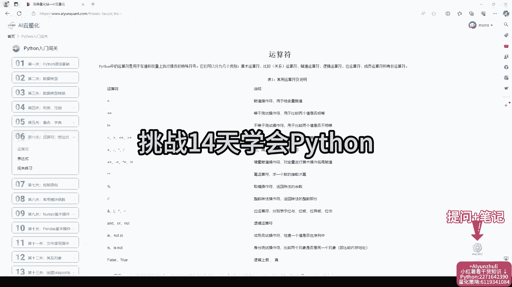

在本节课中，我们将学习Python编程中的运算符与表达式。这是构建量化策略代码的基础，理解它们能帮助我们进行数学计算、逻辑判断和数据操作。课程将结合代码案例，确保初学者能够掌握核心概念。

---

## 运算符与表达式：6.1：算术运算符 ➕➖✖️➗

上一节我们介绍了课程的整体安排，本节中我们来看看最基础的算术运算符。算术运算符用于执行基本的数学运算。

以下是Python中主要的算术运算符：

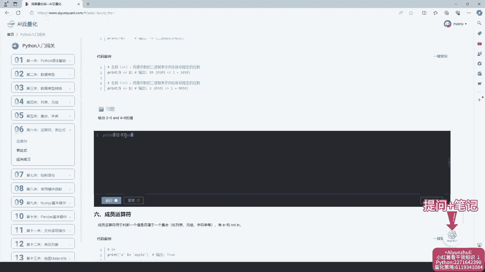

*   `+`：加法，如 `5 + 3` 结果为 `8`。
*   `-`：减法，如 `5 - 3` 结果为 `2`。
*   `*`：乘法，如 `5 * 3` 结果为 `15`。
*   `/`：除法，结果为浮点数，如 `5 / 2` 结果为 `2.5`。
*   `//`：整除，向下取整，如 `5 // 2` 结果为 `2`。
*   `%`：取模（求余数），如 `5 % 2` 结果为 `1`。
*   `**`：幂运算，如 `5 ** 2` 结果为 `25`。

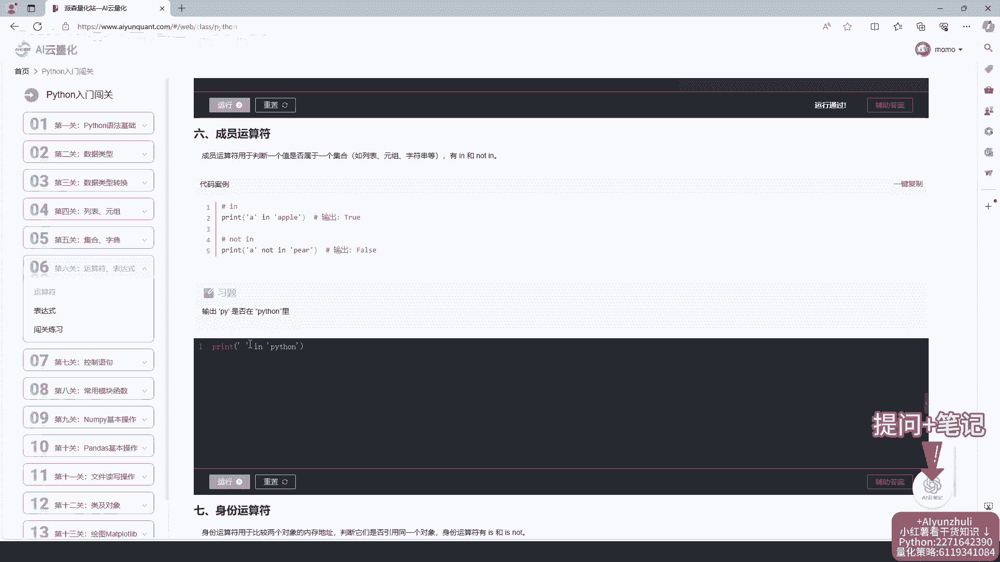

## 运算符与表达式：6.2：比较与逻辑运算符 ⚖️🔗

掌握了数字计算后，我们常常需要对数据进行判断和比较。本节将介绍比较运算符和逻辑运算符。

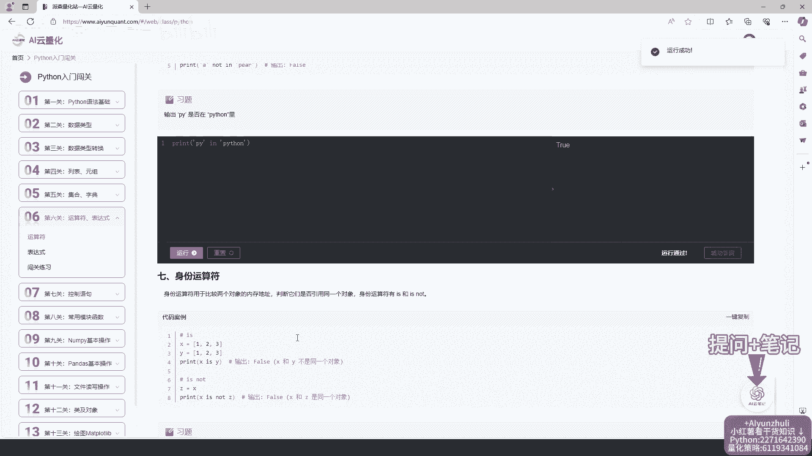

比较运算符用于比较两个值，返回布尔值（`True` 或 `False`）。逻辑运算符用于组合多个布尔条件。

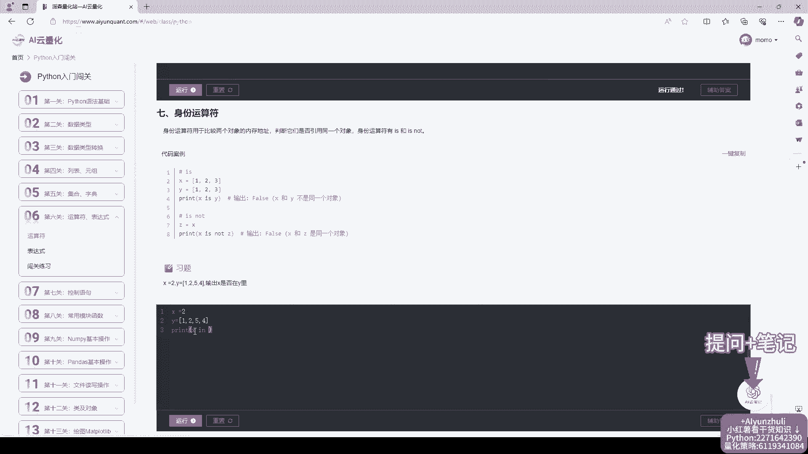

以下是核心的比较与逻辑运算符：

*   `==`：等于，检查两个值是否相等。
*   `!=`：不等于，检查两个值是否不相等。
*   `>`：大于。
*   `<`：小于。
*   `>=`：大于等于。
*   `<=`：小于等于。
*   `and`：逻辑与，所有条件都为真时结果为真。
*   `or`：逻辑或，至少一个条件为真时结果为真。
*   `not`：逻辑非，反转布尔值。

## 运算符与表达式：6.3：赋值与复合赋值运算符 📝

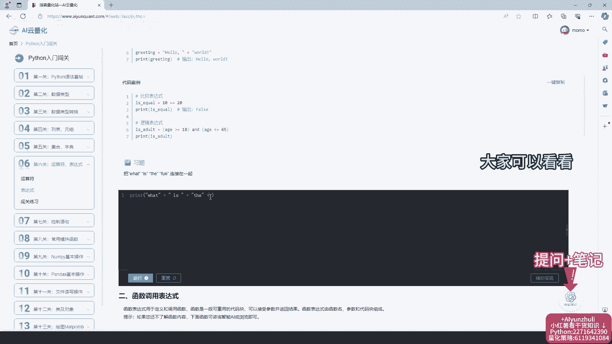

在编程中，我们不仅需要计算和判断，还需要将结果保存下来以备后用。本节我们来学习赋值运算符。

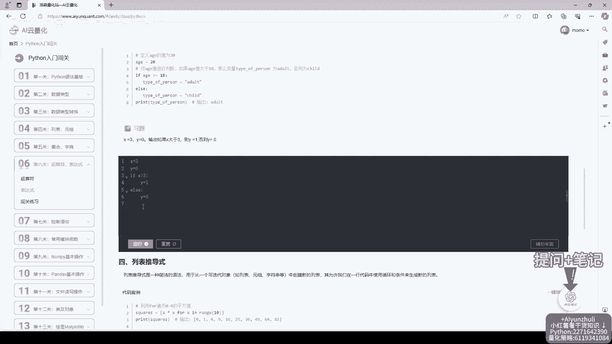

基本的赋值运算符是 `=`，它将右侧的值赋给左侧的变量。Python还提供了复合赋值运算符，可以简化“运算后赋值”的操作。

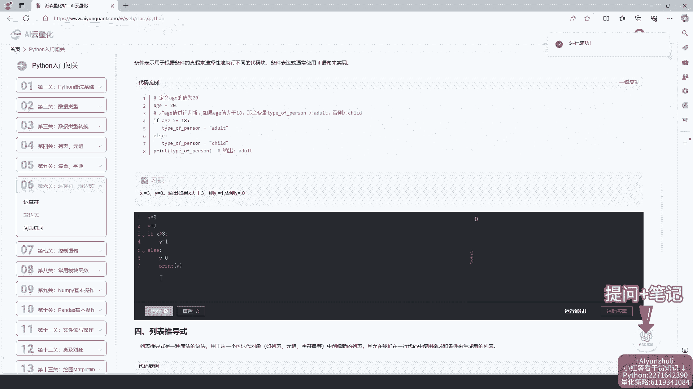

以下是常用的赋值运算符示例：

*   `=`：基本赋值，`x = 5`。
*   `+=`：加后赋值，`x += 3` 等价于 `x = x + 3`。
*   `-=`：减后赋值，`x -= 3` 等价于 `x = x - 3`。
*   `*=`：乘后赋值，`x *= 3` 等价于 `x = x * 3`。
*   `/=`：除后赋值，`x /= 3` 等价于 `x = x / 3`。

## 运算符与表达式：6.4：表达式与代码实践 💻

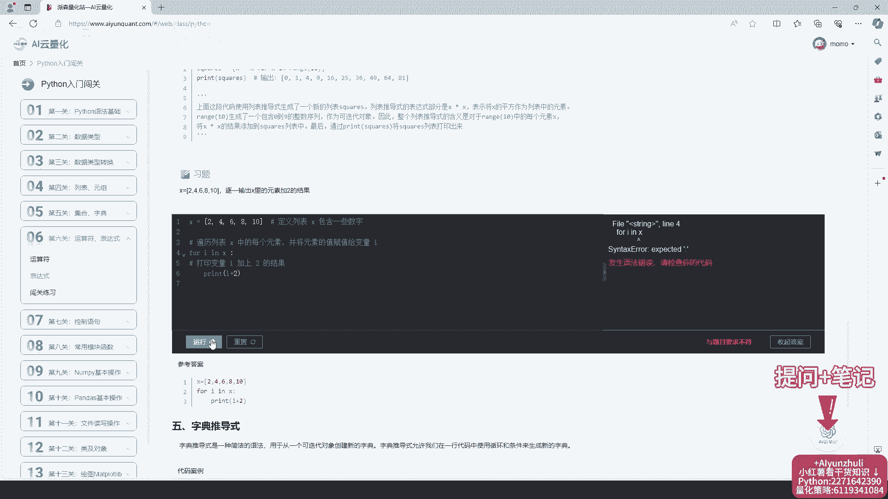

了解了各类运算符后，本节我们将它们组合起来，形成表达式，并进行实际的代码练习。表达式是由运算符和操作数构成的，可以计算出一个值。

运行代码时若出现错误，需要仔细检查代码，查找原因。如果遇到困难，可以查看辅助答案或利用AI助手功能。

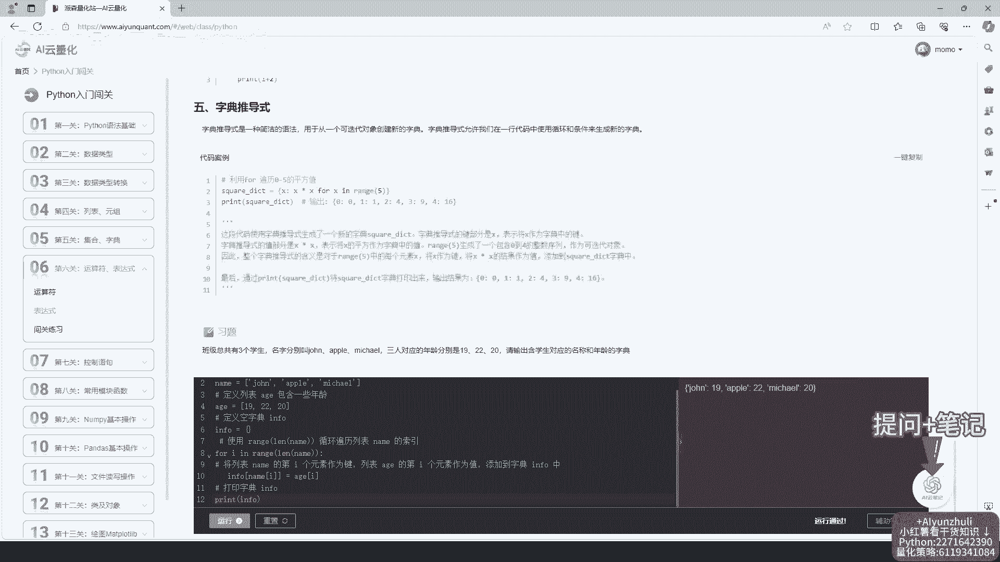

以下是练习的步骤建议：

1.  开始练习闯关，综合运用前面所学知识。
2.  做题时检查代码错误，并查找原因。
3.  修改代码后，务必运行以验证结果。
4.  对照答案查找差异，分析错误原因。
5.  完成最后一题，巩固学习效果。

## 运算符与表达式：6.5：学习工具与总结 🎯

在本节中，我们将回顾本课使用的学习工具，并对运算符与表达式的知识进行总结。有效的工具能提升学习效率。

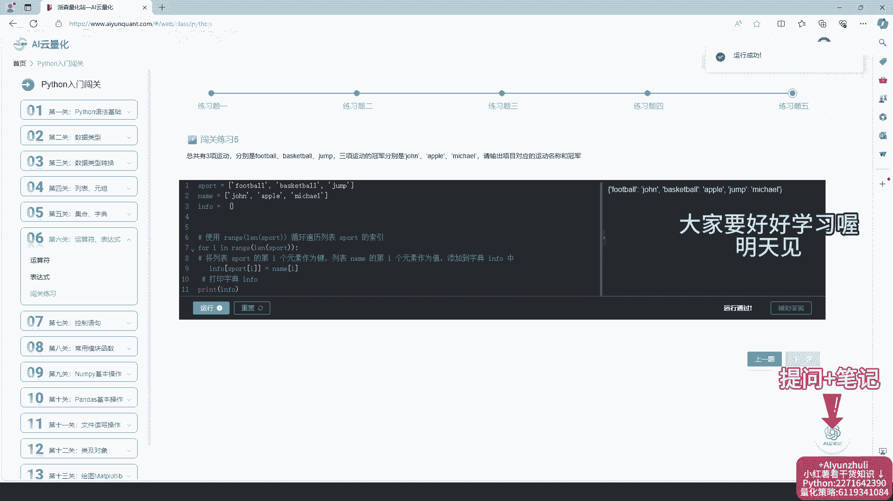

课程提供了在线代码编程器，无需下载安装。同时配备AI云笔记和语言大模型助手，方便随时记录和解答疑问。平台还包含量化策略代码、数学和计算机等干货知识。

**本节课中我们一起学习了Python的运算符与表达式。** 我们掌握了用于计算的算术运算符、用于比较的判断运算符、用于组合条件的逻辑运算符，以及用于保存结果的赋值运算符。通过将这些运算符组合成表达式，并在代码编辑器中实践，我们为编写更复杂的量化策略代码打下了坚实的基础。记得每天学习后要进行复盘，并利用平台提供的工具巩固知识。