# AI云量化：第7关：控制语句 🚦

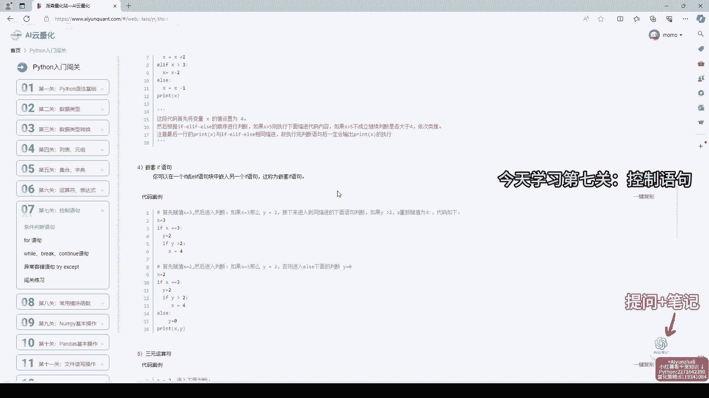

在本节课中，我们将学习Python编程中的核心概念——控制语句。控制语句是编写逻辑和决策代码的基础，对于构建量化策略至关重要。我们将通过简单的例子来理解条件判断和循环，使初学者也能轻松掌握。

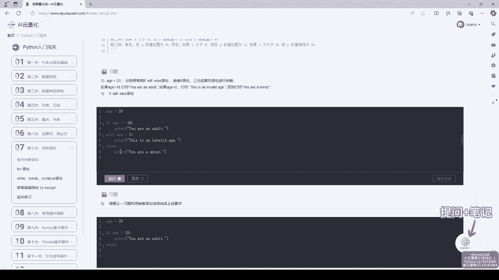

---

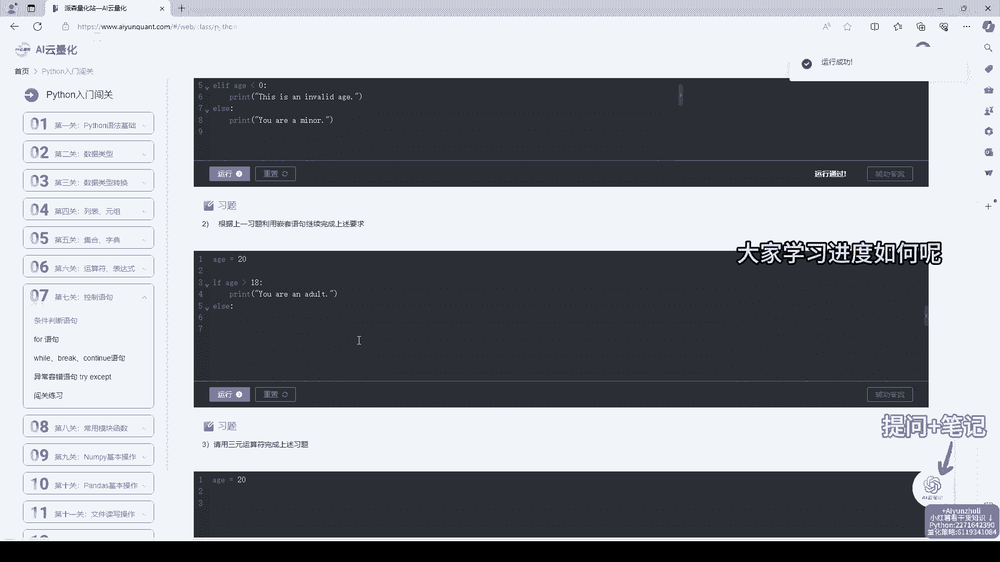

## 概述

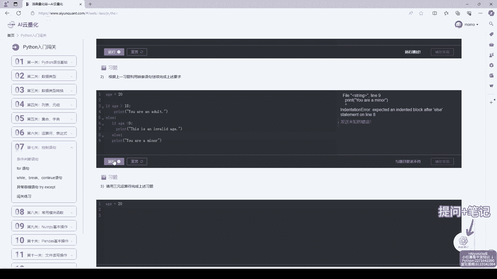

控制语句允许程序根据不同的条件执行不同的代码块，或者重复执行某些操作。它们是实现程序逻辑和自动化的关键。本节课将重点介绍`if`条件语句和`for`循环语句。

## 条件判断：`if`语句

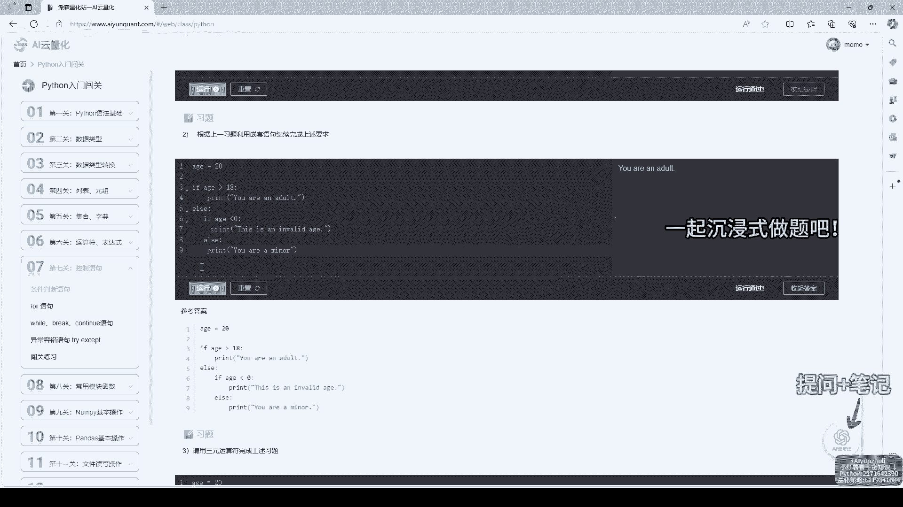

上一节我们概述了控制语句的重要性，本节中我们来看看最基础的条件判断语句——`if`语句。`if`语句用于在满足特定条件时执行一段代码。

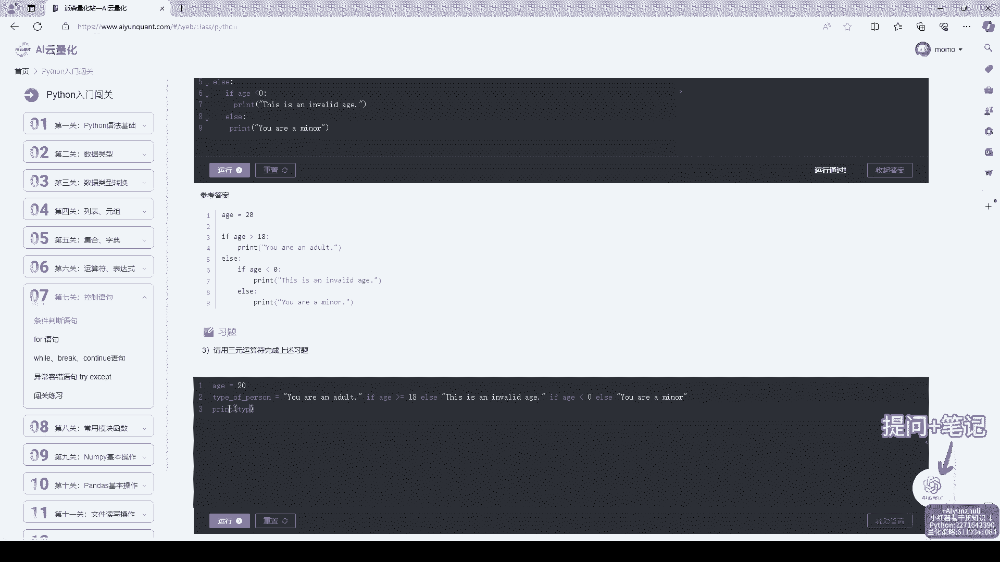

其基本语法结构如下：
```python
if 条件:
    # 条件为真时执行的代码
```

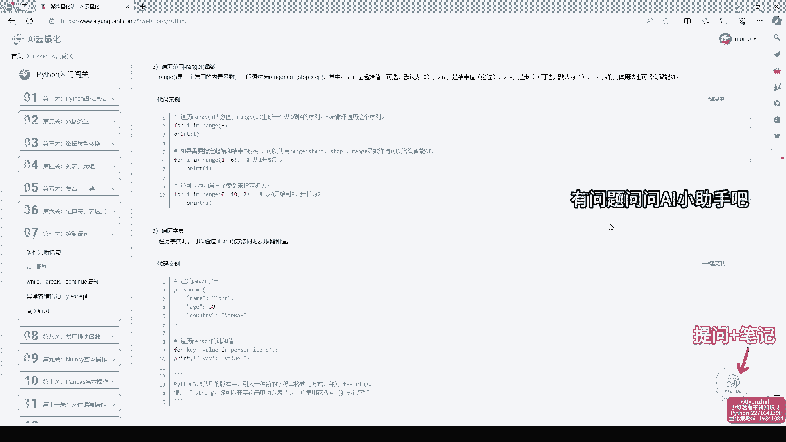

以下是`if`语句的一个简单示例：
```python
x = 10
if x > 5:
    print("x大于5")
```
在这个例子中，因为`x`的值是10，满足`x > 5`的条件，所以程序会输出“x大于5”。

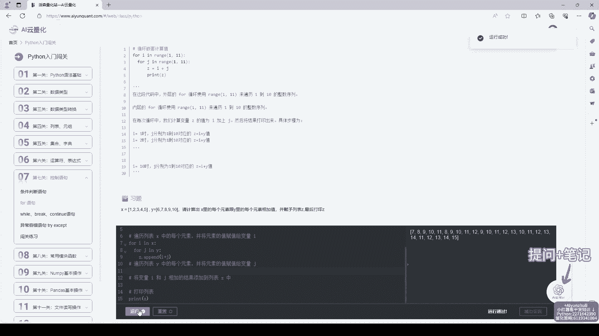

## 循环执行：`for`循环

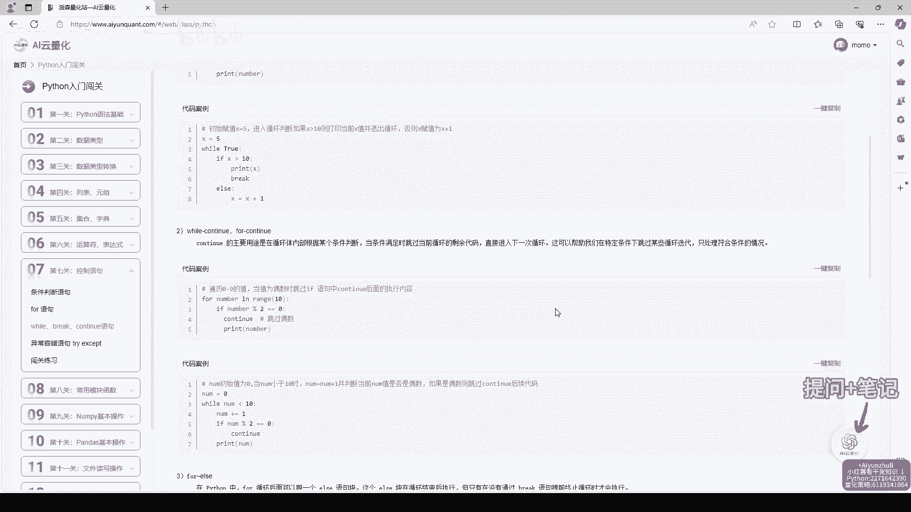

理解了条件判断后，我们来看看如何让代码重复执行。`for`循环用于遍历一个序列（如列表、字符串）中的每个元素，并对每个元素执行相同的操作。

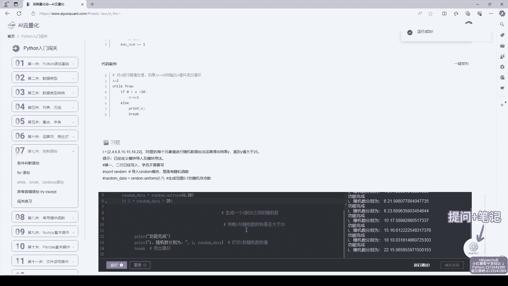

`for`循环的基本语法是：
```python
for 变量 in 序列:
    # 对每个元素执行的代码
```

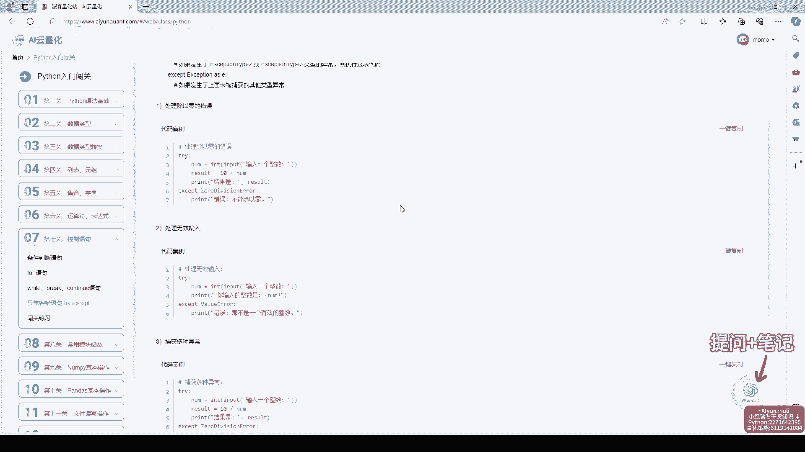

以下是`for`循环的一个应用实例：
```python
fruits = ["苹果", "香蕉", "橙子"]
for fruit in fruits:
    print(fruit)
```
这段代码会依次打印出列表中的每一种水果。

## 学习环境与工具

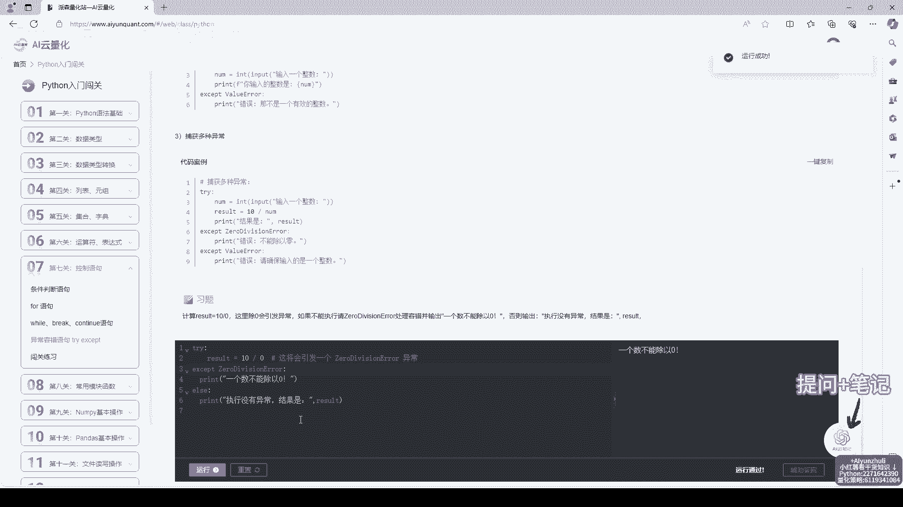

为了高效学习，我们提供了便捷的编程环境。代码编辑器无需下载安装，可直接在本地编写和运行代码，非常方便。

此外，平台还配备了以下辅助功能：
*   **AI云笔记与助手**：在学习过程中，可以使用右下角的AI云笔记记录重点，或向AI小助手提问。
*   **详细代码案例**：每个知识点都配有对应的代码案例，帮助理解。
*   **灵活的访问方式**：不仅可以通过电脑学习，还可以使用“AI量化云”小程序，利用碎片时间学习量化策略和计算机知识。
*   **练习题与辅助答案**：遇到不会的练习题可以查看详细的辅助答案，巩固学习成果。

## 总结

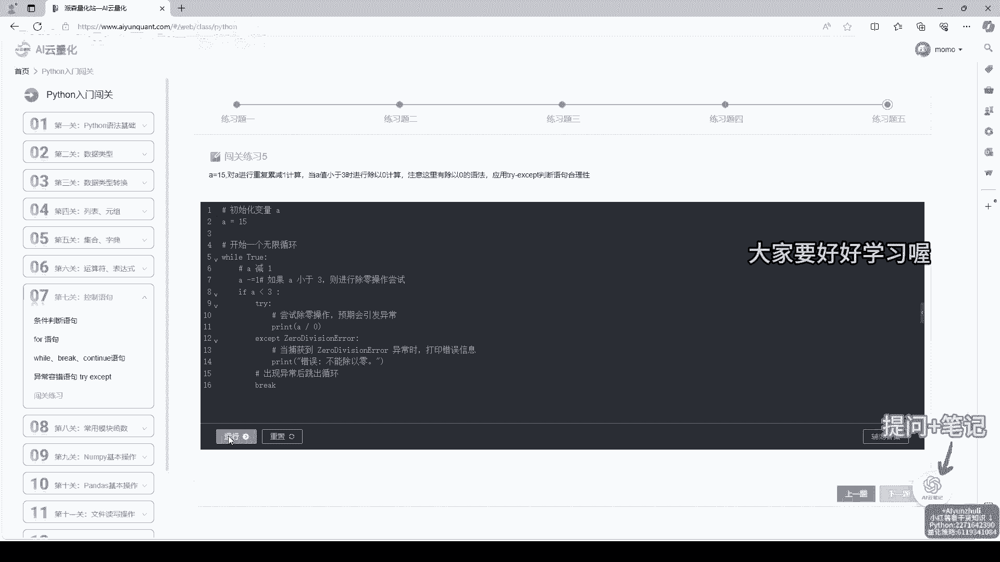

本节课我们一起学习了Python中两个基本的控制语句：用于条件判断的`if`语句和用于重复执行的`for`循环。它们是构建更复杂程序逻辑的基石。请大家结合平台提供的代码案例和练习题进行实践，巩固所学知识。