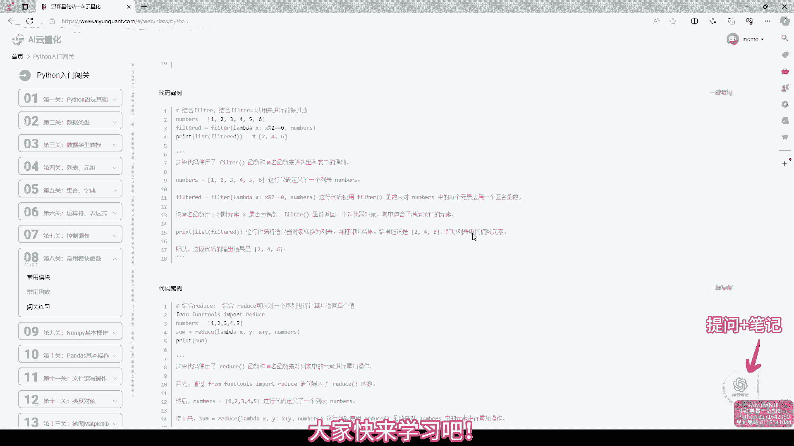
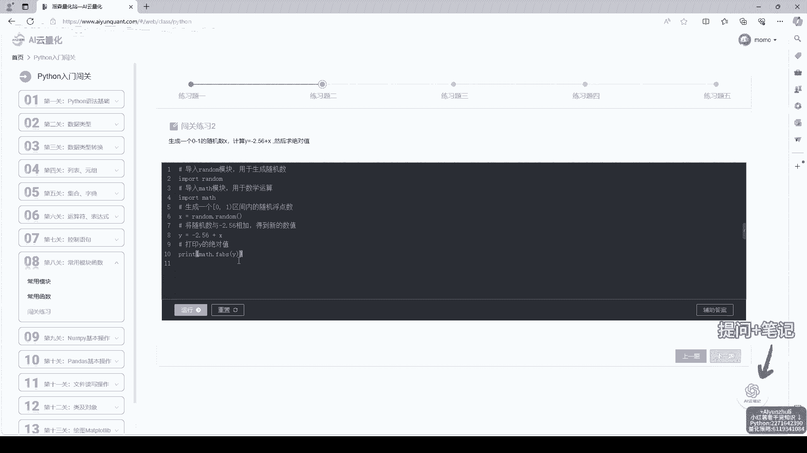
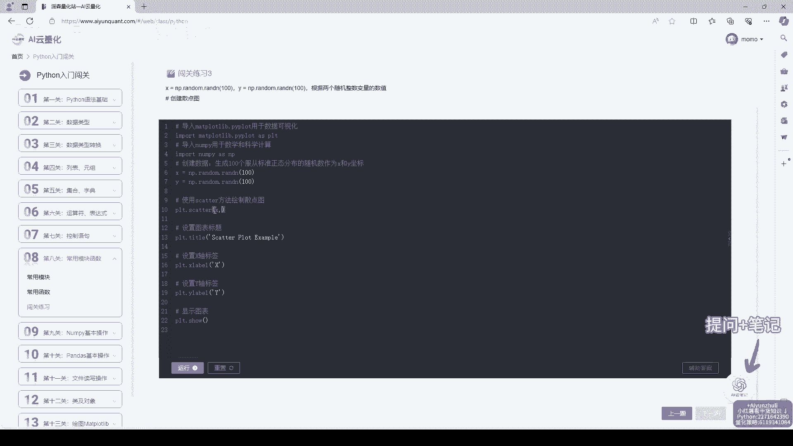
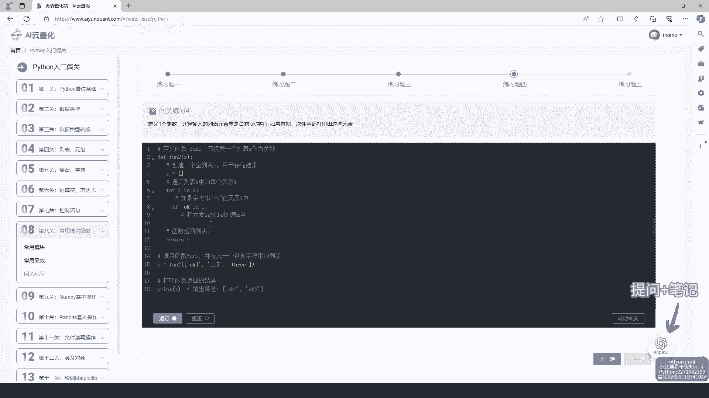
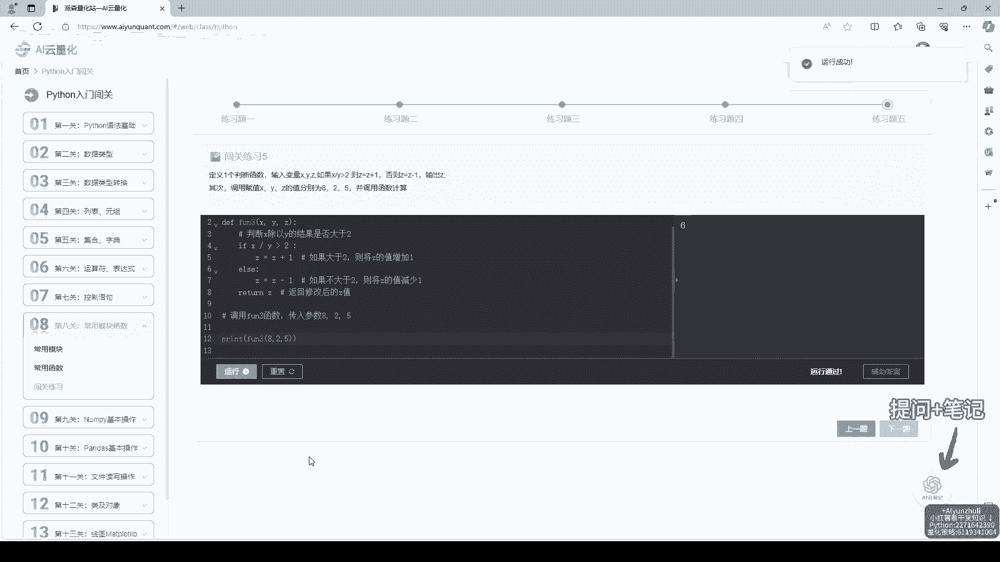
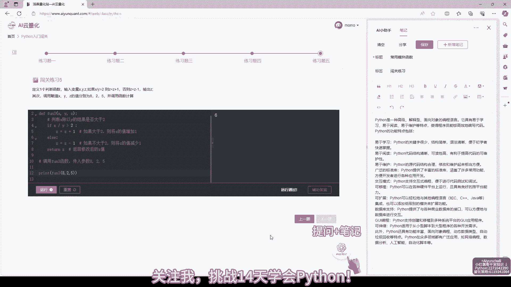

# AI云量化：第8关：常用模块函数，Python量化策略代码学习

在本节课中，我们将学习Python量化策略开发中一些常用模块和函数。这些工具能帮助我们更高效地获取数据、进行计算和实现策略逻辑。我们将重点介绍`akshare`、`talib`、`numpy`和`pandas`这几个核心库。

## 数据获取：akshare库

上一节我们介绍了量化策略的基本框架，本节中我们来看看如何获取市场数据。`akshare`是一个免费、开源的Python财经数据接口库，可以方便地获取股票、期货、基金等多种金融数据。

以下是使用`akshare`获取股票历史行情数据的基本步骤：

1.  导入`akshare`库。
2.  使用`ak.stock_zh_a_hist`函数，传入股票代码和起止日期。
3.  函数会返回一个包含日期、开盘价、收盘价等信息的`DataFrame`。



获取数据的核心代码如下：
```python
import akshare as ak

# 获取贵州茅台（600519）从2023年1月1日到2023年12月31日的日线数据
df = ak.stock_zh_a_hist(symbol="600519", start_date="20230101", end_date="20231231")
print(df.head())
```

## 技术指标计算：talib库

获取到基础价格数据后，我们需要对其进行技术分析。`talib`（Technical Analysis Library）是一个广泛使用的技术分析函数库，它提供了移动平均线、MACD、RSI等上百种技术指标的计算。

以下是使用`talib`计算简单移动平均线（SMA）和相对强弱指数（RSI）的方法：



1.  确保数据列（如收盘价）是`numpy`数组格式。
2.  调用对应的函数，如`talib.SMA`和`talib.RSI`，并传入参数。

计算技术指标的核心代码如下：
```python
import talib
import numpy as np

# 假设‘close’是收盘价序列
close_prices = df['收盘'].values

# 计算20日简单移动平均线
sma_20 = talib.SMA(close_prices, timeperiod=20)

# 计算14日相对强弱指数
rsi_14 = talib.RSI(close_prices, timeperiod=14)
```



## 数据处理与分析：numpy和pandas库

在量化策略中，对数据进行高效的数学运算和表格处理至关重要。`numpy`提供了强大的多维数组对象和数学函数，而`pandas`则构建在`numpy`之上，提供了更易用的`Series`和`DataFrame`数据结构来处理表格型数据。

以下是`numpy`和`pandas`的一些常用操作：



1.  **`numpy`数组运算**：进行快速的向量化计算，如收益率计算。
    ```python
    import numpy as np
    # 计算每日收益率（百分比变化）
    returns = np.diff(close_prices) / close_prices[:-1]
    ```

2.  **`pandas`数据操作**：进行数据筛选、合并和分组统计。
    ```python
    import pandas as pd
    # 创建一个DataFrame
    data = pd.DataFrame({'Close': close_prices, 'SMA_20': sma_20})
    # 筛选出收盘价上穿20日均线的日期
    golden_cross = data[data['Close'] > data['SMA_20']]
    ```

## 策略示例：结合使用

现在，让我们将以上模块结合起来，构建一个简单的双均线策略示例。



该策略的逻辑是：当短期均线上穿长期均线时（金叉），产生买入信号；当短期均线下穿长期均线时（死叉），产生卖出信号。

以下是策略实现的简要步骤：

1.  使用`akshare`获取股票历史数据。
2.  使用`talib`计算短期（如5日）和长期（如20日）移动平均线。
3.  使用`pandas`和`numpy`判断均线交叉点，生成交易信号。

策略信号生成的核心代码如下：
```python
# 计算5日和20日移动平均线
df['SMA_5'] = talib.SMA(df['收盘'].values, timeperiod=5)
df['SMA_20'] = talib.SMA(df['收盘'].values, timeperiod=20)



# 生成交易信号：1代表买入（金叉），-1代表卖出（死叉），0代表持有
df['Signal'] = 0
df.loc[df['SMA_5'] > df['SMA_20'], 'Signal'] = 1
df.loc[df['SMA_5'] < df['SMA_20'], 'Signal'] = -1

# 信号点发生在金叉或死叉的当天
df['Position'] = df['Signal'].diff()
```

## 总结

本节课中我们一起学习了Python量化策略开发中的几个常用模块。我们使用`akshare`获取市场数据，利用`talib`计算技术指标，并借助`numpy`和`pandas`进行高效的数据处理和策略逻辑实现。掌握这些工具是编写自动化量化交易策略的基础。