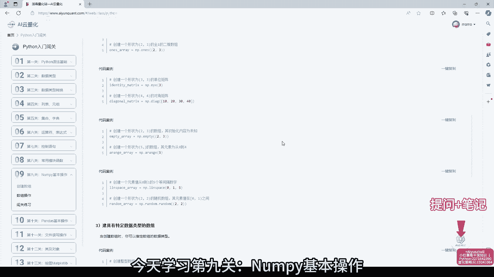
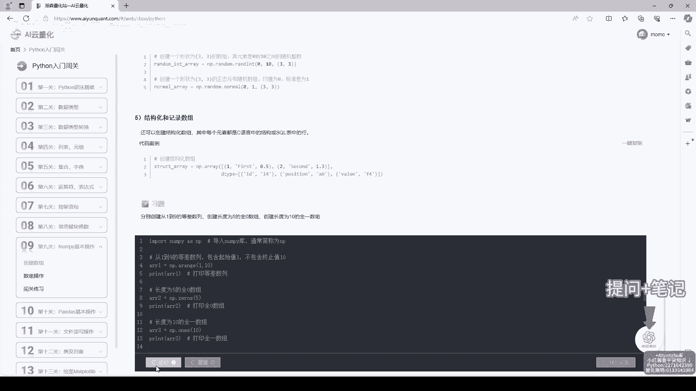
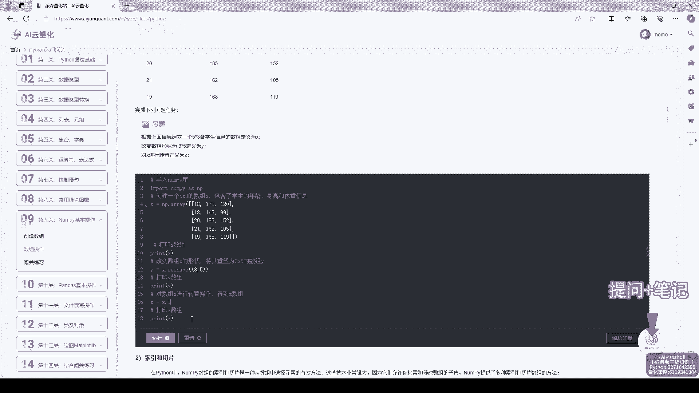
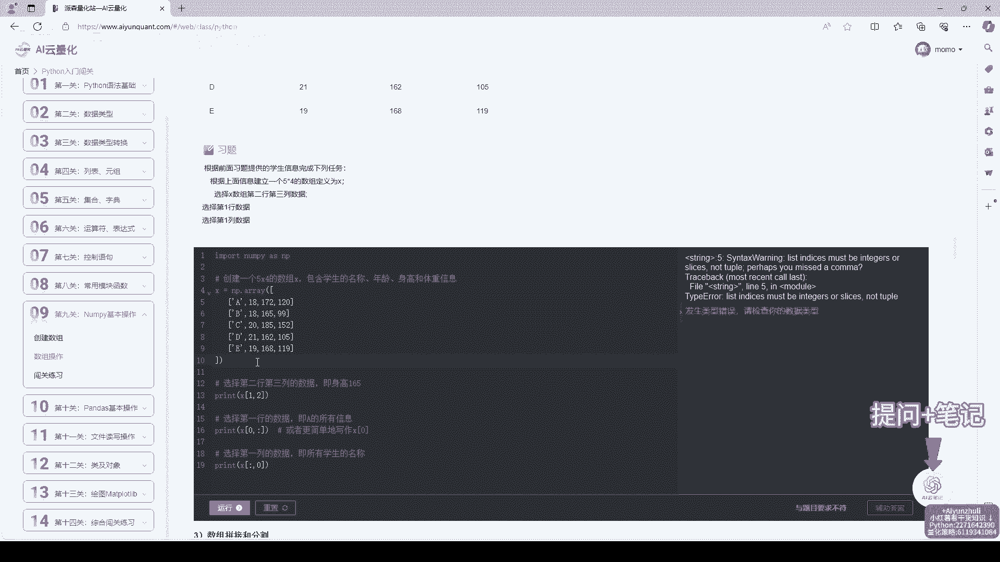
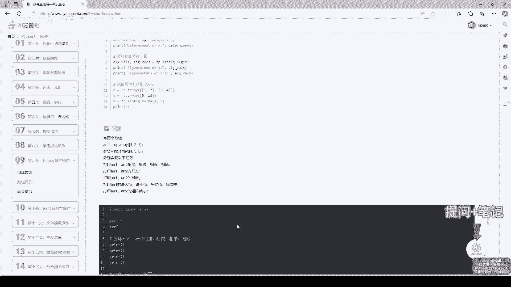
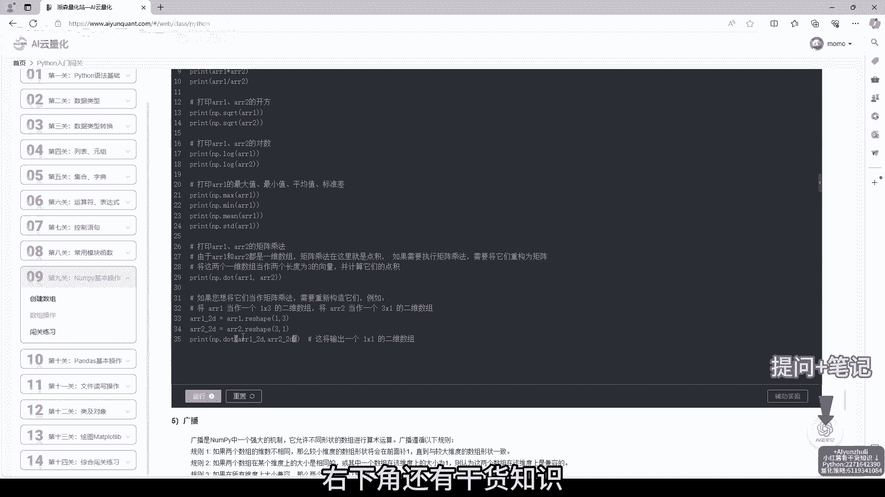
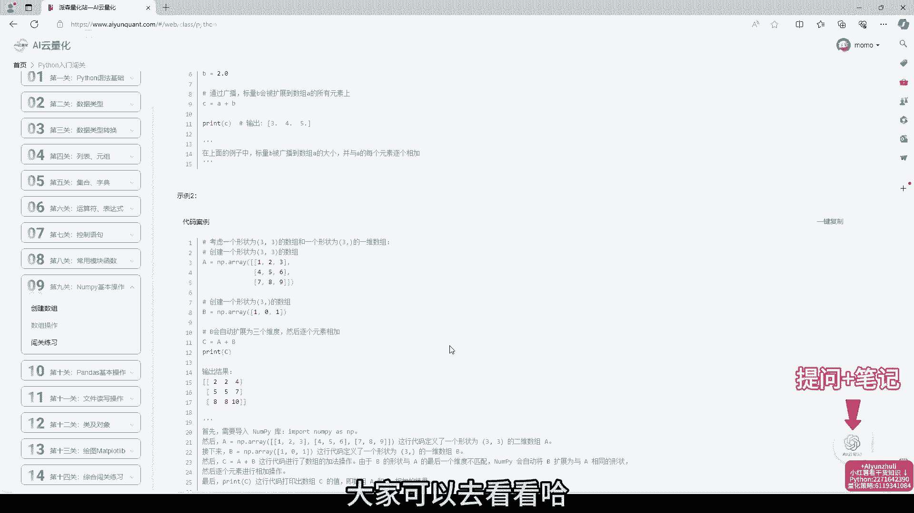
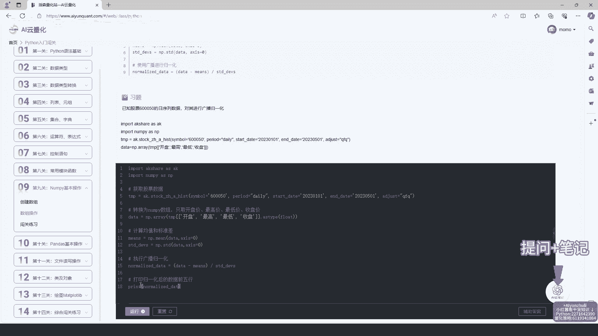
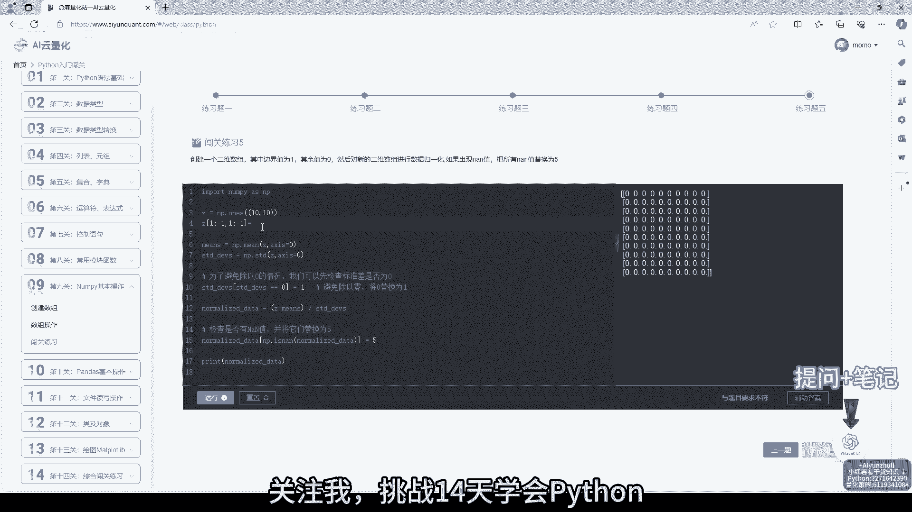

# AI云量化：第9关：NumPy基本操作 📊

在本节课中，我们将要学习NumPy库的基本操作。NumPy是Python中进行科学计算和数据分析的核心库，尤其在量化策略开发中，它提供了高效处理数组和矩阵运算的能力。掌握NumPy是编写高效量化代码的基础。



## 1. 导入NumPy库

首先，我们需要导入NumPy库。在Python中，通常使用`import numpy as np`来导入，这样我们可以用`np`作为别名来调用NumPy的各种功能。



```python
import numpy as np
```

## 2. 创建NumPy数组

NumPy的核心数据结构是`ndarray`，即多维数组。有多种方法可以创建NumPy数组。


上一节我们介绍了如何导入NumPy，本节中我们来看看如何创建数组。



以下是几种常见的创建数组的方法：

*   **从Python列表创建**：使用`np.array()`函数可以将Python列表或元组转换为NumPy数组。
    ```python
    arr_from_list = np.array([1, 2, 3, 4, 5])
    ```
*   **创建特殊数组**：NumPy提供了快速创建特定数组的函数。
    *   `np.zeros(shape)`：创建指定形状的全零数组。
        ```python
        zeros_arr = np.zeros((3, 4)) # 创建一个3行4列的全零数组
        ```
    *   `np.ones(shape)`：创建指定形状的全一数组。
        ```python
        ones_arr = np.ones((2, 3)) # 创建一个2行3列的全一数组
        ```
    *   `np.arange(start, stop, step)`：创建等差序列数组，类似于Python的`range()`函数，但返回数组。
        ```python
        range_arr = np.arange(0, 10, 2) # 创建从0到10（不含），步长为2的数组：[0, 2, 4, 6, 8]
        ```
    *   `np.linspace(start, stop, num)`：在指定区间内创建等间隔的`num`个数值。
        ```python
        linspace_arr = np.linspace(0, 1, 5) # 在0到1之间创建5个等间隔的数：[0., 0.25, 0.5, 0.75, 1.]
        ```


## 3. 数组的基本属性

创建数组后，了解其基本属性非常重要，这有助于我们理解数据的结构。

以下是数组的几个关键属性：



*   **`ndim`**：返回数组的维度（轴）数量。
    ```python
    arr = np.array([[1, 2, 3], [4, 5, 6]])
    print(arr.ndim) # 输出：2
    ```
*   **`shape`**：返回一个元组，表示数组在每个维度上的大小。
    ```python
    print(arr.shape) # 输出：(2, 3)，表示2行3列
    ```
*   **`size`**：返回数组中元素的总数。
    ```python
    print(arr.size) # 输出：6
    ```
*   **`dtype`**：返回数组中元素的数据类型。
    ```python
    print(arr.dtype) # 输出：int64 (取决于系统)
    ```

## 4. 数组的索引与切片


与Python列表类似，NumPy数组也支持索引和切片操作，这对于访问和修改数据至关重要。

上一节我们了解了数组的属性，本节中我们来看看如何访问数组中的元素。


以下是索引和切片的基本规则：

*   **一维数组**：索引和切片方式与列表完全相同。
    ```python
    arr_1d = np.array([10, 20, 30, 40, 50])
    print(arr_1d[0])   # 输出第一个元素：10
    print(arr_1d[1:4]) # 输出第2到第4个元素（不含第4个）：[20, 30, 40]
    ```
*   **多维数组**：使用逗号分隔的索引元组。`arr[row_index, col_index]`。
    ```python
    arr_2d = np.array([[1, 2, 3], [4, 5, 6], [7, 8, 9]])
    print(arr_2d[0, 1])    # 输出第1行第2列的元素：2
    print(arr_2d[1:, :2])  # 输出第2行及之后的所有行，以及前2列：
                           # [[4, 5],
                           #  [7, 8]]
    ```


## 5. 数组的变形与重塑

有时我们需要改变数组的形状而不改变其数据，`reshape`方法可以实现这一功能。



以下是使用`reshape`的示例：

```python
arr = np.arange(12) # 创建一个0到11的一维数组
print(arr) # [ 0  1  2  3  4  5  6  7  8  9 10 11]


reshaped_arr = arr.reshape(3, 4) # 将一维数组重塑为3行4列的二维数组
print(reshaped_arr)
# 输出：
# [[ 0  1  2  3]
#  [ 4  5  6  7]
#  [ 8  9 10 11]]
```

> **注意**：新形状的元素总数必须与原数组一致。`arr.reshape(3, 4)`是可行的，因为3*4=12。`arr.reshape(3, 5)`则会报错。

## 6. 数组的基本运算



NumPy的强大之处在于它支持对整个数组进行快速的数学运算，而无需编写循环。

上一节我们学会了如何改变数组的形状，本节中我们来看看如何对数组进行数学运算。



以下是数组运算的几个例子：

*   **算术运算**：`+`, `-`, `*`, `/`, `**` (幂) 等运算符会作用于数组中的每个元素。
    ```python
    a = np.array([1, 2, 3])
    b = np.array([4, 5, 6])
    print(a + b)  # 对应元素相加：[5, 7, 9]
    print(a * 2)  # 每个元素乘以2：[2, 4, 6]
    print(a ** 2) # 每个元素求平方：[1, 4, 9]
    ```
*   **矩阵乘法**：使用`@`运算符或`np.dot()`函数进行矩阵乘法。
    ```python
    A = np.array([[1, 2], [3, 4]])
    B = np.array([[5, 6], [7, 8]])
    print(A @ B) # 矩阵乘法
    # 输出：
    # [[19 22]
    #  [43 50]]
    ```
*   **聚合函数**：对数组进行统计计算，如求和、求平均值、找极值等。
    ```python
    arr = np.array([1, 2, 3, 4, 5])
    print(np.sum(arr))   # 求和：15
    print(np.mean(arr))  # 求平均值：3.0
    print(np.max(arr))   # 求最大值：5
    print(np.min(arr))   # 求最小值：1
    print(np.std(arr))   # 求标准差：1.414...
    ```



## 7. 随机数生成

在量化策略中，经常需要生成随机数进行模拟测试。NumPy的`random`模块提供了丰富的随机数生成功能。

以下是几个常用的随机数生成函数：

*   **`np.random.rand(d0, d1, ...)`**：生成给定形状的数组，数组中的元素是[0, 1)区间内的均匀分布随机数。
    ```python
    random_arr = np.random.rand(2, 3) # 生成一个2行3列的随机数组
    ```
*   **`np.random.randn(d0, d1, ...)`**：生成给定形状的数组，数组中的元素服从标准正态分布（均值为0，标准差为1）。
    ```python
    normal_arr = np.random.randn(1000) # 生成1000个标准正态分布的随机数
    ```
*   **`np.random.randint(low, high, size)`**：生成给定范围内的随机整数。
    ```python
    int_arr = np.random.randint(1, 100, size=(5,)) # 生成5个1到99之间的随机整数
    ```



## 总结

本节课中我们一起学习了NumPy库的基本操作。我们从导入NumPy开始，逐步掌握了创建数组、查看数组属性、进行索引切片、重塑数组形状、执行数组运算以及生成随机数等核心技能。这些操作是使用Python进行量化分析和策略开发的基石。请务必通过实践练习来巩固这些知识，尝试创建自己的数组并应用所学的各种方法进行操作。