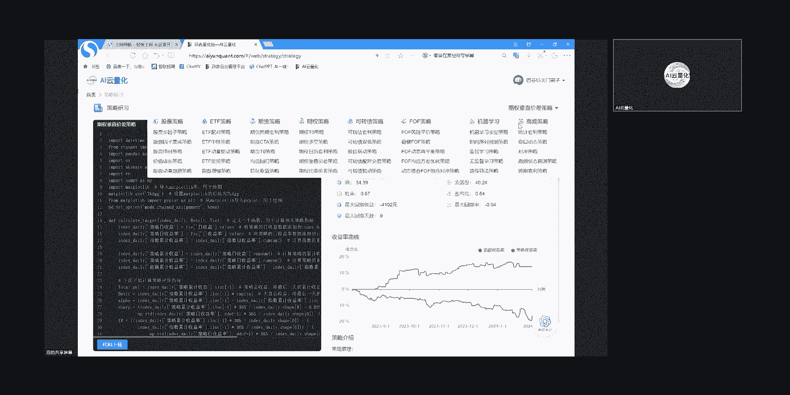
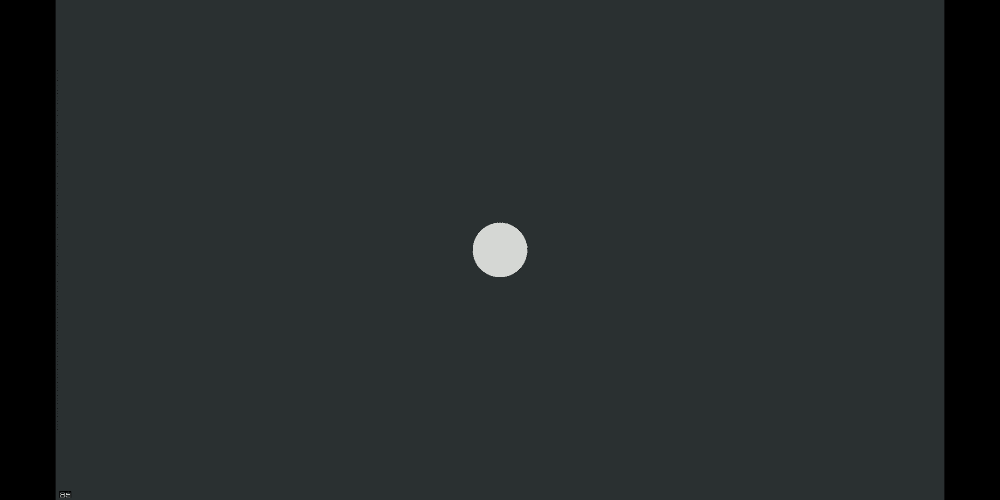
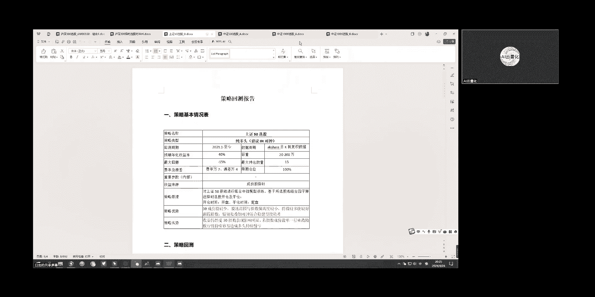
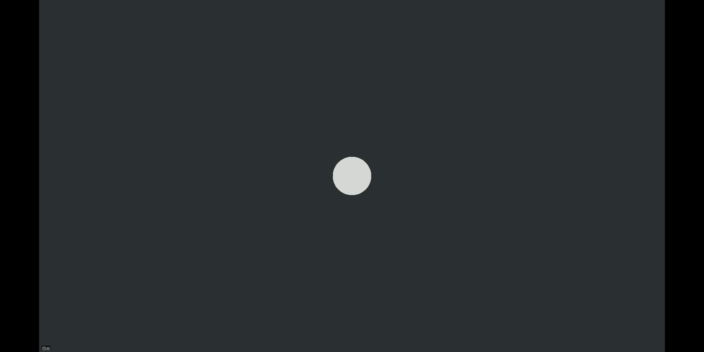
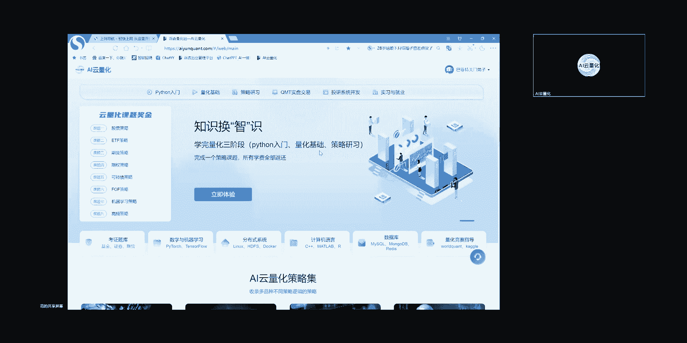

# AI云量化：P1：量化策略学习指南 📚

在本课程中，我们将系统性地学习量化策略开发的全流程，涵盖从Python编程基础到量化理论，再到实际策略研习的完整路径。本指南将帮助初学者建立清晰的学习框架。

## Python入门：1：Python在量化中的角色 🐍

上一节我们概述了课程内容，本节中我们来看看Python为何是量化研究的首选工具。

Python因其用户基数庞大、数据处理能力强、拥有丰富的第三方库以及语法简洁，在金融工程、算法交易和资产管理等领域占据主导地位。量化研究常用的库包括：
*   **数据处理**：`pandas`、`numpy`
*   **机器学习**：`scikit-learn`
*   **技术指标计算**：`TA-Lib`

## Python入门：2：章节内容概览 📖

了解了Python的重要性后，本节我们将详细介绍Python入门部分的学习内容结构。

Python入门章节旨在帮助学员掌握基本语法和编程技巧，并了解其在量化研究中的应用，为后续学习奠定基础。以下是各章节的主要内容：

以下是Python入门章节的核心内容列表：
1.  **第1-3关：基本语法**。掌握变量、数据类型及转换，了解基本语法形式及简单应用。
2.  **第4-5关：数据结构**。学习列表、元组、字典、集合等数据结构，了解其特点与适用场景，这对处理金融数据至关重要。
3.  **第6-7关：程序控制**。学习运算符、表达式和控制语句（如`if`、`for`、`while`），这是编写简单程序的基础。至此可尝试编写简单程序。
4.  **第8关：函数与模块**。学习如何定义和使用函数，以及Python内置的常用函数。这能提高代码的复用性和可维护性，是前7关内容的递进。
5.  **第9-10关：数据处理库**。着重学习量化中常用的`numpy`和`pandas`库，它们用于数据清洗和指标计算。示例代码：`import pandas as pd`
6.  **第11关：异常处理与文件操作**。学习如何处理程序错误（异常），以及如何进行文件读写操作。这是数据处理和持久化存储的必备技能。
7.  **第12关：面向对象编程**。结合第8关的函数定义，学习如何通过定义`类`和`对象`将数据与操作封装起来，提升代码的模块性、灵活性和可重用性。
8.  **第13关：基础绘图**。通常用于可视化策略净值曲线，以及与基准指数或标的股票的对比走势。
9.  **第14关：综合案例**。通过一个案例分解学习，巩固Python用于量化研究的大致流程。

## 量化入门：3：量化学习路径 🧮

掌握了Python基础后，我们进入量化交易入门的学习。这部分内容需要从基础的编程和理论知识开始，逐步深入到专业的策略和工具应用。

量化研究融合了金融知识、数学模型、统计分析和计算机技术，要求学员具备跨学科技能。以下是量化入门部分的具体学习路径：

以下是量化入门章节的核心内容列表：
1.  **第1-2关：数据获取与清洗**。掌握数据的采集、清洗、处理和存储知识，这是进行有效量化分析的基础。
2.  **第3-4关：因子与统计基础**。介绍基础因子及常用的统计理论。量化交易依赖数学和统计方法分析数据与建模，掌握高等数学、概率论、统计学等理论知识有利于后续因子挖掘和算法优化。
3.  **第5关：因子分析法**。介绍常用的因子分析方法。因子分析有助于简化复杂性、揭示市场规律，为投资决策提供定量支持。但其依赖历史数据，可能存在过度拟合等问题，需结合投资逻辑与其他算法补充使用。
4.  **第6-7关：回测框架**。从简单到复杂介绍回测，强调独立完成回测的能力与编写要素，让学员了解并掌握回测的运行机制。
5.  **第8-9关：策略评估与优化**。策略回测完成后，需要用指标评判策略好坏（如年化收益率、最大回撤），并学习如何优化策略以改进指标、减少过拟合。
6.  **第10关：常见错误分析**。针对初学者在独立编写回测时常犯的错误，通过案例进行展示和分析。

## 策略研习：4：策略案例深化 💡

在学习了量化基础之后，策略研习部分将进一步强化独立回测的完整流程。每个策略案例都包含数据采集、清洗、模型构建、信号触发、撮合（默认市价单）及回测结果展示。

策略研习内容广泛，旨在为学员后续的策略开发提供易懂且便于二次加工的模板。整体内容具有以下特点：

以下是策略研习部分的主要特点：
*   **覆盖多资产类别**：根据量化投资常配置的品种，分为股票（含ETF）、期货、期权、可转债、FOF类策略。
*   **融入机器学习算法**：展示了时间序列预测、监督/无监督学习、集成算法等方向，实际应用还包括支持向量机（SVM）、贝叶斯、决策树、随机森林等交叉算法。
*   **包含高频策略**：提供了按交易频率划分的高频策略，通常指使用Tick数据、分钟数据进行高频率触发的策略。
*   **支持多空与组合**：不仅包含单向做多或做空策略，也包含多空一体策略（如配对交易、跨品种对冲）。同时支持单品种回测和投资组合框架回测。

> **注意**：策略案例算法各有千秋，比常见的双均线、海龟策略更为深入，但并非直接适用于实盘。复杂的下单算法（如做市商）或不符合常规投资逻辑的操作，需要学员在熟练掌握代码后自行编写实现。

## 学习步骤与目标：5：从学习到实践 🎯

明确了学习内容后，我们来看看具体的学习步骤与最终目标。学习应遵循“Python技能 -> 量化基础 -> 策略研习”的顺序。

我们的目标是使学员能够达到独立编写策略的要求。为此，我们提供了以下支持路径：

以下是关键的学习步骤与支持措施：
1.  **统一本地化部署**：当学员完成前两阶段学习，进入策略研习时，我们会安排统一会议，由技术支持人员指导完成Python环境及第三方库的本地化部署，避免新手在环境配置上浪费不必要的时间。
2.  **持续技术支持**：在学习过程中，使用PyCharm、VSCode等工具遇到的任何非金融类计算机问题，都可以在群内提问，由专业技术人员解答。
3.  **补足个人短板**：学员可根据自身背景针对性学习。数学背景强的可侧重补充金融知识；金融背景强的可侧重提升Python技能和策略案例研究；纯小白则需按部就班完成全部三个阶段。

## 成果输出与面试：6：准备你的策略报告 📈

学习的目标是产出成果。独立编写策略后，需要准备策略报告，这对于求职面试至关重要。

一份完整的策略回测报告应包含以下基本要素，最容易出成果的是指数类（如指数增强、指数择时）和稳健型策略：

以下是策略报告的核心内容模板：
*   **策略基本情况**：策略名称、策略类型、回测周期、**预期年化收益率**、**最大回撤**等。
*   **回测结果展示**：策略净值曲线图、收益曲线、月度收益表等。
*   **资产类别**：注明策略适用于股票、ETF、期货等哪一类资产。

在面试时，为了提升竞争力，建议做到以下几点：

以下是面试进阶要求：
*   **掌握两个及以上策略类别**：例如同时掌握股票和期货策略，以适应公司策略方向的变化。
*   **建立个人策略库与因子库**：在学习过程中积累和整理。
*   **展示回测效果**：最基本的要求是能提供完整的回测报告。
*   **提供仿真交易报告**：学习约1-1.5个月后，平台将提供仿真交易环境，部署并运行策略后产生的交易报告是更有力的证明。
*   **展示实盘交易效果**：如果有实盘资金（无论大小）的运行记录，将对求职有极大帮助。

## 学习规范：7：注意事项与安排 ⏰

最后，我们来明确学习过程中的注意事项与规范要求，以确保学习效率。

为了保障学习效果，请大家遵循以下四点要求：

以下是学习的具体规范：
1.  **学习周期规划**：Python入门约2周，量化基础约2周，策略研习约1个月，总计集中学习时间约2个月。
2.  **进度可视化**：每完成一大关（包含5道小题），请将完成页面的截图发到学习群中，便于我们跟踪进度并安排相应的辅导会议。
3.  **问题解决流程**：遇到问题请按顺序尝试：① 使用平台内置的“AI云笔记”功能提问并获取智能解答；② 若仍不理解，点击“辅助答案”；③ 若还有疑问，将问题发到群内，我们会安排专人解答及周会统一答疑。
4.  **周会安排**：定于每周三晚上8点举行周会，进行集中答疑和内容讲解。如遇节假日或时间冲突可能调整至9点。

---
本节课中我们一起学习了AI云量化平台的学习体系，从Python基础、量化理论到实战策略研习，明确了学习路径、目标成果以及学习过程中的具体规范和安排。希望大家能遵循此指南，系统性地完成学习，最终具备独立开发量化策略的能力。