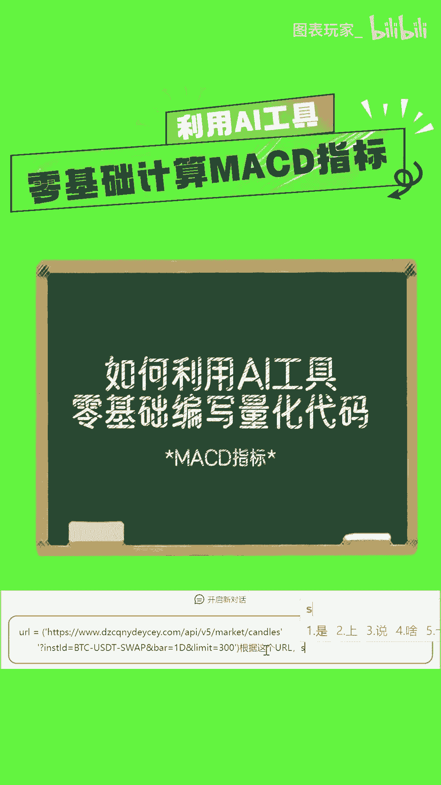
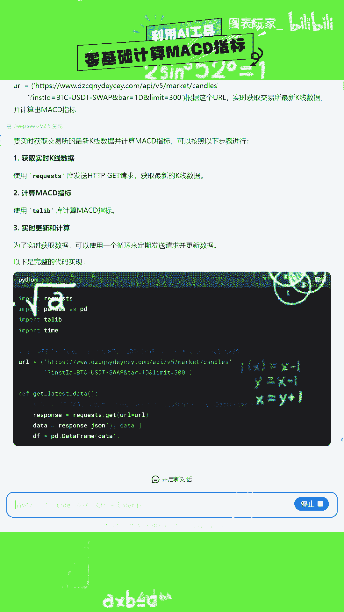
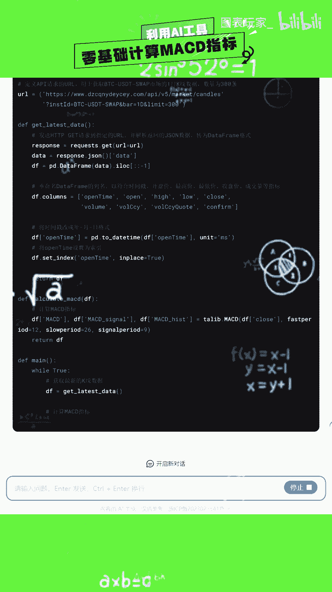
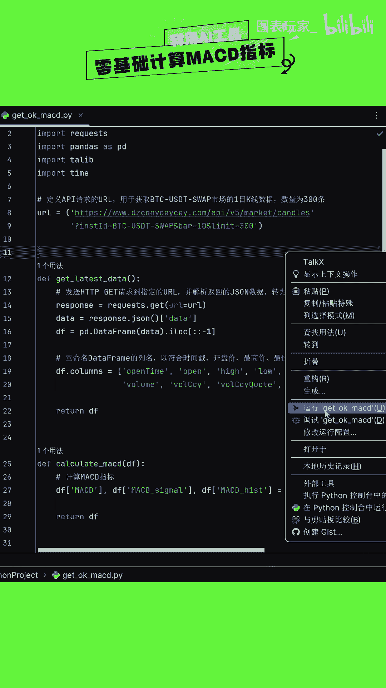
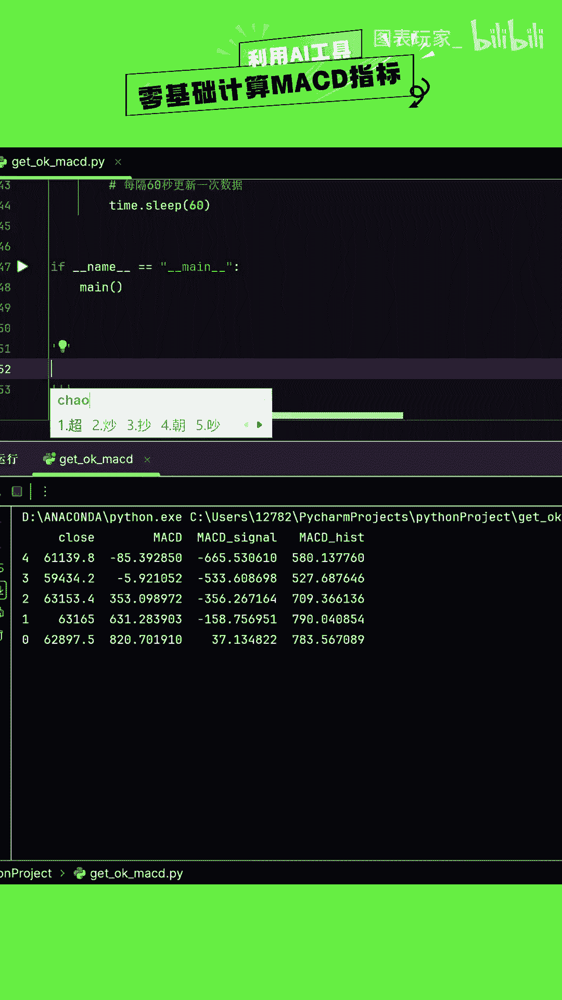

# AI工具零基础实现量化代码：P1：区块捕手聚合群

在本节课中，我们将学习如何利用AI工具，从零开始编写量化交易代码。整个过程分为三个核心步骤：向AI描述需求、等待AI生成代码、复制并运行代码。即使你没有任何编程基础，也能通过本教程快速上手。

## 🎯 核心步骤概述



以下是利用AI工具生成量化代码的三个主要步骤。我们将逐一进行详细说明。

1.  **向AI描述需求**：将你的量化交易想法用清晰、具体的语言告诉AI。
2.  **等待AI结果反馈**：AI会根据你的描述，生成相应的Python代码。
3.  **复制粘贴运行**：将AI生成的代码复制到你的编程环境中执行。

---

## 📝 第一步：向AI描述需求

上一节我们概述了整体流程，本节中我们来看看如何向AI清晰地描述你的需求。这是最关键的一步，描述越准确，AI生成的代码质量越高。

你需要将你的量化策略想法转化为AI能理解的指令。例如，你可以这样描述：



> “请帮我写一个Python量化策略代码。策略逻辑是：当股票的5日均线上穿20日均线时（金叉），在下一根K线开盘时买入；当5日均线下穿20日均线时（死叉），在下一根K线开盘时卖出。使用`backtrader`框架回测，数据源为`yfinance`，测试标的为苹果公司（AAPL）从2022年1月1日到2023年1月1日的数据。”

**核心概念公式**：
*   **金叉买入信号**：`MA(5) > MA(20)` 且前一根K线 `MA(5) <= MA(20)`
*   **死叉卖出信号**：`MA(5) < MA(20)` 且前一根K线 `MA(5) >= MA(20)`

---

## ⏳ 第二步：等待AI结果反馈

在清晰地向AI提交需求后，接下来就是等待AI处理并生成代码。AI（如ChatGPT、Claude等大型语言模型）会分析你的自然语言描述，并将其转换为结构化的Python程序。



这个过程通常只需几秒到几十秒。AI生成的代码会包含策略逻辑、数据获取、回测引擎设置和结果分析等部分。你可能会得到类似下图的代码反馈：


---

## ▶️ 第三步：复制粘贴运行



获得AI生成的代码后，最后一步就是将其付诸实践。你需要一个可以运行Python代码的环境。

以下是操作步骤：
1.  在你的电脑上安装Python环境（推荐使用Anaconda）。
2.  安装必要的库，例如在终端或命令提示符中输入：
    ```bash
    pip install backtrader yfinance pandas
    ```
3.  创建一个新的Python文件（例如`my_strategy.py`）。
4.  将AI生成的完整代码复制粘贴到这个文件中。
5.  运行这个Python文件，查看回测结果。

运行成功后，你将能看到类似下图的回测结果图表和绩效报告：





---

## 📖 总结

本节课中，我们一起学习了如何利用AI工具零基础实现量化代码。我们掌握了三个核心步骤：首先，用清晰的语言向AI描述策略需求；其次，等待AI生成对应的Python代码；最后，将代码复制到本地环境并运行验证。通过这个方法，即使没有编程经验，你也可以快速将自己的交易想法转化为可回测的代码，迈出量化交易的第一步。