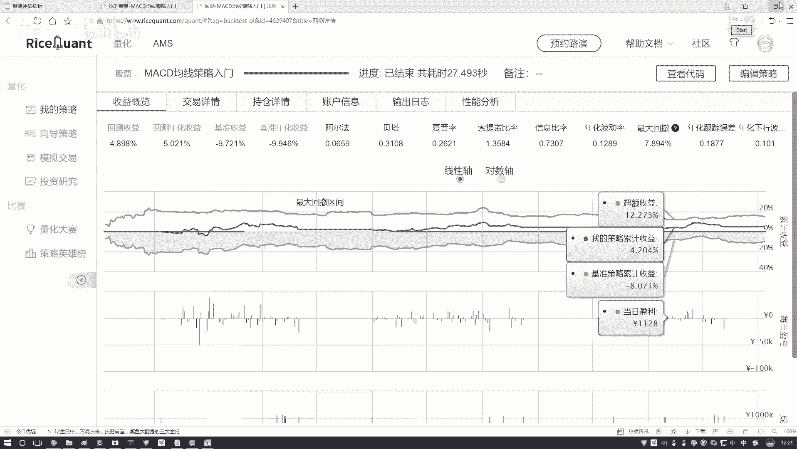
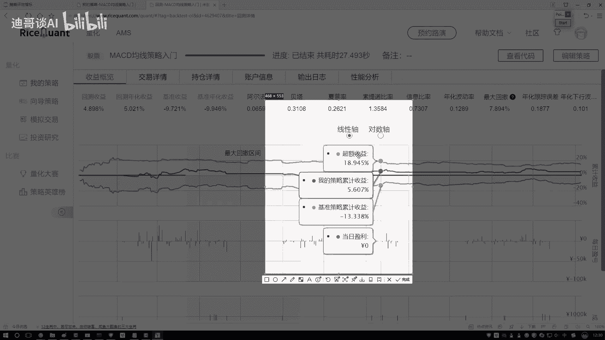
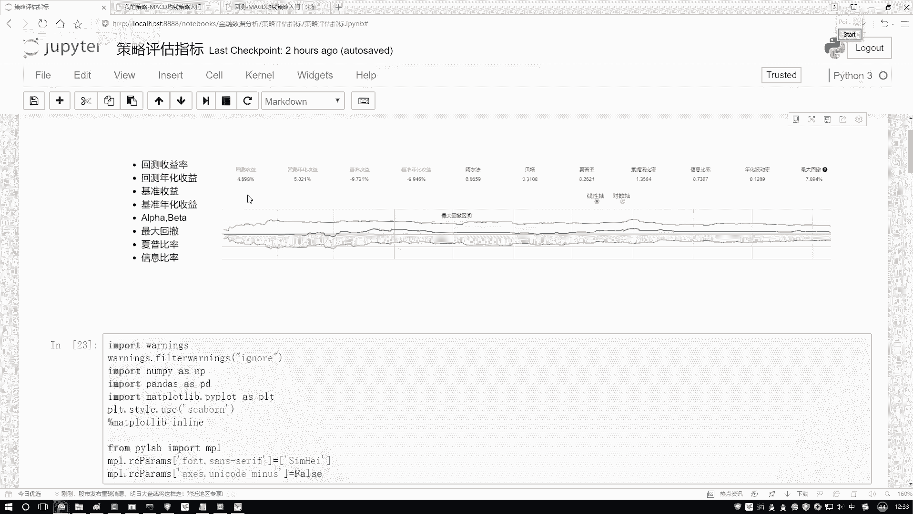

# Python金融分析与量化交易实战：P19：阿尔法与贝塔概述 📈

在本节课中，我们将要学习量化投资中两个核心概念：阿尔法（Alpha）和贝塔（Beta）。理解这两个指标对于评估投资策略的优劣至关重要。

## 收益的构成

当我们通过投资策略获得收益时，这笔收益可以分解为两个部分。

一部分收益与整体市场环境相关。当市场大环境向好时，大部分投资都能赚钱，这部分收益可以看作是“随大流”获得的。

另一部分收益则与市场整体波动关系不大，它主要来源于投资者独特的策略、敏锐的观察力或精准的操作。这部分收益是超越市场平均水平的努力成果。

阿尔法和贝塔就是分别用来衡量这两部分收益的指标。

## 阿尔法（Alpha）与贝塔（Beta）的定义

以下是这两个核心指标的具体含义：

*   **贝塔（Beta）**：衡量投资策略对市场波动的敏感性，反映了策略收益与市场收益的关联程度。它代表的是承担市场系统性风险所获得的回报。**贝塔值高，意味着策略收益随市场涨跌而剧烈波动；贝塔值低，则意味着策略受市场影响较小。**
*   **阿尔法（Alpha）**：衡量投资策略超越市场基准的超额收益。它代表了与市场波动无关的、由策略本身创造的价值。**阿尔法值为正，说明策略跑赢了市场；阿尔法值为负，则说明策略跑输了市场。**

## 通过实例理解

我们可以通过一个回归方程来更清晰地理解二者的关系：

`策略收益 = Alpha + Beta * 市场收益 + 误差项`

在这个模型中：
*   `Beta` 是斜率，表示市场收益每变动1单位，策略收益预期会变动多少。
*   `Alpha` 是截距，代表当市场收益为零时，策略所能获得的独立收益。

在实际分析中，我们可以通过历史数据拟合这个线性方程来求解出具体的阿尔法和贝塔值。

## 我们的关注重点

对于量化交易者而言，市场整体的贝塔收益是我们难以控制和改变的。因此，核心目标在于追求**正的、可持续的阿尔法**，即通过卓越的策略模型和执行力来获取超越市场的超额收益。阿尔法才是体现策略核心竞争力和附加价值的真正来源。

## 总结

本节课中我们一起学习了阿尔法与贝塔的核心概念。贝塔衡量了策略与市场共舞的部分，代表了系统性风险带来的收益；而阿尔法则衡量了策略独立于市场、通过自身努力获取的超额收益。在量化投资中，持续创造正的阿尔法是策略成功的终极目标。后续在因子策略分析等章节中，我们将深入探讨如何构建和优化以获取阿尔法为核心的交易策略。