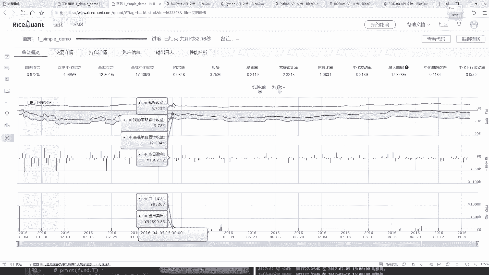
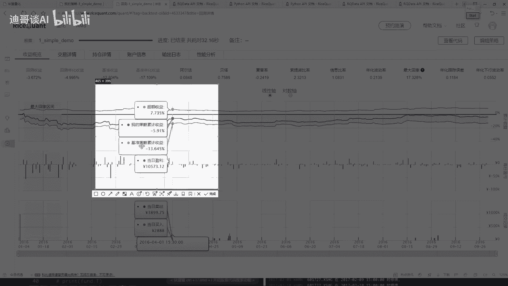
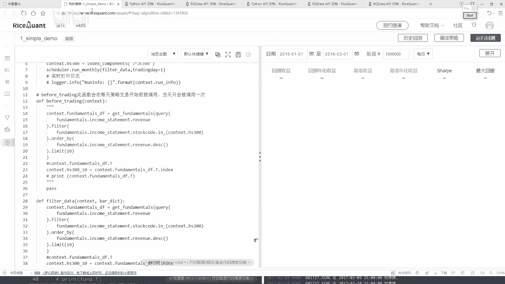

# Python金融分析与量化交易实战：P26：定时器功能与作用 ⏰

在本节课中，我们将学习如何在量化交易策略中使用定时器功能。定时器允许我们按照自定义的时间间隔（如每月、每周）来执行特定的操作，而不是在每一个交易日都执行，这为策略设计提供了更大的灵活性。

上一节我们介绍了如何获取交易详情和持仓信息，本节中我们来看看如何通过定时器来控制策略核心逻辑的执行频率。

## 交易详情与持仓分析回顾

在之前的策略中，我们在 `handle_data` 和 `before_trading` 函数中编写的逻辑会在**每一个交易日**执行。因此，我们得到的结果中，每一天都会产生新的交易记录。

以下是交易详情所展示的信息：
*   **交易动作**：买入或卖出。
*   **成交量与成交价**：每笔交易的具体数量与价格。
*   **交易费用**：包括印花税、佣金等。
*   **持仓盈亏**：从第二天开始，系统会计算并展示每个持仓股票的当日盈亏。

持仓信息则展示了：
*   **持仓市值**：每天账户的总市值变化。
*   **最大回撤区间**：账户净值从高点回落最严重的时期，在图表中通常表现为连续的亏损（绿色区域）。

这些详细的日志和图表（如策略收益、基准收益、超额收益对比图）为我们分析和优化策略提供了重要依据。



## 引入定时器功能



在 `handle_data` 中每天进行选股和调仓操作可能过于频繁。我们可能希望每十天、每月或每季度才执行一次核心的选股逻辑。这时，就可以使用平台提供的**定时器**功能。

定时器允许我们按照设定的时间规则，周期性地触发指定的函数。它只能在策略的初始化函数 `__init__` 中使用。

以下是定时器的一个核心API示例（代码描述）：
```python
# 在 __init__ 函数中使用定时器
self.run_monthly(func, monthday)
```
*   `func`：需要周期性执行的函数名。
*   `monthday`：指定在每月的第几个交易日执行该函数。

## 实战：将每日选股改为每月选股

接下来，我们将改造之前的策略，把每日执行的选股逻辑改为每月第一个交易日执行。

**步骤概述：**
1.  将原来在 `before_trading` 中的选股逻辑移到一个自定义函数中。
2.  在 `__init__` 函数中使用 `run_monthly` 定时器调用这个自定义函数。
3.  注释掉原来每日执行的 `before_trading` 函数。

以下是具体的代码修改示例：
```python
def __init__(self):
    # ... 其他初始化代码 ...
    # 设置定时器：每月第一个交易日执行 filter_stocks 函数
    self.run_monthly(self.filter_stocks, 1)

def filter_stocks(self, context):
    """
    每月执行一次的选股函数
    """
    # 这里放入原来在 before_trading 中的选股逻辑
    # 例如：查询数据、过滤、排序、选取前十等
    stock_list = get_fundamentals(...)
    # 将选出的股票列表存入 context
    context.stock_list = stock_list

def before_trading(self, context):
    """
    注释掉原来的每日选股逻辑
    """
    # 原选股代码已移至 filter_stocks 函数
    pass

def handle_data(self, context, data):
    """
    每日调仓逻辑保持不变，但操作的股票列表来自每月更新的 context.stock_list
    """
    # 调仓逻辑，使用 context.stock_list
    rebalance_portfolio(context, data)
```

**效果对比与思考：**
修改后，策略的选股频率从**每日**降低为**每月**。回测结果可能会发生显著变化，可能更好，也可能更差。这取决于市场特性和策略逻辑本身。我们需要通过回测不同的时间周期和参数来验证策略的有效性。

## 核心要点总结

本节课中我们一起学习了量化策略中定时器的应用：
1.  **定时器的作用**：用于控制策略中特定函数（如选股）的执行周期，而非每日执行，增加策略灵活性。
2.  **关键API**：`run_monthly`, `run_weekly` 等，它们只能在 `__init__` 函数中调用。
3.  **实现步骤**：将周期性逻辑封装成独立函数，然后在初始化时通过定时器进行调度。
4.  **学习方法的启示**：量化平台的实现基于其特定的API，掌握它的最佳途径是**勤查官方文档**，并结合实例进行实验和测试。



定时器是优化策略逻辑、降低交易频率和损耗的重要工具。合理利用它，可以帮助我们构建更符合实际交易习惯的量化模型。