# AI量化投资：P1：基于StockRanker的多模型组合策略构建 🚀

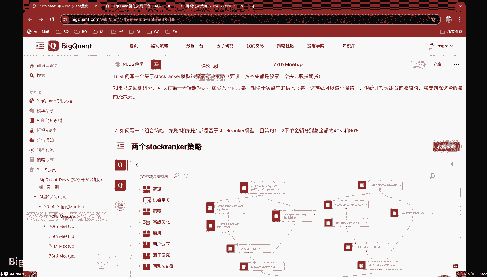

在本节课中，我们将学习如何构建一个基于StockRanker排序学习算法的多模型组合策略。具体来说，我们将创建两个独立的StockRanker模型，并将它们组合成一个策略，其中策略一的下单金额占总金额的40%，策略二占60%。我们将通过一个简单的Demo来演示整个实现过程。

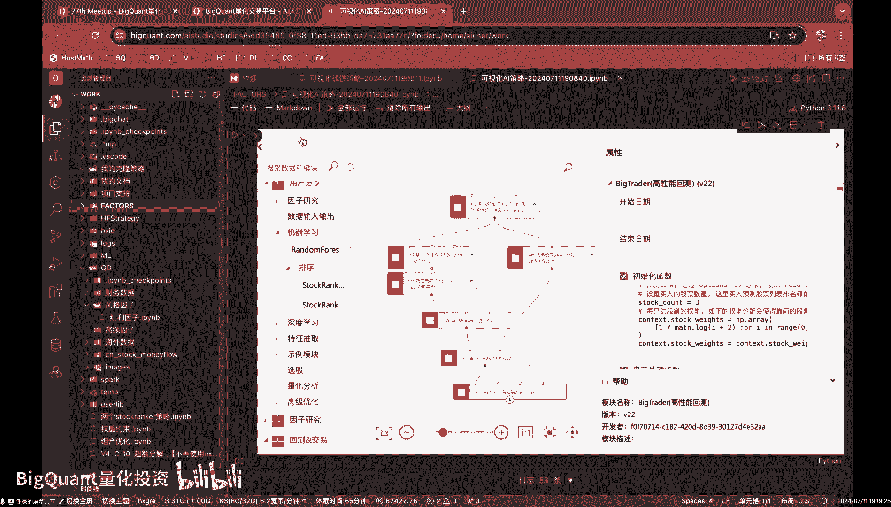

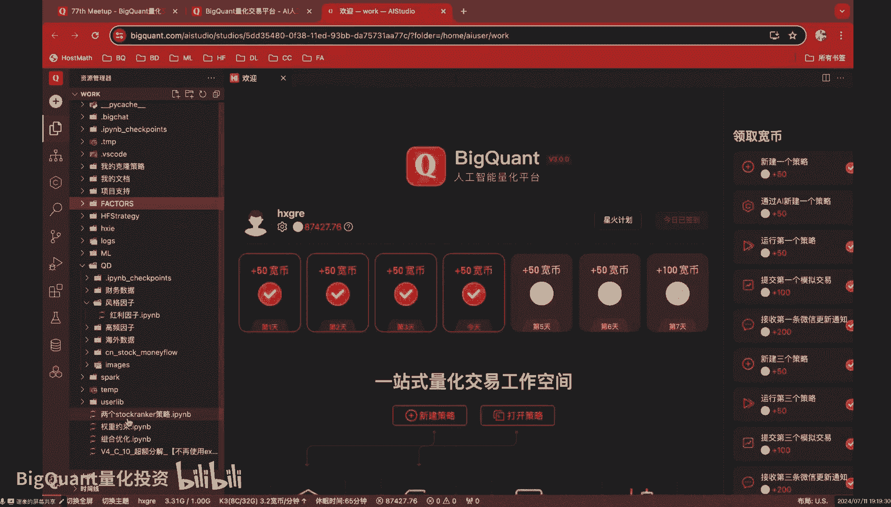

## 策略核心思想 💡

上一节我们介绍了课程目标，本节中我们来看看实现该组合策略的核心思想。StockRanker模型在模板策略中，其最终输出是一个`DataFrame`。这个`DataFrame`标注了每个交易日每只股票的预测得分。

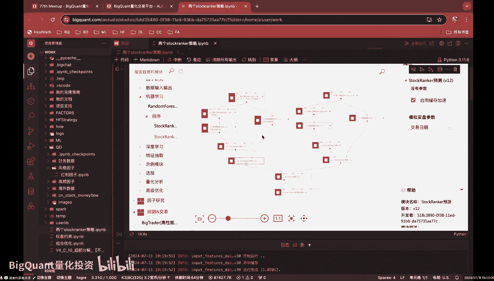

因此，构建组合策略的关键在于：
1.  分别构建两个StockRanker模型，并获取它们各自的预测得分`DataFrame`。
2.  将这两个得分`DataFrame`合并，并传递给回测引擎。
3.  在回测引擎的交易逻辑中，根据不同的得分`DataFrame`和预设的资金比例（40%和60%）分别执行买卖操作。

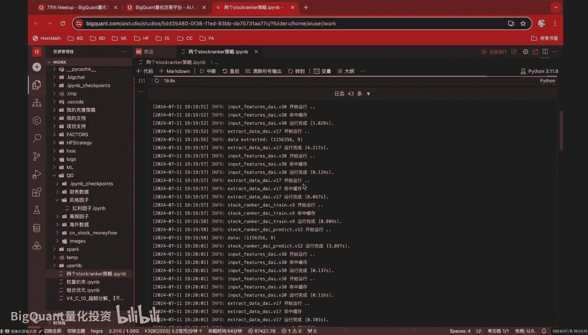

## 模型构建与特征集划分 🔧

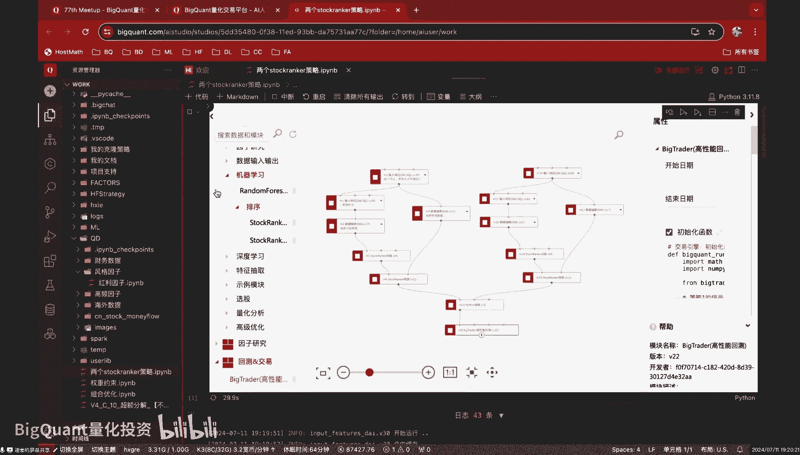

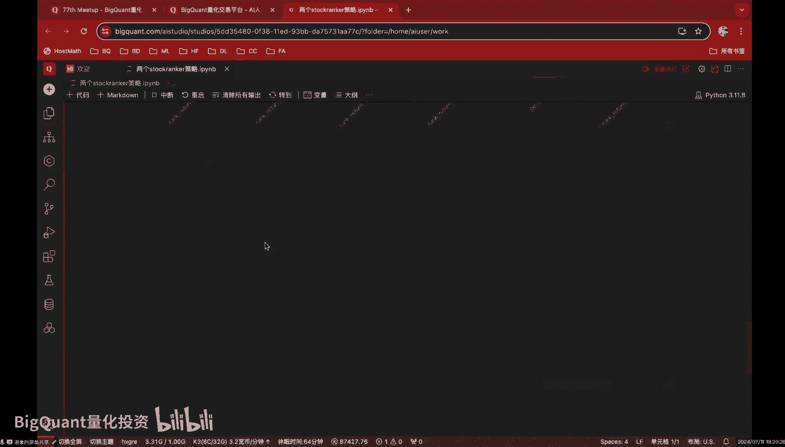

我们首先需要构建两个独立的StockRanker模型。这通常意味着我们需要为每个模型准备不同的特征集。

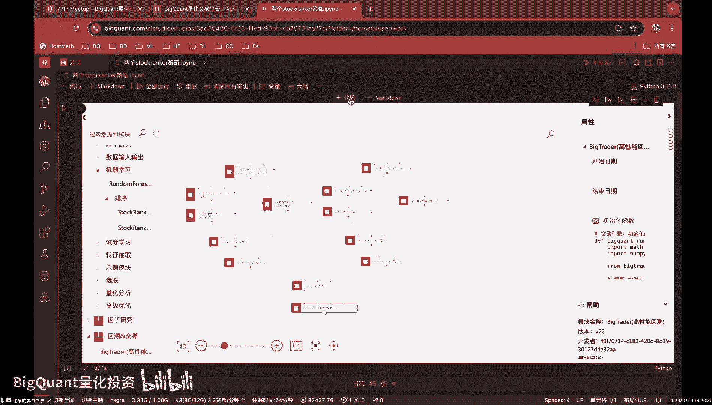

以下是构建两个模型特征集的示例思路：
*   **策略一特征集**：包含第一组选定的因子。
*   **策略二特征集**：包含另一组不同的因子。

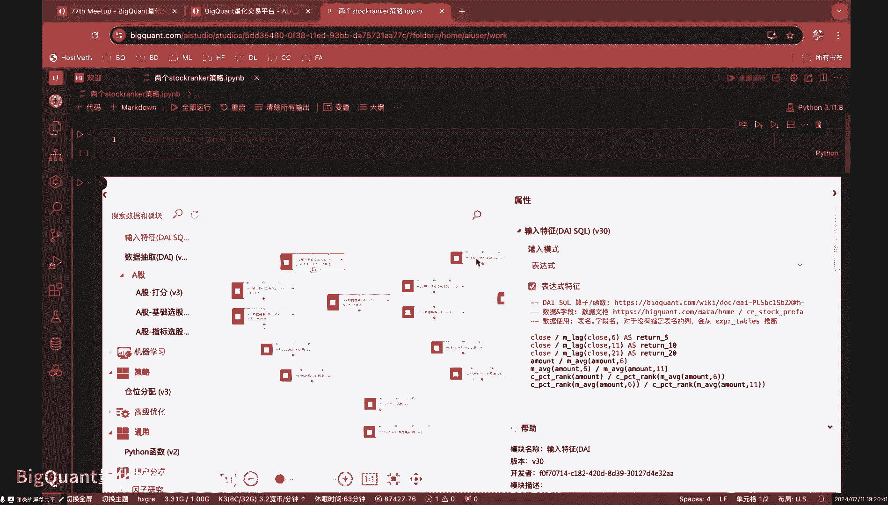

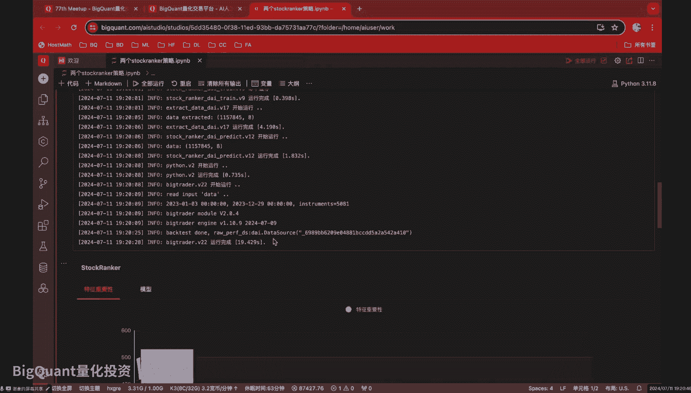

通过这种方式，两个模型基于不同的信息进行学习和预测，可以实现策略的多样性。

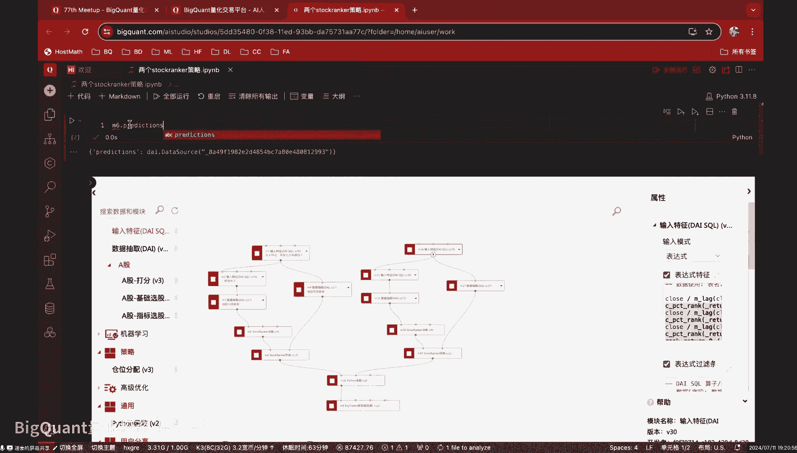

## 模型输出与数据整合 📊

每个StockRanker模型运行后，都会输出一个预测得分的`DataFrame`。例如，策略一的输出`DataFrame`可能如下所示（示意）：

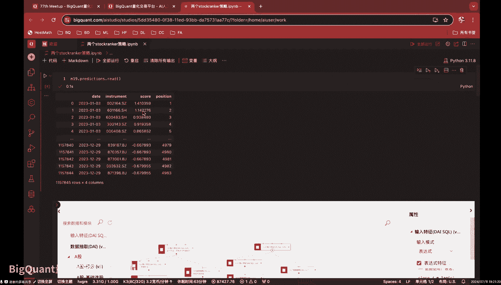

| date       | instrument | score  |
|------------|------------|--------|
| 2023-01-03 | 000001.SZ  | 0.95   |
| 2023-01-03 | 000002.SZ  | 0.87   |

策略二的输出具有类似结构，但得分值不同。

接下来，我们需要将这两个输出整合，以便传递给回测引擎。这可以通过一个简单的Python函数来完成。

```python
def combine_strategies(predictions_1, predictions_2, start_date, end_date, universe):
    """
    整合两个策略的预测结果。
    predictions_1: 策略一的预测得分DataFrame
    predictions_2: 策略二的预测得分DataFrame
    start_date: 回测开始日期
    end_date: 回测结束日期
    universe: 股票池
    """
    combined_data = {
        'strategy_1_predictions': predictions_1,  # 第一个模型的输出
        'strategy_2_predictions': predictions_2,  # 第二个模型的输出
        'start_date': start_date,
        'end_date': end_date,
        'universe': universe
    }
    return combined_data
```

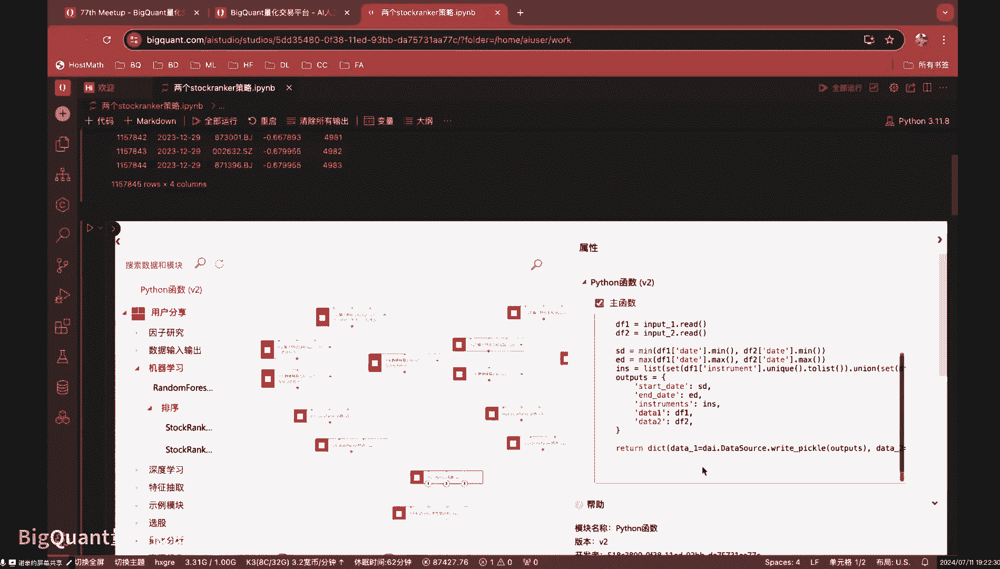

这个函数将两个预测数据集和一个包含回测参数的字典封装在一起，形成一个完整的数据包，供后续回测使用。

## 回测引擎中的交易逻辑 💰

在回测引擎的初始化函数中，我们需要接收并解析上述整合后的数据。

```python
def initialize(context):
    # 从传入的数据中获取策略信号和配置
    context.signal_df_1 = context.combined_data['strategy_1_predictions']  # 策略一信号
    context.signal_df_2 = context.combined_data['strategy_2_predictions']  # 策略二信号
    
    # 设置资金分配权重
    context.weight_1 = 0.4  # 策略一使用40%的资金
    context.weight_2 = 0.6  # 策略二使用60%的资金
```

在每日的交易处理函数中，我们分别处理两个策略的信号。

以下是每日处理买入逻辑的关键步骤：

```python
def handle_data(context, data):
    # 1. 获取当日两个策略的预测信号
    today_signals_1 = context.signal_df_1[context.signal_df_1['date'] == data.current_dt]
    today_signals_2 = context.signal_df_2[context.signal_df_2['date'] == data.current_dt]
    
    # 2. 根据策略一的信号下单（使用40%的资金）
    for _, row in today_signals_1.iterrows():
        stock = row['instrument']
        # 计算该股票应分配的资金（示例，需根据具体选股数量调整）
        order_cash = context.portfolio.cash * context.weight_1 / len(today_signals_1)
        # 生成买入订单
        order_target_value(stock, order_cash)
    
    # 3. 根据策略二的信号下单（使用60%的资金）
    for _, row in today_signals_2.iterrows():
        stock = row['instrument']
        # 计算该股票应分配的资金
        order_cash = context.portfolio.cash * context.weight_2 / len(today_signals_2)
        # 生成买入订单
        order_target_value(stock, order_cash)
```

通过以上代码，我们实现了：
*   每日分别读取两个策略生成的股票排序列表（买入信号）。
*   策略一买入股票时，总下单金额限制为总资金的 **40%**。
*   策略二买入股票时，总下单金额限制为总资金的 **60%**。
*   卖出逻辑可采用类似方式，根据策略信号分别处理。

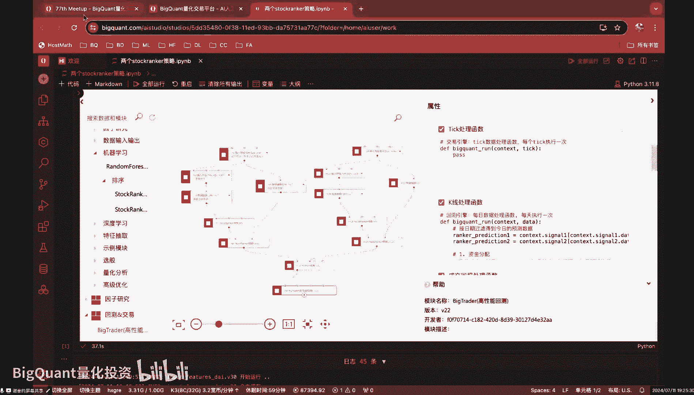

## 总结 📝

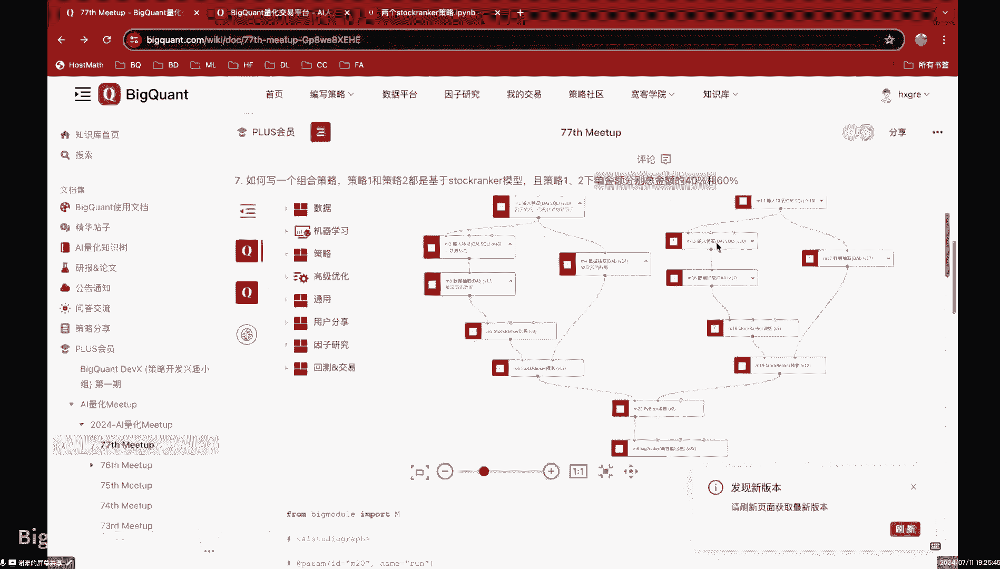

本节课中我们一起学习了如何构建一个基于StockRanker的多模型组合策略。我们首先将原始特征集划分为两部分，分别训练两个StockRanker模型。然后，我们将两个模型的预测输出进行整合，并传入回测引擎。最后，在回测引擎的交易逻辑中，我们通过分配不同的资金权重（40%和60%），实现了两个子策略的独立下单与组合运行。这种方法简单有效，可以快速验证不同因子集或模型组合的效果。