# Python量化交易：P1：Akshare分时成交数据接口详解 📊

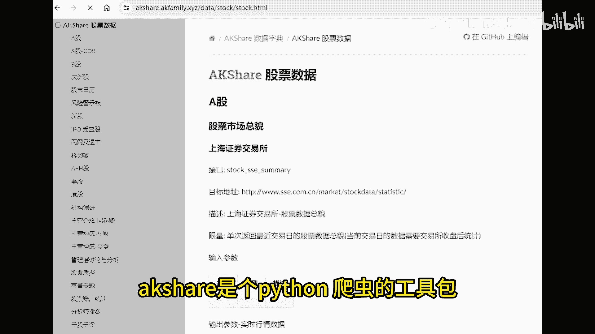

在本节课中，我们将学习如何使用Akshare工具包获取股票的分时成交明细数据。我们将探讨分时成交数据的含义、应用场景，并理解其与逐笔成交数据的区别。通过本教程，你将能够利用这些数据来洞察市场资金的动态。

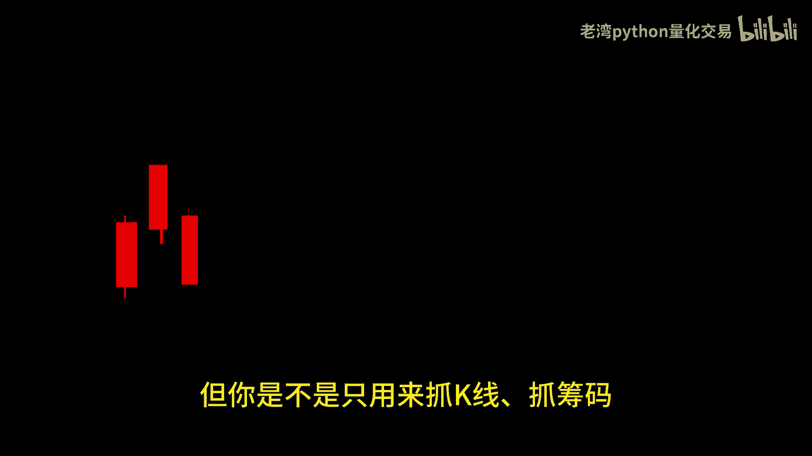

## 概述

Akshare是一个基于Python的爬虫工具包，常用于获取金融数据。许多用户可能仅用它来抓取K线、筹码分布或财务报表数据。实际上，Akshare包含了许多实用但可能被忽视的数据接口，其中之一就是分时成交明细数据。

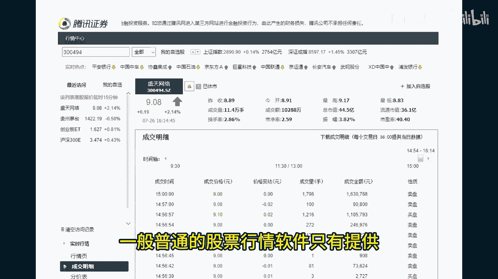

## 分时成交与逐笔成交

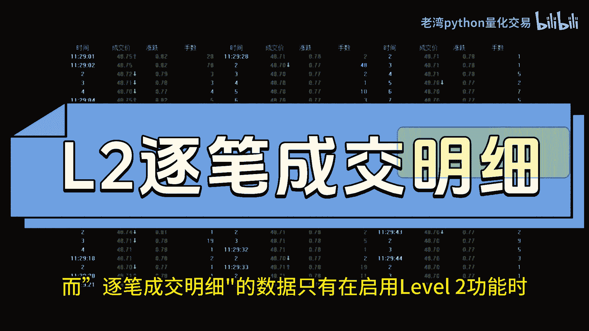

上一节我们介绍了Akshare的基本用途，本节中我们来看看两种关键的成交明细数据：分时成交明细和逐笔成交明细。

*   **分时成交明细**：这是普通股票行情软件普遍提供的数据。它汇总并展示了一段时间内的交易情况。
*   **逐笔成交明细**：这项数据通常需要付费的Level-2行情功能才能查看。它显示了**每一笔**成交的详细信息，包括成交价格以及该笔交易是主动买入还是主动卖出。

“主动交易”反映了交易者的积极性。例如，追涨停时可能会以涨停价买入，而止损时则可能以跌停价卖出。

## 大资金的行为模式

理解了成交数据的类型后，我们来看看如何利用它们分析市场。当市场趋势明显，或有机构、大资金准备进场时，由于资金量庞大，他们通常不会采用挂单的方式。

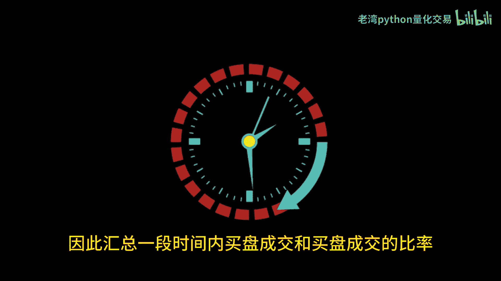

以下是他们不挂单的两个主要原因：
1.  大额挂单会通过上下五档或十档的委托信息被市场其他参与者提前察觉。
2.  挂单等待成交的效率太低，无法满足快速建仓或出货的需求。

因此，大资金往往会以较高的价格多次“扫盘”（主动买入），或以较低的价格“砸盘”（主动卖出）。在横盘震荡时，主动买入和主动卖出的比例会围绕1:1波动。而当大资金开始行动、市场趋势初现时，这个比例会提前出现异常信号。

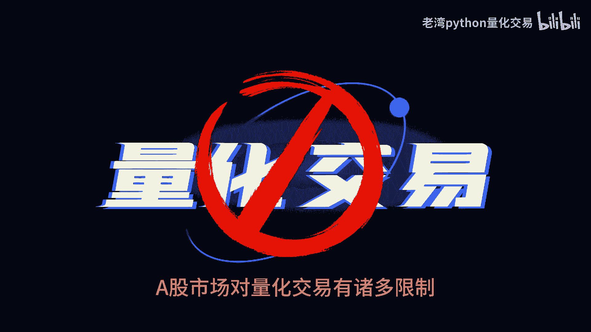

所以，汇总一段时间内（例如3分钟或5分钟）的主动买盘与主动卖盘的比例，可以帮助我们估算大资金的动向。

## A股市场的数据限制

在深入使用数据之前，有必要了解A股市场的数据环境。A股市场的Level-2接口需要付费才能接入，并且委托单通常只能看到上下十档。

相比之下，某些其他金融市场，这些数据在开户后即可通过API免费接入，并且是毫秒级更新。

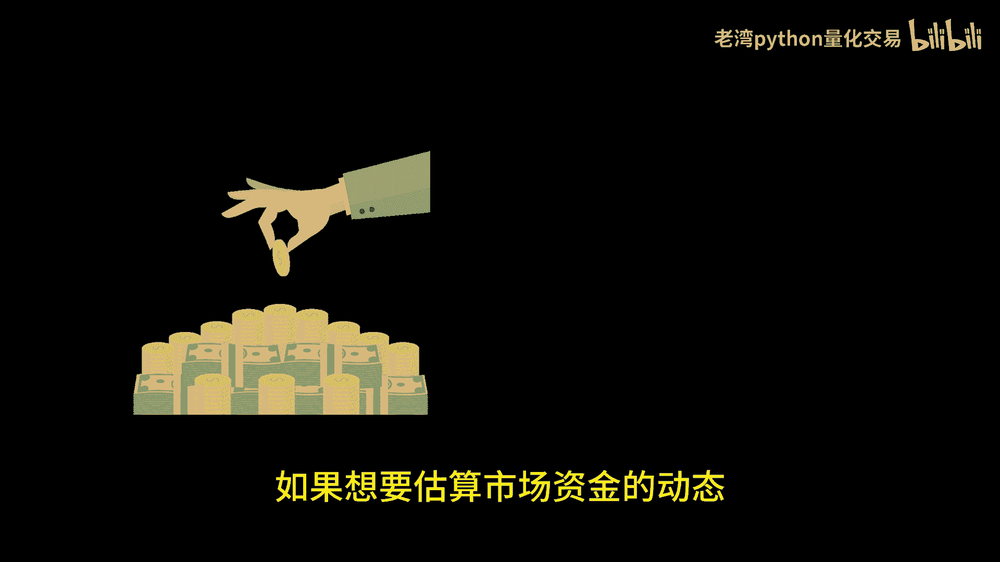

## 分时成交数据的规则

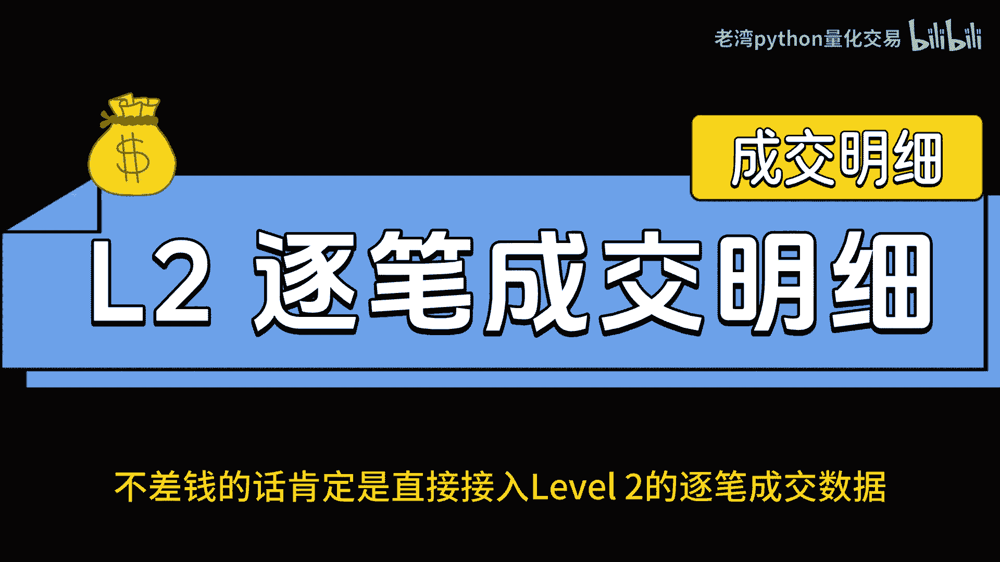

由于逐笔数据获取门槛较高，分时成交数据成为了一个重要的替代分析工具。首先，我们需要了解它的生成规则。

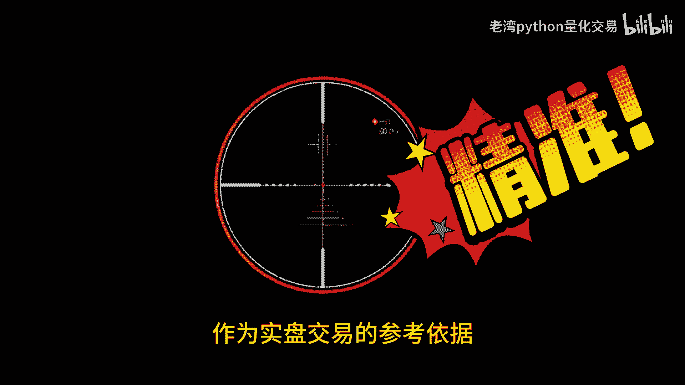

交易所每**3秒**向用户发送一次打包数据。这个数据包包含了过去3秒内的所有成交汇总。如果没有成交，则会发送一条空白信息。因此，每分钟最多有20组数据。

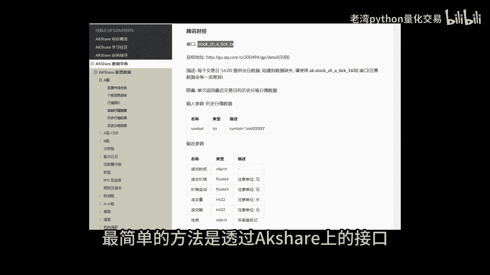

在分时成交明细中显示的“买盘”或“卖盘”标签，取决于过去3秒内**最后一笔**交易的方向。虽然这不如逐笔数据精确，但在“白嫖”原则下，通过Akshare接口下载分时成交明细，仍然是分析市场资金积极程度的最简单有效的方法。

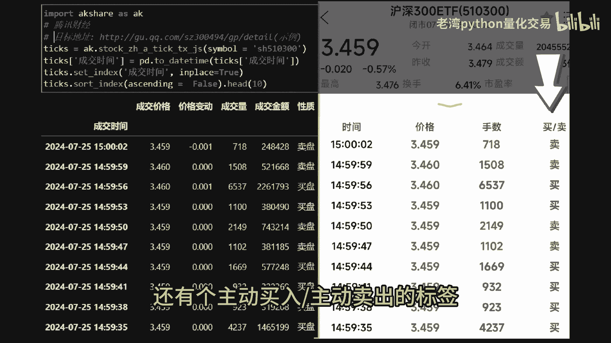

## 数据应用与实例分析

理解了买卖盘的底层逻辑和实时数据的获取方式后，我们就可以设计观察指标和交易信号了。将这些信号与盘中的量比等指标结合，能够揭示更深层的交易信息。

我们来看一个实例。下图展示了某日沪深300ETF的盘中信息。当时市场成交量持续萎缩，这意味着对于大资金而言，只需少量资金就能轻易影响股价。

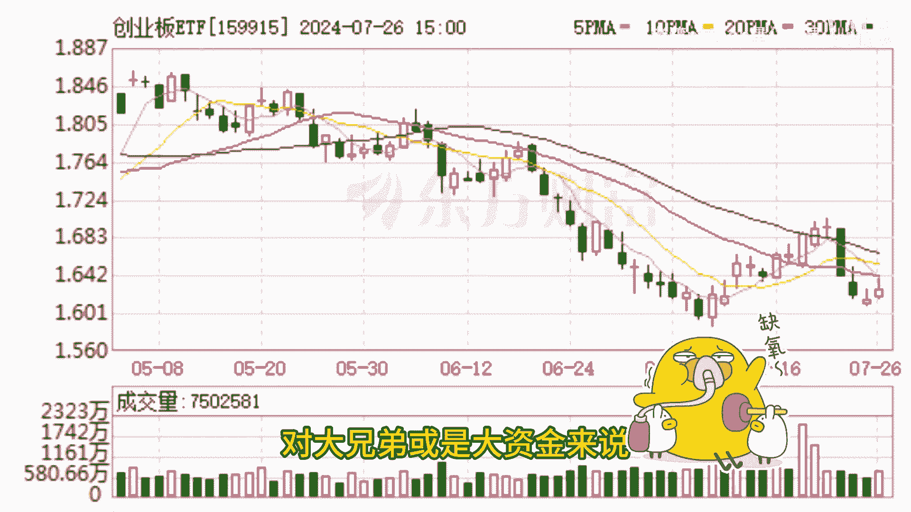

在10:30左右，市场量比下滑至0.8左右。与此同时，原本在1:1附近徘徊的买盘卖盘比率，突然被拉升到了10:1。随后的交易也维持在3倍左右的高位。

从10:30到11:30，该ETF的价格上涨了约1%。K线图虽然直观地展示了价格上涨的结果，但其背后的逻辑和细节却被掩盖了。交易的本质是买卖，K线只是交易后的结果，中间大量的交易信息被过滤掉了。而分时成交数据能让我们更直接地感受到交易者的“气度”。

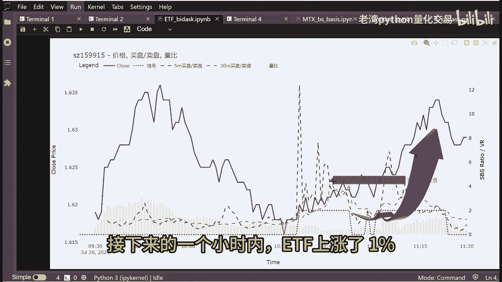

当然，如果你资金和技术允许，直接接入Level-2逐笔成交数据接口会是更优选择。

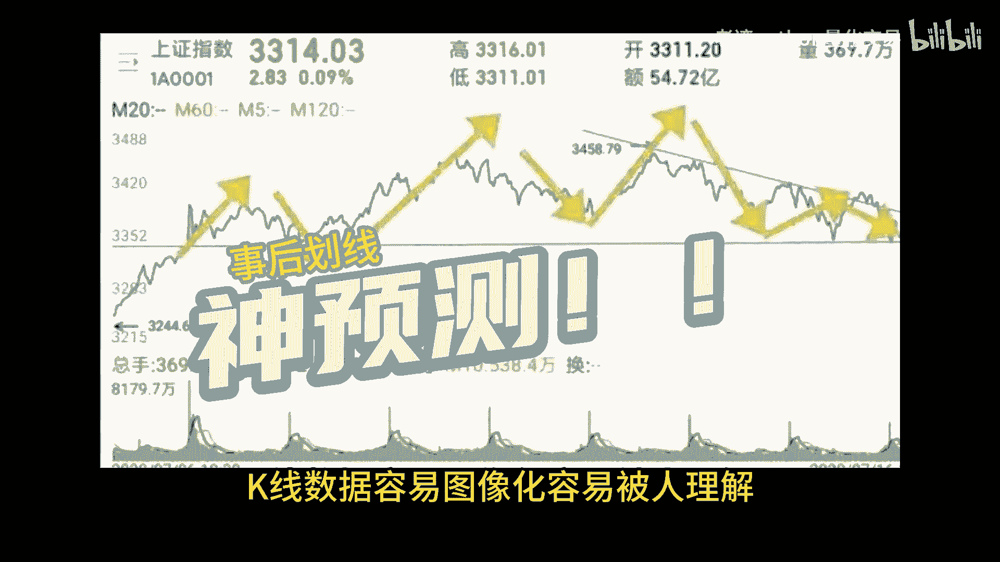

## 总结

本节课中我们一起学习了：
1.  **Akshare工具包** 除了常见数据，还能获取**分时成交明细**。
2.  区分了 **分时成交**（汇总数据）和 **逐笔成交**（Level-2明细数据） 的概念。
3.  理解了大资金 **“扫盘”/“砸盘”** 的行为模式，以及如何通过 **主动买卖盘比例** 洞察其动向。
4.  认识了A股市场的数据限制，以及分时数据 **每3秒推送一次** 的规则。
5.  通过实例看到，结合 **量比** 和 **买卖盘比率**，分时成交数据能提供比单纯K线更超前的市场洞察。

对于量化交易初学者，从免费的分时成交数据入手，是分析市场资金流向和交易者情绪的有效起点。