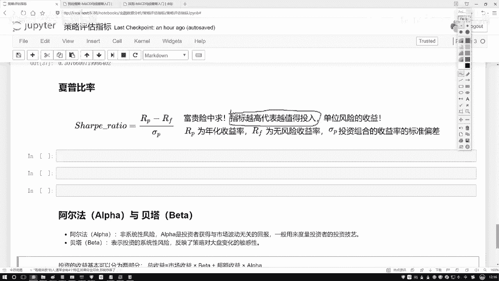
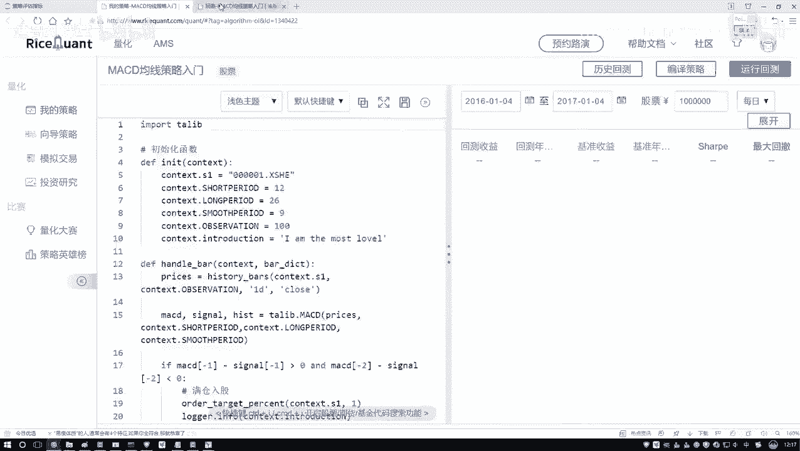
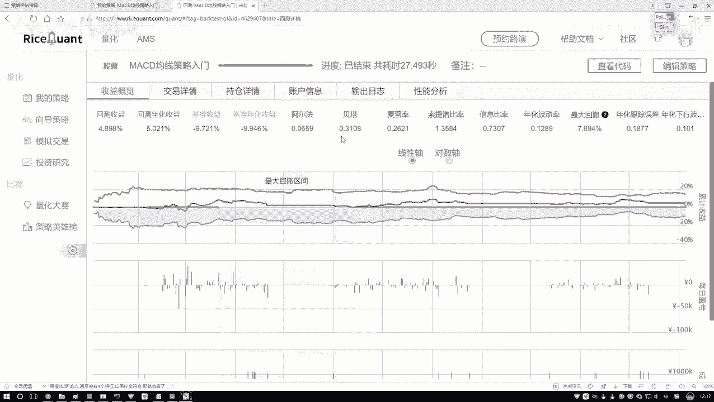
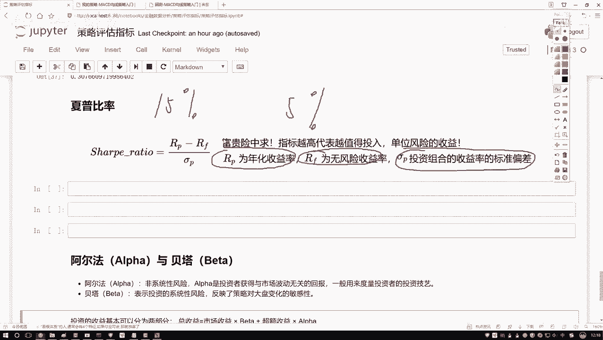
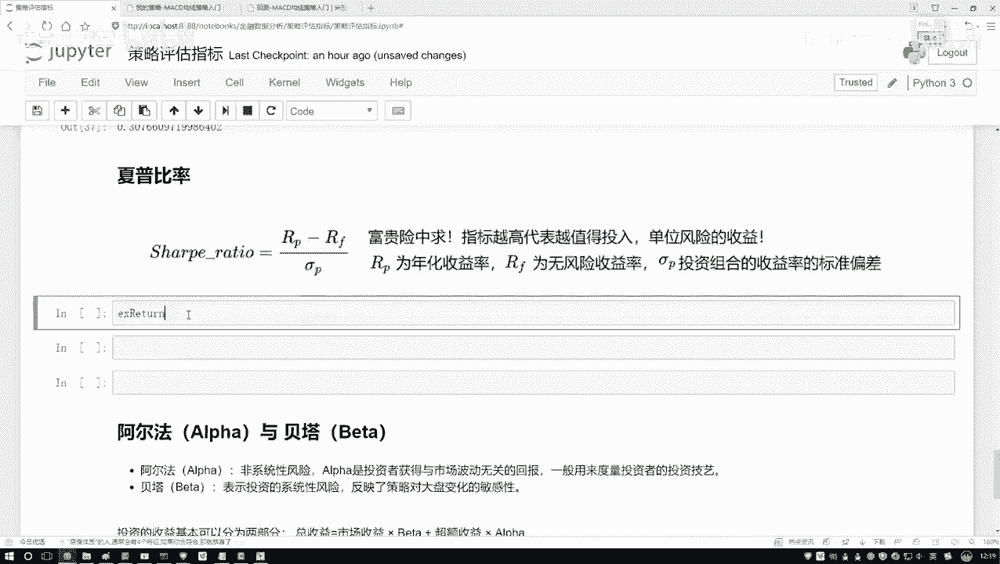
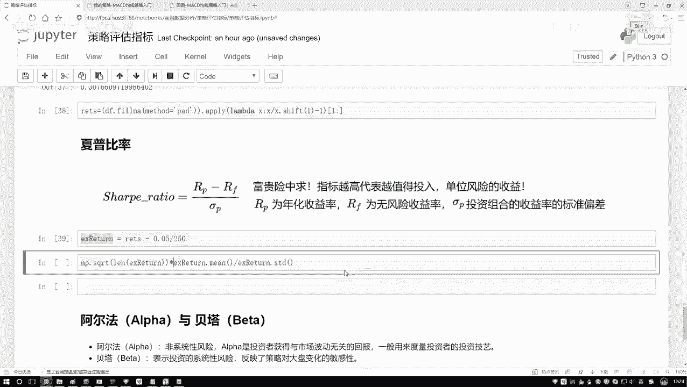
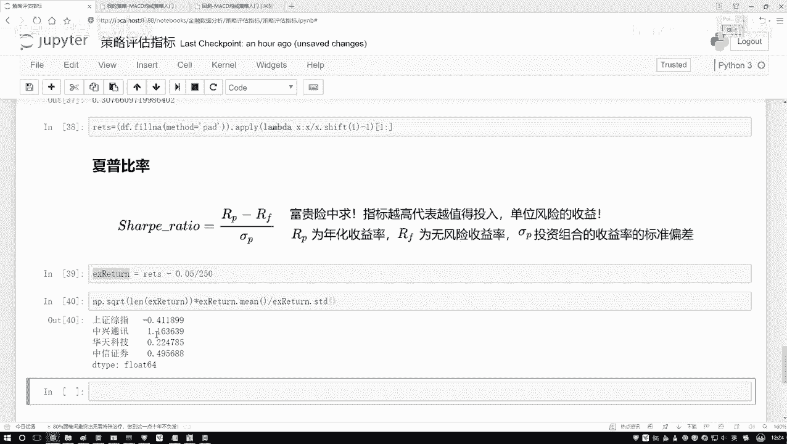
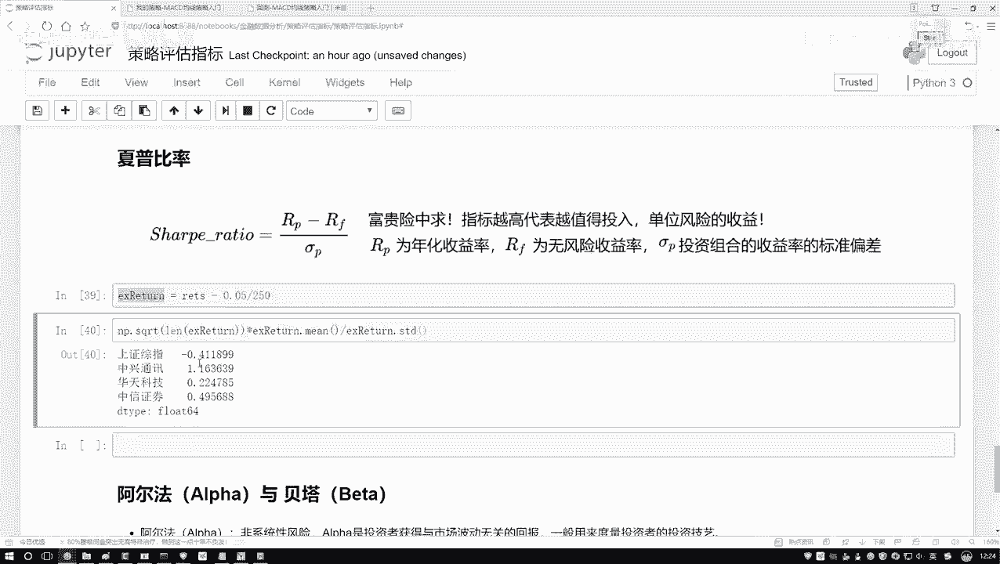
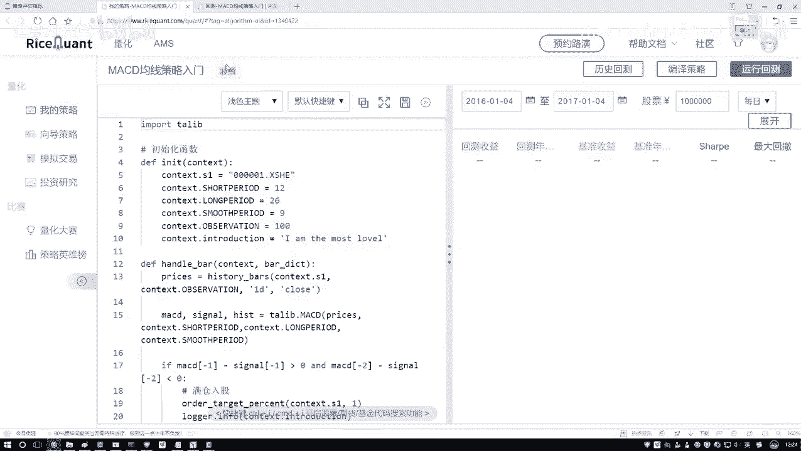
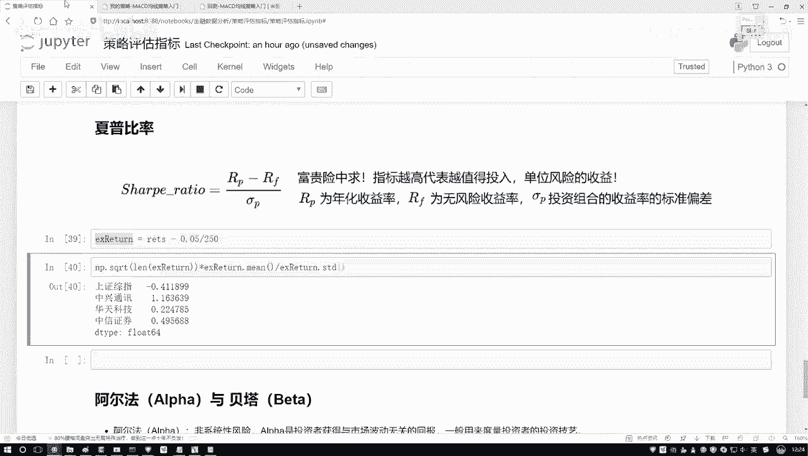

# 机器学习金融分析实战：P19：4-夏普比率的作用 📈

在本节课中，我们将要学习一个在金融投资中至关重要的评估指标——夏普比率。我们将了解它的定义、作用，并通过Python代码演示如何计算它，从而帮助我们评估不同投资策略或资产的风险调整后收益。

## 概述

夏普比率是一个用于衡量投资组合风险调整后收益的指标。它描述了在承担单位风险的情况下，投资者能获得多少超额回报。简单来说，它帮助我们判断一个高收益的投资是否值得其伴随的高风险。

## 夏普比率的定义与作用

上一节我们介绍了投资回报率，本节中我们来看看如何结合风险来评估回报的质量。



夏普比率描述的是：对于单位风险而言，我们能获得多少收益。指标越高，意味着在承担相同风险的情况下，获得的收益越高。在选股或选择投资策略时，如果单看夏普比率，我们通常会选择指标更高的选项，因为它代表了更高的风险调整后收益。



其核心思想可以类比：一份日薪极高但身处战区的雇佣兵工作，其高回报对应着极高的生命风险。夏普比率就是用来量化这种“风险是否值得”的指标。



## 夏普比率的计算公式

理解了夏普比率的作用后，我们来看看它的具体计算方法。

计算夏普比率，需要比较投资组合的收益与无风险收益的差异，并将这个差异与投资组合的风险（波动性）进行比较。

*   **投资组合收益率**：你的投资（如股票组合）产生的回报率。
*   **无风险收益率**：通常指国债等几乎无风险投资的收益率，例如年化5%。
*   **投资组合标准差**：衡量投资组合价格波动幅度（即风险）的指标。

夏普比率（Sharpe Ratio）的公式如下：

```
Sharpe Ratio = (投资组合收益率 - 无风险收益率) / 投资组合收益率的标准差
```

公式的含义是：计算投资组合超越无风险收益的超额收益，再除以该组合的波动性（风险）。结果值越大，说明该投资在单位风险下获得的超额回报越高，性价比越好。

## 使用Python计算夏普比率

接下来，我们将在Python环境中，基于实际的股票回报率数据来计算夏普比率。

在计算之前，我们需要确保数据是完整的。金融数据中可能存在因停牌等原因产生的缺失值，常见的处理方法是使用前一天的数值进行填充。



以下是计算夏普比率的关键步骤代码：



```python
# 假设 returns 是包含各股票每日回报率的DataFrame
# 1. 处理缺失值：用前一天的数值填充
returns_filled = returns.fillna(method='ffill')

# 2. 设置年化无风险收益率，例如5%
risk_free_rate = 0.05

# 3. 计算年化夏普比率
# 假设数据是日频，一年约有250个交易日
sharpe_ratios = (returns_filled.mean() - risk_free_rate/250) / (returns_filled.std() * np.sqrt(250))
```

代码说明：
1.  `returns_filled.mean()` 计算各股票的平均日收益率。
2.  `risk_free_rate/250` 将年化无风险收益率转化为日度数据。
3.  `returns_filled.std()` 计算各股票日收益率的标准差。
4.  `np.sqrt(250)` 将日波动率年化处理（乘以交易天数的平方根）。
5.  最终得到的 `sharpe_ratios` 就是一个Pandas Series，其中包含了每只股票的年化夏普比率。

## 结果解读与应用

计算完成后，我们可以查看结果。

```python
print(sharpe_ratios.sort_values(ascending=False))
```



输出结果可能类似：
```
中兴通讯    1.25
贵州茅台    0.80
中国平安   -0.10
...
```



结果解读：
*   **夏普比率为正且值较大**（如“中兴通讯”的1.25）：表明该资产在承担单位风险时，能产生较高的超额收益，是性价比较高的选择。
*   **夏普比率为正但值较小**：表明收益与风险匹配度一般。
*   **夏普比率为负**：表明该资产的收益甚至未能覆盖无风险收益，投资价值较低。



在策略选择中，我们通常倾向于夏普比率越大越好的投资标的或策略。



## 总结



本节课中我们一起学习了夏普比率。我们首先了解了它是一个衡量**风险调整后收益**的核心指标，用于评估单位风险所带来的超额回报。然后，我们学习了它的计算公式，并通过Python代码演示了如何基于处理好的股票回报率数据来计算多只股票的夏普比率。最后，我们学会了如何解读计算结果：**夏普比率越高，代表投资的风险收益性价比越好**。掌握夏普比率是进行科学量化选股和策略评估的重要一步。