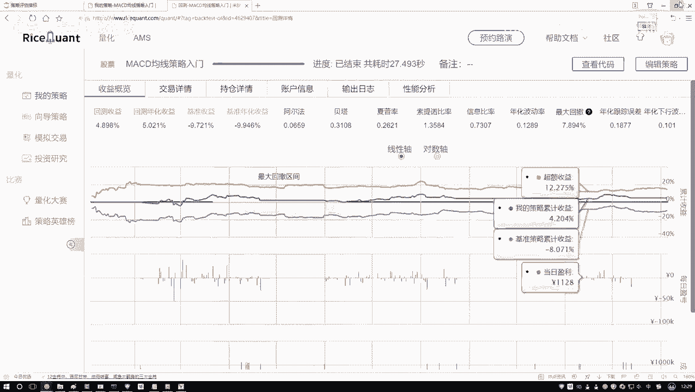
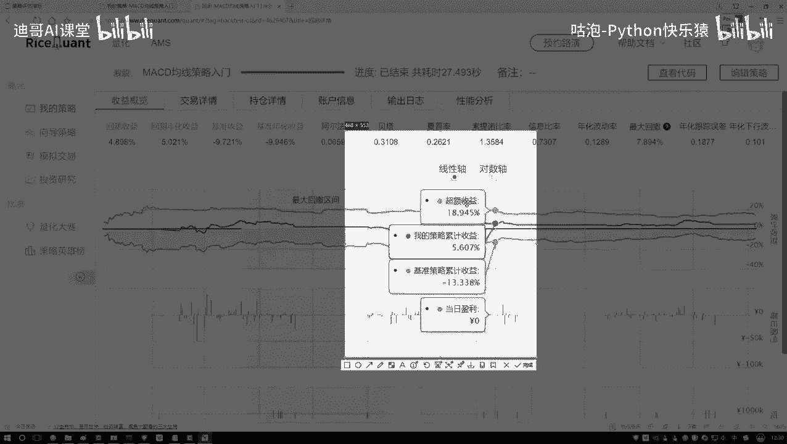
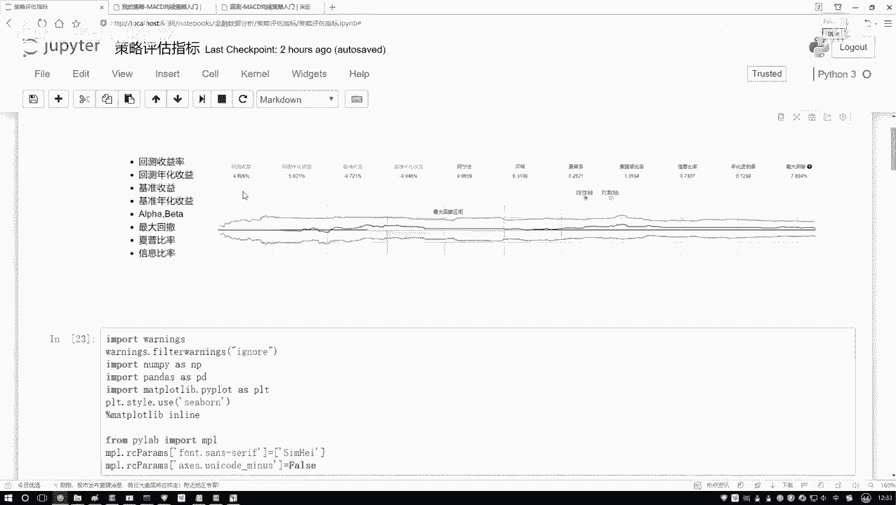

# 机器学习金融分析：P20：阿尔法与贝塔概述

## 概述
在本节课中，我们将要学习量化交易策略评估中的两个核心概念：阿尔法（Alpha）和贝塔（Beta）。理解这两个指标，能帮助我们区分投资收益的来源，并明确量化策略的优化方向。

## 阿尔法与贝塔的定义
上一节我们介绍了策略评估的多种指标，本节中我们来看看阿尔法和贝塔这两个核心概念。

投资收益通常由两部分构成。一部分与整体市场环境相关，当市场整体向好时，大部分投资都能获利。另一部分则与市场波动无关，它源于投资者独特的策略、敏锐的观察力或精准的操作手法。

阿尔法和贝塔就是分别衡量这两部分收益贡献的指标。

*   **阿尔法（Alpha）**：衡量的是**与市场波动无关的超额收益**。它反映了策略本身的有效性，即通过个人努力和独特方法所获得的、超越市场平均水平的回报。阿尔法值越高，通常意味着策略的独立盈利能力越强。
*   **贝塔（Beta）**：衡量的是**策略对市场波动的敏感性**，即“跟随大势”所能获得的收益部分。它反映了投资组合的系统性风险。贝塔值为1表示策略与市场波动同步；大于1表示波动比市场更剧烈；小于1则表示波动比市场平缓。

简而言之：**市场收益与贝塔挂钩，超额收益与阿尔法挂钩。**

## 收益构成的可视化理解
为了更直观地理解，我们可以观察策略回测的结果图表。

在图表中，通常会有几条关键的曲线：
1.  **“我的策略收益”曲线**：代表您所构建的策略产生的总收益。
2.  **“基准收益”曲线**（例如沪深300指数收益）：代表市场大环境的整体走势。
3.  **“超额收益”曲线**：由 **“策略收益”减去“基准收益”** 得到，它直观地展示了策略独立于市场所创造的额外价值。

因此，总收益可以拆解为：**总收益 = 市场收益（贝塔收益）+ 超额收益（阿尔法收益）**。

## 阿尔法与贝塔的计算逻辑
那么，阿尔法和贝塔这两个系数是如何得出的呢？

在金融模型中，常通过一个线性回归方程来估算它们：
`策略收益 = Alpha + Beta * 市场收益 + 误差项`

以下是求解思路：
1.  这个方程描述策略收益与市场收益之间的关系。
2.  通过历史数据，我们可以拟合出最优的Alpha和Beta值。
3.  这个过程类似于解一个线性方程，旨在找到最能解释两者关系的系数。

具体的因子分析和求解方法将在后续课程中详细展开。目前，大家只需理解阿尔法和贝塔所代表的经济含义即可。

## 量化策略的关注重点
我们的最终目标是通过投资获利。然而，市场大盘的走势是个人无法控制的外部因素。

因此，量化策略的核心关注点自然落在了如何获取稳定的**超额收益**上，即追求更高的、可持续的**阿尔法**。如何通过数据、模型和独特的策略逻辑来创造阿尔法，是我们学习和实践量化交易的主要方向。

## 总结
本节课中我们一起学习了阿尔法（Alpha）与贝塔（Beta）的核心概念。
*   **贝塔**衡量了策略受市场影响的程度，代表系统性风险带来的收益。
*   **阿尔法**衡量了策略超越市场的能力，代表通过技能和策略获取的超额收益。
*   在量化交易中，我们的核心目标是构建能够持续产生正阿尔法的策略。

理解这两者的区别，能帮助我们在策略评估和优化中找准方向，不再单纯依赖市场行情，而是致力于提升策略自身的有效性和独特性。