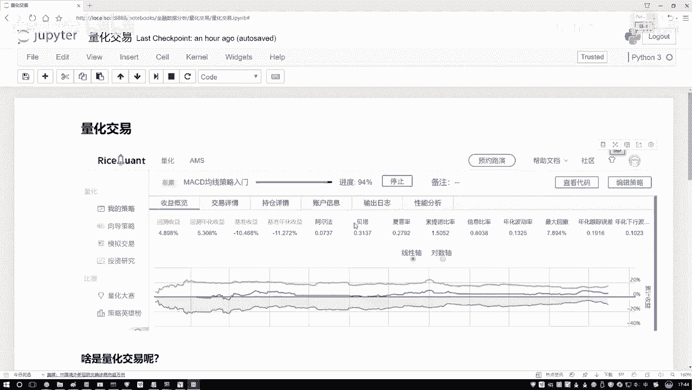
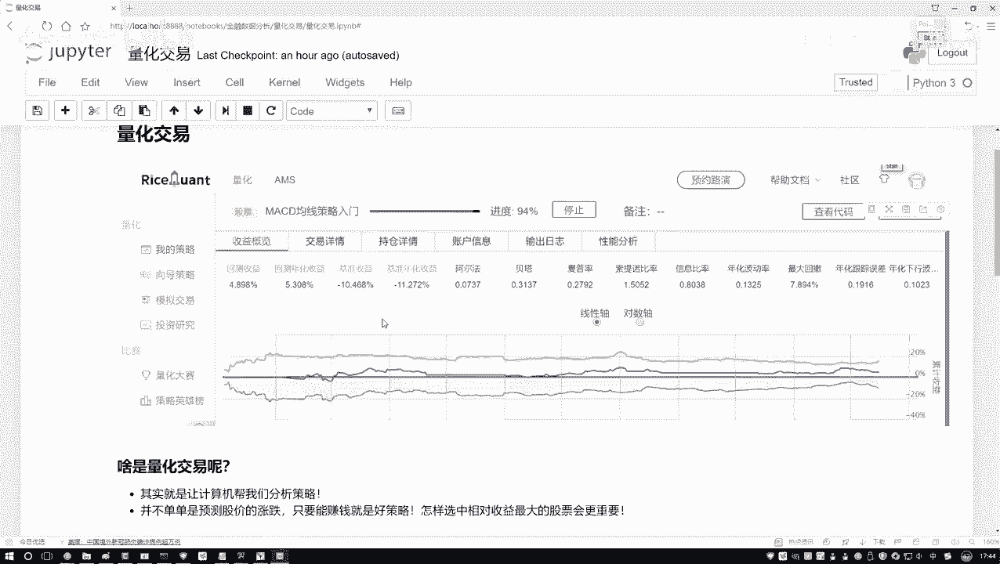
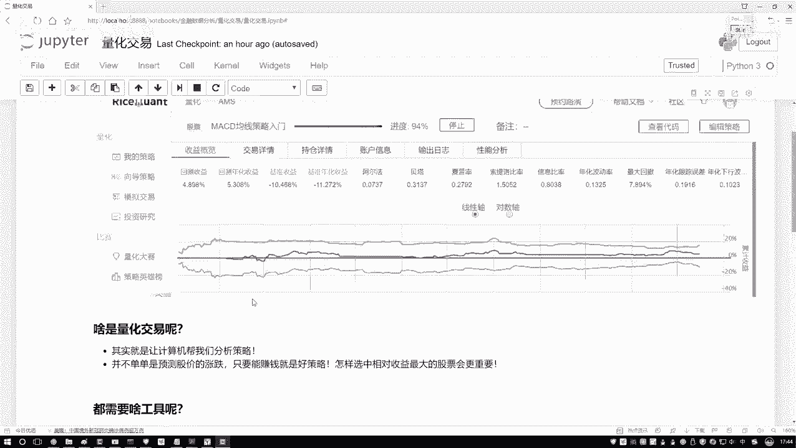
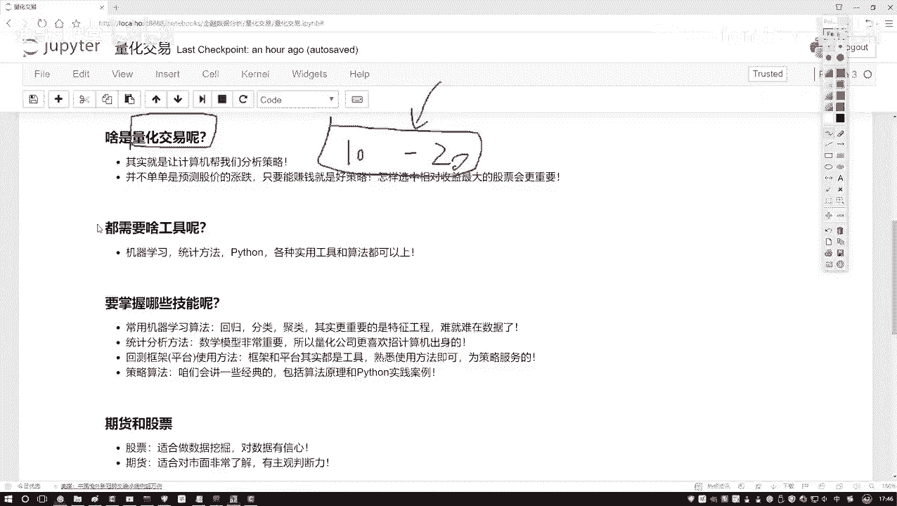
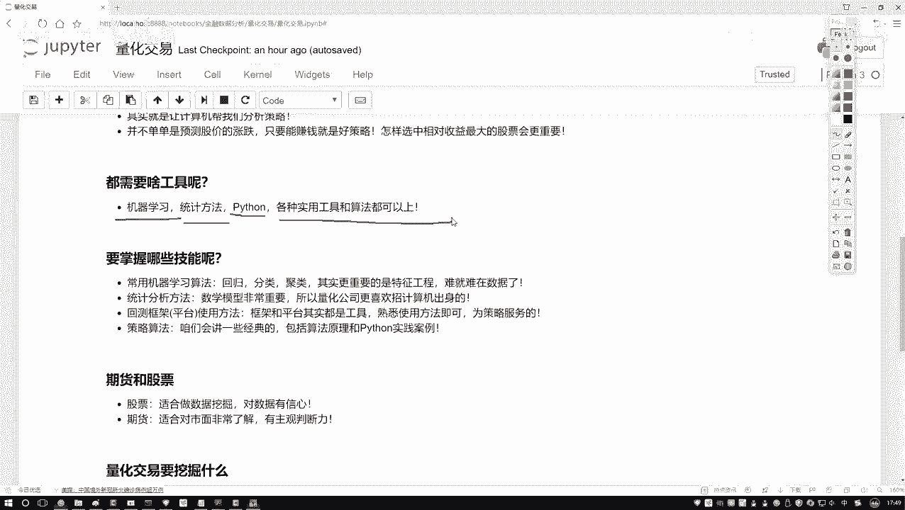

# 量化交易入门：P21：1-量化交易概述

在本节课中，我们将要学习量化交易的核心概念，了解它与传统交易方式的区别，并明确学习量化交易所需要掌握的核心技能。

## 什么是量化交易？

上一节我们介绍了课程主题，本节中我们来看看量化交易的本质。

传统股票交易由交易员在电脑前手动操作，时刻关注市场指标变化。这种方式存在两个主要问题：第一，人的主观判断可能导致决策不准确；第二，人的精力、时间和计算能力有限，无法同时分析大量股票或跨越长时间的历史数据。

量化交易的目标同样是实现盈利，但策略的制定和执行交由计算机完成。其核心是：基于历史数据，通过计算机设计并验证交易策略，以追求收益最大化。

具体来说，量化交易的过程是：获取股票的历史数据（例如过去10年的数据），这些数据是固定不变的。然后，设计一种交易方法（策略），并将此方法应用到历史数据中，检验该策略能否盈利，或通过多项指标评估策略的好坏。这个过程常被称为“回测”。

**量化交易公式化描述**：
`量化交易 = 基于历史数据 + 设计交易策略 + 回测验证 + 追求收益最大化`

简而言之，量化交易是让计算机在历史数据中执行数据挖掘任务，找出能够盈利的有效策略。

## 量化交易需要哪些核心技能？

了解了量化交易的定义后，我们来看看实践它需要掌握哪些知识和工具。

量化交易是一个交叉学科，但学习的侧重点应放在与计算机和数据相关的技能上。金融学知识只需了解基本概念即可，并非重点。

以下是量化交易所需的核心技能领域：

*   **机器学习算法**：用于基于数据预测未来走势或结果。
*   **统计方法**：用于计算和分析数据中的各项指标，挖掘有价值的信息。
*   **编程实践（如Python）**：用于实现策略、处理数据和进行回测。

在量化交易中，没有绝对的“必备工具”。任何能帮助你处理数据、验证策略并最终实现收益最大化的工具都是好工具。其核心可以看作是**数据挖掘**在金融交易领域的具体应用。

## 总结

本节课中我们一起学习了量化交易的基础知识。我们明确了量化交易是利用计算机和数据分析方法，基于历史数据来设计和验证交易策略，以自动化、客观的方式追求投资回报。学习量化交易的重点应放在机器学习、统计学和编程等数据处理技能上，而非深奥的金融理论。