# 量化交易实战：P24：1-策略任务分析 📊

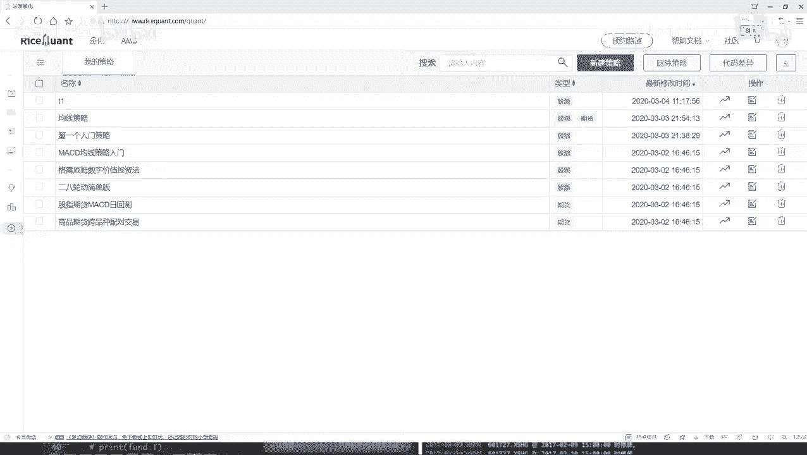

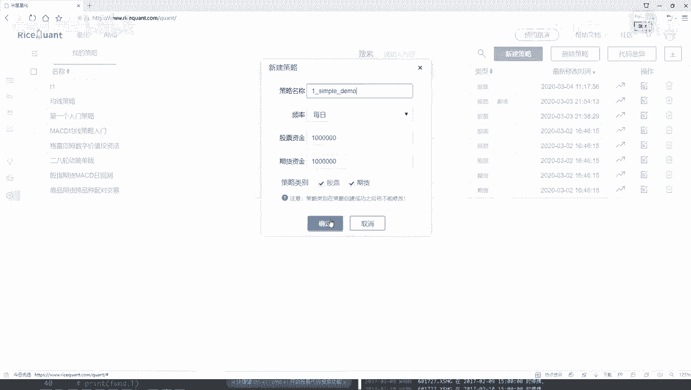

在本节课中，我们将学习如何在一个交易平台上构建一个简单的量化交易策略。我们将通过一个具体的任务来熟悉平台的核心API，并理解策略开发的基本流程。

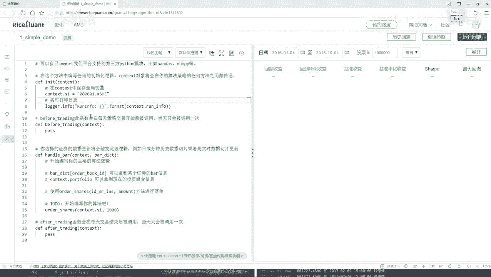

## 策略目标概述

我们的目标是创建一个策略，该策略始终持有沪深300指数中表现最好的十只股票。具体来说，我们需要每天（或每个交易周期）从沪深300的成分股中，根据某个财务指标（例如盈利能力）进行排序，然后买入排名前十的股票，并卖出手中不再属于前十的股票。

## 策略开发流程

上一节我们概述了策略目标，本节中我们来看看实现这个目标的具体步骤。策略代码主要包含三个核心模块：初始化、盘前处理和盘中处理。

### 1. 初始化模块 (`initialize`)

在初始化函数中，我们需要完成策略的初始设置。核心任务是获取我们的股票池。

以下是初始化模块需要完成的工作：
*   获取沪深300指数的所有成分股，作为我们的备选股票池。
*   进行其他必要的全局变量初始化。

### 2. 盘前处理模块 (`before_trading`)

在每天实际交易开始前，我们需要进行数据准备和计算。这个模块每天都会自动执行。

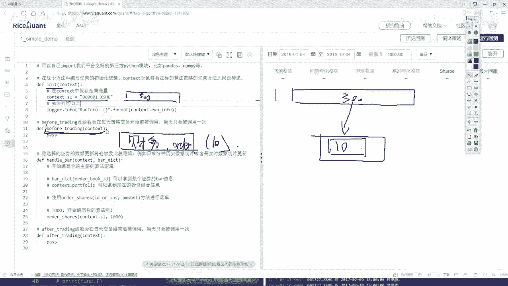

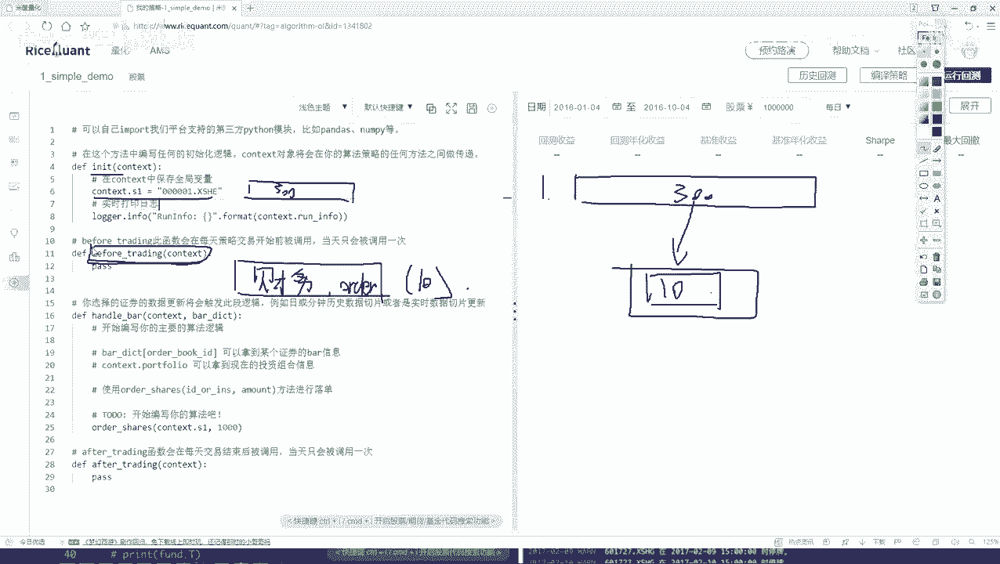

以下是盘前处理模块需要完成的工作：
*   从股票池（沪深300成分股）中，获取每只股票的特定财务数据（例如盈利数据）。
*   根据选定的财务指标对所有股票进行排序。
*   选出排名前十的股票，并将结果保存下来，供交易模块使用。

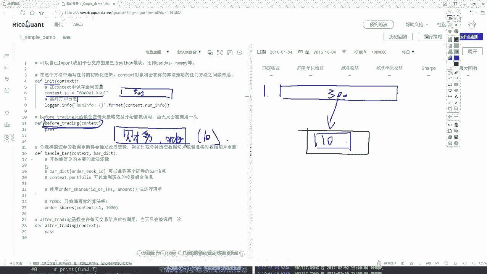

### 3. 盘中处理模块 (`handle_bar`)

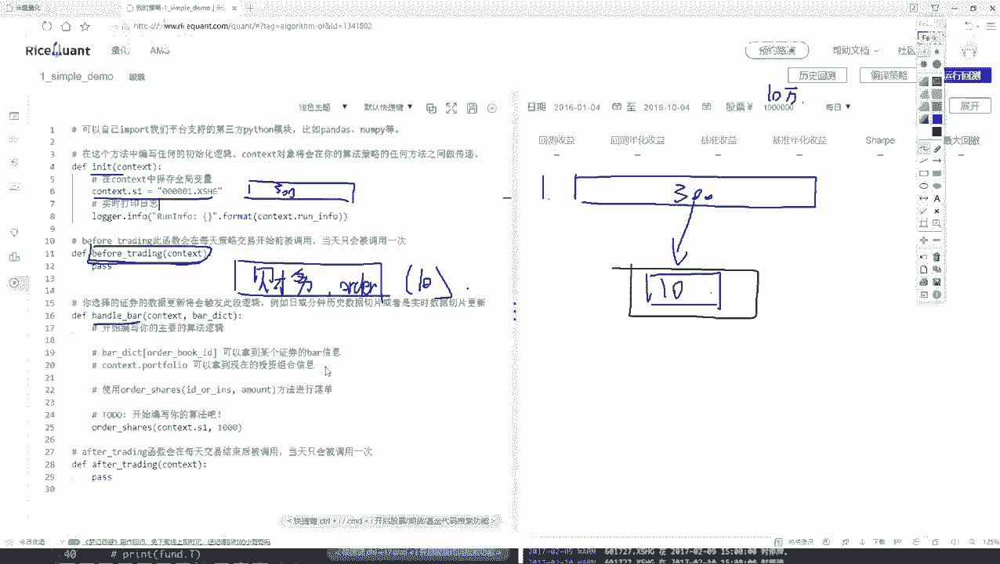

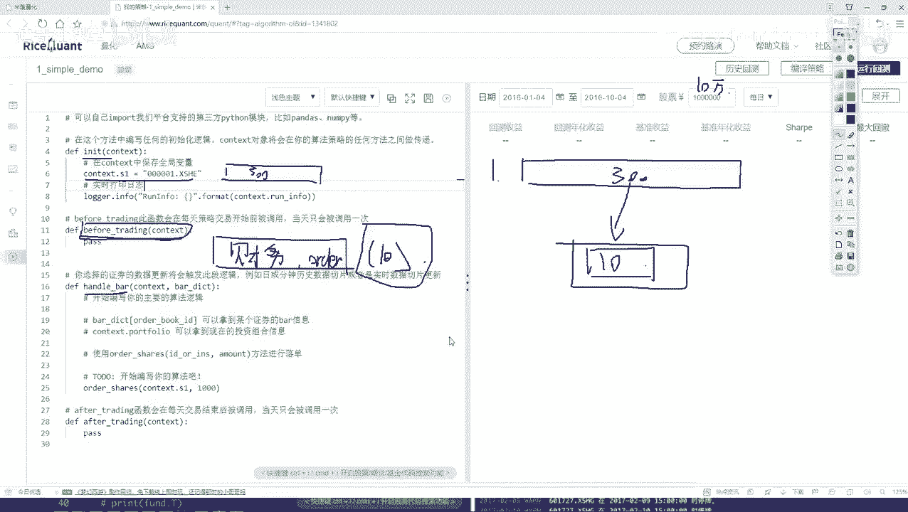

这是策略的核心交易逻辑执行部分。在这里，我们将根据盘前计算的结果，进行实际的买卖操作。

以下是盘中处理模块需要完成的工作：
*   **检查当前持仓**：获取当前账户中持有的所有股票。
*   **对比与调仓**：将当前持仓与盘前计算出的“前十名股票列表”进行对比。
    *   对于列表中已有且当前也持有的股票，继续持有。
    *   对于当前持有但不在新列表中的股票，执行卖出操作。
    *   对于在新列表中但当前未持有的股票，使用可用资金执行买入操作。

## 总结

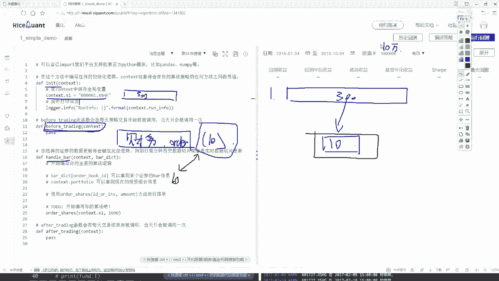

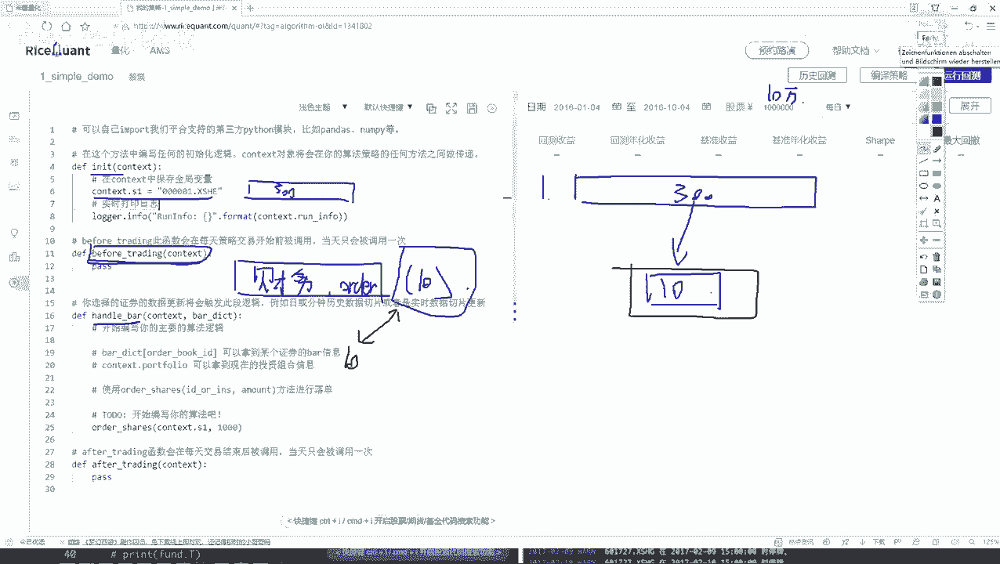

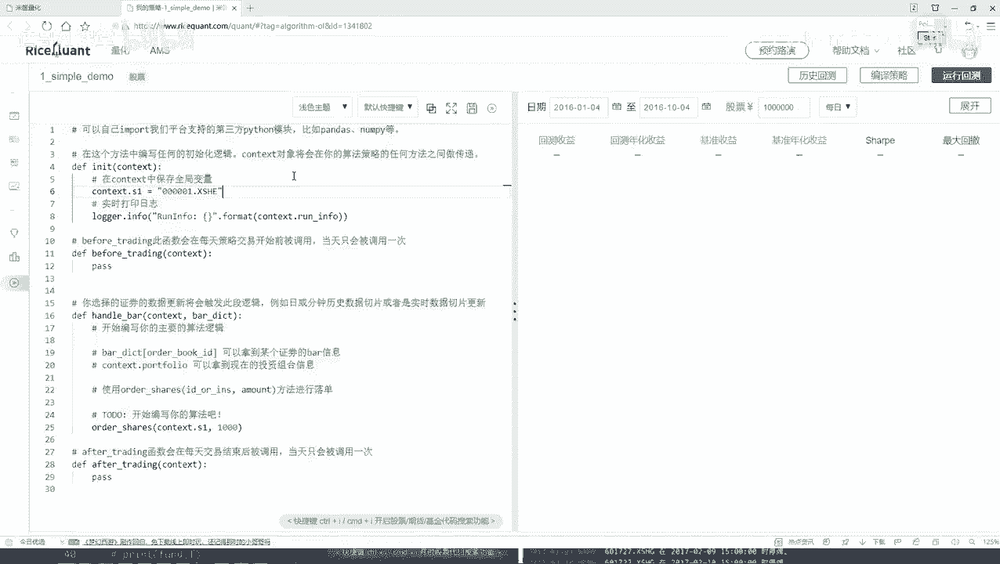

本节课中我们一起学习了如何规划一个简单的选股策略。我们明确了策略的目标：始终持有沪深300中财务表现最好的十只股票。为了实现它，我们分解了三个关键步骤：在`initialize`中初始化股票池；在`before_trading`中每日计算排名前十的股票；在`handle_bar`中执行具体的调仓交易。这个流程清晰地展示了量化策略从数据准备到交易执行的基本框架。