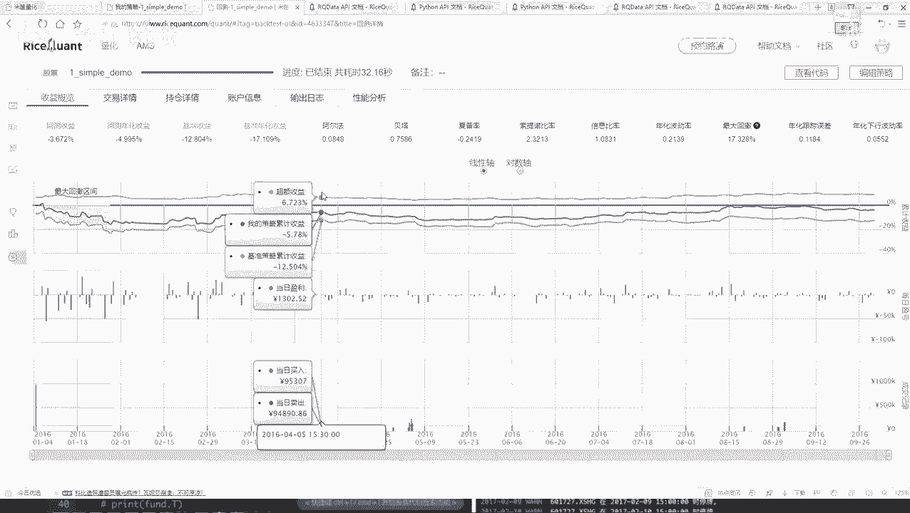
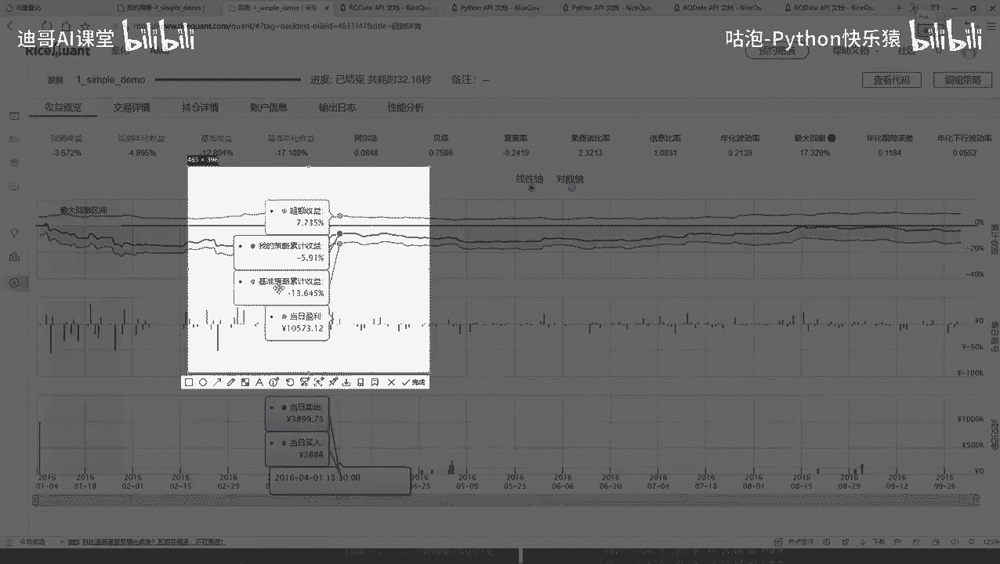
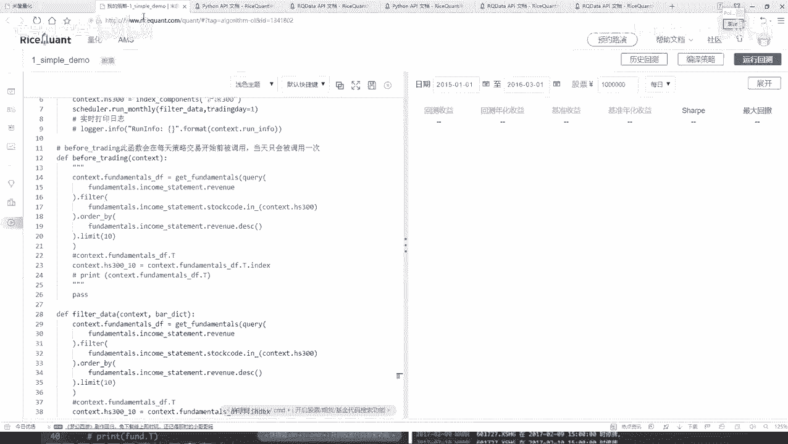

# 量化交易实战：P27：定时器功能与作用 ⏰

在本节课中，我们将学习如何在量化交易策略中使用定时器功能。定时器允许我们自定义策略的执行频率，例如从每日执行改为每月执行，从而优化交易逻辑并减少不必要的操作。

上一节我们介绍了策略回测的基本流程和结果分析，本节中我们来看看如何通过定时器来控制策略核心逻辑的执行时机。

## 交易详情与持仓分析

交易详情记录了在指定回测时间段内（例如2016年1月4日至2016年10月4日）每一天的交易操作。

在`handle_data`和`before_trading`函数中，策略逻辑每天都会执行，因此每天都会产生交易记录。交易详情会详细列出这些记录。

以下是交易详情包含的主要信息：
*   **选股结果**：例如，1月4日选出的10只股票。
*   **首日操作**：回测第一天通常只有买入操作。如果初始资金为10万元，并且采用平均买入策略，则每只股票买入约1万元。这对应策略中判断仓位为零时执行的买入逻辑。
*   **后续操作**：从第二天开始，系统会根据策略进行买入和卖出操作，以调整持仓，并尽可能将可用资金投入市场。
*   **交易明细**：包括股票代码（如中国石化）、成交量、成交价以及交易费用（如印花税、佣金等）。
*   **历史记录**：可以展开查看所有交易日的详细结果，或下载数据进行深入分析。

持仓信息展示了每天持有的股票、其当前价格、市值以及每日盈亏情况。

以下是持仓分析的关键点：
*   第一天盈亏为零，因为刚刚完成建仓。
*   从第二天开始，持仓盈亏会随股价波动而变化。
*   可以观察到最大回撤区间，即账户市值连续下跌的时期。能否度过这段时期对策略至关重要。
*   账户信息显示了总市值随时间的变化，直观展示了初始资金（如10万元）的盈亏情况。



性能概览图表提供了策略收益的直观展示。



*   **策略收益曲线**：展示了策略本身的累计收益率。
*   **基准收益曲线**：例如沪深300指数的收益，作为比较基准。
*   **超额收益曲线**：由 **`策略收益 - 基准收益`** 计算得出，代表策略跑赢基准的程度。

## 引入定时器功能

目前，我们的策略代码在`handle_data`中每天都会执行选股（“洗牌”）和调仓逻辑。但在实际交易中，可能不需要如此频繁的操作，例如可以每十天或每月调整一次持仓。

这时，我们可以使用定时器功能来自定义策略逻辑的执行频率。

定时器允许按照设定的时间间隔（如每月、每周）来执行特定的函数。例如，我们可以将每日“洗牌”改为每月第一个交易日执行一次。

在`Backtrader`等框架中，定时器通常在策略的初始化函数（`__init__`）中设置。其核心参数包括：
*   要执行的自定义函数。
*   执行的频率（如每月`monthly`）。
*   在该频率周期内的具体时点（如每月第1个交易日）。

以下是使用定时器的基本代码结构示例：
```python
def __init__(self):
    # 初始化其他参数...
    # 添加每月定时器，在每月第一个交易日执行 self.filter_data 函数
    self.add_timer(monthday=1, callback=self.filter_data)

def filter_data(self):
    # 这里是原本在handle_data中每日执行的选股逻辑
    # 例如：查询数据、过滤、排序等
    pass

def handle_data(self):
    # 注释掉或移除原有的每日选股逻辑
    # 每日只执行交易逻辑，选股逻辑由定时器控制
    pass
```
具体实现时，我们需要：
1.  将原本在`handle_data`中的选股逻辑移到一个单独的函数中（例如`filter_data`）。
2.  在策略的`__init__`函数中，使用`add_timer`方法设置定时器，指定执行频率和回调函数（即`filter_data`）。
3.  修改`handle_data`函数，使其不再包含选股逻辑，只处理交易执行。

## 定时器效果验证与策略优化

修改代码后，我们重新进行回测。将选股频率从每日改为每月后，策略的收益结果可能会发生显著变化。这种变化可能更好，也可能更差，这取决于市场特性和策略逻辑本身。

例如，在某个测试时间段内，每日调仓策略亏损4%，而改为每月调仓后，亏损可能扩大至28%。这说明了参数优化和策略稳定性测试的重要性。

我们可以通过以下方式进一步探索：
*   **调整回测时间段**：在不同的市场周期（如牛市、熊市）中测试策略表现。
*   **调整定时器参数**：尝试每周、每季度等不同调仓频率。
*   **结合其他因素**：定时器只是控制执行频率，策略的核心选股和风控逻辑同样需要精心设计。

**核心要点**：量化策略的开发是一个迭代和实验的过程。定时器等工具为我们提供了控制策略行为的灵活手段，但策略的最终效果需要基于历史数据进行严谨的回测和验证。学习量化交易的最佳途径是结合平台文档（API文档），理解每个函数的作用，并通过实践不断尝试和优化。



本节课中我们一起学习了定时器在量化策略中的作用和使用方法。我们了解到，通过定时器可以灵活控制策略核心逻辑的执行频率，从而适应不同的交易风格和市场环境。同时，我们也认识到回测结果对参数和周期非常敏感，因此在实际应用中需要进行充分的测试和优化。