# 金融量化分析：P28：因子数据预处理

在本节课中，我们将学习如何对金融分析中的因子数据进行预处理。因子是影响投资决策的指标，例如市净率或营收增长率。处理这些数据是构建有效量化模型的关键步骤。我们将按照“三步走”策略，依次讲解去极值、标准化和中性化这三种核心预处理方法。

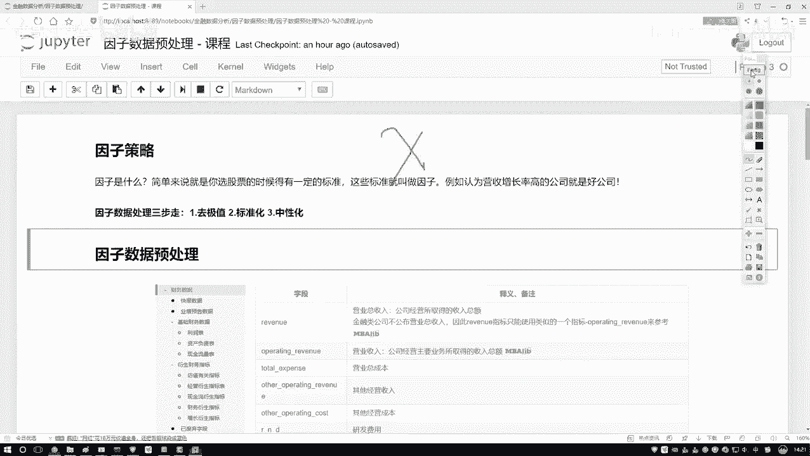

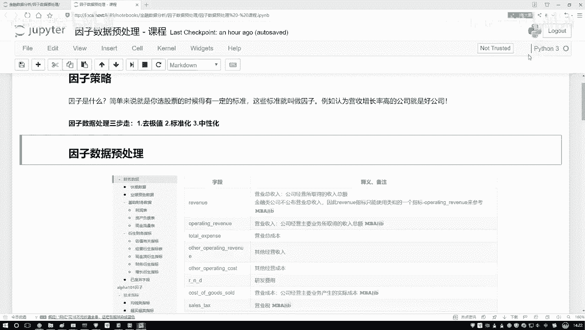

## 因子数据预处理：P28-1：去极值方法

上一节我们介绍了因子数据预处理的重要性，本节中我们来看看第一步：去极值。去极值的目标是处理数据中的异常点，使其不影响模型的稳定性。我们不会直接删除这些点，而是将其调整到合理的边界内。

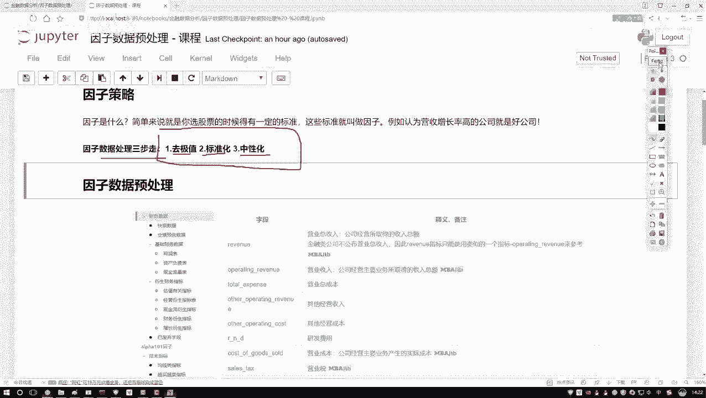

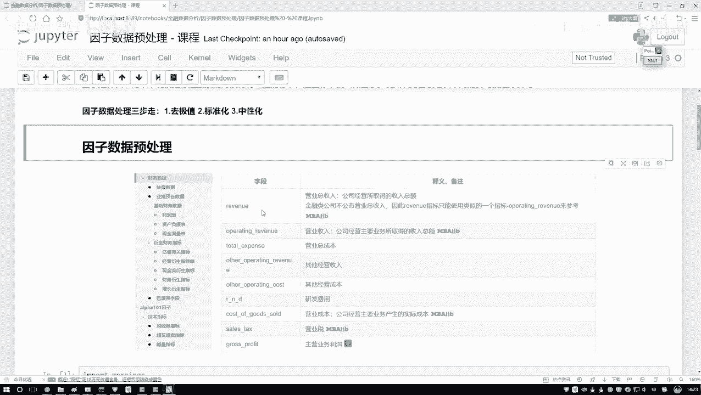

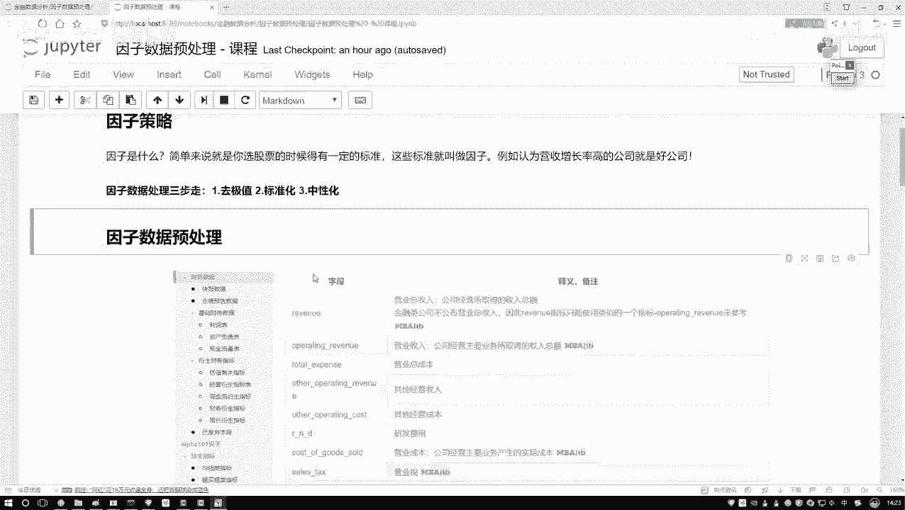

以下是几种常见的去极值方法，首先介绍基于分位数的方法。

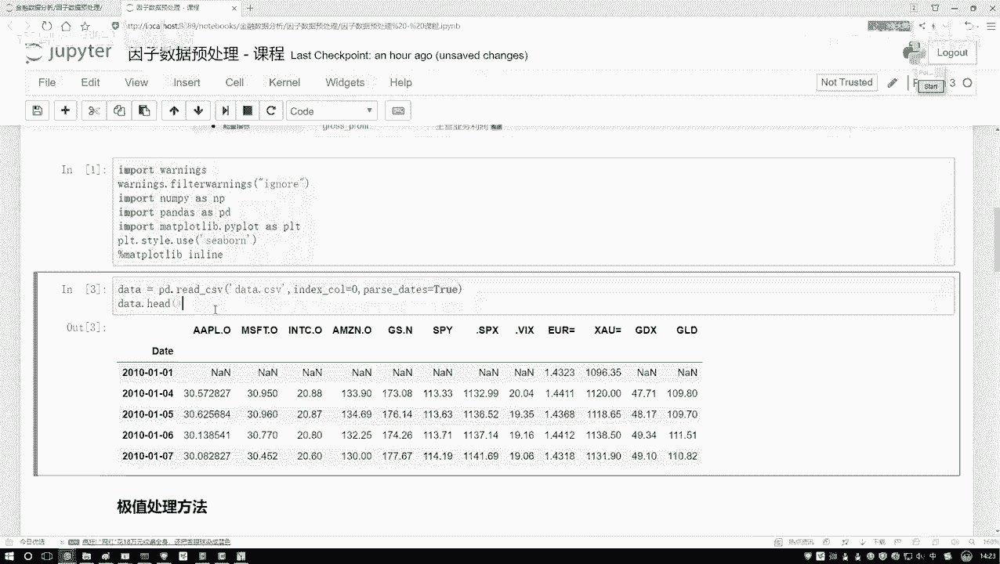

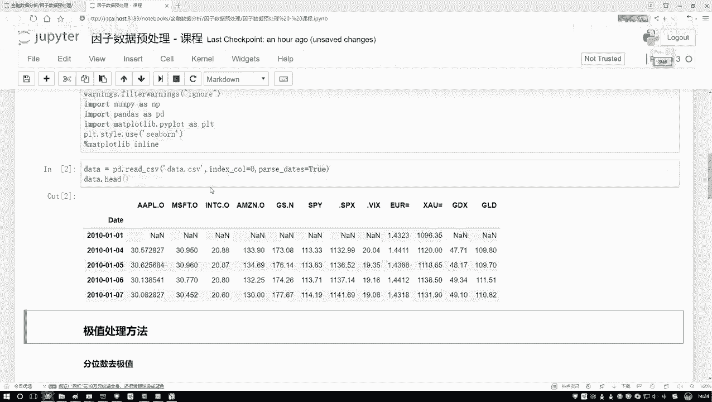

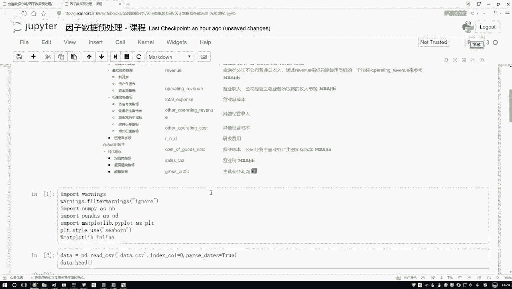

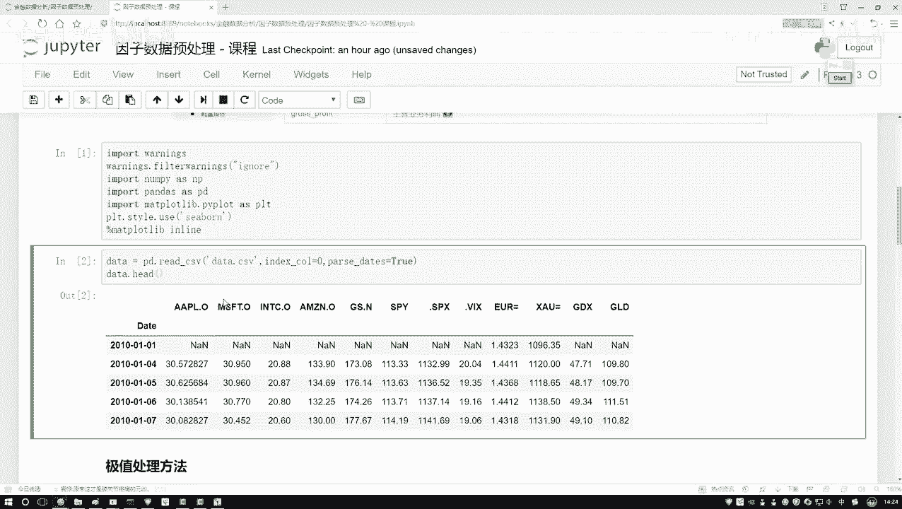

### 分位数去极值法

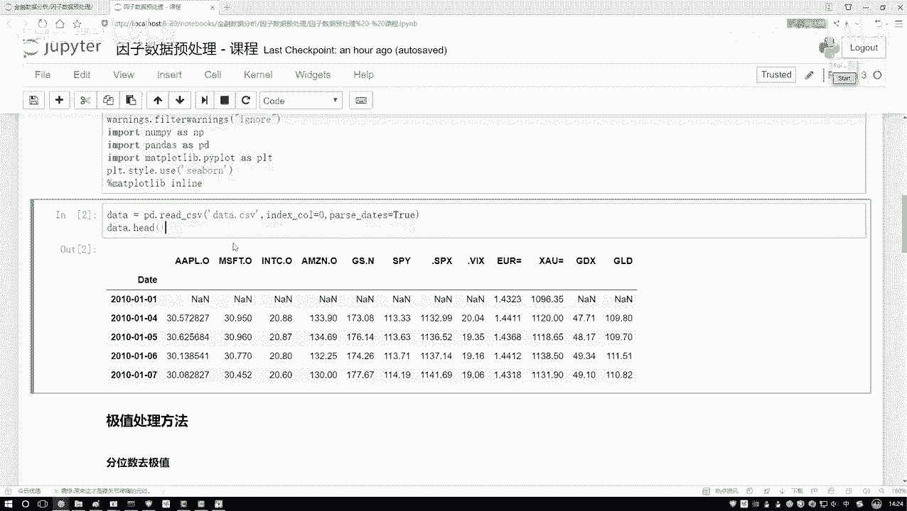

分位数是描述数据分布位置的关键统计量。中位数是大家熟悉的概念，它代表数据排序后处于中间位置的值，相比均值更能抵抗极端值的影响。在数据预处理中，我们常用中位数而非均值来处理缺失值或异常值。

除了中位数，四分位数也很有用。它们将数据分为四等份：
*   **Q1（第一四分位数）**：代表数据中25%位置的值。
*   **Q2（第二四分位数）**：即中位数，代表数据中50%位置的值。
*   **Q3（第三四分位数）**：代表数据中75%位置的值。

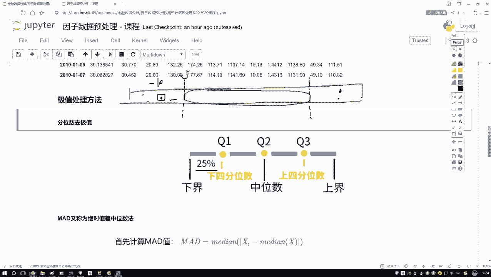

基于这些分位数，我们可以定义数据的正常范围。一种常见的方法是计算四分位距（IQR），即 `IQR = Q3 - Q1`。然后设定正常值的上下界，通常为：
*   下界：`Q1 - k * IQR`
*   上界：`Q3 + k * IQR`

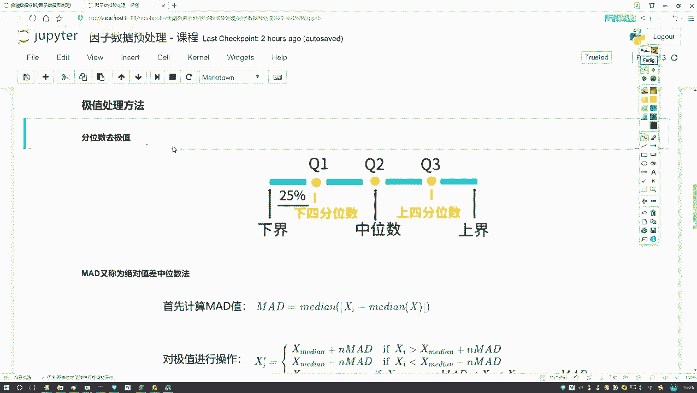

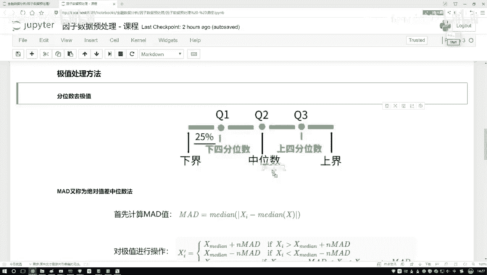

其中，`k` 是一个常数（常用1.5）。任何低于下界或高于上界的值都被视为极值，并将其数值调整到对应的边界值上，而不是直接丢弃。

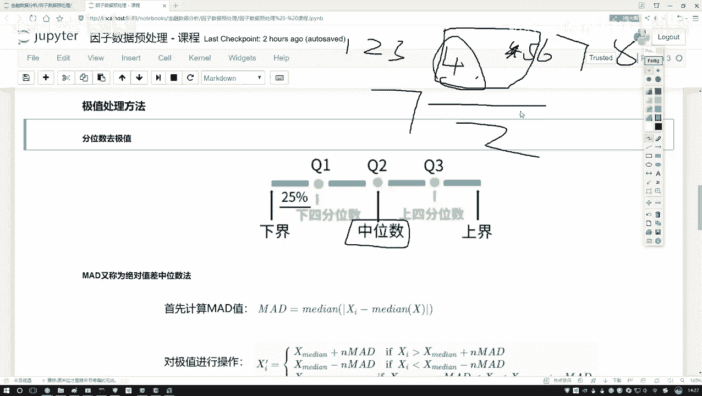

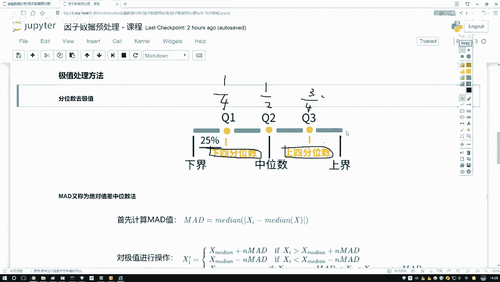

本节课中我们一起学习了因子数据预处理的第一步——去极值，重点介绍了基于分位数的去极值方法。理解并处理数据中的异常值是构建可靠金融模型的基础。在接下来的章节中，我们将继续学习标准化和中性化这两种预处理技术。