# 机器学习金融分析实战：P32：5-标准化处理方法 📊

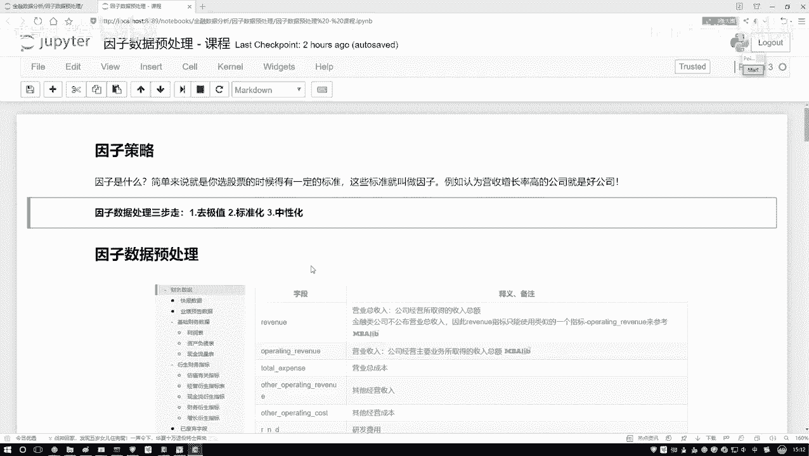

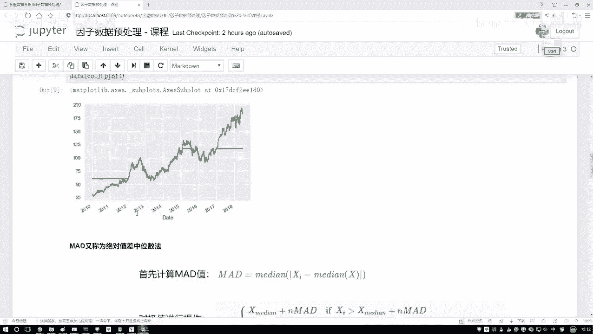

在本节课中，我们将要学习数据预处理中一个至关重要的步骤——标准化。标准化能够消除不同特征（指标）之间由于量纲和取值范围不同带来的影响，使得模型能够更公平地看待每一个特征，从而提升机器学习模型的性能。

## 标准化的目的与原理

上一节我们介绍了数据预处理的重要性，本节中我们来看看如何通过标准化处理数据。

标准化的核心目标是：**使得不同特征（维度）的数值处于同一量级**。我们通过一个简单的例子来理解为什么需要这样做。

假设我们有一个数据集，包含两个特征：`X1` 和 `X2`。`X1` 的取值范围可能是 `[0, 100]`，而 `X2` 的取值范围可能是 `[0, 1]`。对于很多机器学习算法（如基于距离的KNN、支持向量机SVM或梯度下降优化的模型），`X1` 的微小变化（例如从50变到51）对结果的影响，会远远超过 `X2` 的巨大变化（例如从0.5变到1.0）。这并非因为 `X1` 更重要，而仅仅是因为它的数值更大。标准化就是为了解决这个问题。

标准化的数学原理非常简单，其核心公式如下：

**公式：`z = (x - μ) / σ`**

其中：
*   `x` 是原始数据。
*   `μ` 是该特征所有数据的**均值**。
*   `σ` 是该特征所有数据的**标准差**。
*   `z` 是标准化后的数据。

这个公式可以分解为两个步骤：

1.  **去均值**：`x - μ`
    *   **目的**：将数据的中心移动到零点。原始数据可能围绕某个值分布，减去均值后，新数据的均值变为0，实现了以原点为中心的对称分布。
2.  **除标准差**：`(x - μ) / σ`
    *   **目的**：缩放数据，使其标准差变为1。这解决了不同特征取值范围差异大的问题。

为了更直观地理解除标准差的作用，可以想象两组人：
*   **第一组**：收入都在1万到2万之间，大家的收入很接近，计算出的标准差`σ`会很小。
*   **第二组**：收入从1万到数千亿不等，收入差异巨大，计算出的标准差`σ`会非常大。

对于取值范围小的数据（第一组），除以一个小的标准差，数据会被适度放大。对于取值范围大的数据（第二组），除以一个大的标准差，数据会被显著缩小。最终，所有特征的数据都会被“拉”到一个以0为中心、标准差为1的相似尺度上。

## 标准化的实现方法

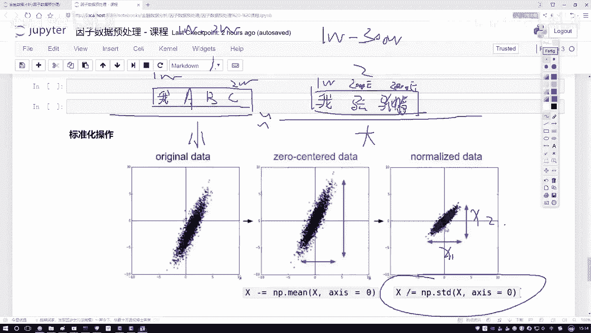

理解了原理后，我们来看看如何用代码实现标准化。以下是两种常见的方法。

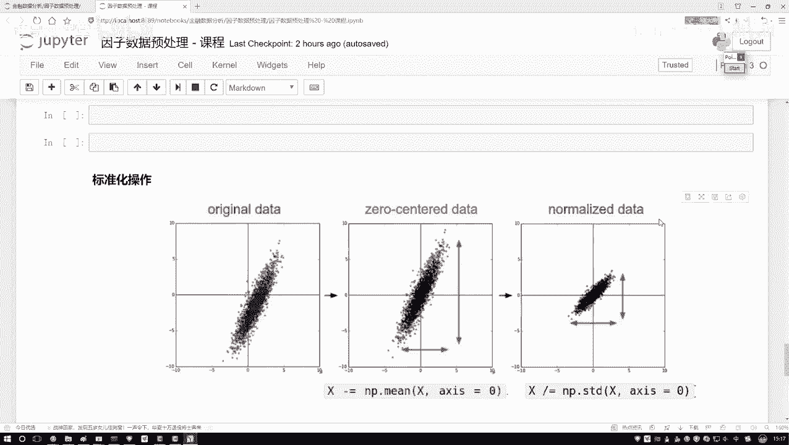

### 方法一：手动实现

我们可以根据公式，手动计算均值和标准差，然后进行转换。这种方法有助于加深对原理的理解。

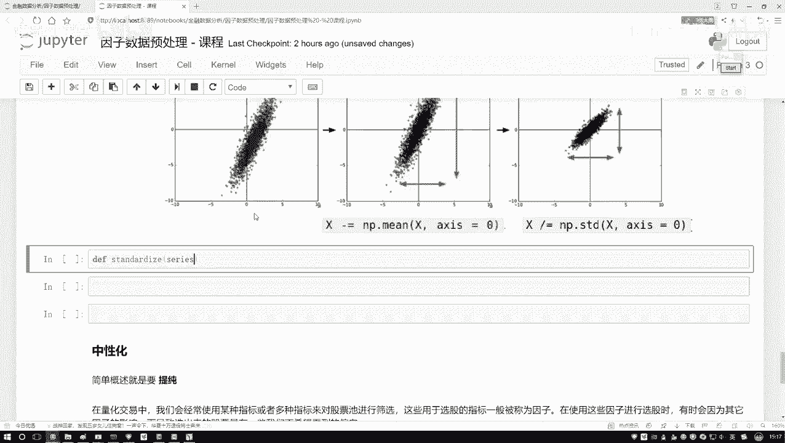

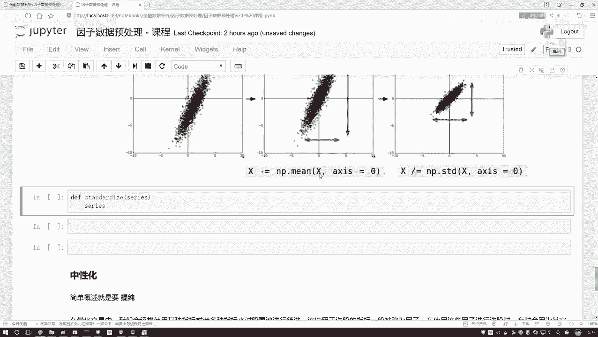

```python
def standardize(series):
    """
    对输入的Pandas Series进行标准化处理。
    参数:
        series: 一个Pandas Series对象。
    返回:
        标准化后的Series对象。
    """
    # 计算均值和标准差
    mean_val = series.mean()
    std_val = series.std()
    # 应用标准化公式: (x - mean) / std
    standardized_series = (series - mean_val) / std_val
    return standardized_series
```

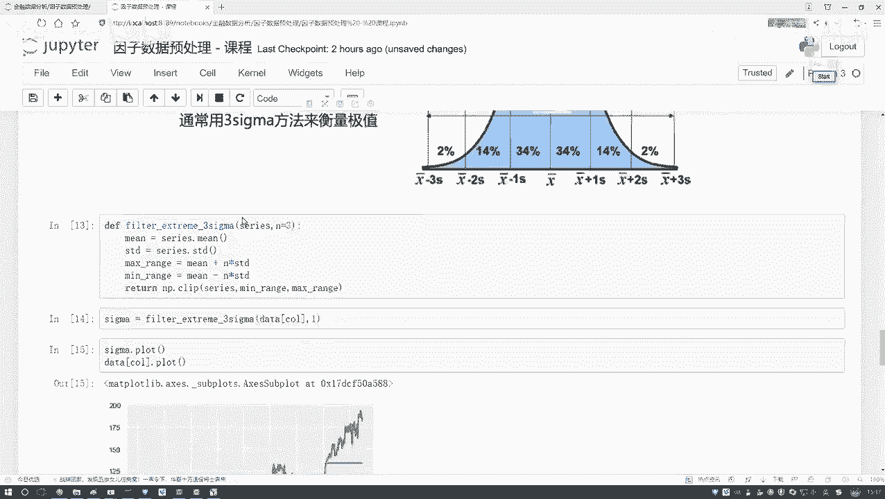

### 方法二：使用Scikit-learn库

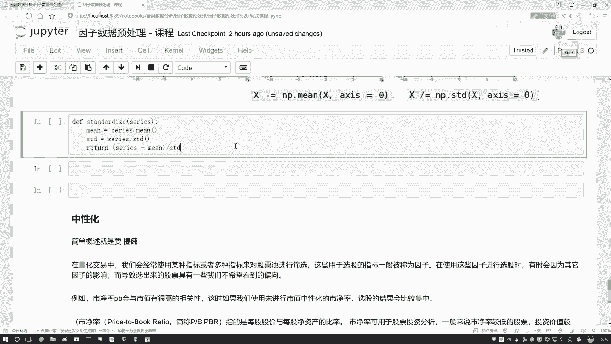

在实际项目中，我们通常使用成熟的机器学习库来完成这些预处理步骤，代码更简洁、高效。Scikit-learn提供了 `StandardScaler` 工具。

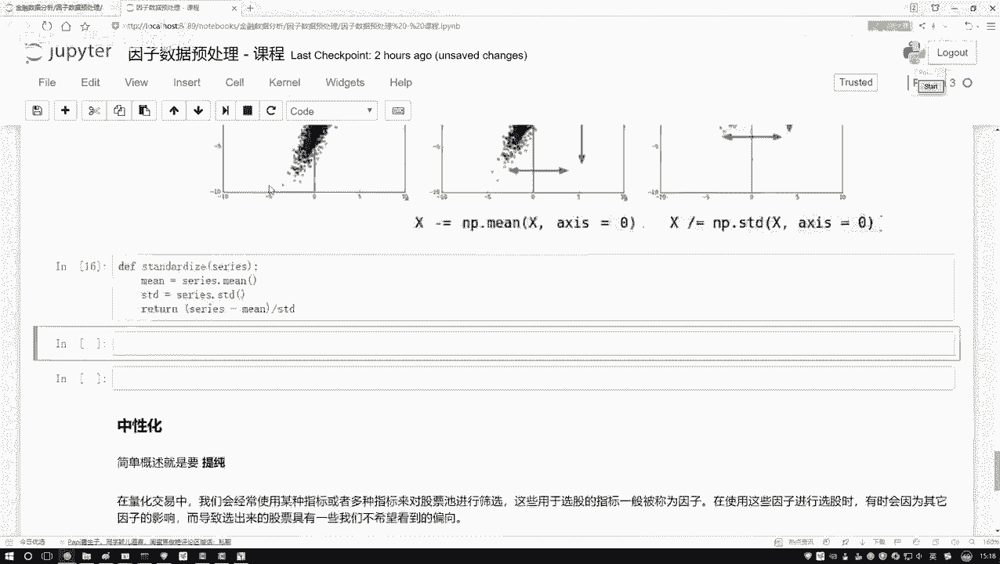

```python
from sklearn.preprocessing import StandardScaler
import pandas as pd

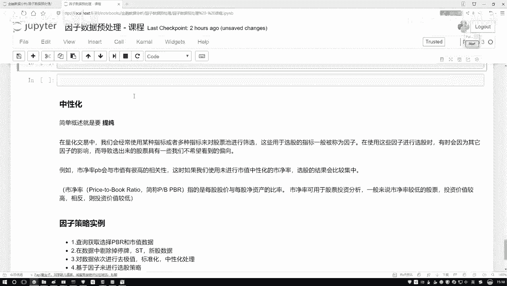

# 假设 `data` 是一个Pandas DataFrame
# 初始化标准化器
scaler = StandardScaler()
# 拟合数据并计算均值和标准差，然后进行转换
# 注意：fit_transform 期望二维数组，通常我们处理整个特征列
standardized_data = scaler.fit_transform(data[['feature_column']])
# 将结果转换回DataFrame（可选）
standardized_df = pd.DataFrame(standardized_data, columns=['feature_column'])
```

使用 `StandardScaler` 的优势在于，它能够方便地保存拟合时计算的均值和标准差，之后可以用相同的参数去转换新的数据或测试数据，保证训练集和测试集处理方式的一致性。

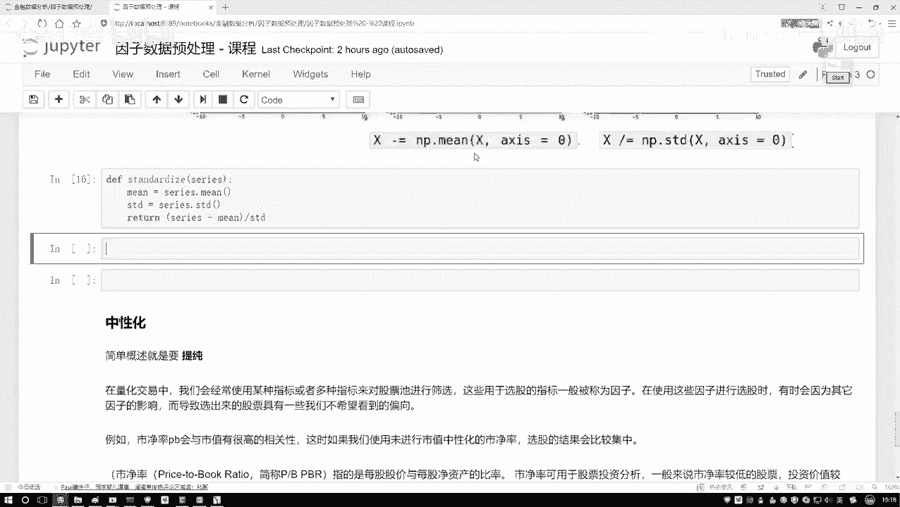

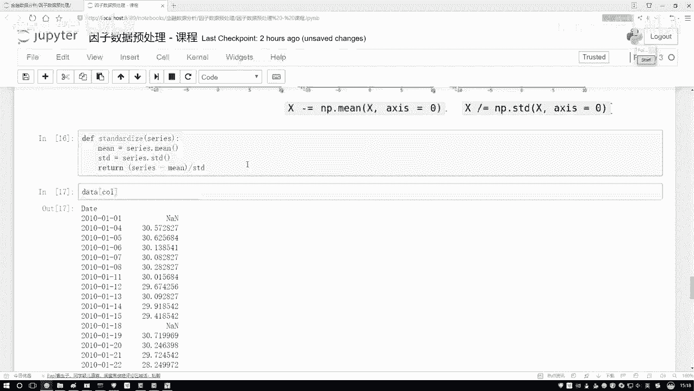

## 标准化效果演示

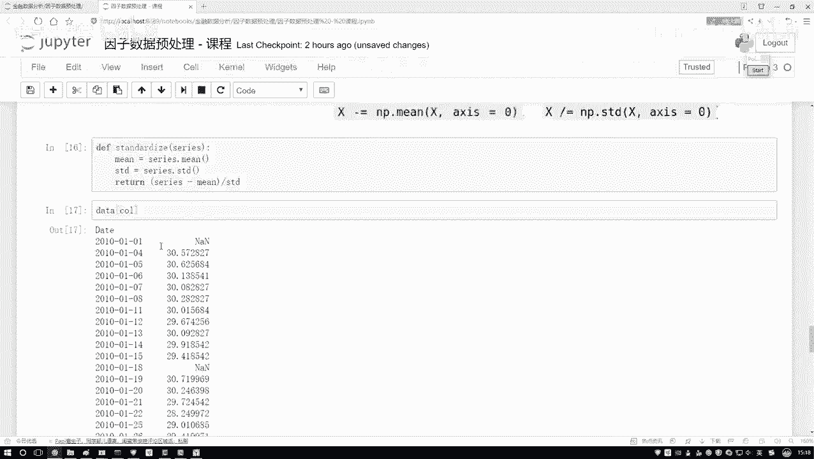

让我们通过一个简单的对比，直观感受标准化的效果。

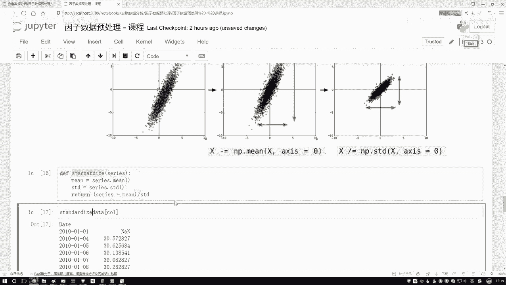

假设原始数据中某个特征的取值有 `30`, `20`, `100` 等，范围差异较大。

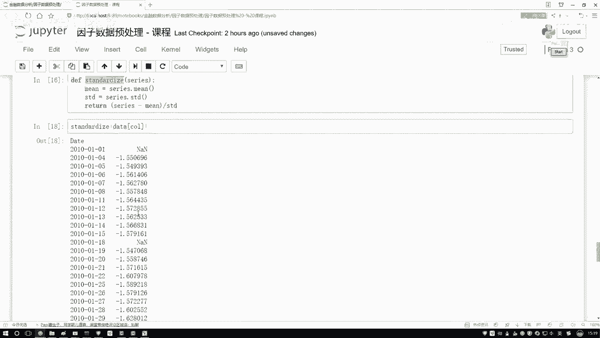

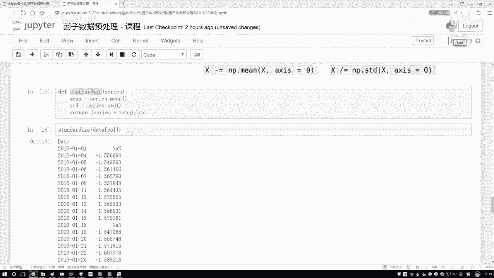

经过标准化处理后，这些数值会转变为类似 `0.5`, `-1.2`, `1.8` 这样的值。可以看到：
1.  数值基本围绕0分布。
2.  所有数值被压缩到一个相对较小的区间内（通常在 `[-3, 3]` 之间）。
3.  不同特征之间原本巨大的量纲差异被消除。

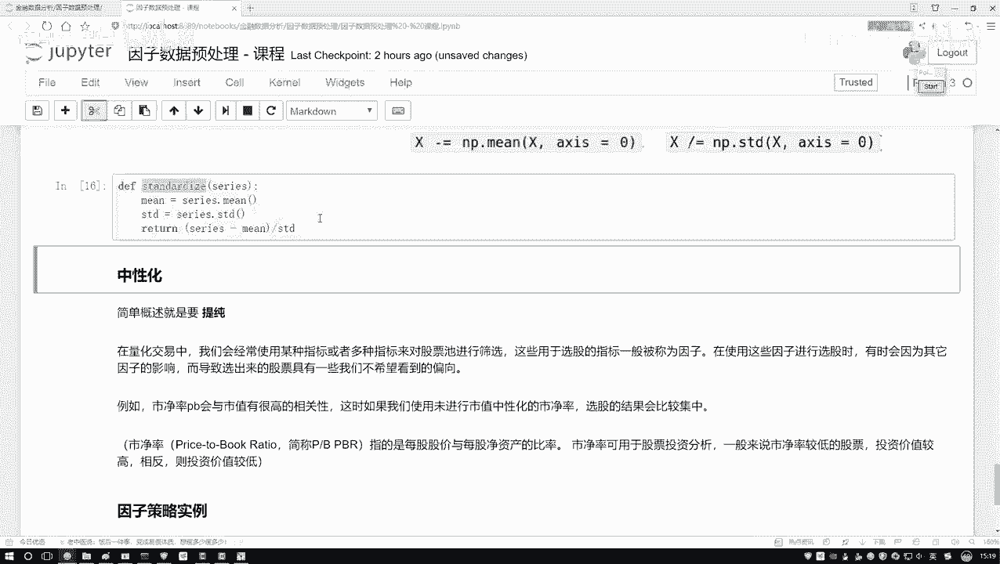

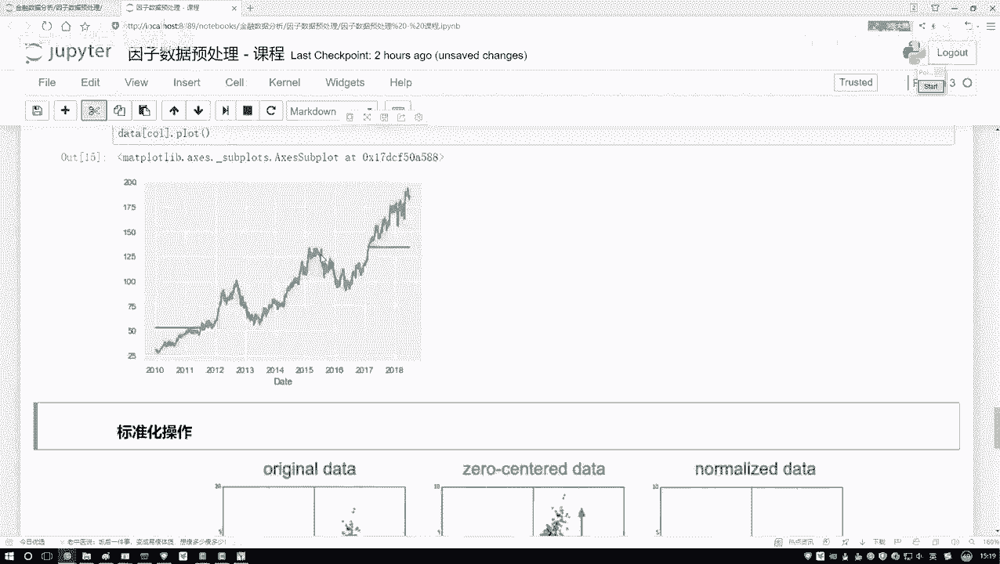

## 总结

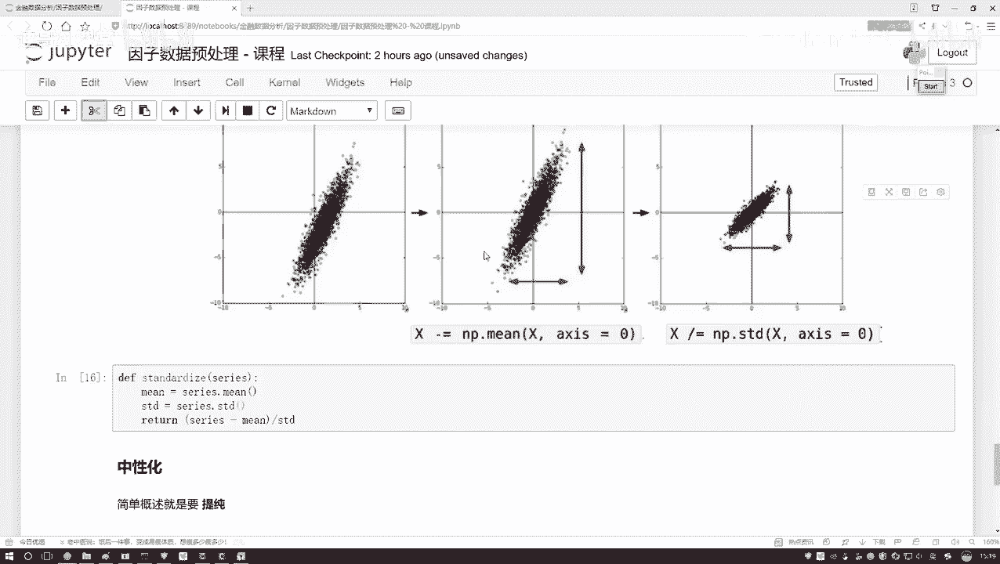

本节课中我们一起学习了数据标准化处理。
*   **目的**：消除不同特征间量纲和取值范围的差异，使模型能平等评估各个特征。
*   **原理**：通过 **`z = (x - μ) / σ`** 公式，先**去均值**使数据中心化，再**除标准差**进行缩放。
*   **实现**：可以手动根据公式计算，也可以使用Scikit-learn的 `StandardScaler` 工具快速实现。
标准化是机器学习数据预处理中极为基础和常用的一步，对于大多数模型（特别是涉及距离计算或梯度下降的模型）来说，能有效提升模型的收敛速度和最终性能。拿到数据后，进行标准化处理通常是一个稳妥的起点。