# 量化交易实战：P34：7-策略任务概述 📊

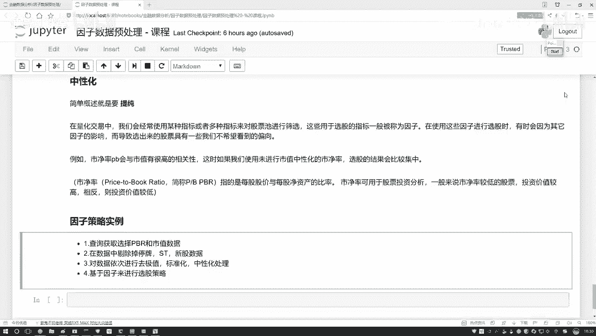

在本节课中，我们将学习如何对金融因子进行“中性化”处理，以剔除其他因素（如市值）对目标因子的影响，从而得到更“纯净”的因子信号。我们将通过一个具体的例子——从市净率（PB）因子中剔除市值的影响——来详细讲解其背后的原理和实现步骤。

## 核心概念：什么是因子中性化？🧠

上一节我们介绍了因子处理的基本流程。本节中，我们来看看因子处理中的一个关键步骤：中性化。

因子中性化的目标是从一个原始因子中，剔除我们不希望它包含的、来自其他因素（如市值、行业）的影响。例如，我们发现市净率（PB）因子与市值（Market Cap）高度相关。为了更纯粹地使用PB因子进行选股，我们需要从PB中剔除掉能被市值解释的那部分信息。

这个过程可以类比为“提纯”。我们想从原始的PB因子（一个混合物）中，分离出与市值无关的“纯净”PB信号。

## 中性化的数学原理：线性回归 🔢

那么，如何从PB因子中剔除市值的影响呢？核心方法是使用**线性回归**。

我们可以建立这样一个回归方程，来探究市值能解释PB因子的多少：

`PB = W * 市值 + B + ε`

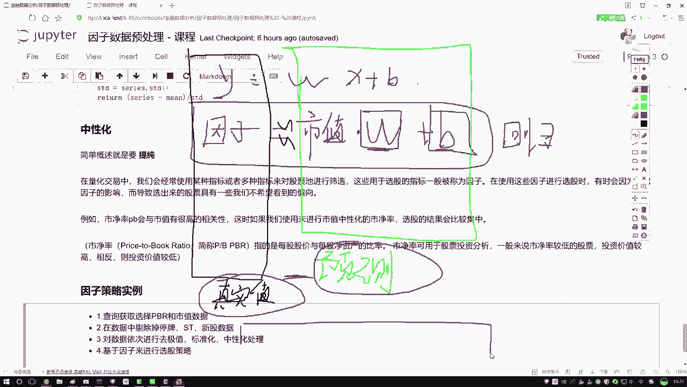

在这个公式中：
*   `PB` 是因变量（Y），即我们想要分析的原始因子。
*   `市值` 是自变量（X），即我们希望剔除的影响源。
*   `W` 是回归系数，`B` 是截距项。
*   `ε` 是误差项，代表市值无法解释的PB部分。

通过线性回归模型，我们可以求解出最优的 `W` 和 `B`。此时，`W * 市值 + B` 计算出的值，就是市值所能“预测”或“解释”的PB部分，我们称之为**预测值**。

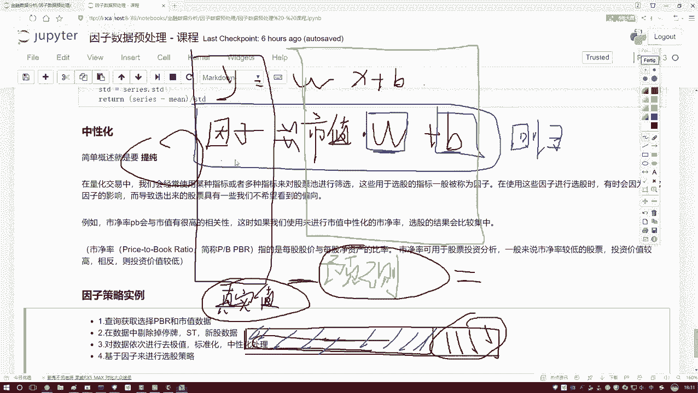

原始PB值是**真实值**。预测值与真实值之间的差异（即误差项 `ε`），正是市值所无法解释的、我们想要的“纯净”PB信号。

因此，中性化的操作本质上就是计算这个误差项：

`中性化后的PB = 真实PB值 - 预测PB值 = ε`

以下是实现因子中性化的两个核心步骤：

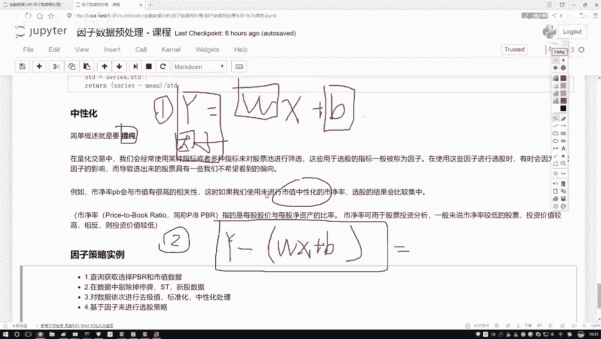

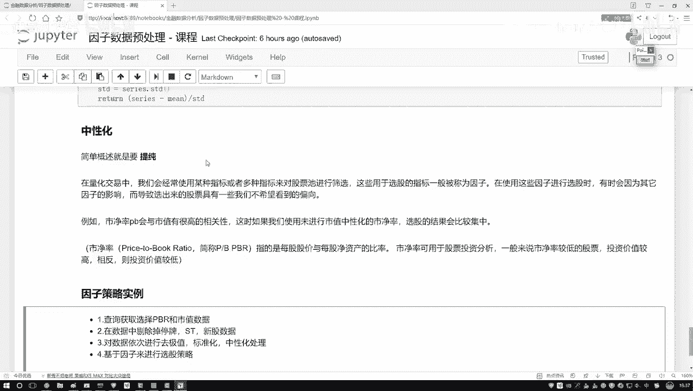

1.  **建立并求解回归方程**：以需要提纯的因子（如PB）为Y，以需要剔除的影响因子（如市值）为X，进行线性回归，得到系数W和截距B。
2.  **计算残差**：用因子的真实值减去回归方程的预测值（`W*X + B`），得到的残差就是中性化后的因子值。

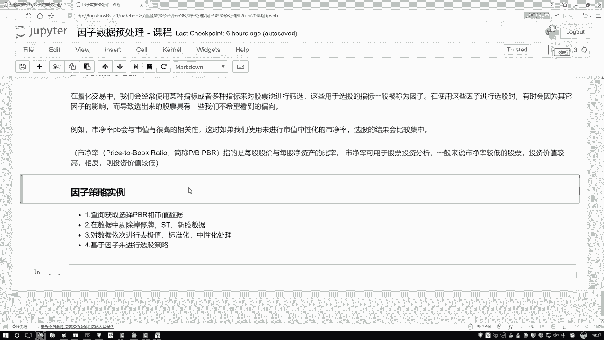

## 策略任务流程概述 🚀

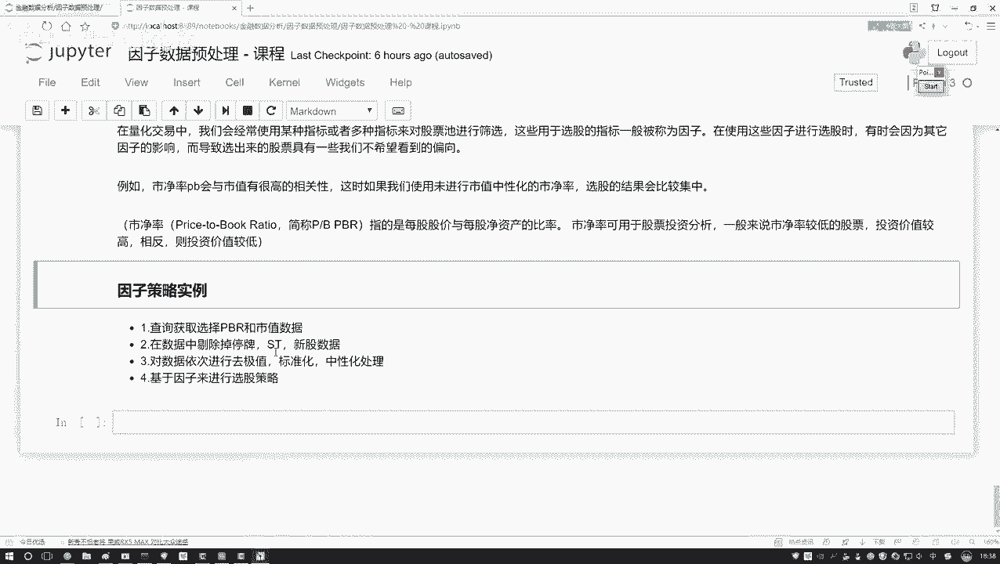

理解了中性化的原理后，我们将其融入到一个完整的因子选股策略流程中。本节我们将构建一个简单的策略作为示例。

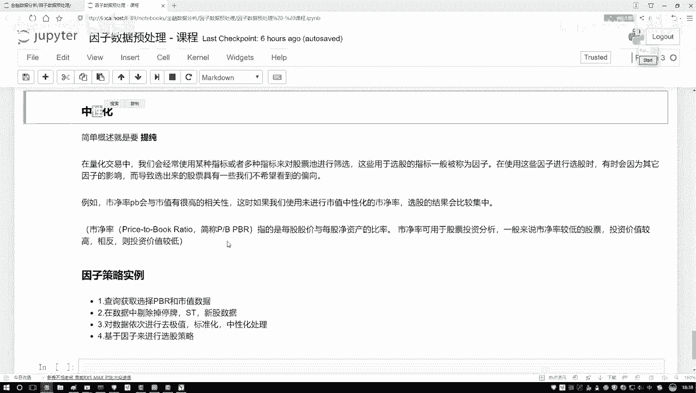

我们的策略将使用市净率（PB）和市值两个因子，目标是选出市净率较低的股票。以下是完整的策略执行步骤：

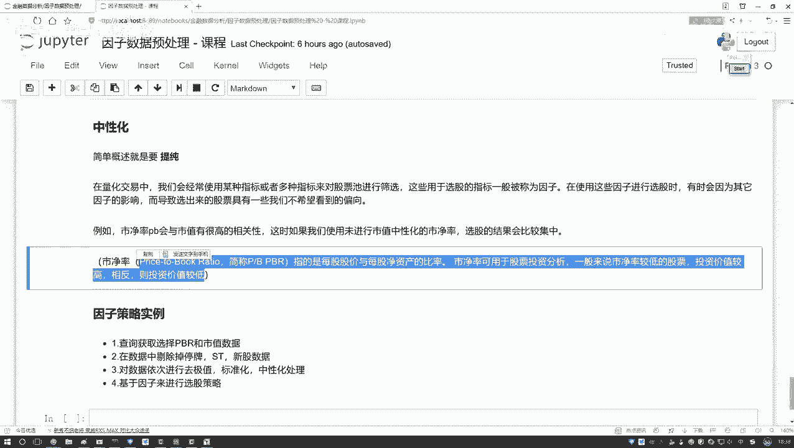

1.  **数据准备**：获取股票池的市净率（PB）和市值数据。
2.  **数据清洗**：从股票池中剔除不符合条件的股票，例如：
    *   停牌的股票
    *   ST、*ST等风险警示股
    *   上市时间不足半年的新股
3.  **因子处理**：对清洗后的因子数据依次进行处理：
    *   **去极值**：处理异常值。
    *   **标准化**：使因子数据符合标准正态分布。
    *   **中性化**：本例中，对PB因子进行市值中性化处理，得到纯净的PB信号。
4.  **选股逻辑**：基于处理后的因子值制定选股规则。例如，设定一个阈值：
    *   买入规则：选择 **中性化后的PB值 < 0.2** 的股票。
5.  **构建组合**：根据选股结果，决定买入和卖出的股票，形成投资组合。

在这个过程中，中性化处理确保了我们的选股逻辑是基于PB本身的估值特性，而非其与市值相关的部分，从而使策略逻辑更加清晰和有效。

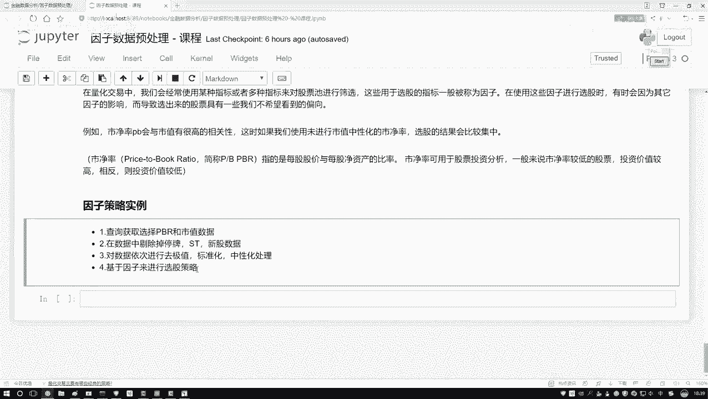

## 总结 📝

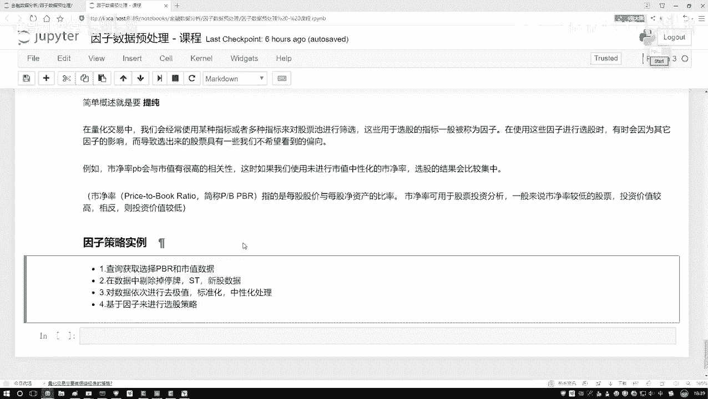

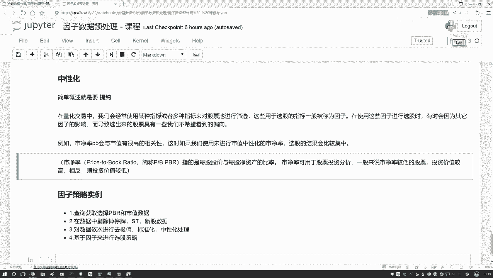

本节课中我们一起学习了因子中性化的核心概念与实现方法。我们了解到，中性化是通过线性回归模型，从一个因子中剔除其他常见影响因素（如市值）干扰的过程，其结果是回归的残差。我们将这一步骤置于完整的因子选股策略框架中，从数据准备、清洗、处理到最终制定选股规则，形成了一个清晰的实战流程。接下来，我们就可以在代码中实现这一过程，构建属于自己的量化策略。