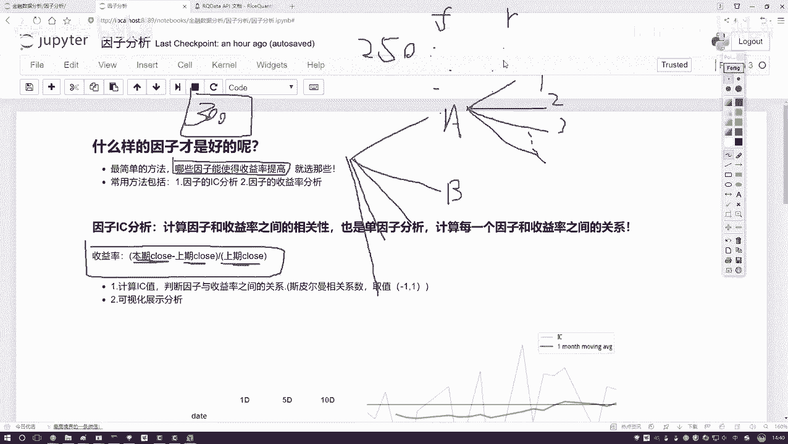
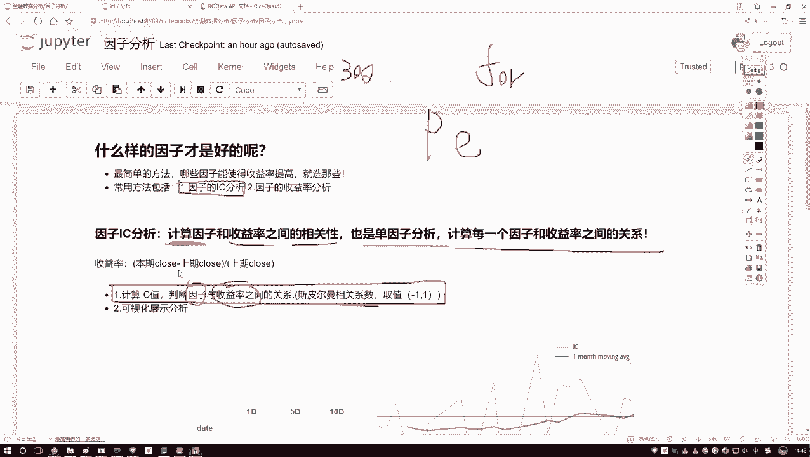
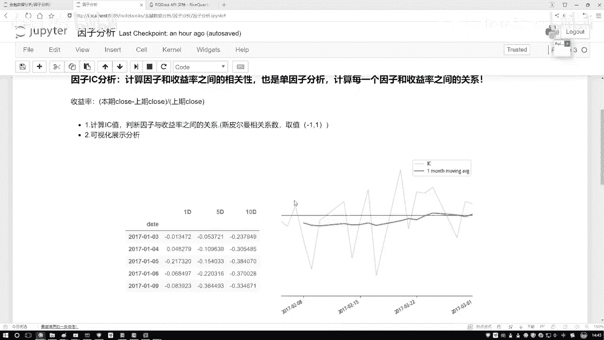
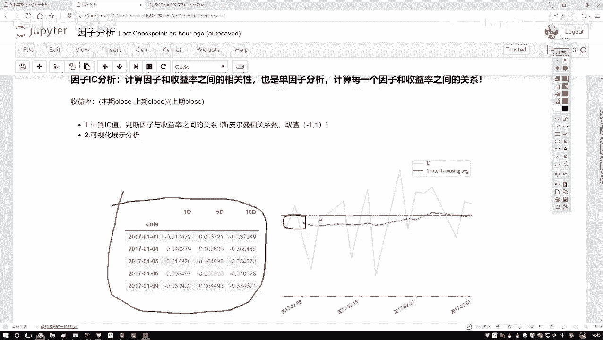
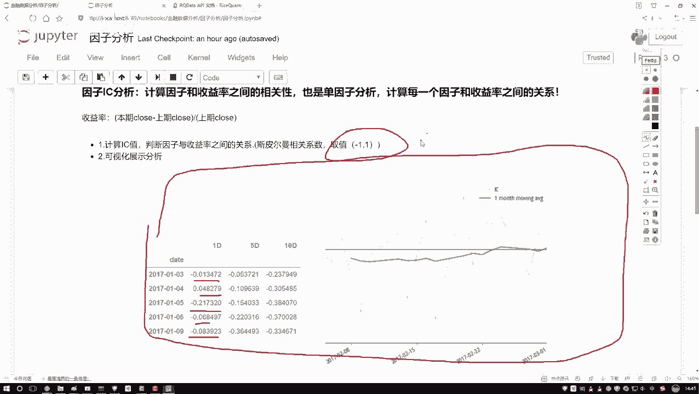

# 量化交易入门：P40：因子分析概述 📊

在本节课中，我们将要学习量化交易中一个至关重要的环节：因子分析。我们将探讨如何从海量的股票指标（因子）中，筛选出对投资收益率有显著影响的优质因子，并介绍两种基础的分析方法。

## 什么是因子分析？

上一节我们介绍了量化交易的基本概念，本节中我们来看看如何评估和筛选交易因子。

在股票分析中，我们可以获取到大量的指标数据，例如基本面信息（A）和技术指标。这些指标可以归类为不同的因子大类，每个大类下又可细分为众多具体因子。

假设我们手头有300个不同的因子。在设计交易策略或进行回测时，我们面临一个选择：是使用全部因子，还是只选用其中一部分？因此，我们需要对因子进行评估和排序，判断哪些因子对最终的投资收益有积极影响，哪些影响甚微或为负面。

## 如何评估因子好坏？

以下是评估因子有效性的核心思路：我们需要分析因子数值的变化与股票收益率变化之间的关系。

首先，我们来明确“收益率”的概念。以日收益率为例，其计算公式为：

**收益率 = (当日收盘价 - 上一交易日收盘价) / 上一交易日收盘价**

我们的目标是实现收益的积少成多。因此，我们希望找到那些与收益率变动存在稳定关系的因子。在连续的一段时间（例如250个交易日）内，每个因子（F）和每日收益率（R）都会形成一系列对应的数值。我们需要分析因子F的走势与收益率R的走势之间存在何种关系：是线性相关、非线性相关，还是基本不相关？如果是相关，是正相关还是负相关？

## 因子分析的核心方法：IC值分析

基于上述思路，我们引入第一种核心分析方法：因子的IC分析。

IC（Information Coefficient，信息系数）是一个衡量相关性的指标。在单因子分析中，我们计算**每一个**因子与收益率序列之间的斯皮尔曼秩相关系数。

**IC值 = 斯皮尔曼相关系数(因子序列， 收益率序列)**

斯皮尔曼相关系数的取值范围在 **-1 到 1** 之间：
*   值越接近 **1**，表示因子与收益率**正相关**越强。
*   值越接近 **-1**，表示因子与收益率**负相关**越强。
*   值越接近 **0**，表示两者基本没有相关性。

这个过程就像执行一个循环：对于300个因子中的每一个，我们都单独计算其与收益率的IC值。计算出的斯皮尔曼相关系数，即为该因子的IC值。

## IC值的可视化与分析

计算出每个因子的IC值后，我们需要对其进行分析和解读。

以下是IC值分析中常见的可视化图表及其作用：

*   **IC值序列图**：此图展示了某个因子在历史上一段时间内（例如每一天）的IC值变化情况。通过折线图，我们可以观察IC值的稳定性、波动范围以及是否长期保持在正值或负值区间。
*   **IC值移动平均线**：在IC值序列图上，我们通常会叠加一条移动平均线（例如10日移动均线）。这条均线（绿色线）可以帮助我们平滑短期波动，更清晰地识别IC值的长期趋势。均线窗口期的起始部分可能显示为空值。

通过观察这些图表，我们可以筛选出与收益率关系显著（IC绝对值较大）且稳定的因子进行深入研究。对于那些IC值接近零或波动无常的因子，则可以暂时不予考虑。

## 课程总结

本节课中我们一起学习了量化交易中因子分析的基础知识。我们明确了因子分析的目标是从众多候选因子中筛选有效因子，并重点介绍了通过计算**IC值**（斯皮尔曼相关系数）来评估单个因子与收益率相关性的方法。同时，我们也了解了如何通过IC值序列图和移动平均线来直观地分析和解读因子的有效性。掌握这些是构建可靠量化交易策略的重要第一步。