# 金融量化分析：P44：5-数据格式转换 📊

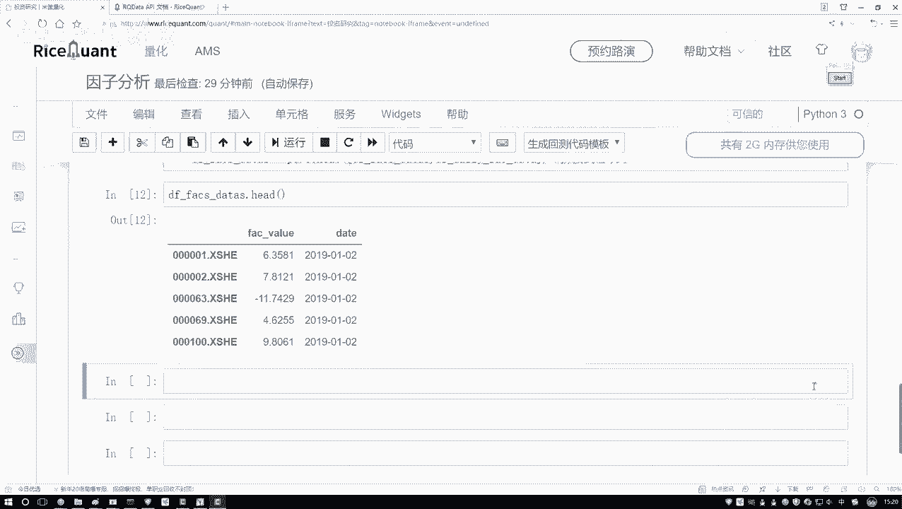

在本节课中，我们将学习如何将处理好的金融数据转换为特定量化分析工具包（如 `alphalens`）所要求的格式。这是使用外部库进行深入分析前的关键一步。

上一节我们完成了数据的初步处理，本节中我们来看看如何调整数据格式以满足工具包的要求。

## 理解目标格式

当前我们的数据格式与目标工具包的要求不同。目标格式要求数据是一个多层索引的 `DataFrame`。

具体来说，目标格式如下：
- **第一层索引**：日期（`date`）。
- **第二层索引**：股票代码或名称。
- **数据列**：具体的因子值（例如，某个财务指标）。

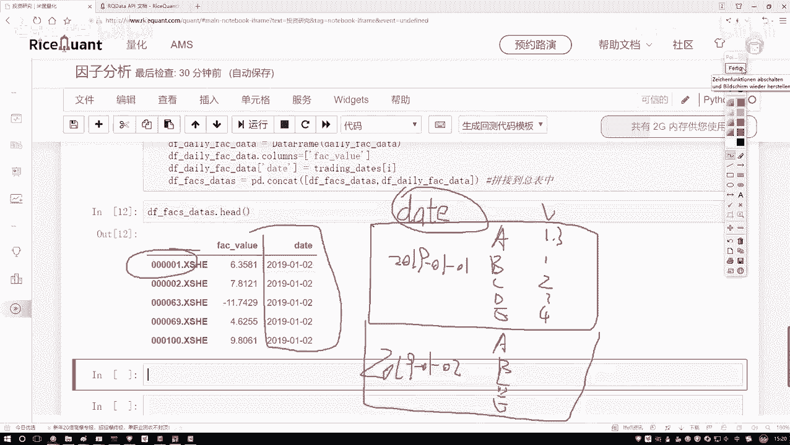

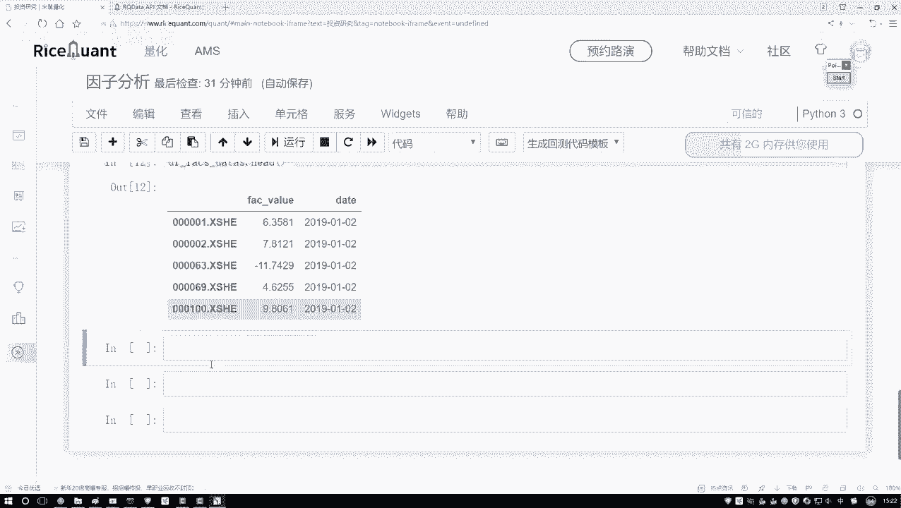

这不同于我们当前可能按日期或股票排列的简单表格结构。因此，我们需要进行转换。

## 执行格式转换

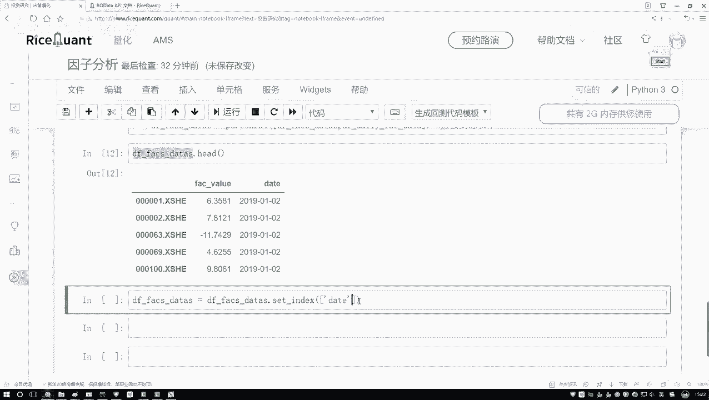

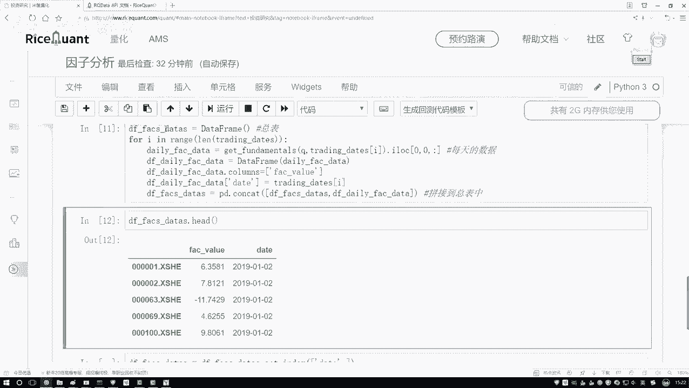

以下是转换数据格式的核心步骤。

首先，我们需要重新设置 `DataFrame` 的索引。我们将 `date` 和股票的标识（如股票代码）设置为多层索引。

```python
# 假设 df 是包含‘date’、‘stock’和‘value’列的原始DataFrame
# 设置多层索引：第一层是日期，第二层是股票
df_formatted = df.set_index(['date', 'stock'])
```

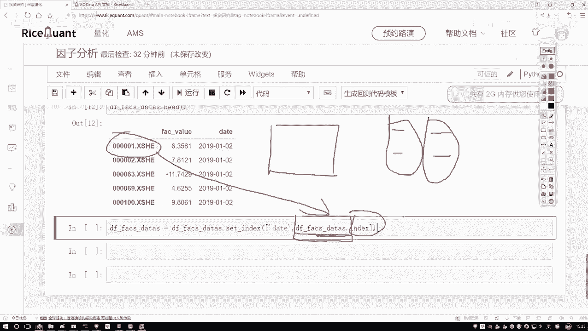

执行此操作后，数据将按照（日期， 股票）的层级进行组织，每个组合对应一个因子值。

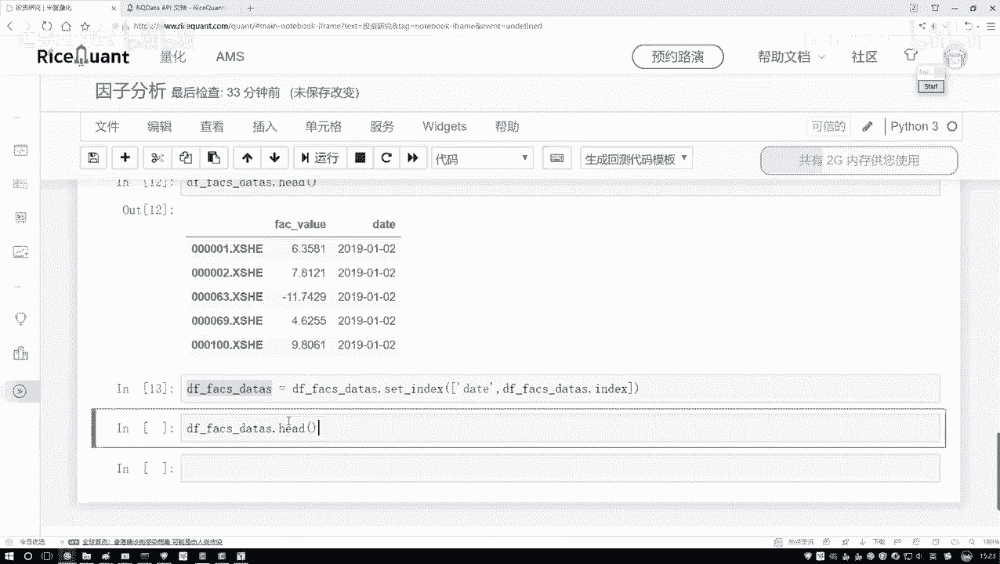

## 验证转换结果

转换完成后，应检查数据格式是否符合预期。

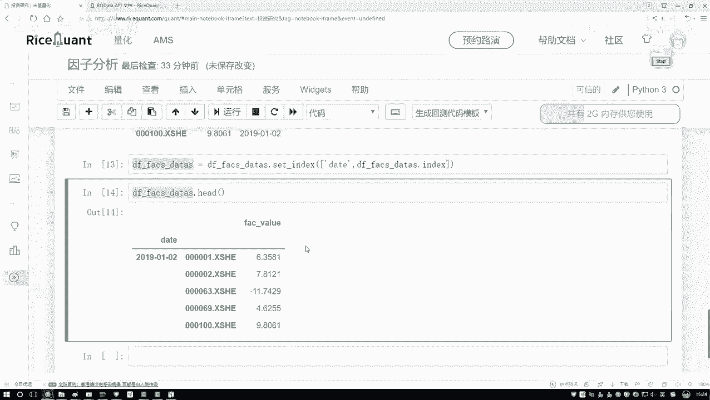

```python
# 查看转换后的数据前几行
print(df_formatted.head())
```

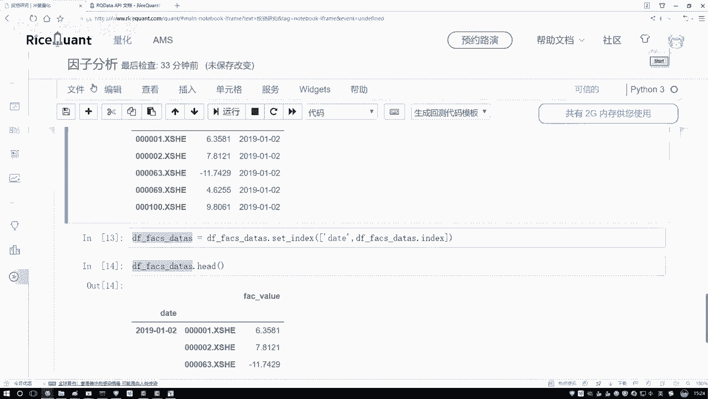

输出应显示一个以日期和股票为索引的 `DataFrame`，其主体部分只有一列，即我们关心的指标值。这满足了工具包的输入要求。

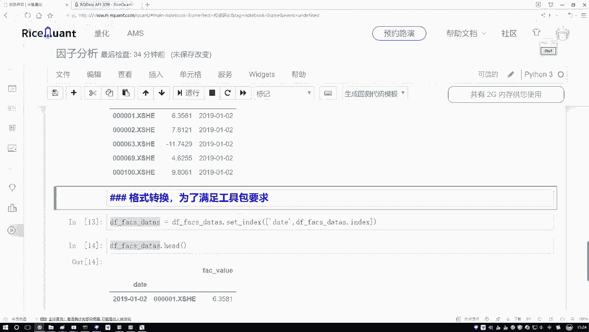

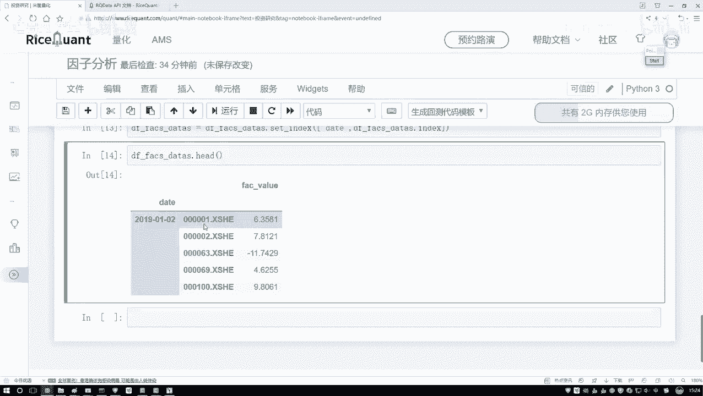

## 数据预处理

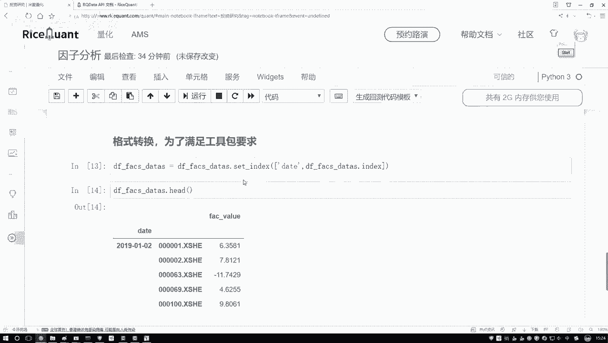

在格式转换之后，通常还需要对因子值本身进行一些标准化处理，以确保后续分析的稳定性和准确性。这包括去除异常值和标准化（归一化）。

以下是两个常用的预处理步骤：

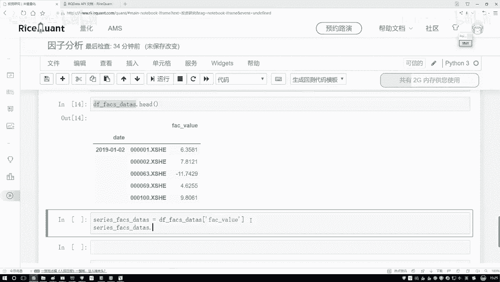

1.  **去极值（Winsorization）**：将因子值中超出指定分位数（如1%和99%）的部分截断，替换为边界值。
    ```python
    # 设定上下限，例如1%和99%分位数
    lower_bound = df_formatted['value'].quantile(0.01)
    upper_bound = df_formatted['value'].quantile(0.99)
    df_formatted['value'] = df_formatted['value'].clip(lower=lower_bound, upper=upper_bound)
    ```

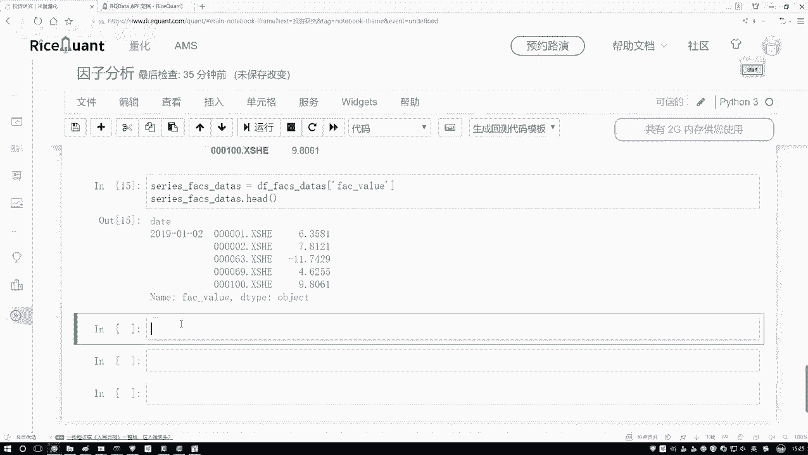

2.  **标准化（Standardization）**：将因子值转换为均值为0、标准差为1的分布。
    ```python
    # 使用Z-score标准化
    mean_val = df_formatted['value'].mean()
    std_val = df_formatted['value'].std()
    df_formatted['value_standardized'] = (df_formatted['value'] - mean_val) / std_val
    ```

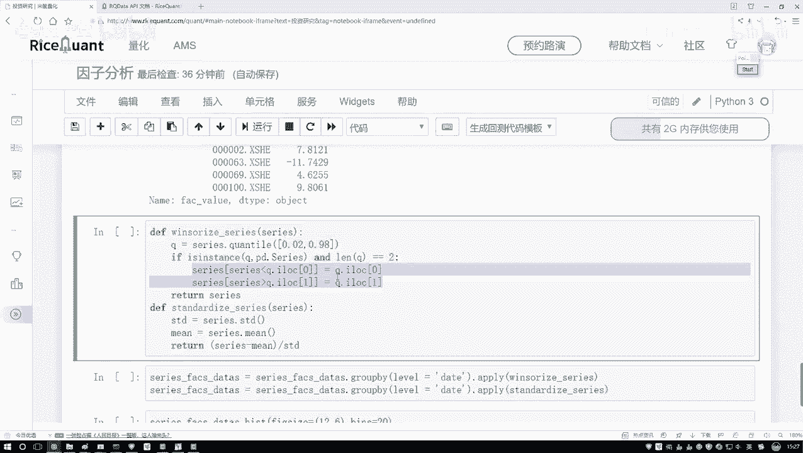

这些操作通常需要按日期分别对横截面数据（即同一天的所有股票）进行，以消除时间趋势的影响。

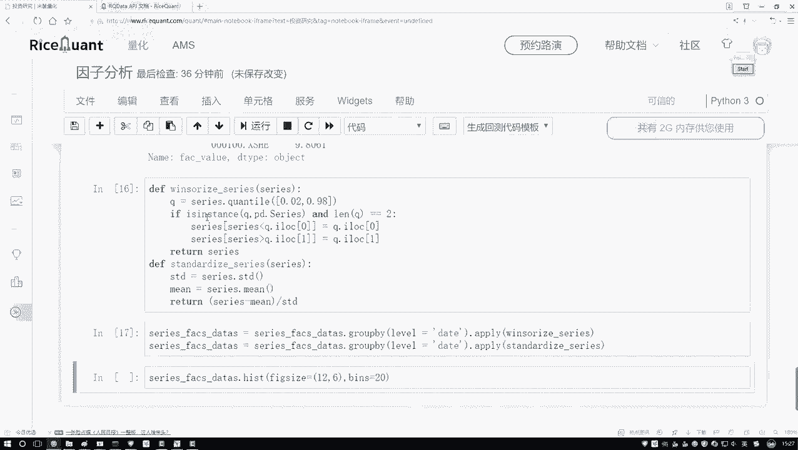

## 总结

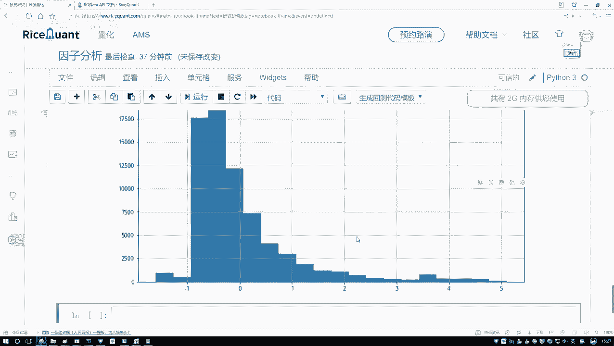

本节课中我们一起学习了为特定量化分析工具包准备数据的关键步骤。
1.  我们理解了目标工具包所需的多层索引数据格式。
2.  我们使用 `set_index` 方法成功将原始数据转换为（日期， 股票）的索引格式。
3.  我们介绍了数据预处理的常见操作，包括去极值和标准化，以提高后续分析的鲁棒性。

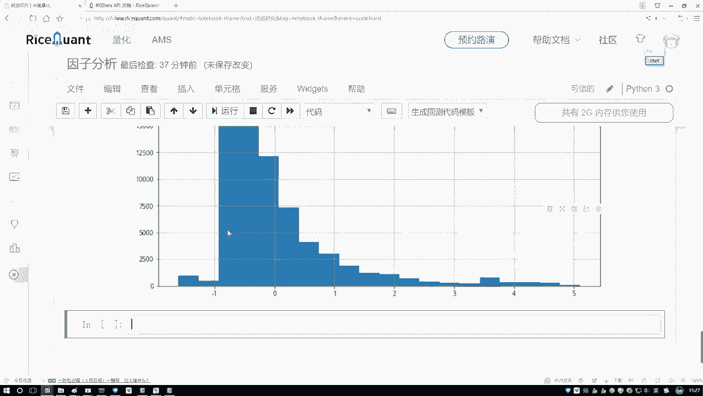

完成这些步骤后，我们的数据就准备好了，可以输入到如 `alphalens` 这样的工具包中进行因子绩效分析（例如计算IC值、进行分组回测等）。