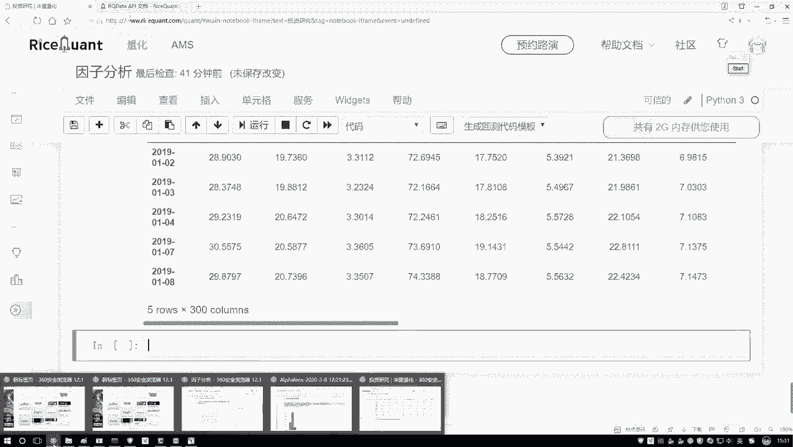
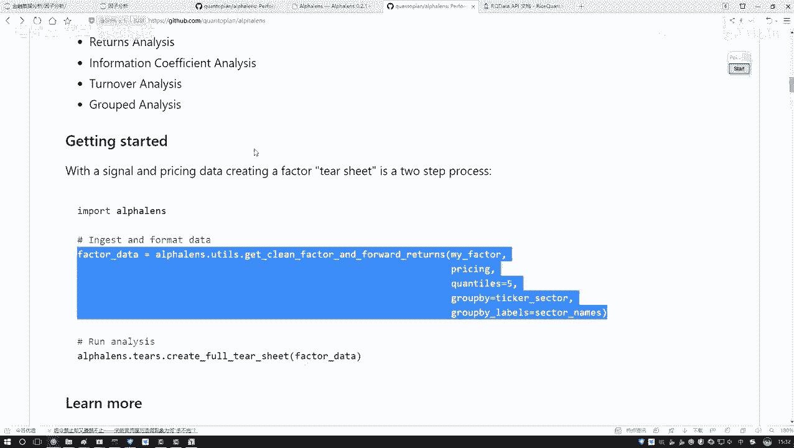
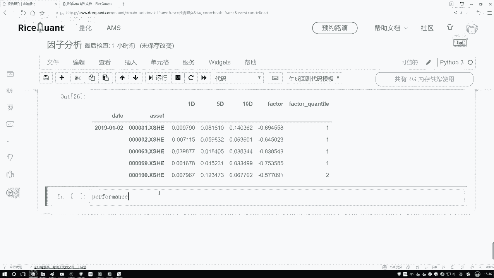
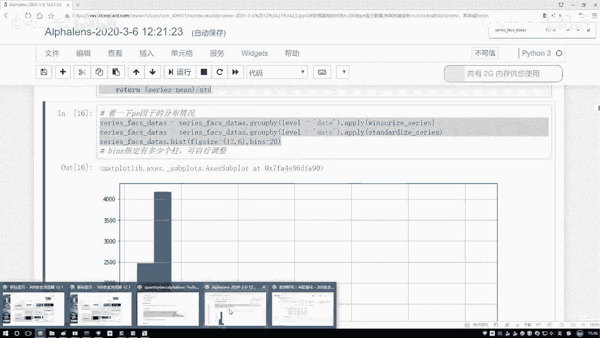
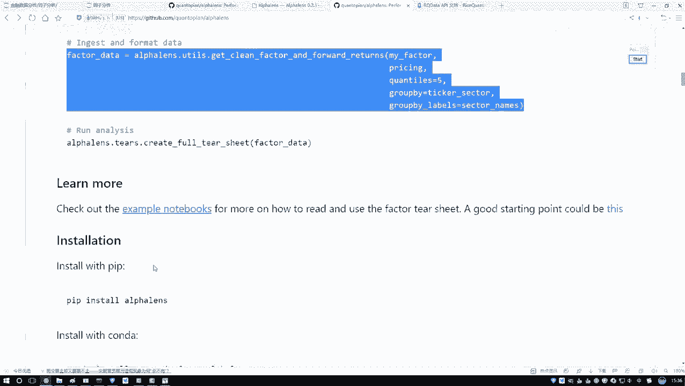
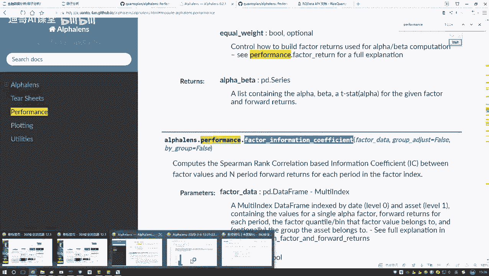
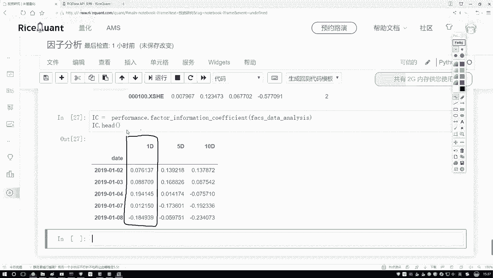

# 金融量化分析实战：P45：IC指标值计算 📊

在本节课中，我们将学习如何计算IC（信息系数）指标值。IC值是衡量选股因子与未来股票收益率之间相关性强弱的关键指标，是量化策略评估的重要环节。我们将通过获取股票价格数据、处理因子数据，并最终计算斯皮尔曼秩相关系数来完成IC值的计算。

## 获取收盘价数据

上一节我们介绍了如何构建选股因子。本节中，我们来看看如何获取计算IC值所需的实际股票价格数据。计算IC值需要将因子值与股票的实际收益率进行关联计算，因此首先需要获取股票的每日收盘价。

以下是获取收盘价数据的步骤：

1.  使用 `get_price` 函数获取指定股票池在特定时间段内的价格数据。
2.  从返回的多维价格数据中，提取出我们需要的“收盘价”数据，并将其转换为二维的 `DataFrame` 格式。
3.  为数据框指定合适的索引和列名，以便于后续处理。



```python
# 获取股票池的收盘价数据
price = get_price(stock_pool, start_date='2019-01-01', end_date='2020-01-01')
# 提取收盘价并转换为二维DataFrame
close_price = price['close'].unstack()
# 设置索引和列名
close_price.index.name = 'date'
close_price.columns.name = 'code'
```

执行以上代码后，我们得到一个以日期为索引、股票代码为列名的二维表格，其中包含了每个股票每天的收盘价。



## 数据格式转换

现在，我们同时拥有了因子数据和价格数据。为了计算IC值，我们需要使用一个特定的工具函数将这两份数据转换成统一的、便于分析的格式。

这个转换函数较长，其核心作用是合并因子值与对应的未来收益率（例如1日、5日、10日收益率），并自动将因子值按大小分档。

```python
# 导入工具函数并进行数据格式转换
from utils import convert_to_forward_returns_data
# 将因子数据和价格数据转换为统一格式
factor_data = convert_to_forward_returns_data(factor_values, close_price)
```

转换后的 `factor_data` 数据框包含以下关键列：
*   `date`: 日期。
*   `asset`: 股票代码。
*   `factor`: 因子值。
*   `1D`/`5D`/`10D`: 未来1日、5日、10日的收益率。
*   `factor_quantile`: 因子分档（1-5档）。该列将因子值从小到大排序后，按百分位划分为5个区间（例如，1代表最小的20%，5代表最大的20%）。档位数字越大，代表原始因子值越大。

## 计算IC值

数据准备就绪后，我们就可以计算IC值了。IC值通常使用斯皮尔曼秩相关系数来计算，它衡量的是因子排名与未来收益率排名之间的单调关系。



以下是计算IC值的步骤：





1.  从 `performance` 模块中导入计算因子信息系数的函数。
2.  将上一步转换好的 `factor_data` 传入该函数。
3.  函数将返回一个包含每日IC值的数据序列。

```python
# 从performance模块导入信息系数计算函数
from alphalens.performance import factor_information_coefficient
# 计算IC值序列
ic_series = factor_information_coefficient(factor_data)
# 查看前几条IC值
print(ic_series.head())
```



执行代码后，我们将得到一个以日期为索引的序列（`Series`），其中的每个值就是对应交易日的IC指标值。这个值介于-1到1之间，正值表示因子与未来收益率正相关，负值表示负相关，绝对值越大表示相关性越强。



本节课中我们一起学习了IC指标值的完整计算流程。我们首先获取了股票的收盘价数据，然后通过专用函数将因子数据与价格收益率数据合并并格式化，最后调用库函数计算得到了衡量因子预测能力的IC值序列。这是评估量化选股因子有效性的基础步骤。