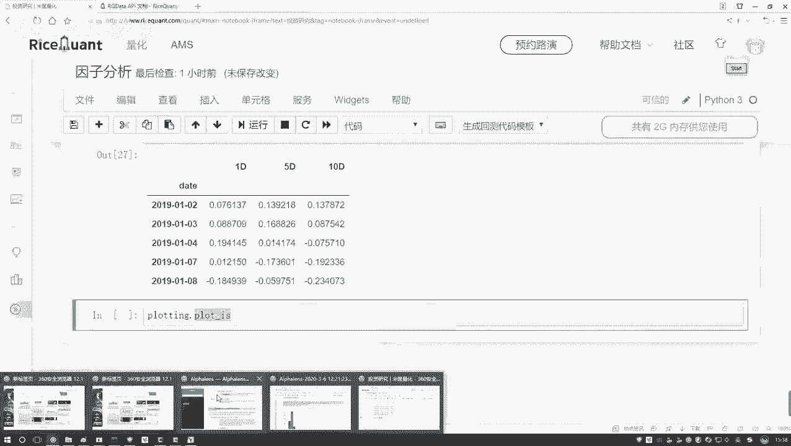
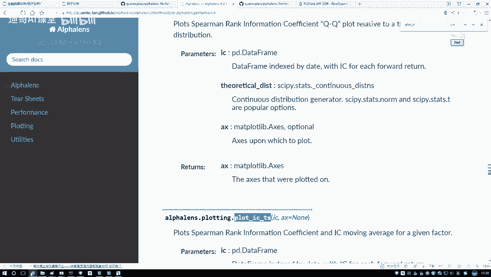
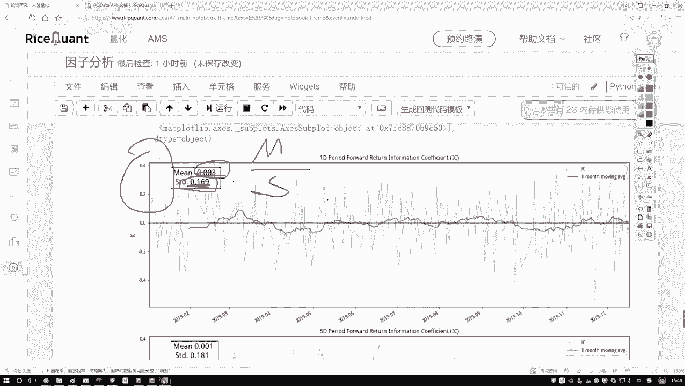
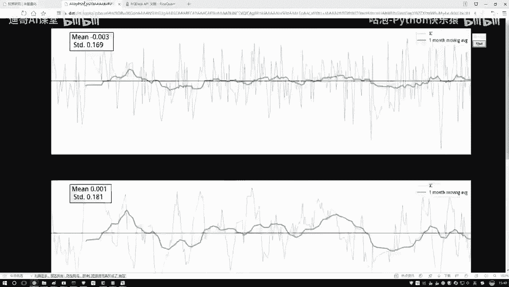
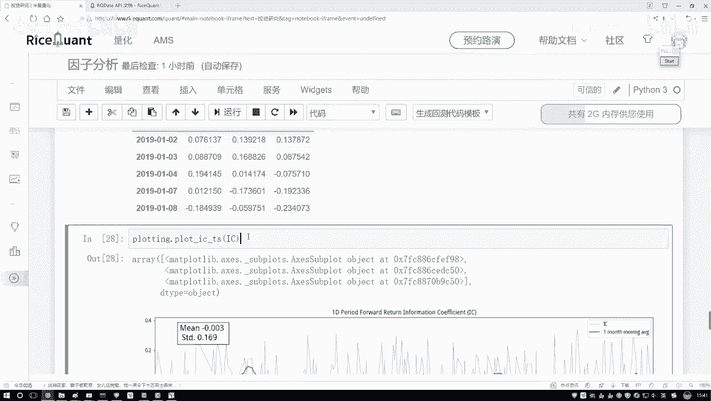
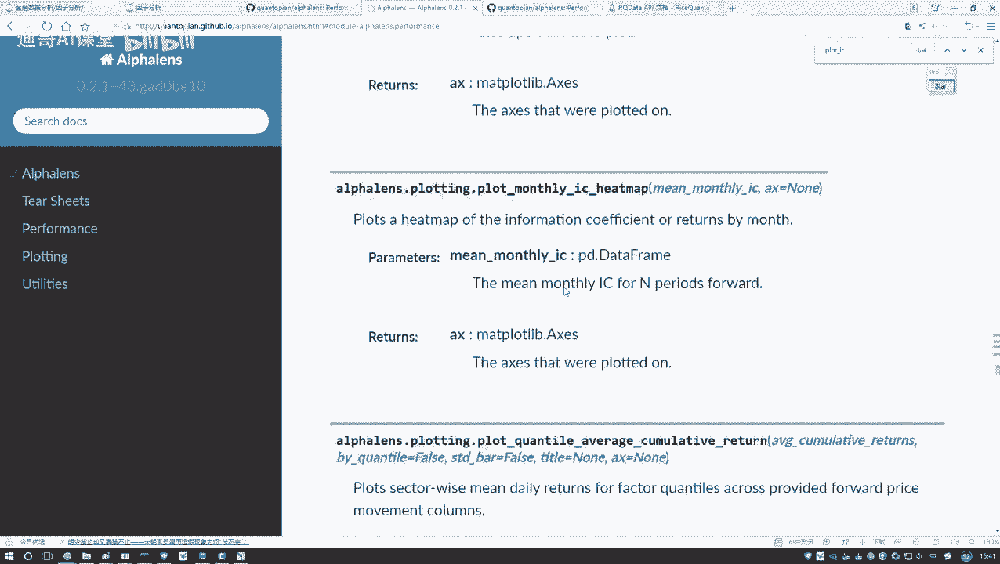
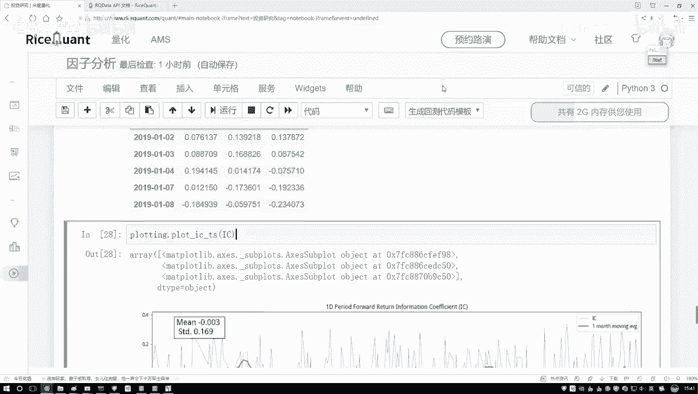

# 金融量化分析：P46：7-工具包绘图展示 📊

## 概述
在本节课程中，我们将学习如何使用绘图工具包，将计算得到的因子IC值（信息系数）进行可视化展示。通过图表，我们可以更直观地分析因子与收益率之间的相关性及其稳定性。

---

上一节我们介绍了如何计算因子与收益率之间的相关系数（IC值）。计算完成后，我们得到了一个数值结果。通常，我们更关注相关性强的因子，因为这意味着该因子与收益率的关系更密切，可能更具研究价值。



然而，我们计算出的IC值每天都会变化。仅从数值结果来看，其变化趋势可能不够明显。因此，本节我们将学习如何将IC值的时间序列绘制成图表，以便进行更深入的分析。

以下是使用 `alphalens` 工具包中的绘图功能进行可视化的步骤。



1.  **导入绘图工具**：我们使用 `alphalens` 中的 `plotting` 模块进行绘图。
    ```python
    import alphalens
    ```
2.  **绘制IC时间序列图**：调用 `plot_ic_ts` 函数，传入我们之前计算好的因子数据。
    ```python
    alphalens.plotting.plot_ic_ts(ic_data)
    ```
    执行以上代码后，系统会自动生成图表。

---

生成的图表包含以下关键信息：

*   **蓝色曲线**：代表每日的实际IC值，其波动范围通常较大。
*   **绿色曲线**：代表以一个月为窗口的IC滚动平均值。由于蓝色曲线波动剧烈，我们主要观察这条平滑后的绿色趋势线，以判断因子的长期表现。
*   **统计指标**：图表上方会显示IC的均值（Mean）和标准差（Std），以及由 **均值 / 标准差** 计算得出的**信息比率（Information Ratio, IR）**。

信息比率 **IR = Mean(IC) / Std(IC)** 是一个重要的稳定性指标。它衡量了因子IC值的稳定性。IR值越大，说明因子的预测能力越稳定；反之，则说明因子的表现波动较大。

观察我们绘制的图表，绿色趋势线整体较为平稳，且IC均值较小。这表明当前因子的预测能力可能较弱，且没有显示出明显的上升或下降趋势，与我们期望的“强相关性”目标尚有距离。

---



除了IC时间序列图，`alphalens` 工具包还提供了其他多种分析图表，例如：



*   IC值的直方图（Histogram）
*   QQ图（用于检验IC值是否服从正态分布）
*   不同分位数下的平均收益率热力图



这些图表功能非常全面，足以支持对因子策略进行深入的定量分析。在本入门教程中，我们主要掌握核心的IC序列绘图方法即可。未来在进行详细的因子分析时，可以进一步探索这些高级功能。



---



## 总结
本节课我们一起学习了如何使用 `alphalens` 工具包对因子IC值进行可视化。我们绘制了IC时间序列图，学会了观察其滚动平均趋势，并理解了信息比率（IR）作为稳定性指标的含义。通过图表化分析，我们可以更有效地评估因子的有效性和稳定性，这是构建量化交易策略的关键一步。