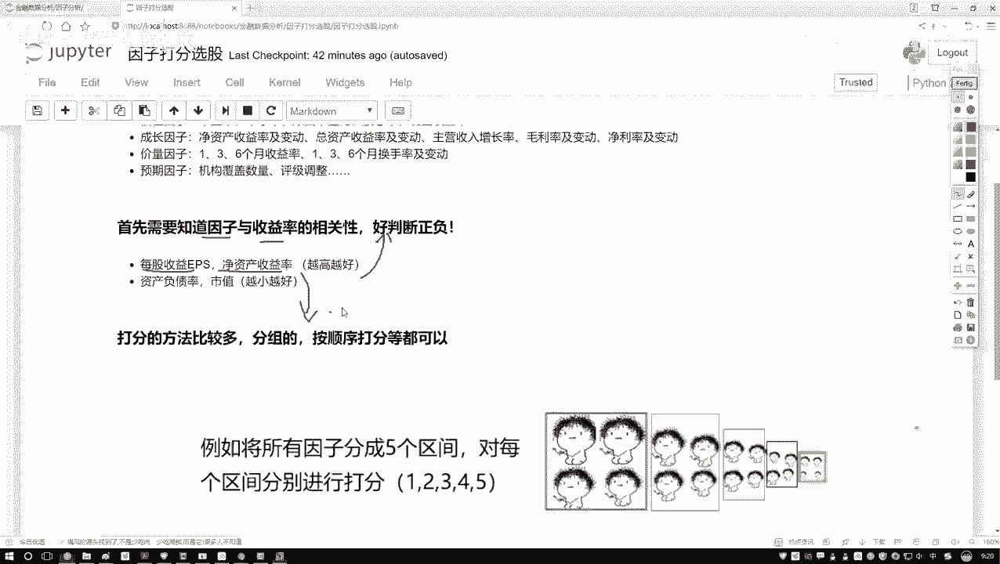
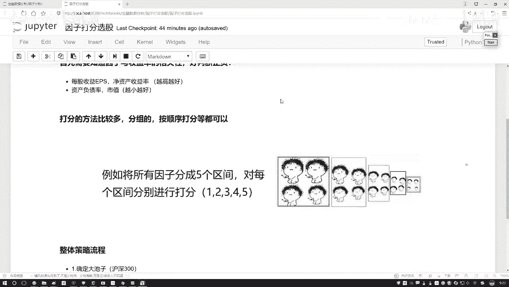
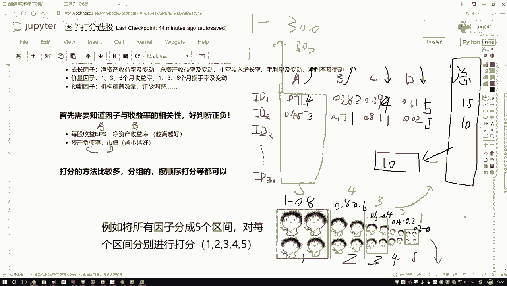
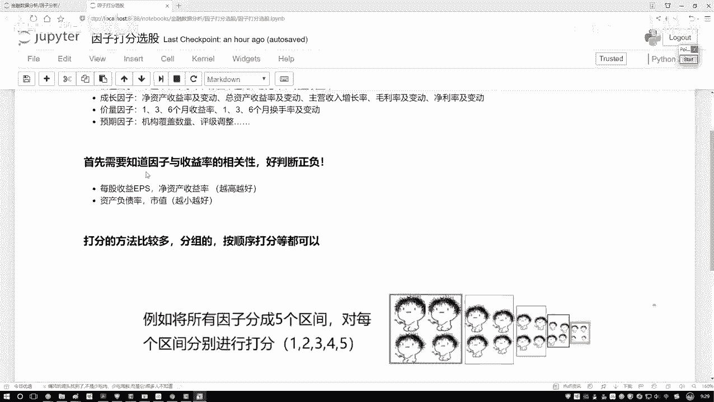
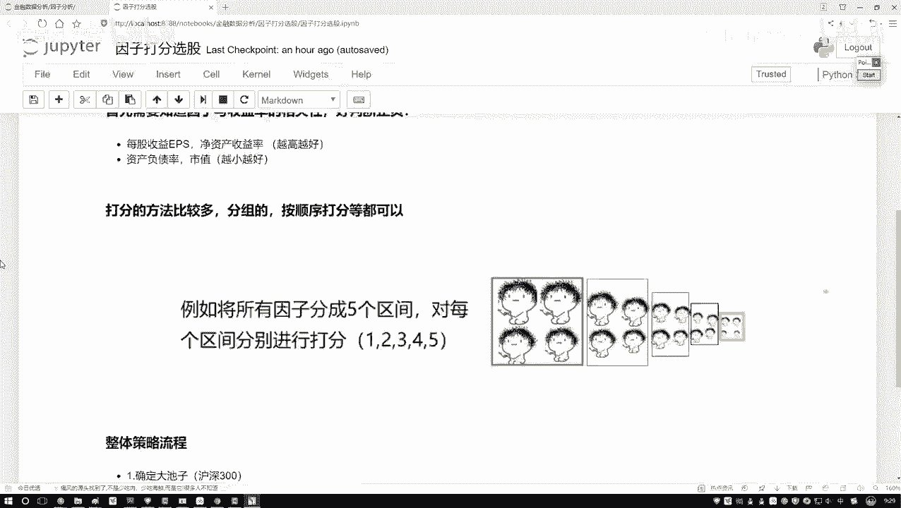
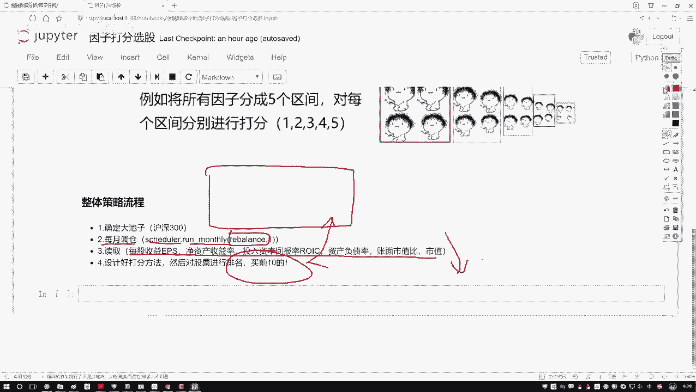
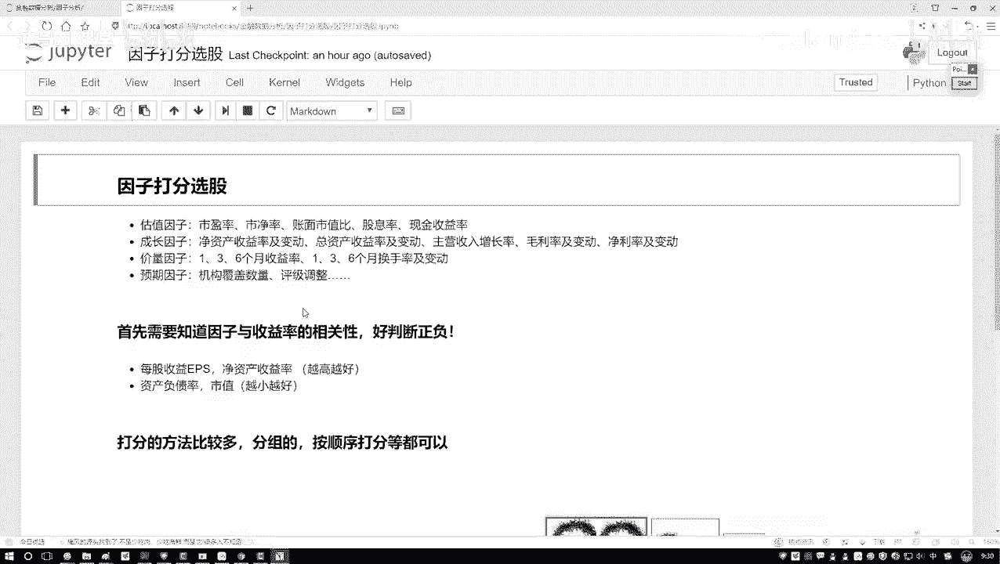

# 量化交易实战：P49：2-整体任务流程梳理

## 概述
在本节课中，我们将学习量化交易策略中的一个核心环节——**因子打分法**。我们将详细拆解如何根据已知的财务指标，对股票池中的每一只股票进行评分，并基于总分进行排序和选股，最终构建一个可执行的月度调仓策略。

---

## 因子打分法详解

上一节我们介绍了如何获取和筛选财务指标。本节中，我们来看看如何利用这些指标对股票进行量化打分。

有了已知的指标数据后，下一步就是进行打分。打分的方法有很多种，我们将通过一个具体的例子来讲解最常用的一种方法。

以下是打分法的核心步骤：

1.  **准备数据**：假设我们有一个包含300只股票（例如沪深300成分股）的股票池。每只股票有A、B、C、D四个财务指标。其中，指标A和B是**越大越好**（例如ROE、净利润增长率），指标C和D是**越小越好**（例如资产负债率、市值）。
2.  **确定打分方向**：根据指标的好坏方向，我们需要设计不同的打分规则。
    *   **越大越好**的指标：数值越大，得分越高。
    *   **越小越好**的指标：数值越小，得分越高。
3.  **划分区间并赋值**：将每个指标的数值范围（例如归一化后的0-1区间）划分为若干个等级，并为每个等级赋予一个分数。

为了更直观地理解，我们来看一个具体的例子。

### 打分示例

假设我们有两只股票（id1, id2）的指标数据（已归一化到0-1之间）：

| 股票ID | 指标A (越大越好) | 指标B (越大越好) | 指标C (越小越好) | 指标D (越小越好) |
| :----- | :--------------- | :--------------- | :--------------- | :--------------- |
| id1    | 0.71             | 0.28             | 0.39             | 0.01             |
| id2    | 0.45             | 0.17             | 0.81             | 0.02             |

首先，我们为每个指标划分区间并设定分数。这里我们将0-1的区间等分为5档：

**对于“越大越好”的指标（A, B）：**
*   数值在 [0.8, 1.0]：得 **5分**
*   数值在 [0.6, 0.8)：得 **4分**
*   数值在 [0.4, 0.6)：得 **3分**
*   数值在 [0.2, 0.4)：得 **2分**
*   数值在 [0.0, 0.2)：得 **1分**

**对于“越小越好”的指标（C, D）：**
*   数值在 [0.0, 0.2)：得 **5分**
*   数值在 [0.2, 0.4)：得 **4分**
*   数值在 [0.4, 0.6)：得 **3分**
*   数值在 [0.6, 0.8)：得 **2分**
*   数值在 [0.8, 1.0]：得 **1分**

现在，我们来为每只股票的每个指标打分：

*   **股票 id1**：
    *   指标A = 0.71 → 落在 [0.6, 0.8) → **4分**
    *   指标B = 0.28 → 落在 [0.2, 0.4) → **2分**
    *   指标C = 0.39 → 落在 [0.2, 0.4) → **4分** (注意：C是越小越好)
    *   指标D = 0.01 → 落在 [0.0, 0.2) → **5分** (注意：D是越小越好)
    *   **总分** = 4 + 2 + 4 + 5 = **15分**

*   **股票 id2**：
    *   指标A = 0.45 → 落在 [0.4, 0.6) → **3分**
    *   指标B = 0.17 → 落在 [0.0, 0.2) → **1分**
    *   指标C = 0.81 → 落在 [0.8, 1.0] → **1分** (注意：C是越小越好)
    *   指标D = 0.02 → 落在 [0.0, 0.2) → **5分** (注意：D是越小越好)
    *   **总分** = 3 + 1 + 1 + 5 = **10分**

通过计算，id1的总分（15分）高于id2（10分）。将这个逻辑扩展到整个300只股票的池子，我们就能计算出每只股票的总分。

> **补充说明**：除了划分区间的方法，也可以直接根据数值在所有股票中的**排名**来打分。例如，对于“越大越好”的指标，排名第1的给300分，排名第300的给1分。方法多样，核心目标是得到一个可比较的总分用于排序。

---

## 整体策略流程梳理

理解了打分法之后，我们来看整个量化策略的完整执行流程。这个流程就是我们接下来要编码实现的策略骨架。

以下是策略的核心步骤：

1.  **确定股票池**：首先，需要指定策略操作的股票范围。在本例中，我们使用**沪深300指数成分股**作为初始股票池。在代码中，这通常在 `contest` 或初始化函数中设置。
2.  **设置调仓周期**：确定策略的调仓频率。量化策略通常按月、季度或周进行调仓。本例中，我们采用**月度调仓**。这需要通过设置一个定时器函数来实现。
3.  **实现调仓逻辑**：这是策略的核心函数，通常命名为 `rebalance`。在这个函数中，我们将执行以下操作：
    *   **数据获取**：读取当前时刻所有股票池内股票的指定财务指标（A, B, C, D）。
    *   **因子打分**：应用上面介绍的打分法，为每只股票的每个指标计算分数。
    *   **汇总排序**：将每只股票的所有指标分数相加，得到总分。然后对所有股票按总分进行**降序排序**。
    *   **生成交易信号**：选择总分排名**前10**的股票，作为本次调仓要买入或持有的标的。
4.  **回测与评估**：将上述逻辑在历史数据中运行，观察策略的收益、回撤等表现，评估打分法选股的有效性。

这个流程看起来相对清晰。接下来，我们将使用这种打分法进行实战，看看仅凭几个简单的财务指标，能否构建出一个有效的选股策略，并带来超越基准的收益。

---

## 总结
本节课中我们一起学习了量化交易中的**因子打分法**。我们掌握了如何根据指标的经济含义（越大越好或越小越好）设计打分规则，并通过划分区间或排名的方式为股票评分。最后，我们梳理了整合打分法到一个完整量化策略中的**整体流程**，包括确定股票池、设置调仓周期、实现打分排序逻辑等关键步骤。这是将主观投资经验转化为客观、可执行的量化模型的重要一步。