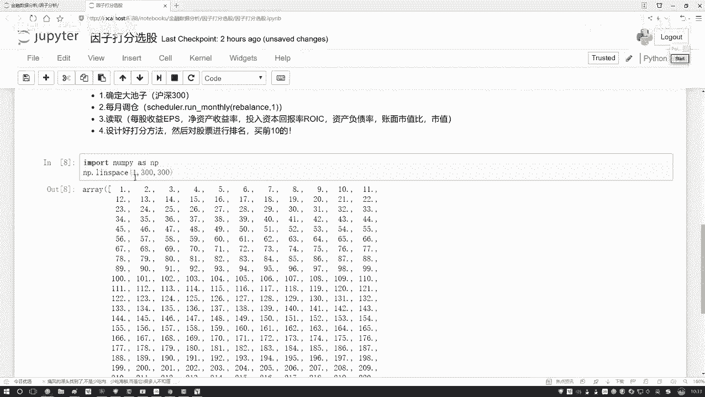
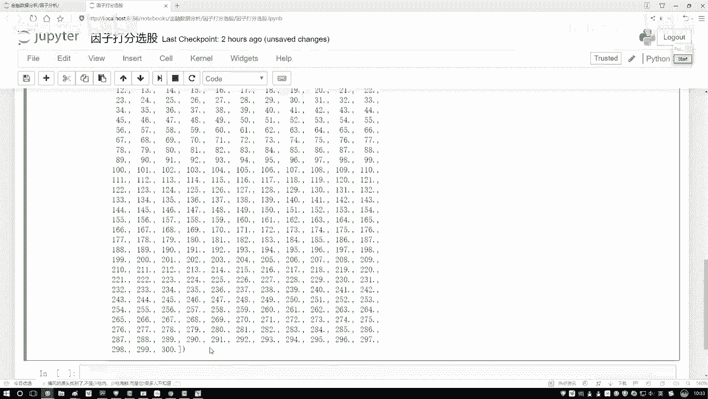
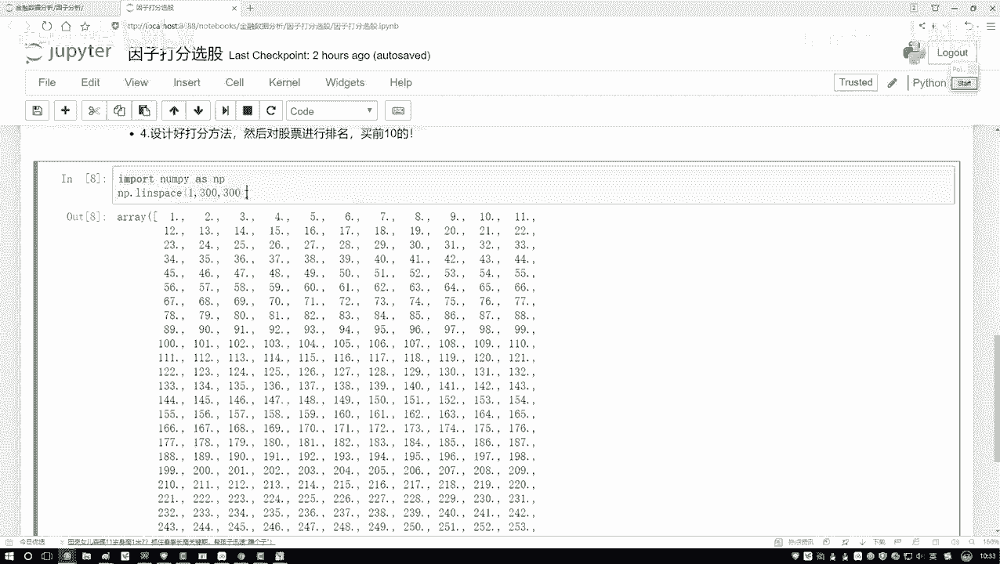
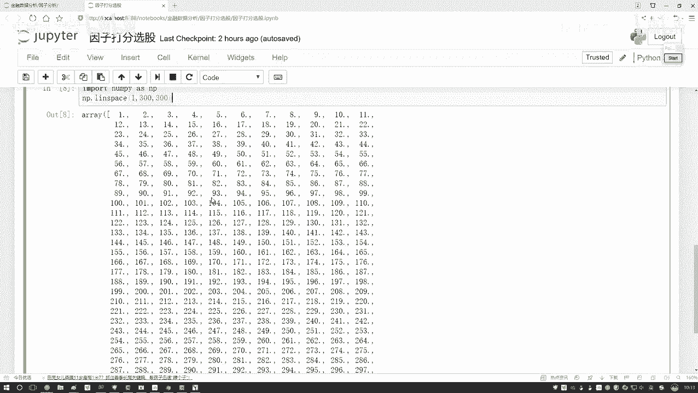
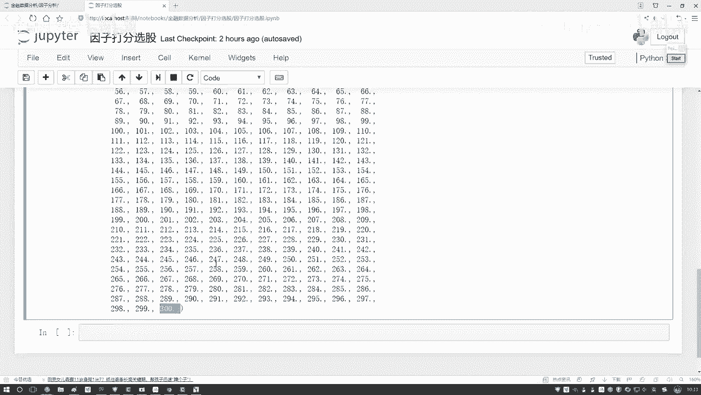
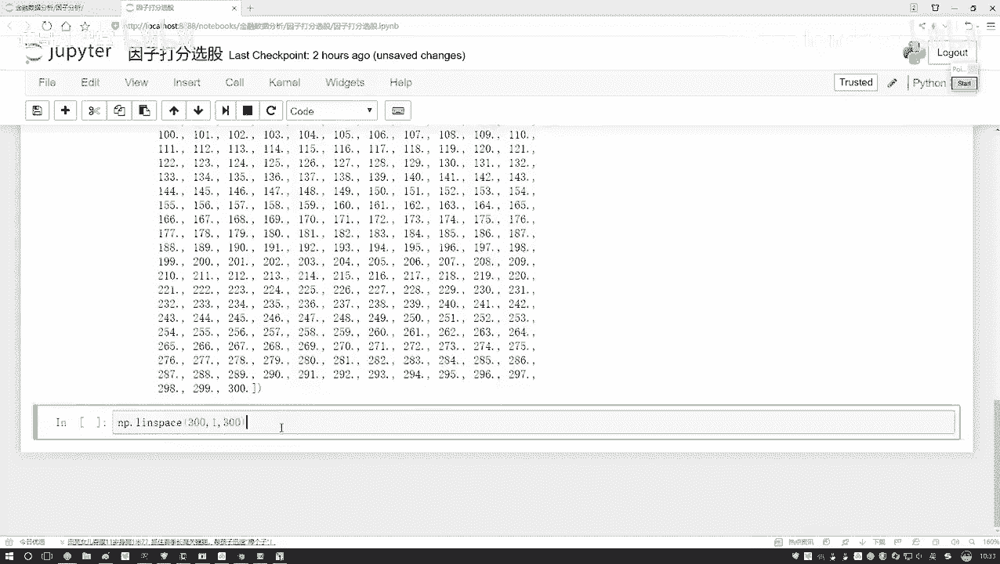
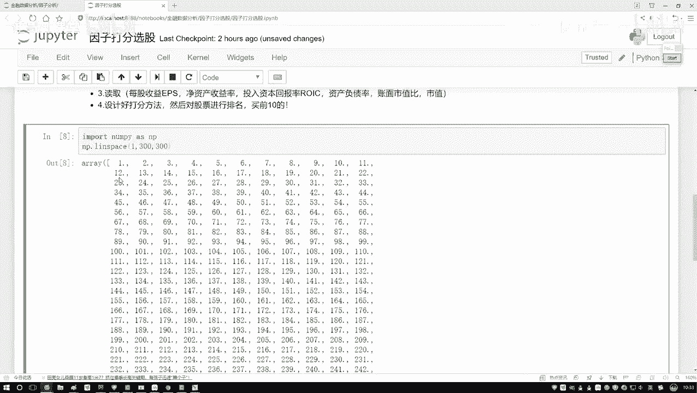
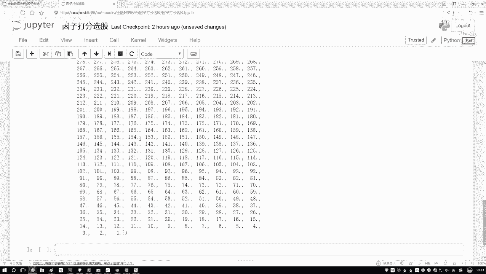
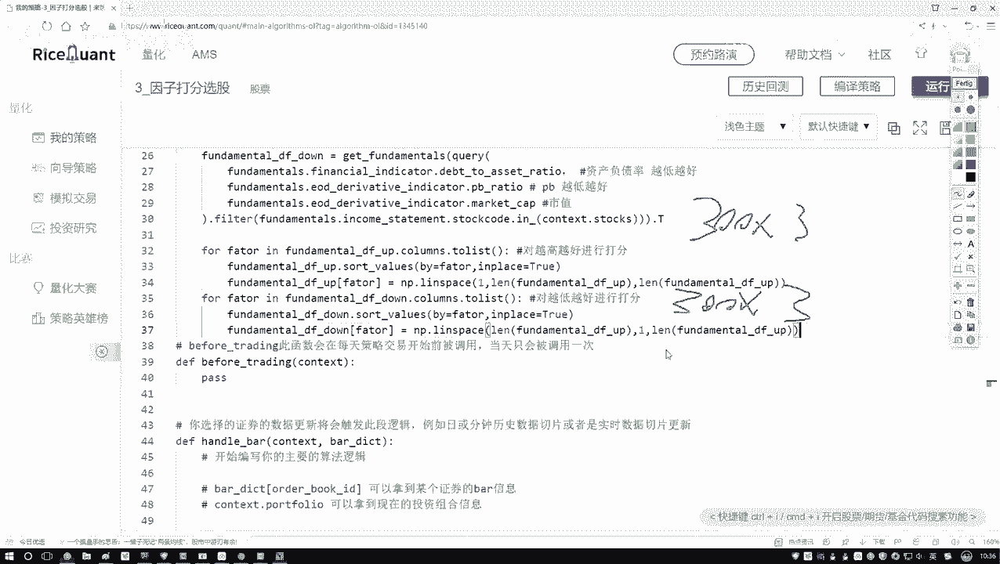

# 金融量化分析：P51：4-因子打分与排序


在本节课中，我们将学习如何对选出的因子进行排序和打分。这是构建多因子模型的关键步骤，我们将分别处理“越高越好”和“越低越好”两类因子，并为每个股票在每个因子上分配一个得分。


上一节我们介绍了如何筛选和分类因子，本节中我们来看看如何为这些因子进行排序和打分。

## 遍历因子并排序

首先，我们需要遍历两个DataFrame（分别对应“越高越好”和“越低越好”的因子），并对每个因子列进行排序。


以下是遍历“越高越好”因子DataFrame的步骤：

1.  获取DataFrame的列名列表，以便遍历每一个因子。
2.  对每个因子列，按照其数值进行排序。排序时，我们使用 `sort_values` 方法，并设置 `inplace=True` 参数，这样排序结果会直接更新到原始DataFrame中，无需重新赋值。


核心排序代码如下：
```python
# 假设 fundamental_up 是“越高越好”因子的DataFrame
for factor in fundamental_up.columns:
    fundamental_up.sort_values(by=factor, inplace=True)
```


## 为排序结果分配得分







排序完成后，我们需要根据排名为每个股票分配得分。我们使用NumPy的 `linspace` 函数来生成一个线性的得分序列。





`numpy.linspace` 函数的公式为：
`numpy.linspace(start, stop, num)`
它会生成从 `start` 到 `stop` 之间等间隔的 `num` 个数字。





对于“越高越好”的因子，排名第一（值最大）的股票应得最高分。因此，我们生成一个从1到股票总数（例如300）的序列，并将其赋值给排序后的因子列。




以下是生成得分并赋值的代码：
```python
import numpy as np
import pandas as pd


# 假设股票总数为 stock_count
stock_count = len(fundamental_up)
for factor in fundamental_up.columns:
    fundamental_up.sort_values(by=factor, inplace=True)
    # 生成得分：排名第1得1分，排名第300得300分（假设因子值越大越好）
    scores = np.linspace(1, stock_count, stock_count)
    fundamental_up[factor] = scores
```


对于“越低越好”的因子，逻辑相反：排名第一（值最小）的股票应得最高分。因此，我们生成一个从股票总数到1的递减序列。

以下是处理“越低越好”因子的代码：
```python
# 假设 fundamental_down 是“越低越好”因子的DataFrame
for factor in fundamental_down.columns:
    fundamental_down.sort_values(by=factor, inplace=True)
    # 生成得分：排名第1（值最小）得300分，排名第300得1分
    scores = np.linspace(stock_count, 1, stock_count)
    fundamental_down[factor] = scores
```


## 合并数据并计算总分


完成两个DataFrame的因子打分后，我们得到了两个新的DataFrame，其中原始因子值已被替换为基于排名的得分。

为了计算每个股票的综合得分，我们需要将这两个DataFrame合并。之后，只需对每个股票在所有因子上的得分进行求和，即可得到该股票的总分，用于最终的选股决策。




本节课中我们一起学习了因子打分与排序的核心流程。我们首先遍历并排序了“越高越好”和“越低越好”两类因子，然后利用 `numpy.linspace` 函数根据排名生成线性得分，最后为后续计算各股票的综合总分做好了数据准备。这是将因子信息转化为统一、可比较的分数的关键步骤。