# 金融量化交易实战：P6：突变点调参 🎯

在本节课中，我们将要学习Prophet模型中一个至关重要的参数——突变点（Change Point）的权重（`changepoint_prior_scale`）。我们将通过实验理解这个参数如何影响模型的拟合效果，并学习如何通过调整它来优化预测性能。

## 核心概念：突变点权重

突变点权重（`changepoint_prior_scale`）是一个控制模型对数据中突变趋势敏感度的参数。其核心含义如下：

*   **参数作用**：该参数指定了突变点的权重。
*   **权重含义**：权重越大，模型在训练时会更加重视数据中的突变点，并尝试学习这些突变的趋势。
*   **默认值**：在Prophet框架中，该参数的默认值为 `0.05`。

## 参数影响分析

上一节我们介绍了突变点权重的概念，本节中我们来看看不同权重大小对模型结果的具体影响。

### 权重大小的影响

以下是不同权重设置下模型可能出现的两种状态：

1.  **权重大（如 `0.2`）**：
    *   **优点**：模型能更好地捕捉训练数据中的突变信息，与训练数据的拟合程度更高。
    *   **风险**：模型可能过度关注训练集中的噪声或偶然波动，导致**过拟合**风险增加。这意味着模型在训练集上表现很好，但在未见过的测试数据上可能表现不佳。

2.  **权重小（如 `0.001`）**：
    *   **表现**：模型对突变点不敏感，趋势预测会相对平稳和保守。
    *   **风险**：模型可能无法充分学习数据中的关键变化模式，导致**欠拟合**。这意味着模型既不能在训练集上很好地拟合，预测能力也有限。

### 实验对比

为了直观展示影响，我们选取四组不同的权重值进行实验：`0.001`, `0.05`（默认值）, `0.1`, `0.2`。

以下是实验代码的核心逻辑：
```python
# 假设 df 是包含‘ds’和‘y’列的训练数据框
changepoint_prior_scales = [0.001, 0.05, 0.1, 0.2]
forecasts = {}

for scale in changepoint_prior_scales:
    # 1. 创建模型并设置参数
    model = Prophet(changepoint_prior_scale=scale)
    # 2. 拟合模型
    model.fit(df)
    # 3. 创建未来时间框并进行预测
    future = model.make_future_dataframe(periods=180)
    forecast = model.predict(future)
    # 4. 存储预测结果
    forecasts[scale] = forecast
```
通过对比预测曲线与真实数据（通常用黑点表示），我们可以观察到：
*   **`0.001`（蓝色线）**：曲线非常平滑，几乎忽略了所有突变点，欠拟合特征明显。
*   **`0.05`（红色线）**：相比蓝色线，能捕捉到部分主要趋势，但依然比较保守。
*   **`0.1`（灰色线）与 `0.2`（黄色线）**：能越来越紧密地跟随训练数据的波动，尤其是黄色线，对突变点的拟合程度很高。

## 模型评估与参数选择

仅仅观察拟合曲线不够客观，我们需要通过评估指标来量化模型性能，并据此选择最佳参数。

### 评估指标

我们主要关注两个误差指标：
*   **训练误差（Train Error）**：模型在训练集上的预测误差。
*   **测试误差（Test Error）**：模型在预留的测试集（未来时间段）上的预测误差。对于时间序列预测，**测试误差更具参考价值**。

### 寻找最优参数

我们测试了从 `0.2` 到 `0.8` 之间更大的权重值，并计算了对应的测试误差。

以下是评估发现：
*   **训练误差趋势**：随着 `changepoint_prior_scale` 增大，训练误差持续下降，这与模型过拟合能力增强的观察一致。
*   **测试误差趋势**：测试误差随着参数增大先下降后趋于平缓。在本案例中，当 `changepoint_prior_scale=0.7` 时，测试误差达到最低点（约66）。
*   **选择标准**：**应选择使测试误差最小的参数值**。因此，对于当前数据集，最优参数是 `0.7`。

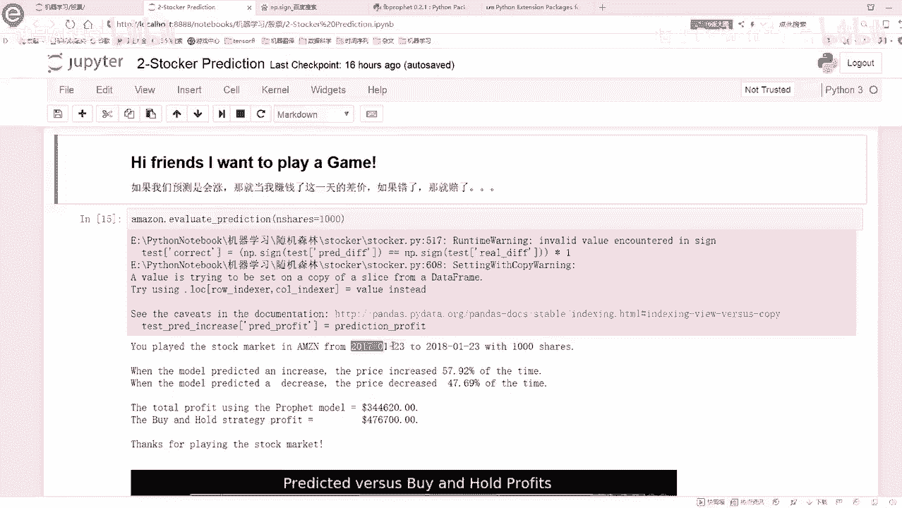

使用优化后的参数（`0.7`）重新训练模型并进行预测，其预测值（如1263）与真实值（1294）的差距，会比使用默认参数时的差距更小，验证了调参的有效性。

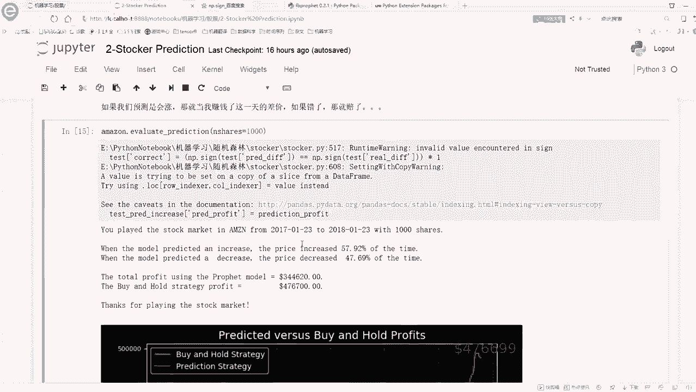

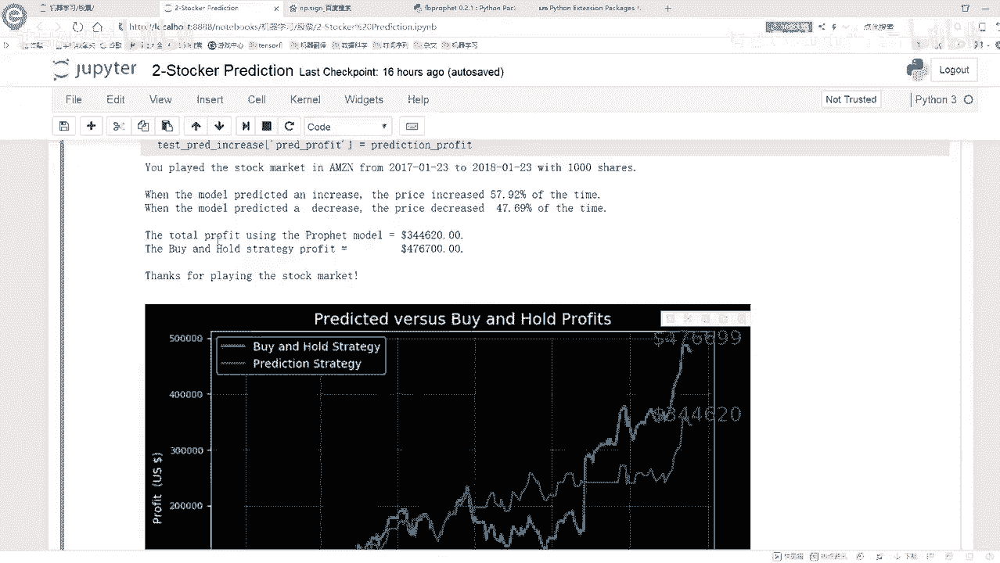

## 拓展应用：简单的交易策略模拟

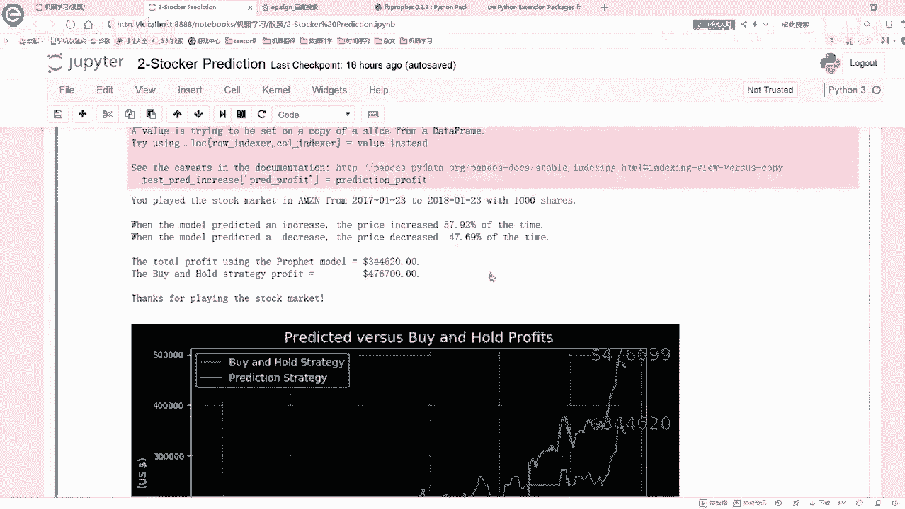

Prophet模型不仅可以预测价格，还可以基于预测结果构建简单的策略进行回测。以下是一个概念性的策略示例：

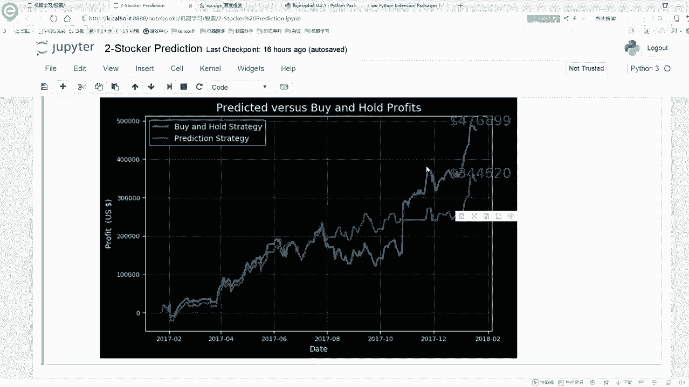

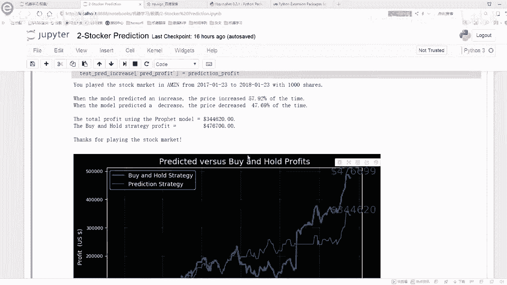

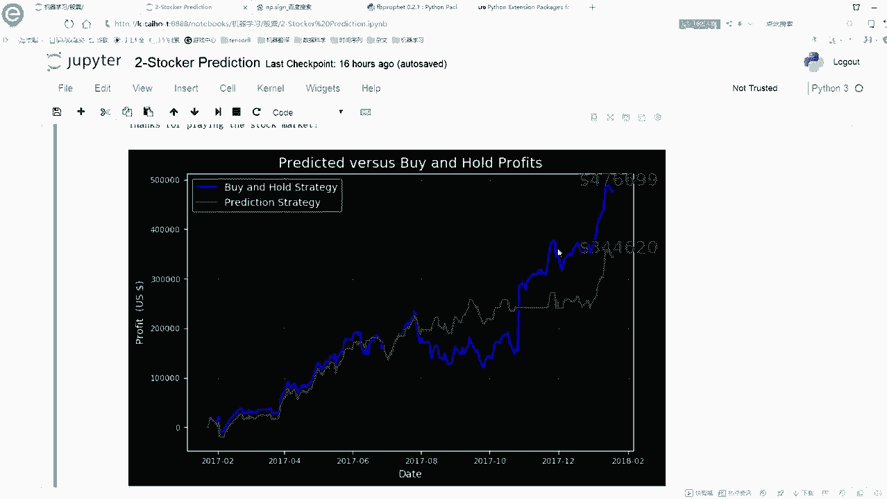

1.  **策略逻辑**：每天根据模型对次日价格的预测方向（涨/跌）决定操作。
    *   预测涨 -> 买入（或持有）。
    *   预测跌 -> 卖出（或不持有）。
2.  **策略回测**：在历史数据上模拟该策略的执行，计算总收益。
3.  **结果分析**：通过回测可以观察策略在特定时间段（如2017-2018年）是否有效。**需要注意的是，股票预测极具挑战性，任何策略都无法保证持续盈利，回测结果仅供参考，不能代表未来表现。**

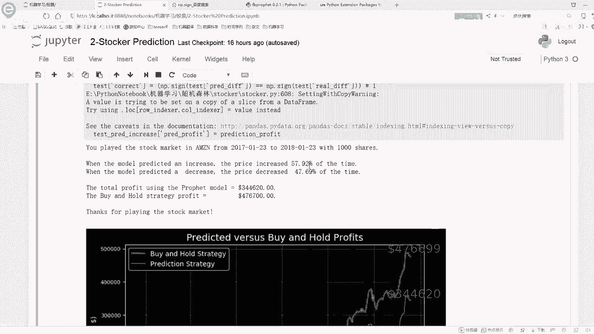

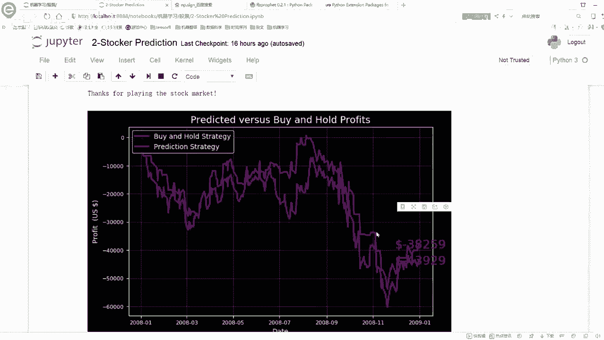

## 总结与建议

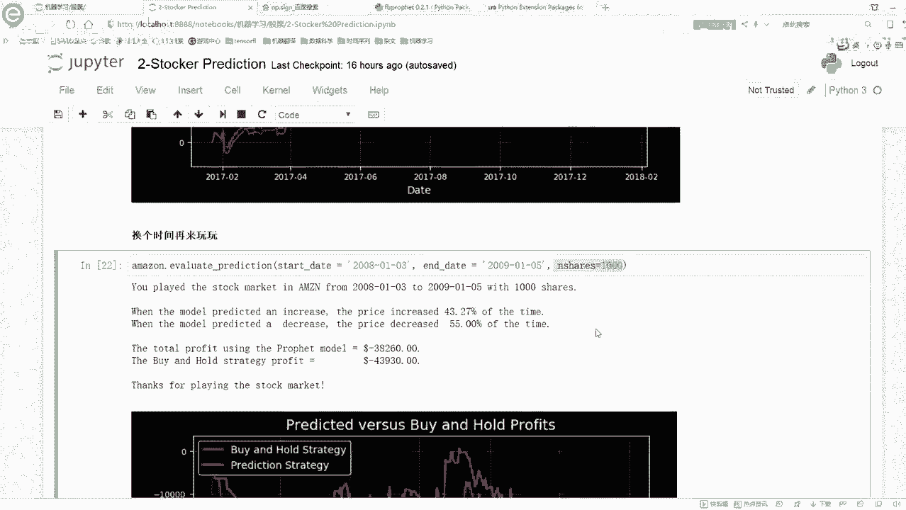

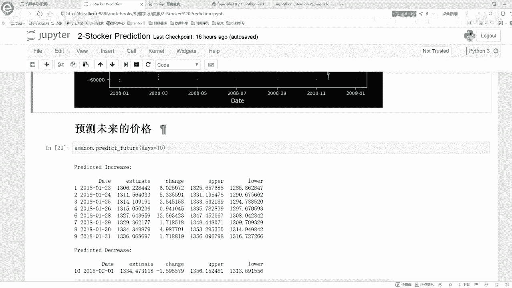

本节课中我们一起学习了Prophet模型的核心调参技巧。

*   **核心收获**：我们深入理解了 `changepoint_prior_scale` 参数如何控制模型的灵活性与过拟合风险，并通过实验和误差评估找到了针对特定数据集的最优参数。
*   **方法论**：调参的关键在于使用**测试误差**作为客观评价标准，选择使测试误差最小的参数配置。
*   **学习建议**：要深入掌握Prophet或其他工具，最佳方法是：
    1.  **查阅官方文档**：理解每个参数和功能的详细说明。
    2.  **动手实践**：像本节课一样，通过修改参数、运行代码并观察结果来验证你的理解。
    3.  **应用于自己的数据**：尝试用该框架处理你感兴趣领域的时间序列数据。

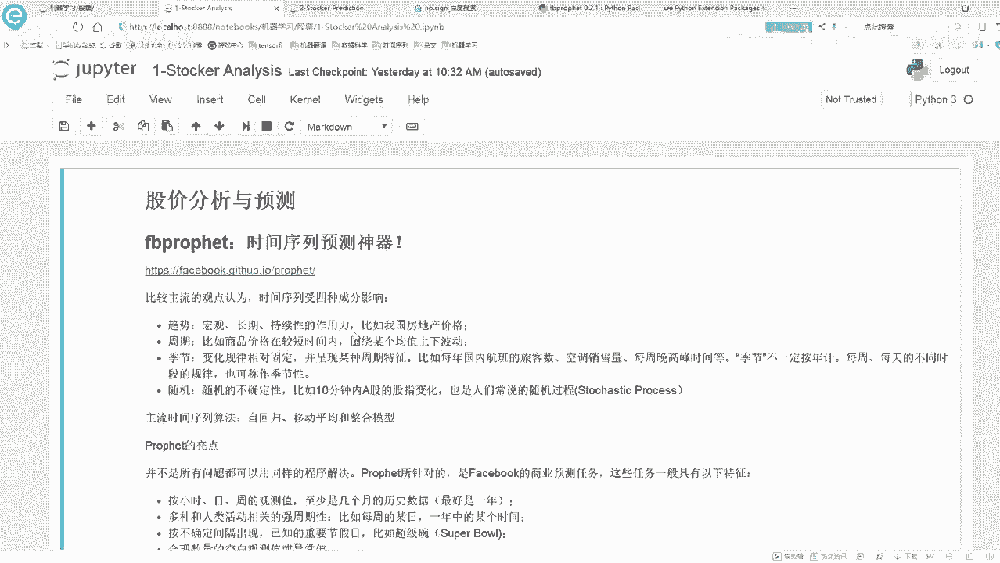

通过结合文档学习与动手实验，你将能更有效地掌握并应用这些强大的分析工具。