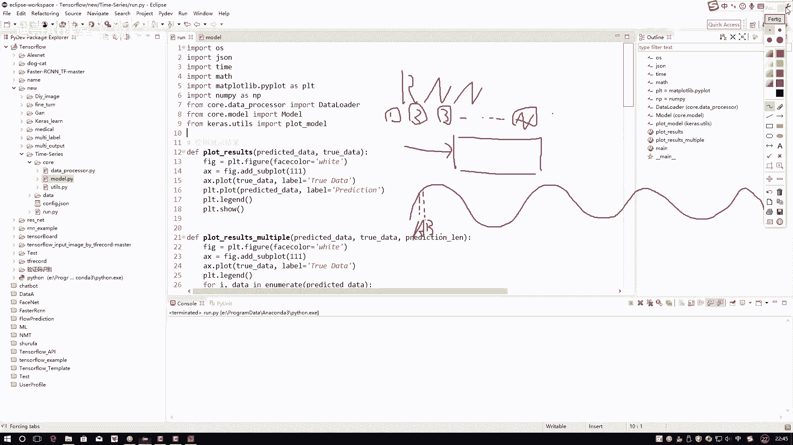
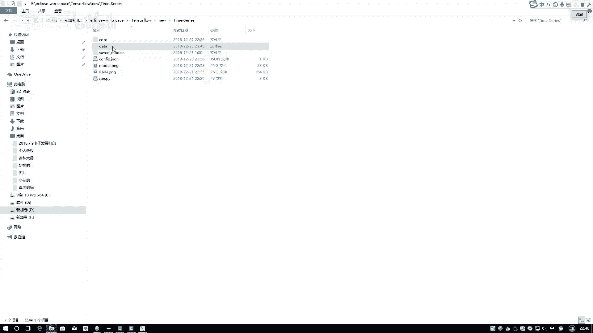
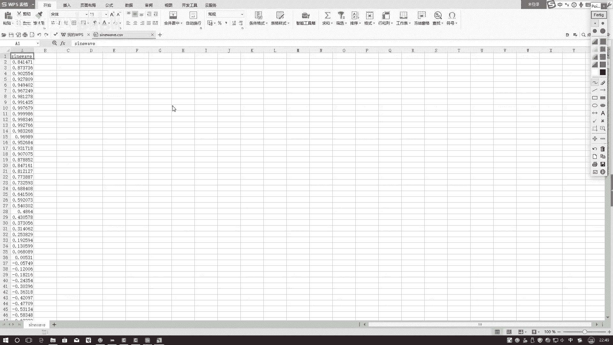
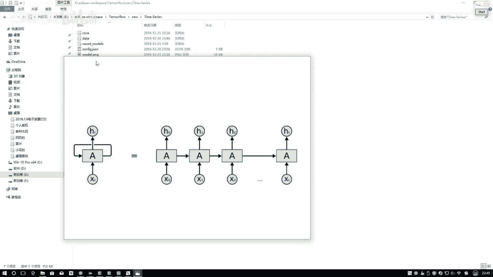
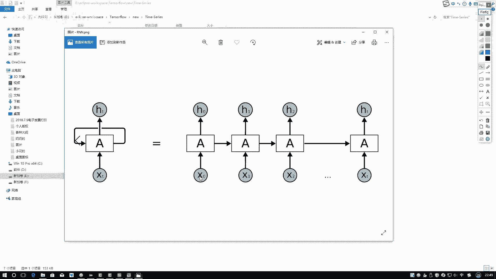
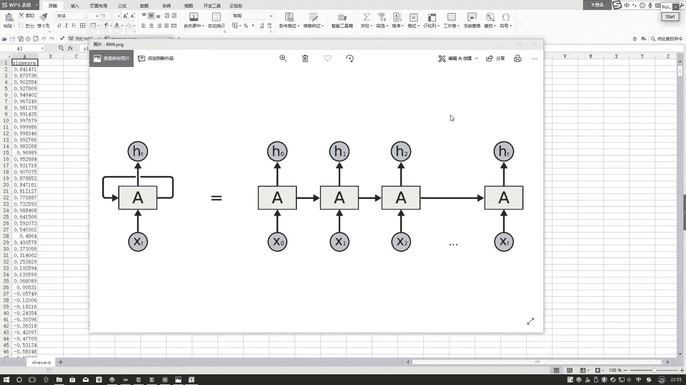

# 机器学习实战：P64：时间序列模型

在本节课中，我们将学习深度学习中的另一个重要分支——递归神经网络。我们将探讨如何利用RNN处理具有时间依赖性的序列数据，例如正弦波或文本，并学习在Keras框架中构建和训练RNN模型。

上一节我们介绍了与图像识别相关的模型，本节中我们来看看如何处理时间序列数据。

## 什么是时间序列数据？

时间序列数据是指数据点之间存在顺序依赖关系的数据。在传统神经网络中，每个输入数据点被视为独立且不相关的。然而，在许多实际场景中，例如股票价格、天气变化或自然语言，当前的数据点会受到其前面数据点的影响。

递归神经网络能够捕捉这种前后依赖关系，因此广泛应用于时间序列预测和文本分析等领域。

## 课程目标与数据准备

本节课的目标是学习两件事：如何准备时间序列数据，以及如何搭建和训练RNN网络模型。

首先，我们来看一下将要使用的数据。

我们使用的第一份数据是一列正弦波数据。将其可视化后，会呈现出一条规律波动的曲线。每个数据点对应曲线上的一个值。

我们的任务是进行预测：基于前面的一系列数据点，预测下一个数据点的值。

## 理解RNN的输入结构

在构建模型之前，我们必须清楚RNN模型对输入数据格式的要求。理解输入结构是成功训练模型的关键。

以下是构建输入数据时需要考虑的核心概念：

*   **时间步长**： 这决定了我们使用多少个连续的历史数据点来预测下一个点。例如，我们可以用前50个点来预测第51个点。
*   **特征维度**： 这表示每个时间步上的数据点本身是什么。在我们的正弦波例子中，每个点是一个标量值。但在文本处理中，每个词可能被表示为一个高维向量（例如300维）。

因此，对于我们的正弦波预测任务，如果我们设定时间步长为50，那么输入数据的形状可以表示为：
`(样本数, 时间步长=50, 特征维度=1)`

这意味着每个样本是长度为50的序列，序列中的每个元素是一个单独的数字。

**重要提示**： 所有输入样本的时间步长必须一致。如果序列长度不同，需要进行填充或截断处理。

## 滑动窗口构建训练数据

为了从一长串序列数据中创建出多个符合上述格式的训练样本，我们需要使用滑动窗口的方法。

以下是构建训练数据的具体步骤：

1.  从序列的起始位置开始，选取第一个窗口（例如，索引0到49的数据点）作为第一个输入样本 `X[0]`。
2.  这个窗口之后的下一个数据点（索引50）则作为该样本对应的目标值 `y[0]`。
3.  将窗口向右滑动一步（例如，选取索引1到50的数据点），形成第二个输入样本 `X[1]`，其目标值为索引51的数据点 `y[1]`。
4.  重复此过程，直到遍历完整个序列。

通过这种方式，我们可以从一个长的序列中生成许多 `(X, y)` 样本对，用于训练RNN模型。

## 总结

本节课中我们一起学习了递归神经网络的基础知识。我们明确了时间序列数据的特性，即数据点之间存在前后依赖关系。我们深入探讨了RNN模型输入数据的关键维度：**时间步长**和**特征维度**。最后，我们介绍了如何使用**滑动窗口**的方法，将一维序列数据构建成适合RNN训练的格式 `(样本数, 时间步长, 特征维度)`。理解并准备好数据格式，是成功应用RNN进行时间序列预测的第一步。