# 机器学习实战：P66：3-构建LSTM模型 🧠

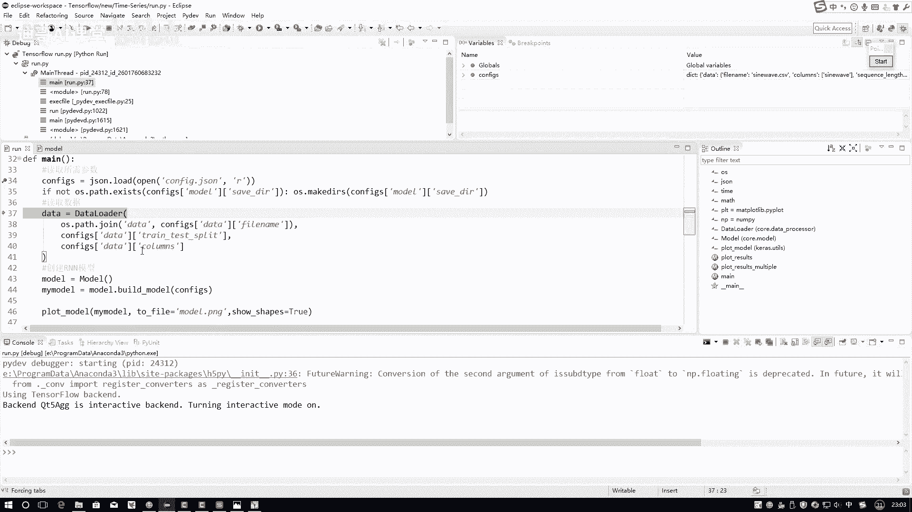

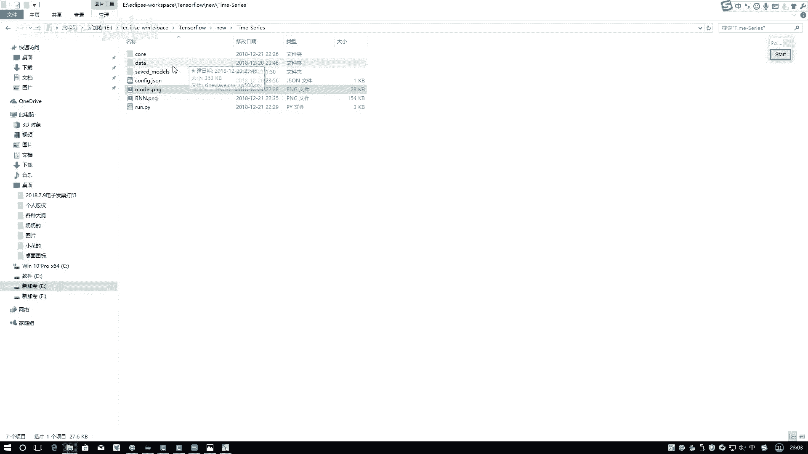

在本节课中，我们将学习如何构建一个LSTM模型。我们将从读取数据开始，然后按照配置文件中的定义，一步步搭建网络层，最终完成模型的构建。

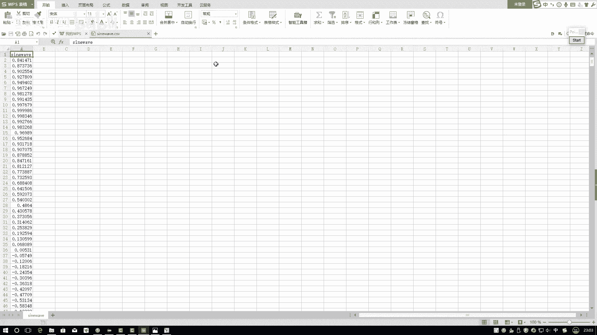

---

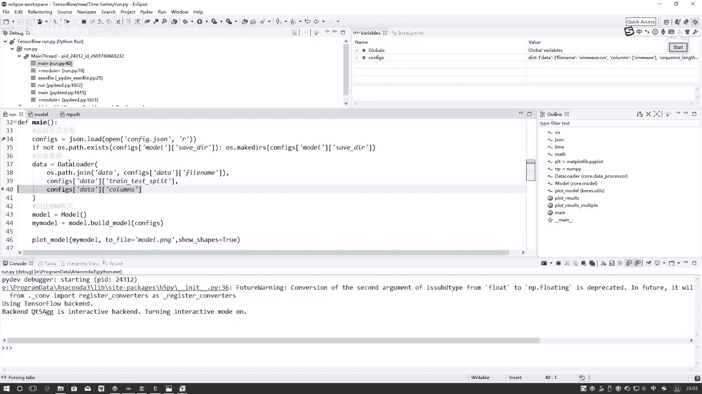

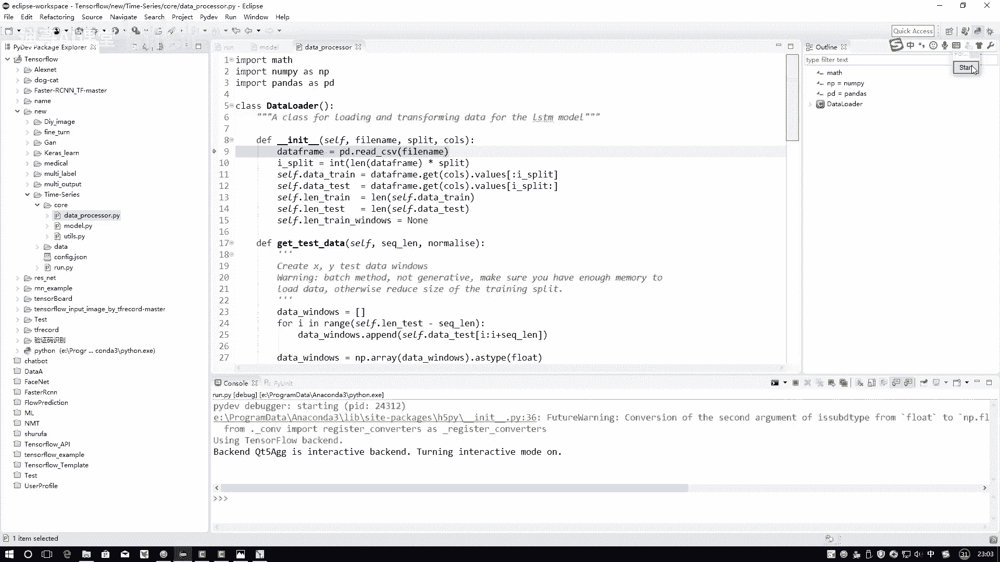

## 数据读取与预处理

首先，我们需要将数据读取到程序中。数据位于 `data` 文件夹下的 `sin_wave.csv` 文件中，这是一个正弦曲线数据。

以下是读取和切分数据的步骤：

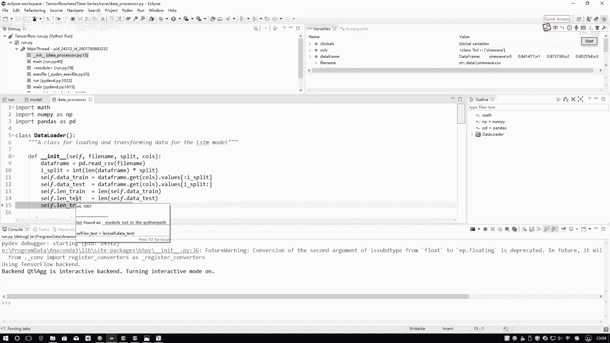

1.  使用 `pandas.read_csv` 函数读取CSV文件，数据将被加载为DataFrame格式，包含索引和实际值两列。
2.  将数据集切分为训练集和测试集。我们按照0.8（训练集）和0.2（测试集）的比例进行划分，即前4000条数据作为训练集，后1000条数据作为测试集。

```python
import pandas as pd

# 读取数据
data = pd.read_csv('data/sin_wave.csv')

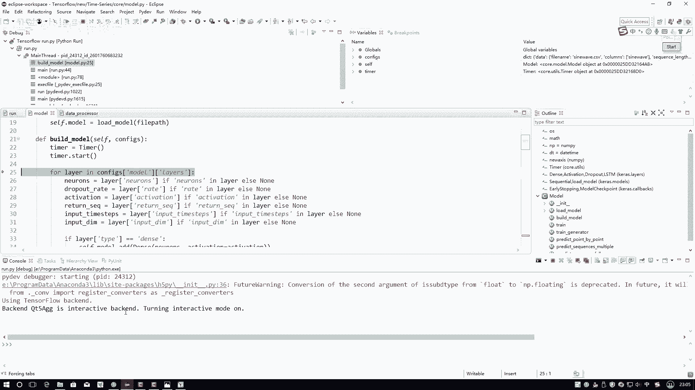

# 划分训练集和测试集
train_data = data.iloc[:4000]
test_data = data.iloc[4000:]
```

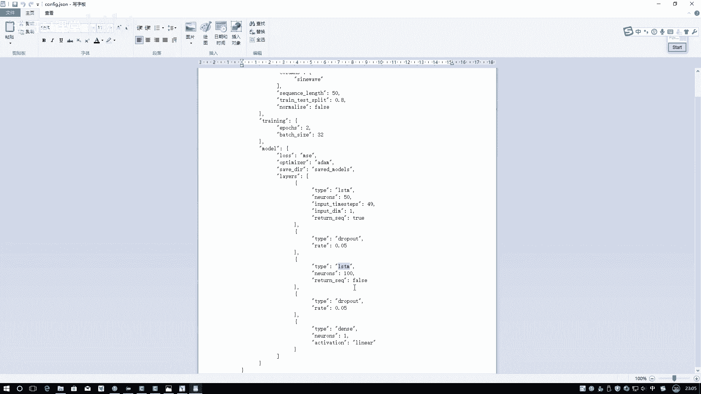

数据读取和划分完成后，我们得到了训练集（4000条）和测试集（1000条）。

---

## 构建LSTM模型

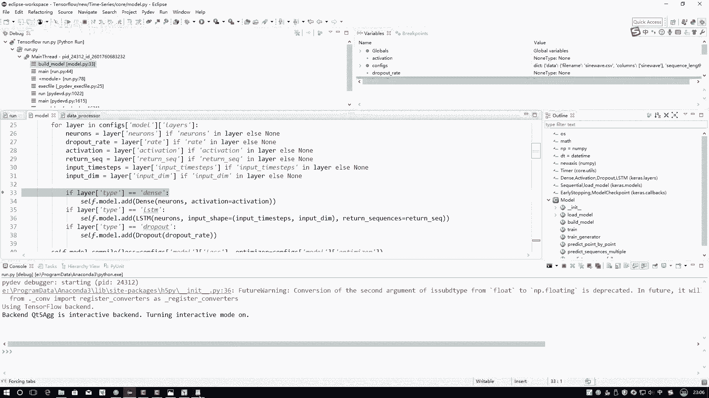

上一节我们准备好了数据，本节中我们来看看如何根据配置文件构建LSTM模型。我们将使用一个自定义的 `Model` 类，通过调用其 `build_model` 方法并传入配置参数来完成构建。

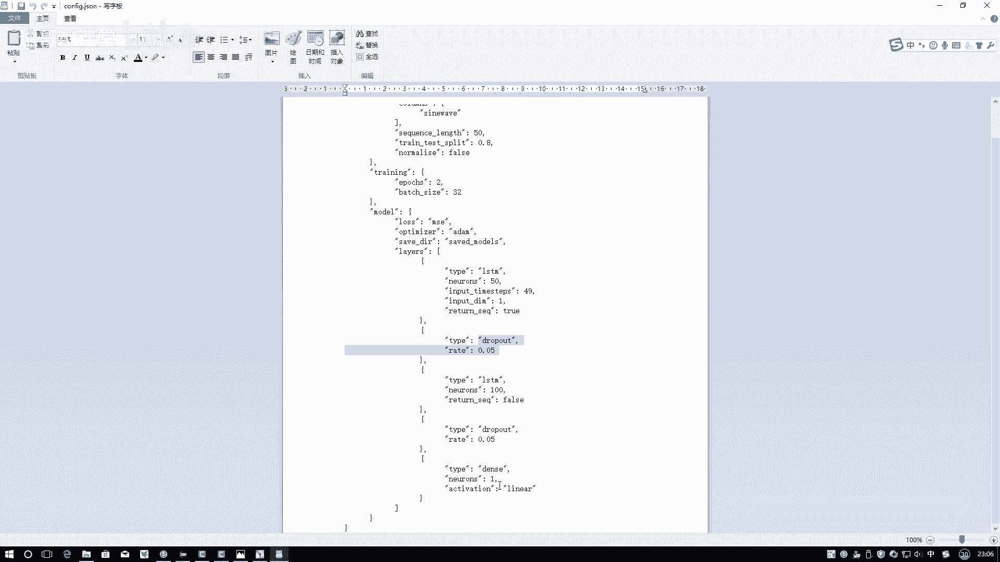

核心构建逻辑在 `build_model` 函数中。该函数会读取 `configure.json` 配置文件，并按照其中 `layers` 列表定义的顺序，逐层搭建网络。

以下是构建模型的具体流程：

1.  **实例化模型**：首先，我们实例化一个序列模型（`Sequential`）。
2.  **循环添加网络层**：遍历配置文件中的 `layers` 列表。对于列表中的每一层配置，判断其类型并添加相应的Keras层。
    *   **LSTM层**：当层类型为 `LSTM` 时，添加一个LSTM层。需要指定的参数包括：隐藏单元数量（如50）、输入形状 `input_shape=(time_steps, features)`（本例中为 `(49, 1)`），以及 `return_sequences=True`（当后面还有循环层时需要）。
    *   **Dropout层**：当层类型为 `Dropout` 时，添加一个Dropout层，并设置丢弃率（如0.2）。
    *   **全连接层（Dense）**：当层类型为 `Dense` 时，添加一个全连接层，并指定神经元数量。
3.  **编译模型**：在所有层添加完毕后，使用 `model.compile` 方法编译模型。我们需要指定损失函数（如均方误差 `mse`）和优化器（如Adam优化器 `adam`）。

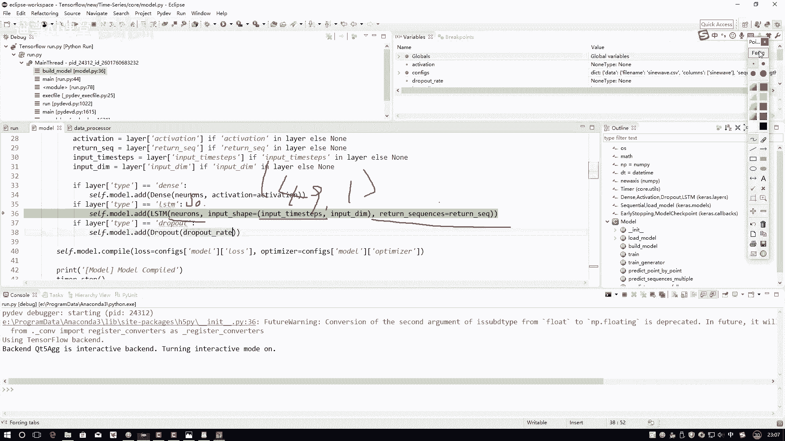

```python
from tensorflow.keras.models import Sequential
from tensorflow.keras.layers import LSTM, Dropout, Dense
import json

def build_model(config):
    model = Sequential()
    
    # 读取层配置
    with open('configure.json', 'r') as f:
        config = json.load(f)
    layers_config = config['model']['layers']
    
    # 按顺序添加层
    for layer_config in layers_config:
        layer_type = layer_config['type']
        
        if layer_type == 'LSTM':
            model.add(LSTM(units=layer_config['units'],
                           input_shape=(layer_config['time_steps'], layer_config['features']),
                           return_sequences=layer_config['return_sequences']))
        elif layer_type == 'Dropout':
            model.add(Dropout(rate=layer_config['rate']))
        elif layer_type == 'Dense':
            model.add(Dense(units=layer_config['units']))
    
    # 编译模型
    model.compile(loss='mse', optimizer='adam')
    
    return model
```

**代码说明**：
*   函数通过循环解析JSON配置，动态构建模型结构，这使得模型架构可以灵活调整。
*   构建完成后，模型被编译，准备进行训练。

---

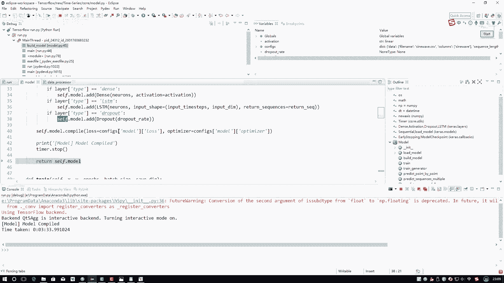

## 模型构建完成

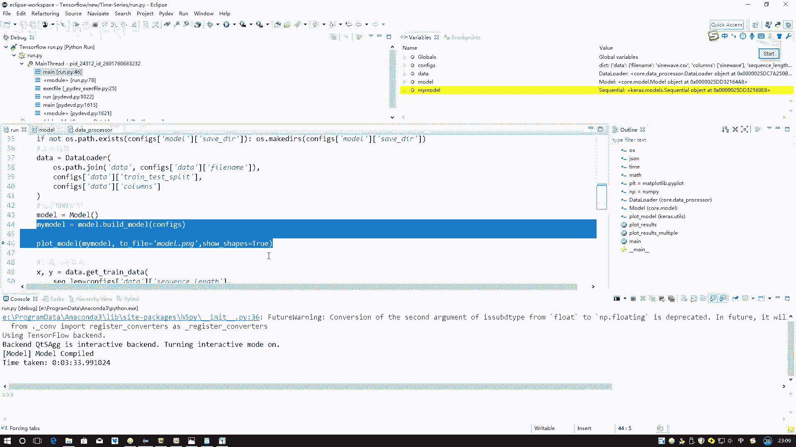

本节课中我们一起学习了构建LSTM模型的完整流程。我们首先读取并划分了数据，然后根据配置文件动态地构建了一个包含LSTM层、Dropout层和全连接层的序列模型，最后对模型进行了编译。

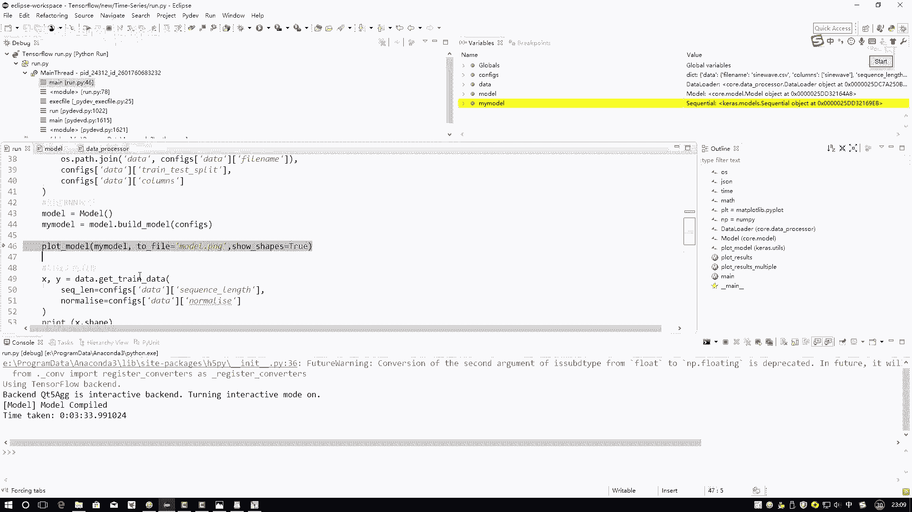

通过这种方式，我们可以通过修改外部的JSON配置文件来轻松调整模型结构，而无需修改核心代码，提高了代码的复用性和可维护性。模型现已准备就绪，下一步就可以使用训练数据对其进行训练了。