# 机器学习金融分析：P69：6-股票数据预测 📈

在本节课中，我们将学习如何将之前构建的LSTM网络模型应用于真实的股票数据预测任务。我们将重点探讨如何处理实际数据、定义模型输入输出，并比较使用单一特征与多个特征进行时间序列预测的效果。

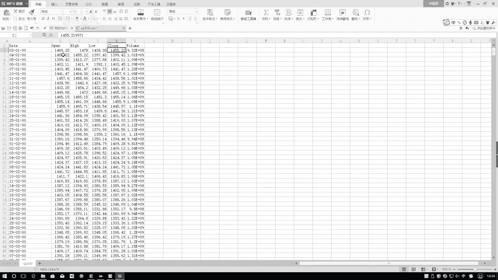

上一节我们介绍了基于正弦函数的时间序列预测模型，本节中我们来看看如何将同样的方法应用到更复杂、更无规律的股票数据上。

## 数据观察与挑战

首先，我们观察一下拿到的股票数据。这份数据包含以下几个指标：
*   开盘价
*   最高价
*   最低价
*   收盘价
*   交易数量

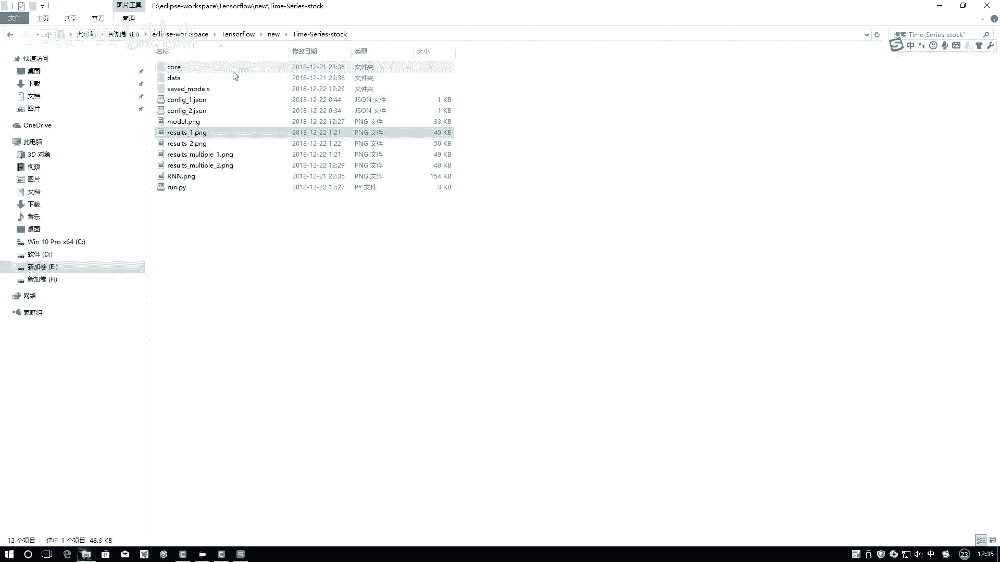

与之前正弦函数仅有一个数值不同，股票数据为我们提供了更丰富的特征条件。稍后我们将演示如何使用单一特征以及多个特征共同进行时间序列预测。

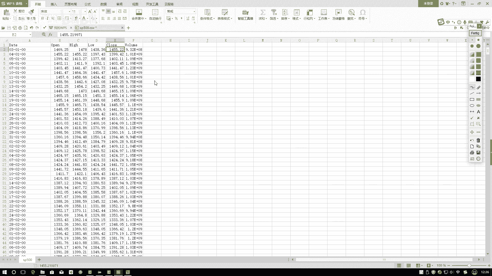

一个核心问题是：股票市场的走势真的能被预测吗？通过观察其走势图可以发现，股票数据不像正弦函数那样具有明显的周期性规律，其波动看起来更随机。这对于机器学习模型，尤其是进行长序列预测（例如基于当前50个点预测未来50个点）提出了挑战。

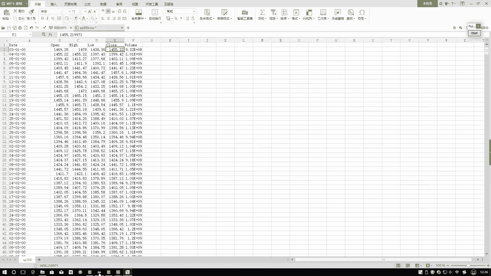

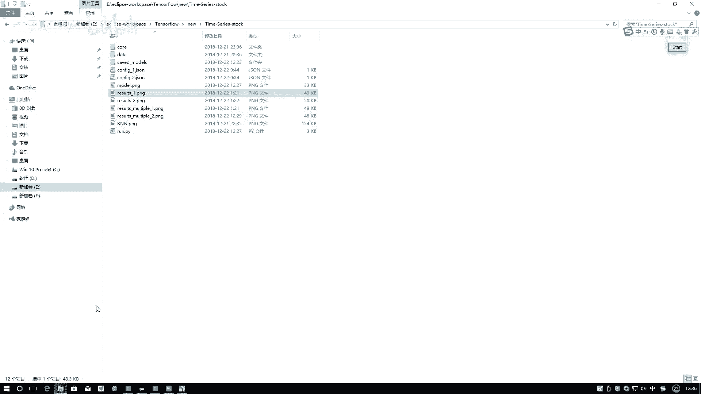

本节课的目的不仅是解决股市预测问题，更重要的是展示拿到实际数据后，如何定义模型、构建输入和输出。这是处理自己数据时的关键步骤。

## 数据预处理的重要性

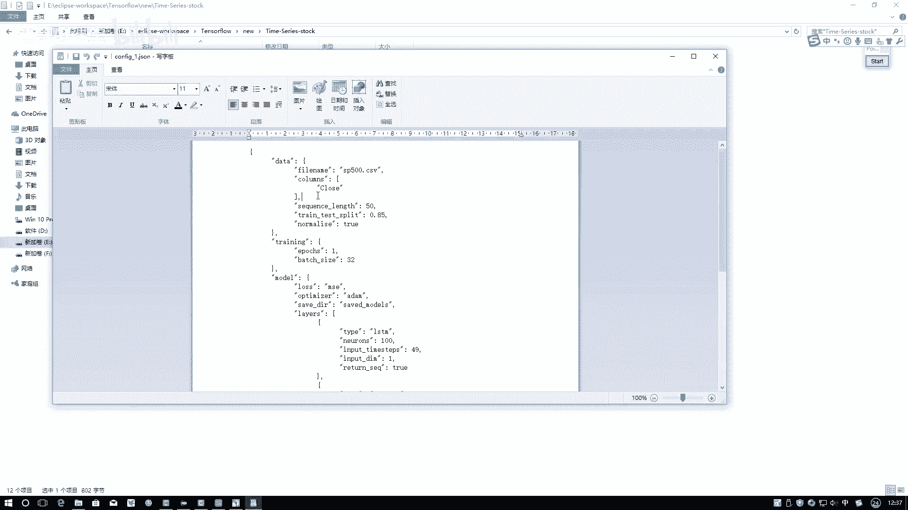

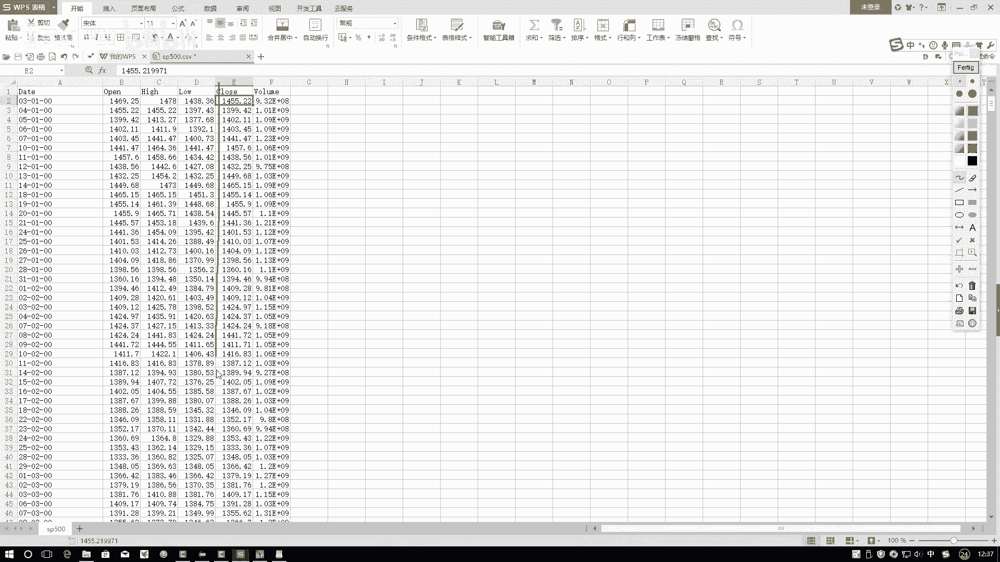

我们注意到，正弦函数的数据在一定范围内浮动，而股票数据的取值范围不固定，波动幅度时大时小。这就引出一个问题：我们是否需要以及如何进行数据预处理？

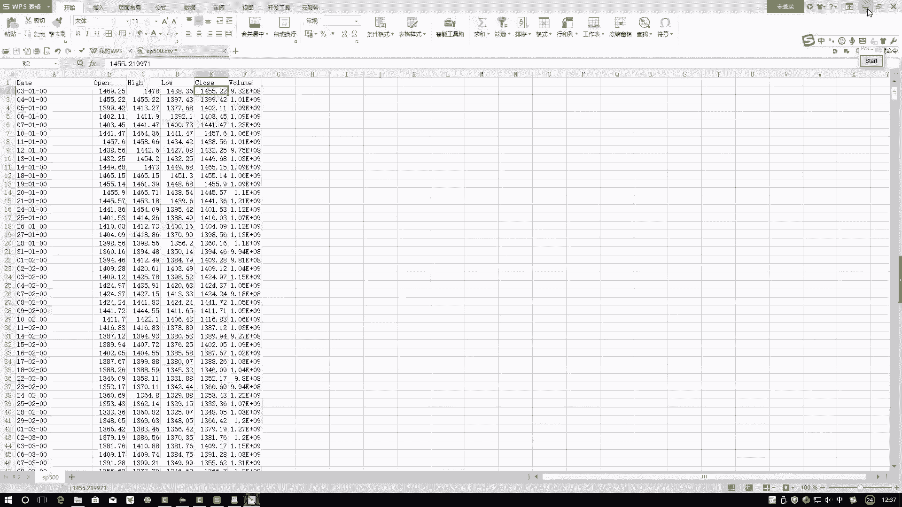

为了探究这一点，我们修改了配置文件，将数据源从正弦函数文件更换为实际的股票CSV文件。在`CONFIG1`中，我们仅选用“收盘价”这一列数据。

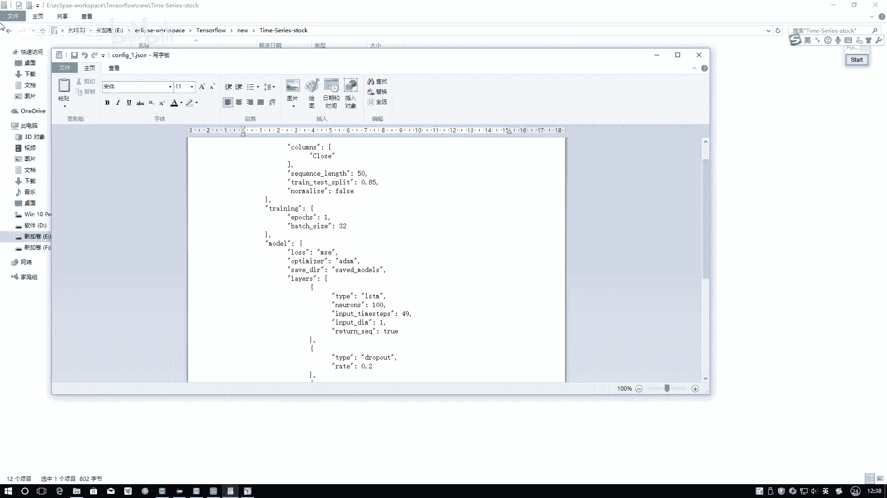

模型结构方面，我们在之前LSTM1和LSTM2的基础上增加了一层，变为LSTM1、LSTM2和LSTM3。同时，我们引入了一个关键配置项：归一化。首先，我们将其设置为`False`，即不使用归一化，直接使用原始数据运行模型。

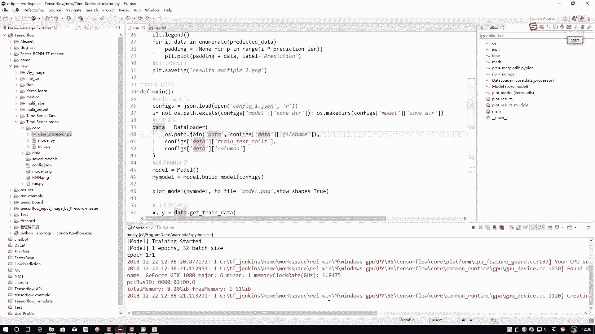

以下是核心配置代码示例：
```python
# config1.py 配置文件示例
data_file = ‘stock_data.csv‘  # 数据文件改为股票CSV
selected_columns = [‘close‘]  # 仅选择‘close‘（收盘价）这一列
normalize = False  # 初始设置为不进行归一化
```

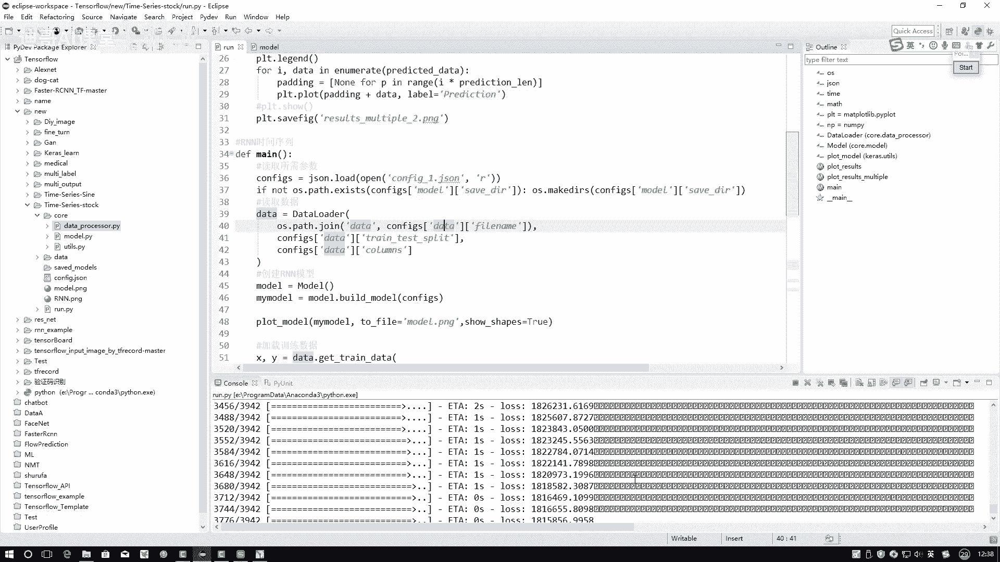

运行模型后，我们观察损失函数的变化。由于使用MSE（均方误差）作为损失函数，原始数据数值较大，导致损失值也特别大，且收敛速度较慢。在回归任务中，损失值的大小是相对的，数值大的数据自然会产生较大的损失值。

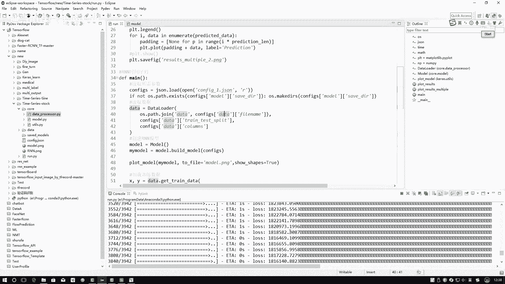

更重要的是预测结果：模型预测出的几乎是一条直线，与真实的股价波动（蓝色线）相差甚远。这表明模型未能从原始数据中学到有效模式。因为绝对数值的剧烈波动让模型难以捕捉趋势。

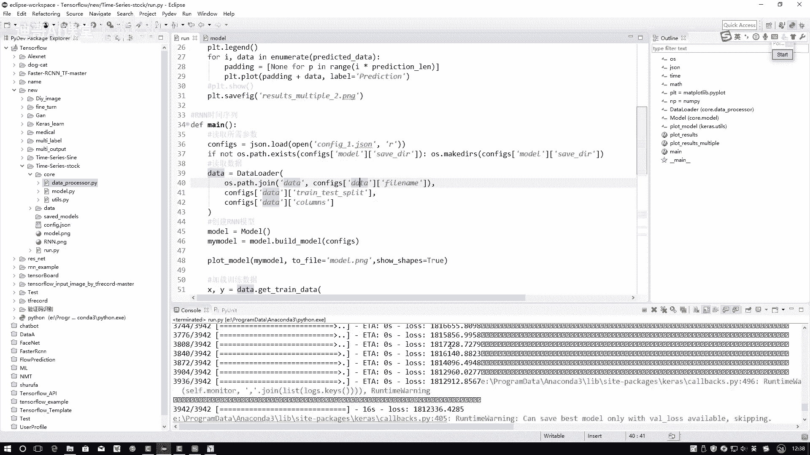

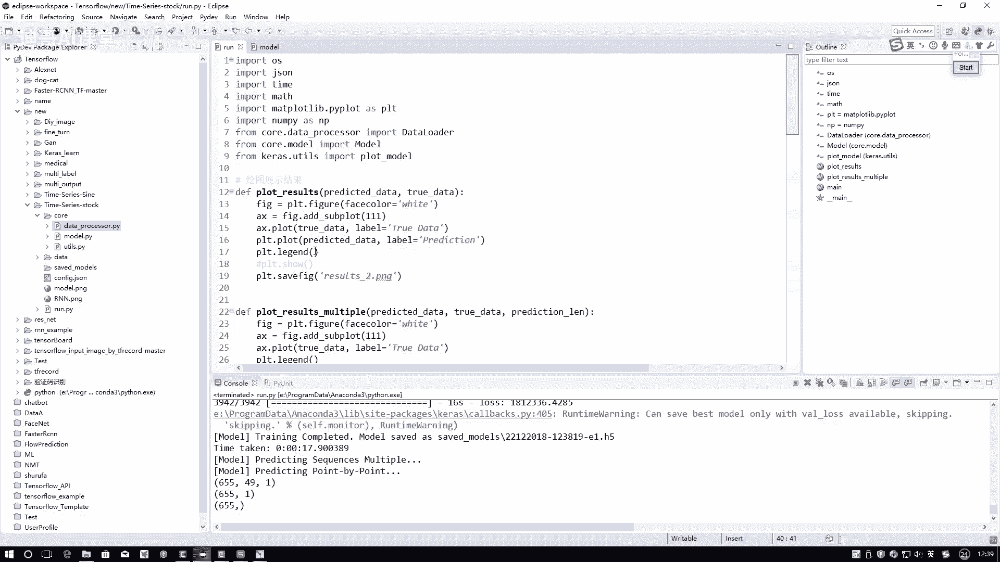

## 引入相对变化预处理

既然直接使用绝对数值效果不佳，我们需要对数据进行预处理，让模型学习相对的变化趋势，而非具体的绝对值。例如，我们更关心第二天相对于第一天涨了多少百分比，而不是具体的股价数字。

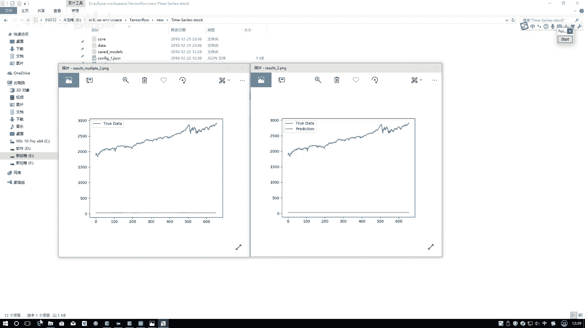

一种有效的方法是计算差值或比率。假设我们有一个长度为50的序列，我们可以让模型关注第二天相对于第一天的变化、第三天相对于第二天的变化，以此类推。这样，模型就能学习价格变动的趋势。

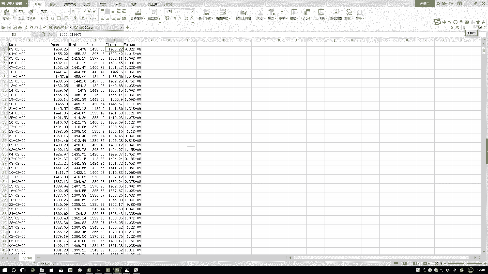

在配置文件中，我们将归一化选项改为`True`，并重新运行模型。预处理公式可以简单表示为：
**相对变化 = (当前值 - 前一个值) / 前一个值**
或使用归一化：
**归一化值 = (原始值 - 最小值) / (最大值 - 最小值)**

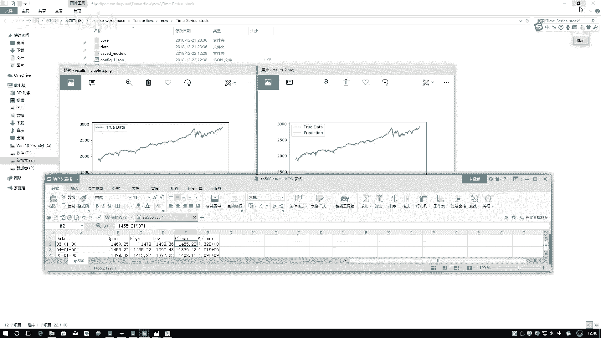

经过预处理后，模型输入的数值范围被规范到一个稳定的区间（如[0,1]或[-1,1]），这有助于LSTM网络更稳定、更快地学习数据中的时序依赖关系，从而有望得到更好的预测曲线。

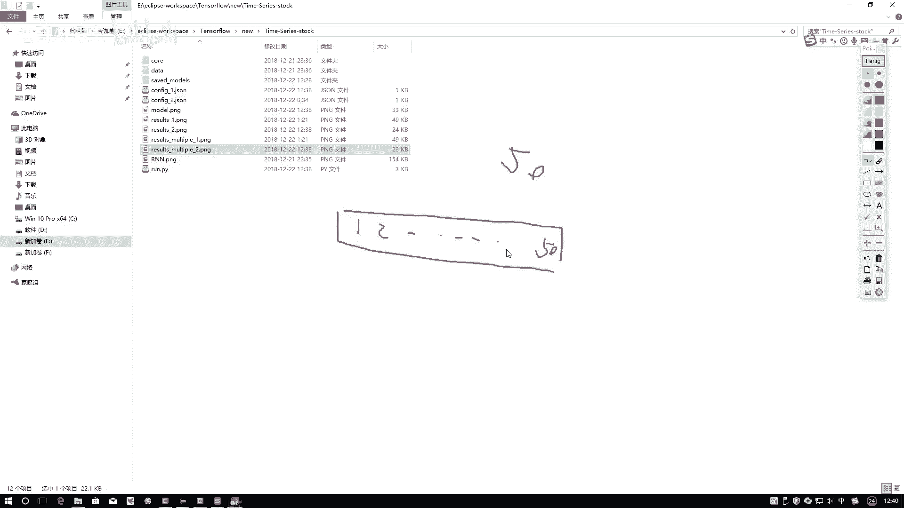

本节课中我们一起学习了将LSTM模型应用于股票数据预测的完整流程。我们认识到，对于实际中波动大、规律性弱的时间序列数据，直接使用原始值训练模型效果很差。关键在于进行合适的数据预处理（如归一化或计算相对变化），将绝对数值转换为相对趋势，这样才能帮助模型捕捉到数据中潜在的时序模式。这是处理金融、销量等实际时序数据时至关重要的一步。