# 金融量化交易实战：P71：8-预测结果展示 📊

在本节课中，我们将学习如何展示和评估LSTM模型在金融时间序列预测任务中的结果。我们将对比两种不同的预测模式（单点预测与序列预测）以及不同输入特征（单指标与双指标）对预测效果的影响。

## 单点预测结果分析

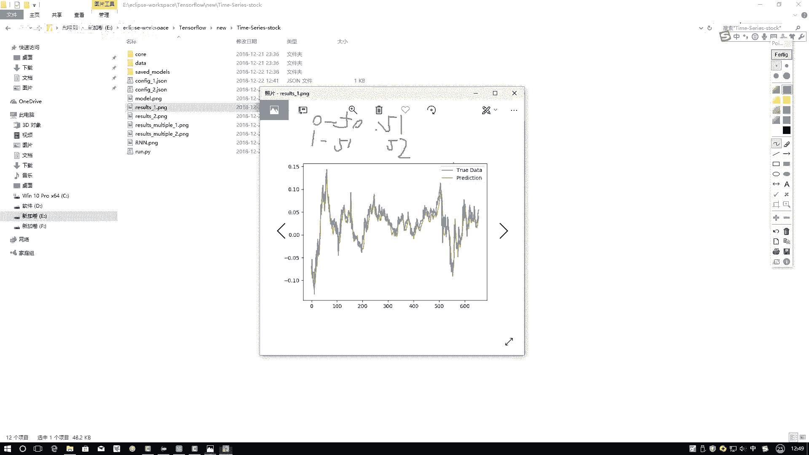

上一节我们介绍了LSTM模型的基本构建，本节中我们来看看模型在单点预测任务上的表现。单点预测是指使用过去一段时间（例如0-50个时间点）的数据，来预测下一个时间点（第51个点）的值。

以下是单点预测（`result1`）的可视化结果：


*   **蓝色曲线**代表真实的股价数据。
*   **黄色曲线**代表模型预测的股价数据。

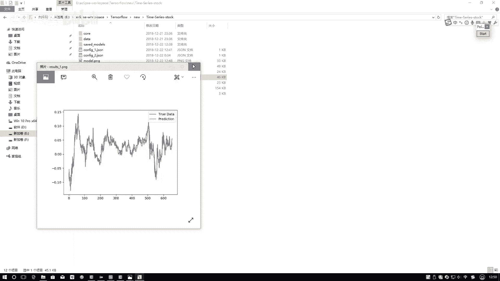

从图中可以看出，模型在单点预测任务上表现尚可，预测曲线与真实曲线的整体趋势大致吻合。这说明使用LSTM预测下一个时间点的值是相对容易的任务。

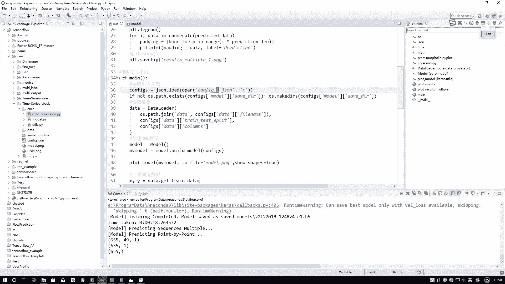

## 序列预测的挑战

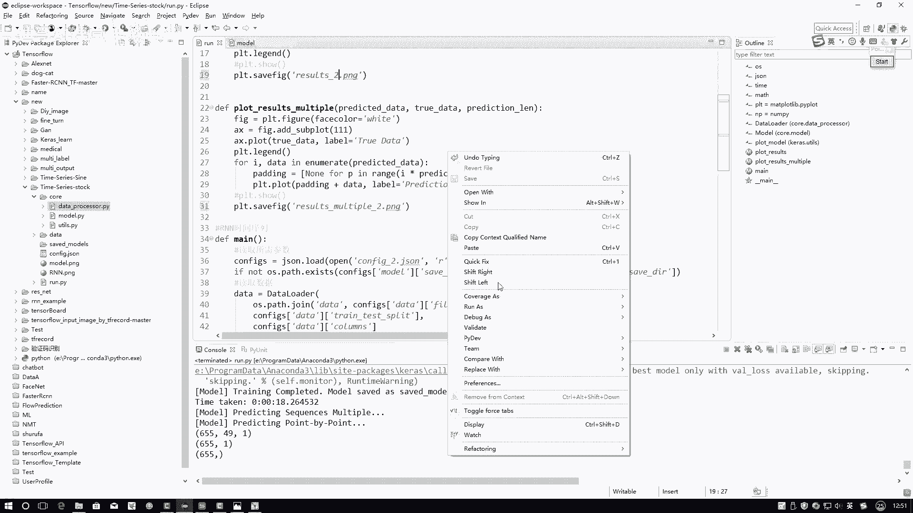

然而，当我们尝试进行序列预测时，难度会显著增加。序列预测是指使用0-50个时间点的数据，直接预测未来51到100这整个时间序列的结果。

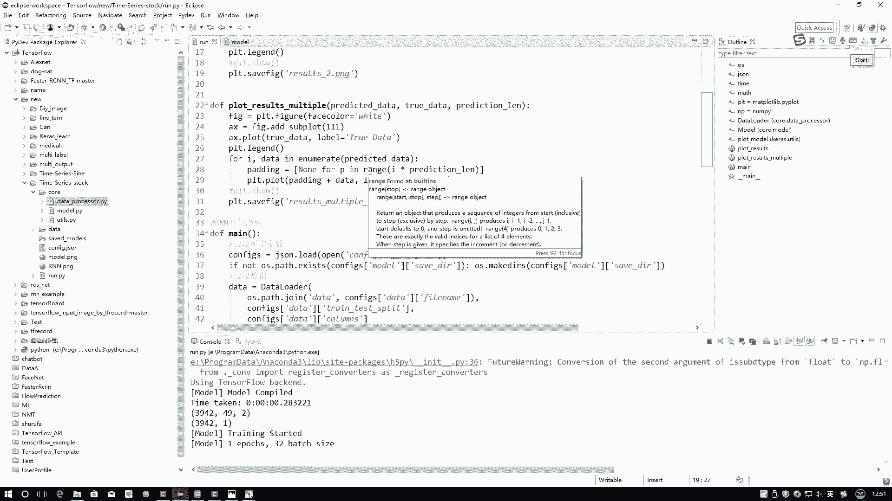

以下是序列预测的可视化结果：

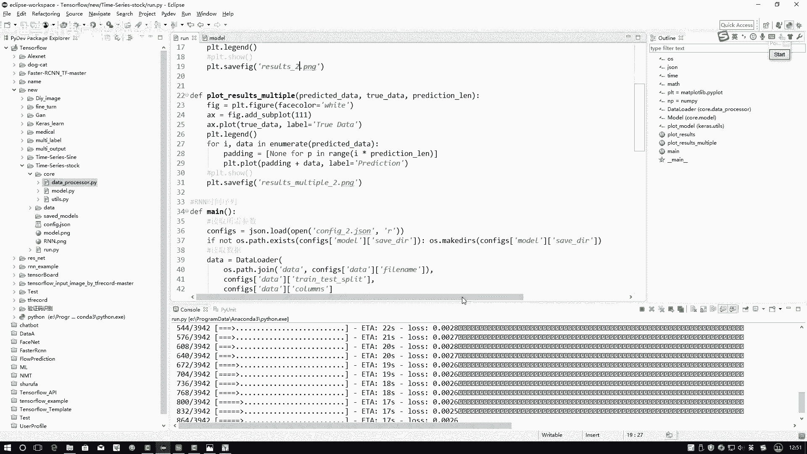


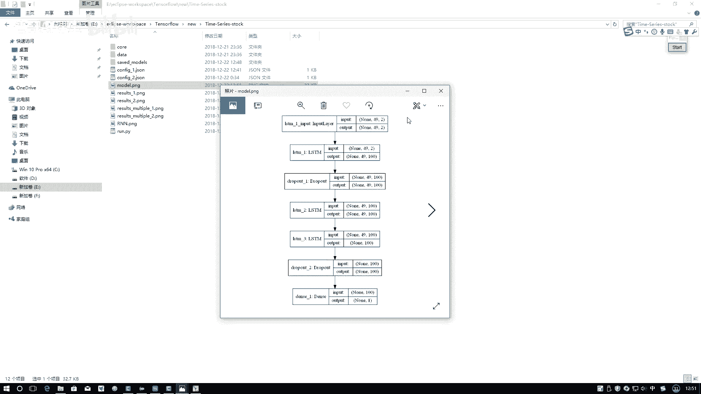

观察此图可以发现：
*   模型预测的整体趋势（黄色曲线）与真实情况（蓝色曲线）存在偏差。
*   在某些区域，真实趋势在上升，但模型预测却在下降，出现了方向性错误。

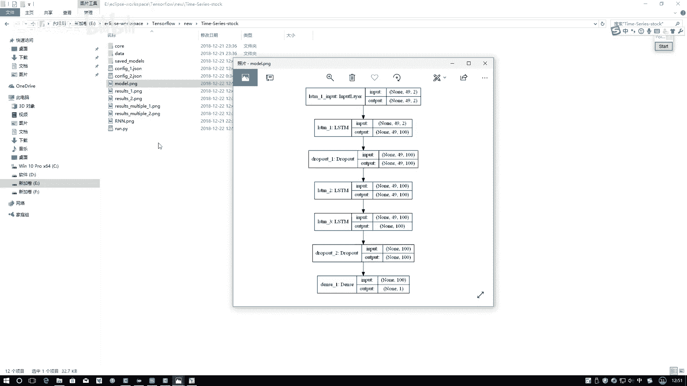

这表明，使用LSTM预测未来一段连续的序列，其难度远大于预测单个点。模型在长期依赖和误差累积方面面临挑战。

## 多特征输入模型构建

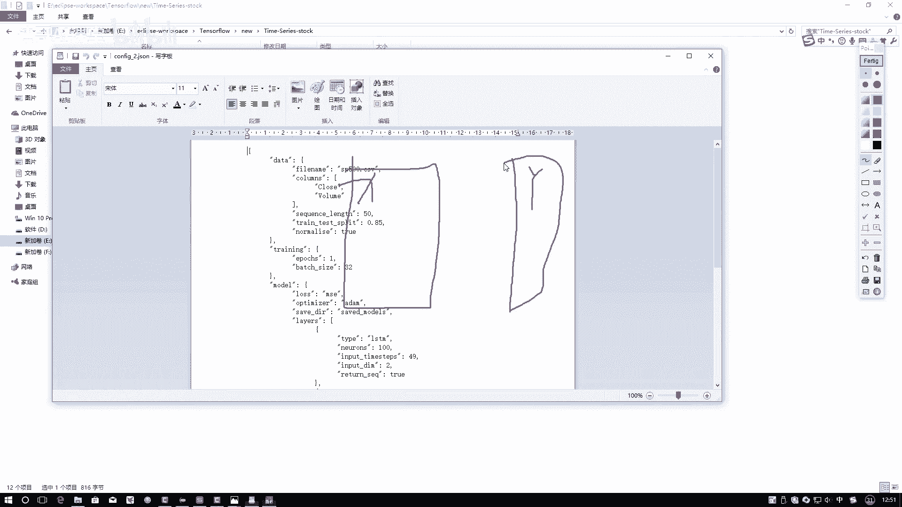

接下来，我们探讨引入更多特征是否能够提升预测效果。我们将模型的输入从单一的“收盘价”改为“收盘价”和“交易量”两个指标。

在代码中，这需要将数据配置从 `json1` 改为 `json2`：

```python
# 修改配置，使用两个特征列
config = ‘json2’
```

同时，在绘图时也需要相应地将标签改为 `result2` 以便区分。运行修改后的代码，系统会生成并保存新的模型结构图 `model.png`。

以下是新的模型结构示意图：

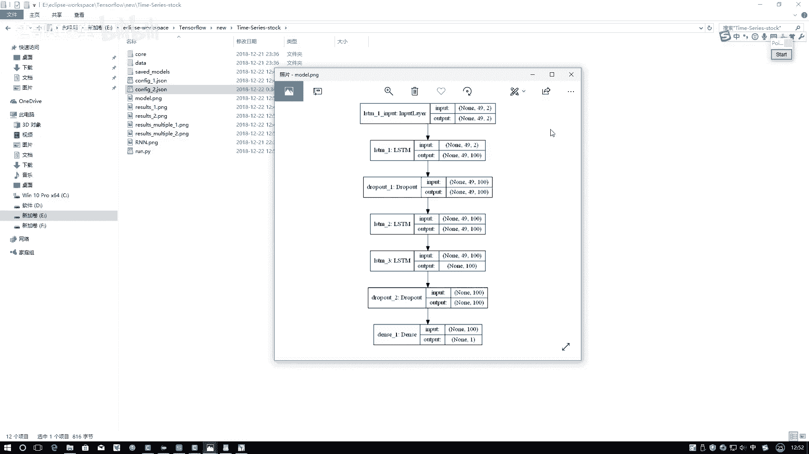


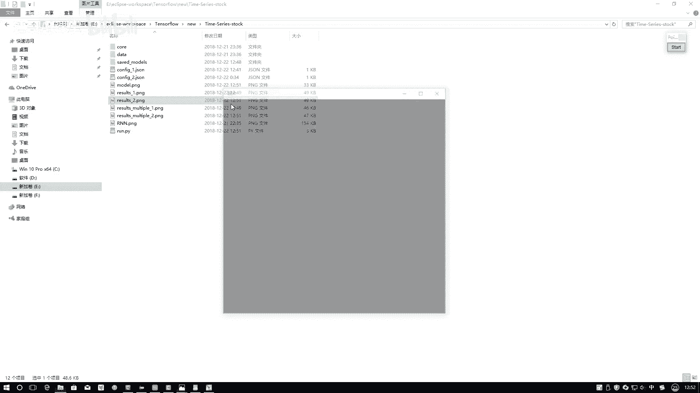

与单特征模型的关键区别在于输入层：
*   **单特征模型输入**：`(49, 1)`，表示49个时间步，每个时间步1个值（收盘价）。
*   **双特征模型输入**：`(49, 2)`，表示49个时间步，每个时间步2个值（收盘价和交易量）。

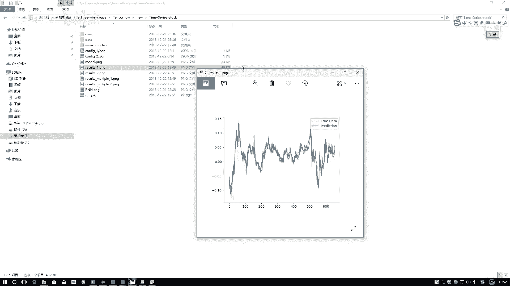

虽然输入维度变了，但模型的输出目标不变，仍然是预测下一个时间点的**收盘价**。网络结构中间层（如LSTM层）的维度会相应调整，最终通过全连接层输出一个预测值。

## 多特征预测结果对比

增加特征并不总是意味着更好的预测效果。我们需要通过实际结果来验证。

以下是单特征(`result1`)与双特征(`result2`)在单点预测任务上的结果对比：


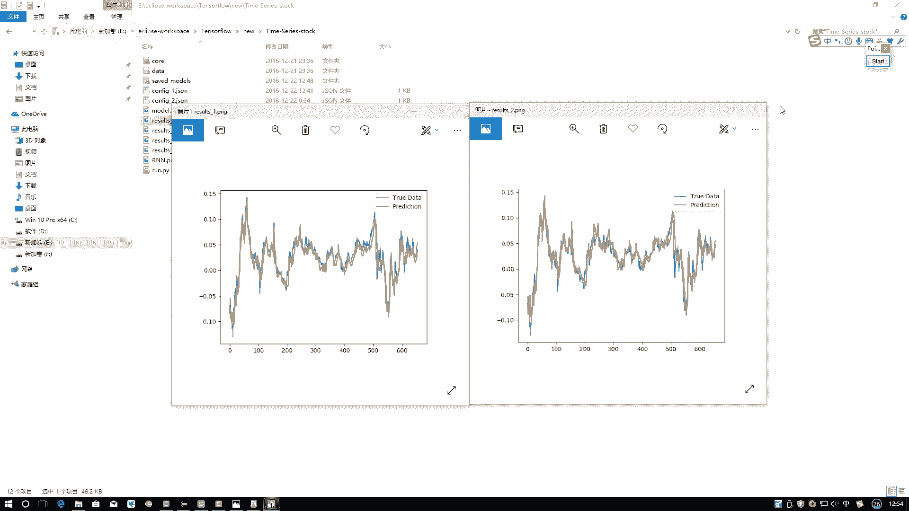

对比分析如下：
*   在某些区域（如图中左侧尖峰处），`result2`（双特征）的拟合效果似乎更好，预测曲线更贴近真实曲线。
*   在另一些区域（如图中右侧部分），`result1`（单特征）的表现反而更稳定，而`result2`出现了较大的预测缺口。

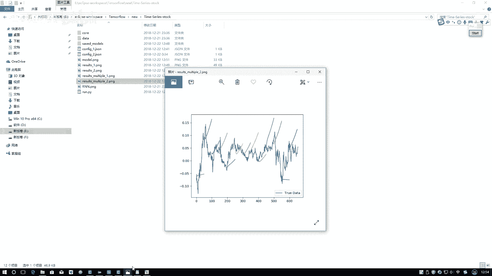

因此，增加“交易量”特征并没有带来一致的、显著的性能提升，效果好坏需要根据具体区间进行评估。

## 序列预测结果的显著差异

当我们对比两种特征在序列预测任务上的结果时，差异变得更为明显。

以下是序列预测的对比结果：

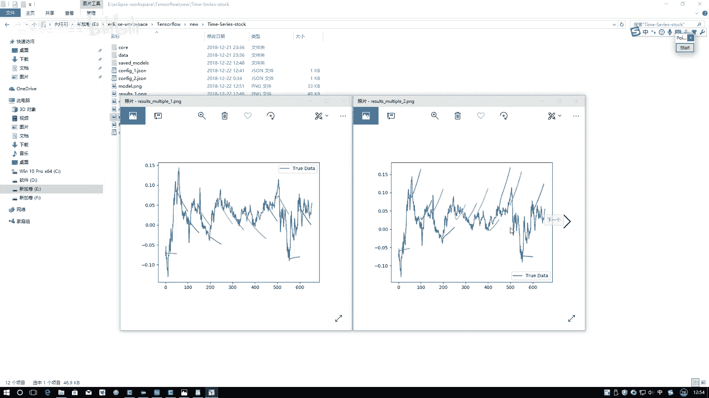


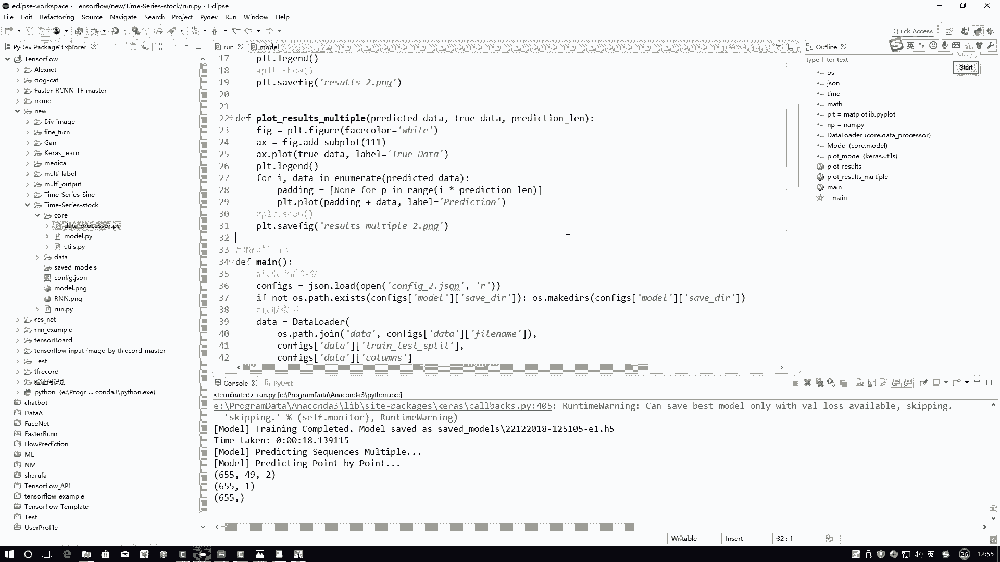

观察可以发现：
*   `result1`（单特征）预测出了一个下降的趋势。
*   `result2`（双特征）则预测出了一个上升的趋势。
*   在右半部分，真实趋势可能是下降的，因此`result2`的预测方向出现了错误。

这个对比强烈地说明，在复杂的序列预测任务中，特征工程的选择对结果有着至关重要的影响，甚至可能改变预测的整体方向。

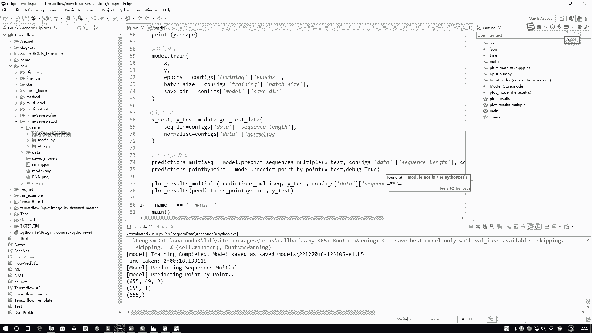

## 核心总结与展望

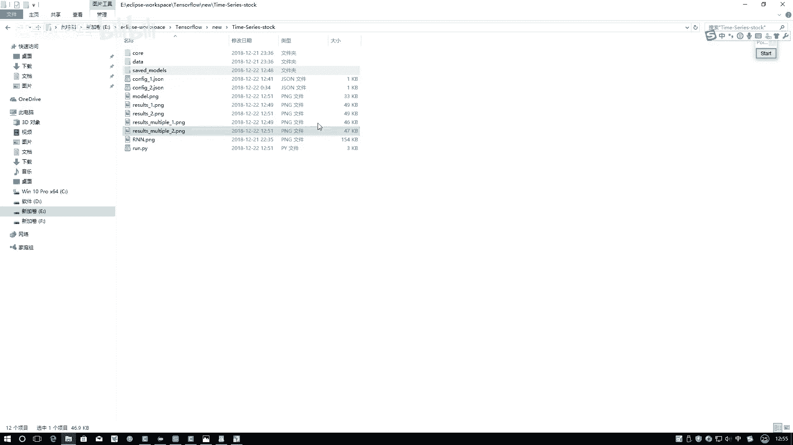

本节课中我们一起学习了LSTM模型在金融时间序列预测中的结果展示与评估。

我们掌握了以下关键点：
1.  **预测模式对比**：**单点预测**相对简单直接，而**序列预测**因误差累积而更具挑战性。
2.  **特征工程影响**：增加输入特征（如加入交易量）不一定总能提升模型性能，需要根据实际数据情况进行谨慎选择和验证。
3.  **评估重要性**：必须通过可视化结果仔细对比评估，不能仅凭单一指标或感觉判断模型优劣。

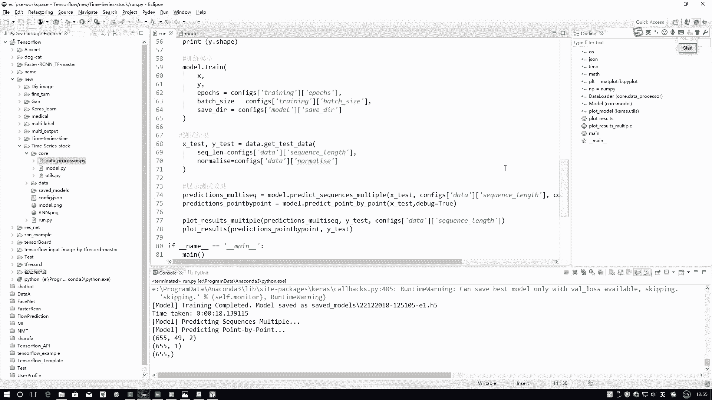

最终，时间序列预测的成效很大程度上取决于 **数据预处理** 和 **特征构建** 的质量。在实际应用中，你需要反复尝试不同的特征组合、窗口大小和模型参数，并通过严谨的评估来找到最适合你数据的解决方案。