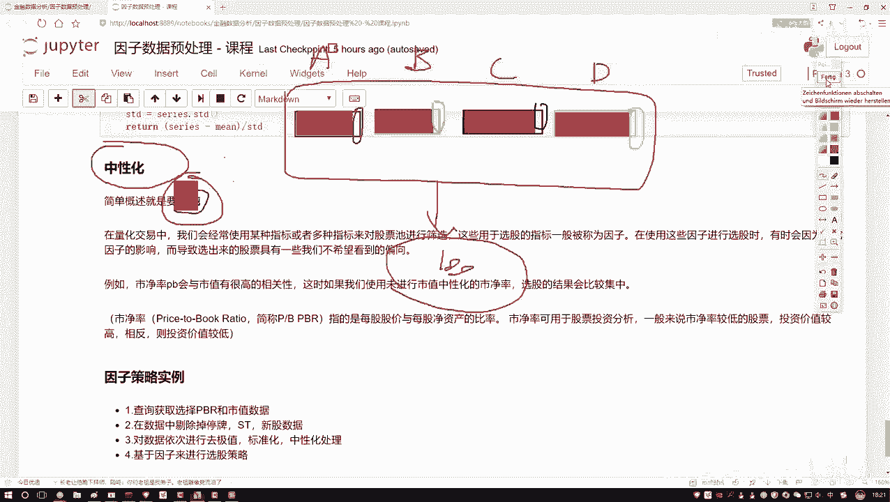
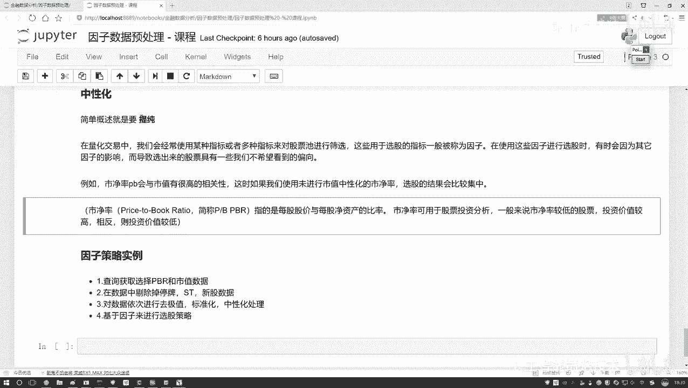

# Python金融量化+股票交易：P33：中性化处理方法通俗解释

在本节课中，我们将要学习量化交易中一个重要的数据处理概念——**中性化**。我们将通过一个简单的例子来理解它的目的和意义，并了解其核心的计算方法。

## 概述：什么是中性化？

上一节我们介绍了因子分析的基本概念，本节中我们来看看如何“提纯”因子。中性化的核心目的就是**提纯**。它旨在从原始因子中，剥离掉与其他常见因素（如市值）高度相关的部分，从而提取出该因子独特且真正有价值的信息。

## 一个直观的例子

为了理解“提纯”的含义，我们先来看一个例子。

假设我们设计了一个选股策略，其中使用了四个不同的因子（A、B、C、D）来筛选股票。理论上，这四个因子应该从不同角度反映股票的特性。

然而，在实际操作中，你可能会发现一个现象：无论你如何调整这四个因子的权重或组合方式，最终选出的股票池总是高度相似，甚至总是那几只股票。

为什么会这样？

原因可能在于，这四个看似不同的因子，其内部绝大部分的“成分”其实是相同的。例如：
*   因子A（比如市净率）的数值在很大程度上受到股票**市值**的影响。
*   因子B、C、D虽然代表不同的指标，但它们的数值也显著地与**市值**相关。

这样一来，无论你使用哪个因子，最终起决定性作用的可能都是“市值”这个共同因素。这导致选股结果缺乏多样性，也无法真正体现每个因子自身的预测能力。

所谓“中性化”，就是要解决这个问题。它就像是从一杯混合果汁中，分离出纯正的橙汁成分。对于因子A，我们要剔除掉其中与市值相关的部分，只保留剩下的、独特的“纯”信息。对因子B、C、D也进行同样的操作。这个过程就是**提纯**，也就是**中性化**。

## 量化交易中的中性化

在量化交易中，我们经常使用多个指标（因子）对股票池进行筛选，以决定买入或卖出哪些股票。

在使用因子选股的过程中，有时会因为因子受到其他共同因素的影响（例如上文提到的市值），导致选出的股票具有我们不希望看到的倾向性，即选股结果过于集中，无法分散风险或捕捉多样化的收益机会。

例如，市净率（PB）因子就与市值有很高的相关性。如果不进行中性化处理，直接使用市净率选股，结果可能会严重偏向某一特定市值范围的股票。

**关于市净率（PB）**：
市净率的计算公式为：
`市净率(PB) = 每股股价 / 每股净资产`
其中，每股净资产 = （公司总资产 - 公司总负债）/ 总股数，它代表了每股股票所代表的公司净价值。

在投资中，通常认为较低的市净率可能意味着股票被低估，其未来上涨的潜力空间相对更大，投资风险可能更低。

## 核心计算方法

上一节我们通过例子理解了中性化的目的，本节中我们来看看其数学本质。中性化处理通常通过回归分析来实现。

核心思想是：将需要处理的因子（如市净率）作为因变量（Y），将需要剥离的共同因素（如市值）作为自变量（X），建立回归模型：
`因子 = α + β * 市值 + ε`
其中：
*   `α` 是截距项。
*   `β` 是市值对因子的影响系数。
*   `ε` 是回归残差，它代表了因子中无法被市值解释的部分，即我们想要的“提纯”后的中性化因子。

计算步骤如下：

以下是实现中性化的关键步骤：

1.  **数据准备**：获取所有股票在特定时间点的因子值（如市净率）和需要中性化的变量值（如市值）。
2.  **截面回归**：在每一个时间截面上（例如每一天），对所有股票进行上述回归分析。
3.  **提取残差**：对每只股票，计算其回归残差 `ε`。
    `ε = 因子实际值 - (α + β * 市值)`
4.  **得到中性化因子**：这些残差 `ε` 的序列，就是剔除了市值影响后的、中性化的新因子。它的均值为0，与市值的相关性理论上也为0。

## 后续操作说明

由于在本地Notebook环境中通常难以直接获取到全市场的股票因子数据（如市净率、市值），因此具体的代码实现将在量化交易平台中演示。在平台中，我们可以通过API调取所需数据，并应用上述回归方法完成中性化处理。

## 总结

本节课中我们一起学习了**因子中性化**的处理方法。
*   我们首先明白了中性化的目的是**提纯**，即剥离因子中与常见风险因素（如市值）相关的部分。
*   然后通过一个生动的例子，理解了为什么需要进行中性化——为了避免选股因子失效和结果趋同。
*   最后，我们掌握了中性化的核心计算方法，即通过**截面回归**提取**残差**来获得纯净的因子值。

掌握中性化技术，能帮助我们构建更有效、更纯粹的选股因子，从而提升量化策略的稳定性和多样性。