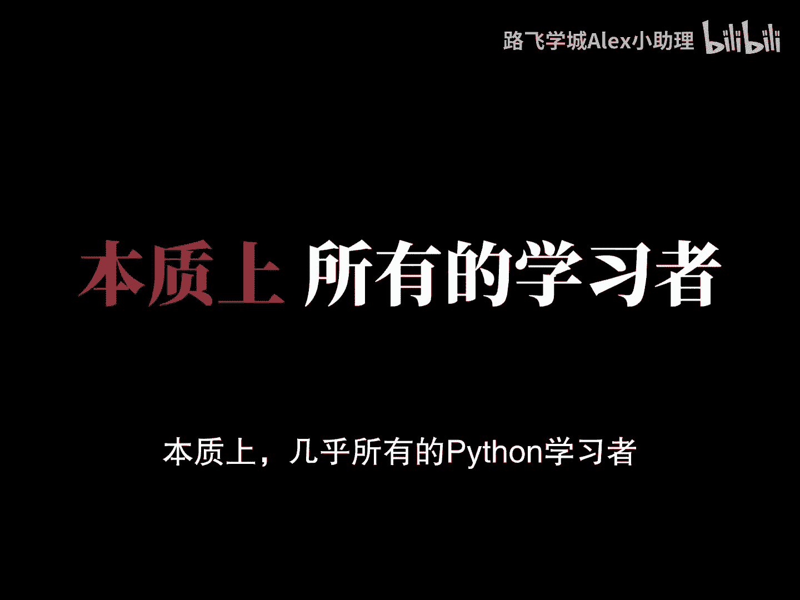
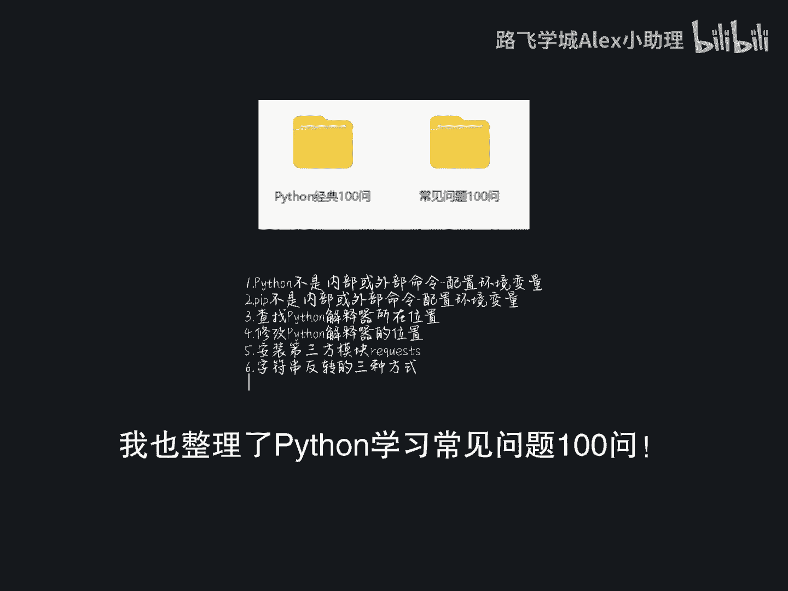
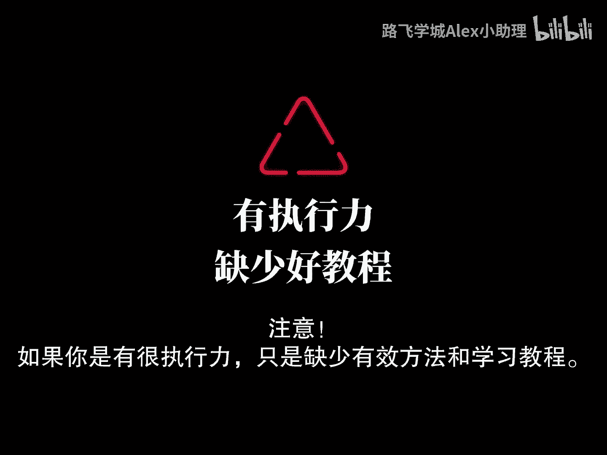
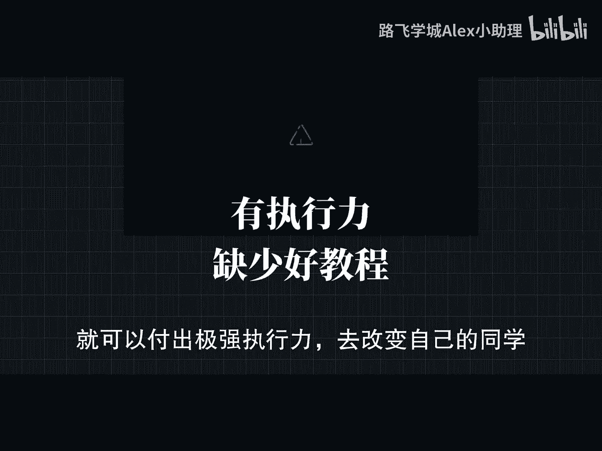

# Python金融分析与量化交易：0：课前先导 🎬

在本节课中，我们将了解学习Python编程时常见的误区，并探讨如何通过科学的方法和路径，高效地掌握Python，尤其是在金融分析与量化交易领域的应用。

很多人认为学习Python需要激情或天赋。实际上，学习Python本身并不复杂。是外界环境将学习过程过度复杂化了。掌握Python的关键在于趣味性的引导和有效的记忆方法。

本质上，学好Python不依赖天赋，而依靠**记忆力**。通过**高频次的重复**和**实战案例练习**，可以强化理解与掌握。许多人完全有能力达到自己未曾设想的编程水平。

请思考，为什么很多人学不好Python？

Python作为一种广泛使用的编程语言，应用范围非常广。从简单的脚本编写，到复杂的数据分析、机器学习、Web开发、自动化运维以及游戏开发等领域。表面上，Python需要学习的内容确实很多。

然而，这并不意味着你需要一次性学完所有内容。但几乎所有人都有一个通病：学习没有规划。今天学点这个，明天学点那个，一段时间后发现似乎什么都没掌握，进而归咎于自己没有天赋或努力没有回报。这实际上是无效努力。

为什么大多数人学不好Python？可以概括为两点：
1.  极为不科学的学习路径。
2.  极为低下的学习方法。

低效的课堂、冗长空洞的讲解，以及网络上“十分钟速成”类的误导信息，都阻碍了有效的学习。能看到这里的同学，说明你具备耐心，是真心想学好Python的。

本质上，几乎所有Python学习者在整个学习阶段踩的坑都具有极强的共性，但这些问题往往无人帮忙解决。

很多人完全有能力达到更高的编程水平，只是低效的学习方法和错误的学习路径限制了自己的上限。

本套课程源自VIP内部Python全栈高级架构师课程，是首次发布的、面向零基础或基础薄弱同学的最新Python教程，全程干货细讲。

此时可能有人会说，这又是一个卖课广告。可以很明确地说，这个视频确实是广告。但即便如此，这个视频也能帮助许多人进行预习。

请注意：
*   如果你具备执行力，只是缺少有效的方法和学习路径，那么在获得明确指导后，你就能付出强大执行力来改变自己。这套视频可以为你提供帮助。
*   如果你只想看励志视频自我感动，指望看一套课程就能逆天改命，执行上却“三天打鱼，两天晒网”，那么这套课程帮不了你。

网络上充斥着大量零散的编程教程，缺乏完整体系。看得越多，可能越感到迷茫和痛苦，甚至想要放弃。时间消耗了，却没有获得应有的收获。

编程小白如果不打好基础，盲目挑战高难度项目，急于求成，编程之路将会走得无比艰难。

在当今这个互联网与人工智能快速发展的时代，掌握一门能居家接单的技术非常有价值。为了让零基础的小伙伴学起来没有负担，相关的学习思维导图已经准备好。

此外，视频中用到的软件安装包、激活码、各种项目源码、练习手册、课件等资料，也可通过评论留言免费获取。

接下来，我们将从P2开始这套系统课程的学习。

本节课中，我们一起探讨了Python学习的常见误区，强调了科学学习路径和方法的重要性，并为你开启了系统学习Python金融分析与量化交易的大门。