# Python金融分析与量化交易：P12：数据分析秘笈介绍 📊

在本节课中，我们将要学习数据分析的基本概念、作用、学习原因以及实现流程，并对整个课程内容进行概述。

## 什么是数据分析？🤔

上一节我们介绍了课程背景，本节中我们来看看数据分析的核心定义。

数据分析是指从看似杂乱无章且量级庞大的数据中，提炼出有价值的信息，并总结出这些数据内部规律的过程。

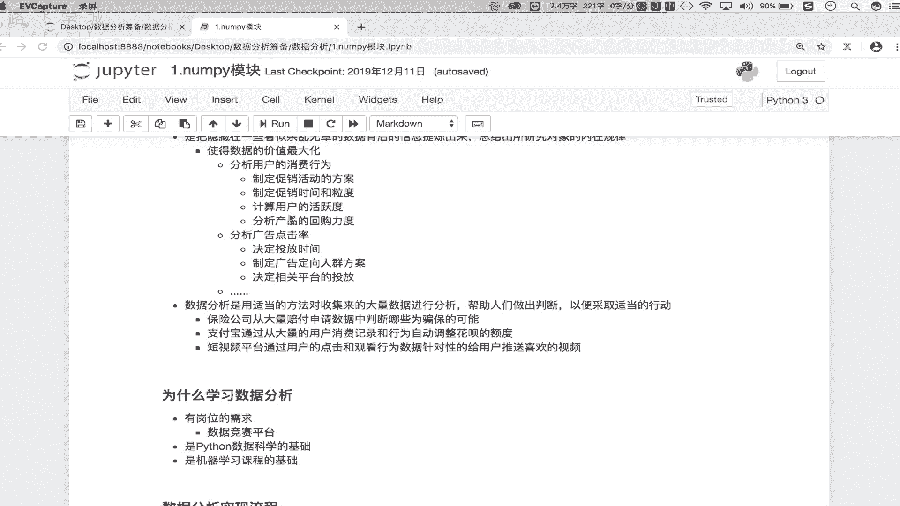

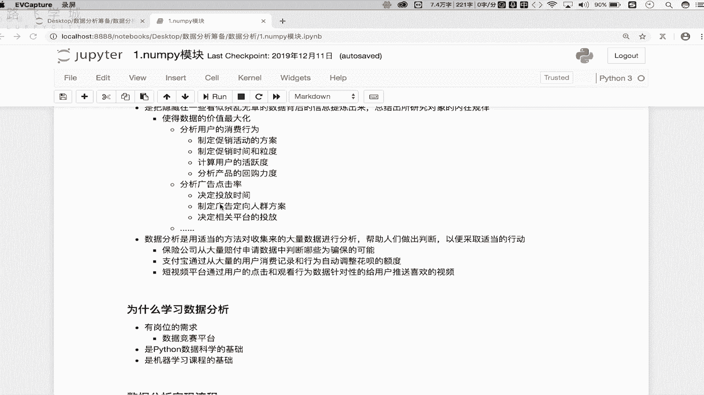

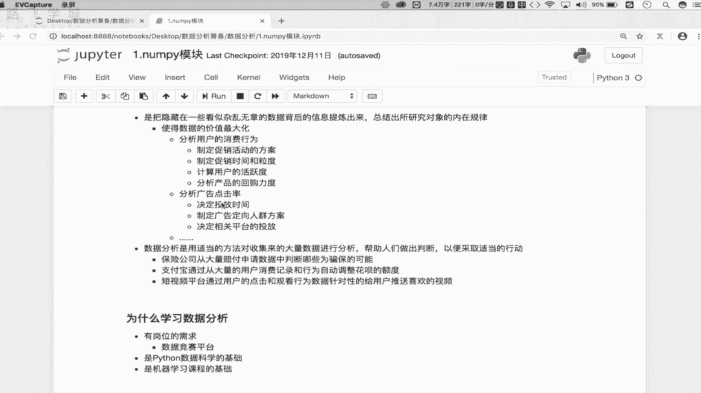

**核心公式**可以概括为：
`原始数据` + `分析方法` -> `有价值的信息/内部规律`

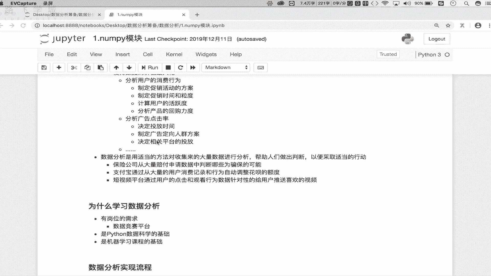

## 数据分析的作用与价值 💎

理解了数据分析的定义后，我们来看看它最重要的作用：**实现数据价值的最大化**。这主要体现在提升综合收入和利润上。

以下是数据分析价值最大化的几个具体应用场景：

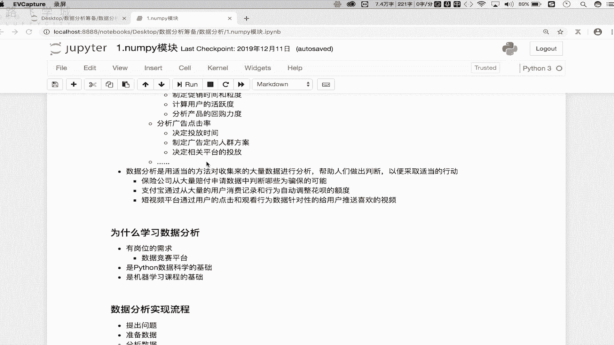

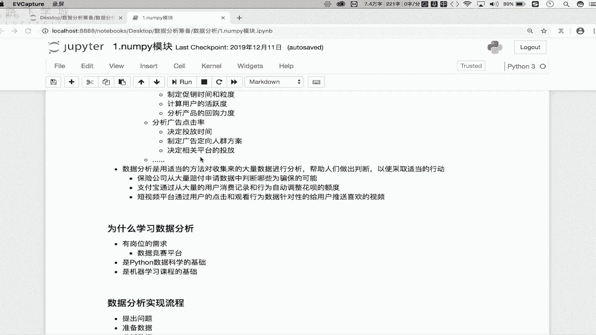

*   **分析用户消费行为**：商家可以基于历史消费记录，分析用户偏好、回购能力等，从而制定更有效的促销活动方案、确定促销时间和力度。
*   **优化广告投放策略**：广告商可以分析用户观看、点击广告的历史行为数据，从而决定广告内容、投放平台（如爱奇艺、腾讯）、投放时长，以更精准地触达目标人群。
*   **识别金融风险**：保险公司可以从大量赔付申请数据中，分析并识别潜在的骗保行为。
*   **制定信用额度**：如支付宝花呗，通过分析用户的历史消费记录和行为数据，为不同用户设定差异化的信用额度。
*   **实现精准推荐**：短视频平台通过分析用户的观看行为数据，了解用户喜好，为用户进行精准画像，从而实现个性化的视频和广告推送。

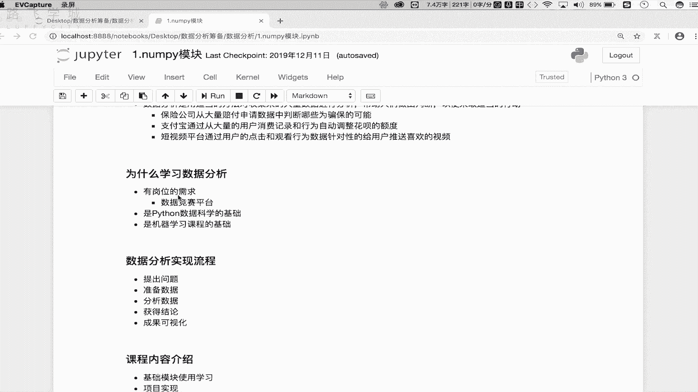

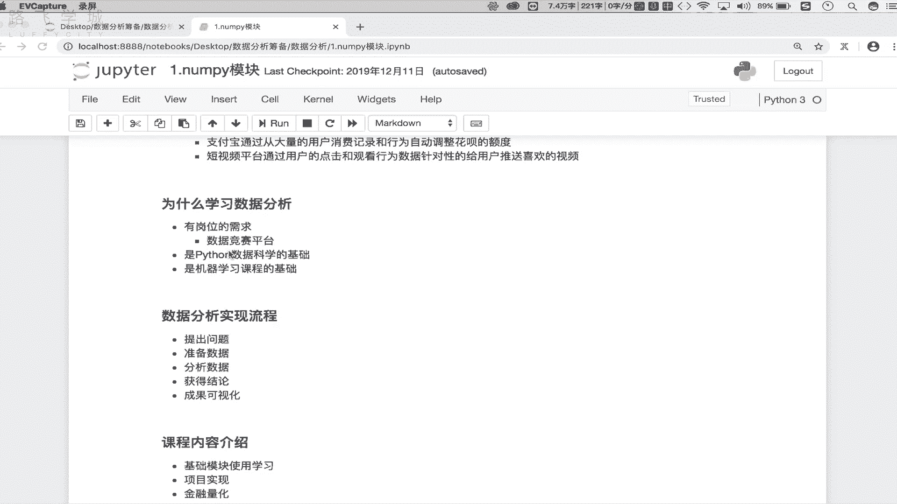

从这些例子可以看出，数据分析能帮助人们做出更精准的判断并采取合适行动，最终保障利润最大化。

## 为什么学习数据分析？🎯

了解了数据分析的强大作用后，你可能会问：我们为什么要学习它？主要有以下三个原因：

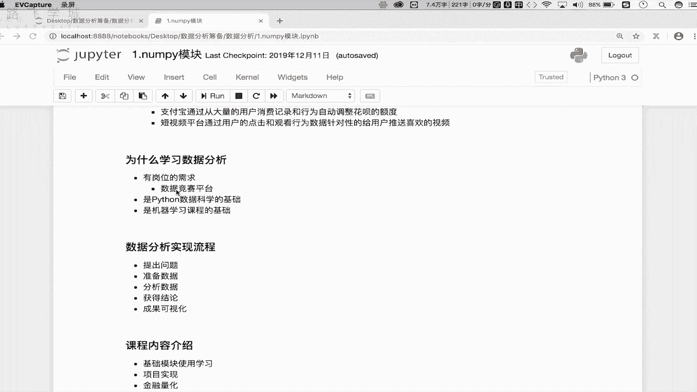

1.  **岗位需求广泛**：数据分析岗位在招聘平台（如Boss直聘）上需求量很大。与移动端或网站开发等主要集中于互联网行业的岗位不同，数据分析适用于所有产生数据的行业，包括传统制造业和新兴互联网行业，帮助企业利用数据做出正确决策、提升价值。
2.  **Python数据科学的基础**：Python在数据分析、机器学习领域优势显著。其数据分析框架集成了大量用于数学和科学计算的模块，为进行各种复杂的数据分析提供了坚实基础。
3.  **机器学习课程的基石**：对于未来想转向机器学习领域的同学来说，扎实的数据分析能力是必不可少的前提。打好数据分析的基础，能为学习机器学习做好充分铺垫。

## 数据分析的基本流程 🔄

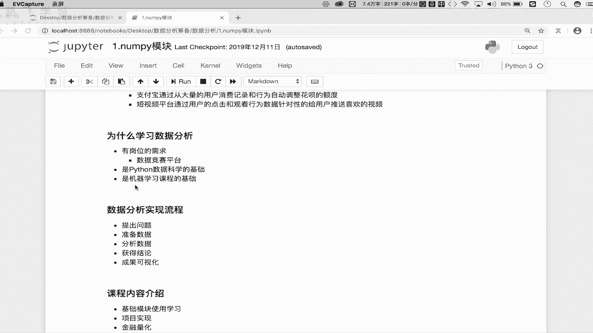

明确了学习动机，接下来我们看看进行数据分析通常遵循的五步基本流程：

1.  **提出问题**：明确需要分析解决的具体问题。
2.  **准备数据**：通过内部获取、购买或使用爬虫技术采集与分析问题相关的数据。
3.  **分析数据**：运用数据分析相关的模块和技能，对准备好的数据进行处理和分析。
4.  **获得结论**：从分析结果中提炼出有价值的结论和信息。
5.  **成果可视化**：使用图表（如散点图、直方图、折线图）将分析结论直观地展示出来。

## 本课程内容架构 📚

最后，我们来了解一下整个课程的内容架构。课程主要分为三大部分：

*   **第一部分：基础模块学习**：系统讲解数据分析相关核心模块（如Pandas, NumPy）的使用，包括模块导入、工具类、方法及属性。这是后续学习的基础。
*   **第二部分：企业实战项目**：将所学基础模块应用到真实的企业需求项目中。通过完整的项目实战（从需求制定、数据分析到结论呈现），巩固基础知识，并让大家了解企业内数据分析工作的实际流程。
*   **第三部分：金融量化入门**：介绍数据分析在金融量化领域的重要应用。课程将讲解如何结合数据分析技能制定股票交易策略（例如双均线策略、小市值策略），帮助对金融感兴趣的同学了解该方向。

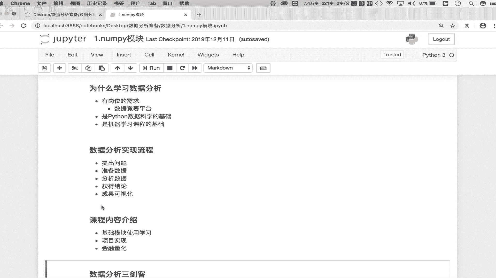

本节课中我们一起学习了数据分析的核心概念、巨大价值、学习必要性、标准工作流程以及本课程的整体规划。从下一小节开始，我们将正式进入具体内容的学习。