# Python金融分析+量化交易：P3：02 捕获股票上涨的日期 📈


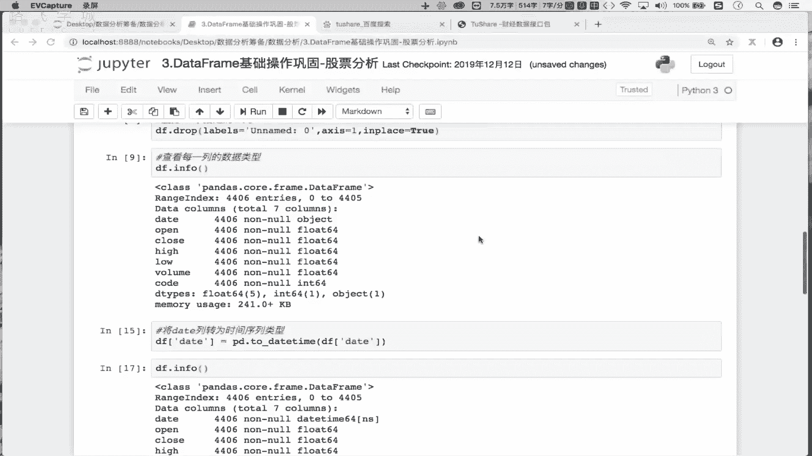

在本节课中，我们将学习如何从股票历史交易数据中，找出所有收盘价比开盘价上涨超过3%的日期。这是量化分析中的一个基础但重要的步骤，可以帮助我们识别股票的强势上涨日。

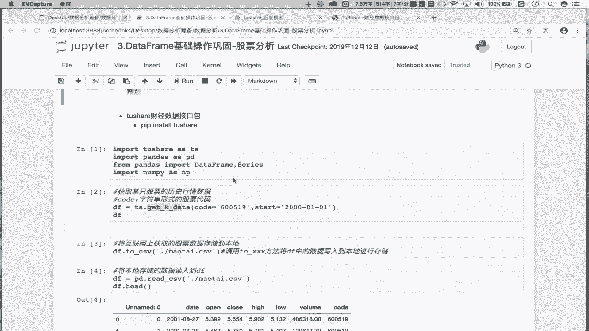

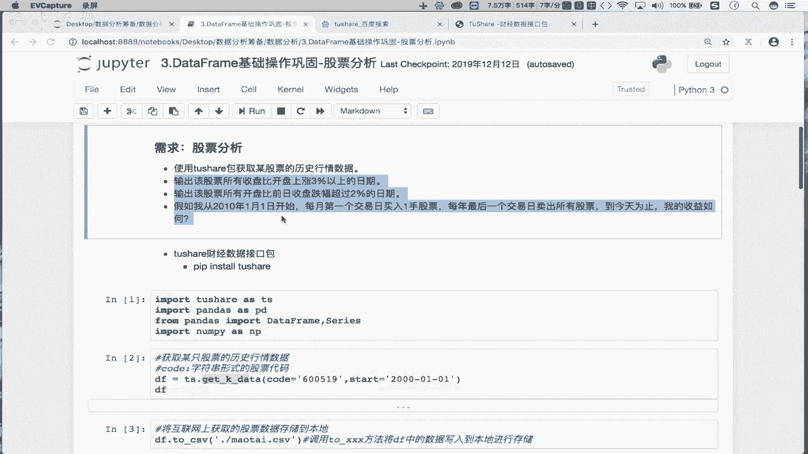

上一节我们介绍了如何对股票历史交易数据进行预处理，包括将日期列转换为时间序列并设置为行索引。本节中我们来看看如何利用处理好的数据，实现一个具体的分析需求。

## 为什么需要转换日期格式？

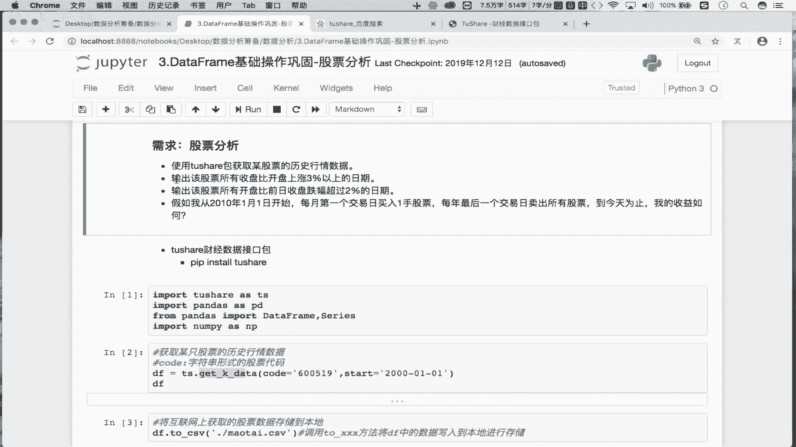

首先需要明确一点，为什么需要将`date`那一列转换成时间序列，并再次将其作为行索引。

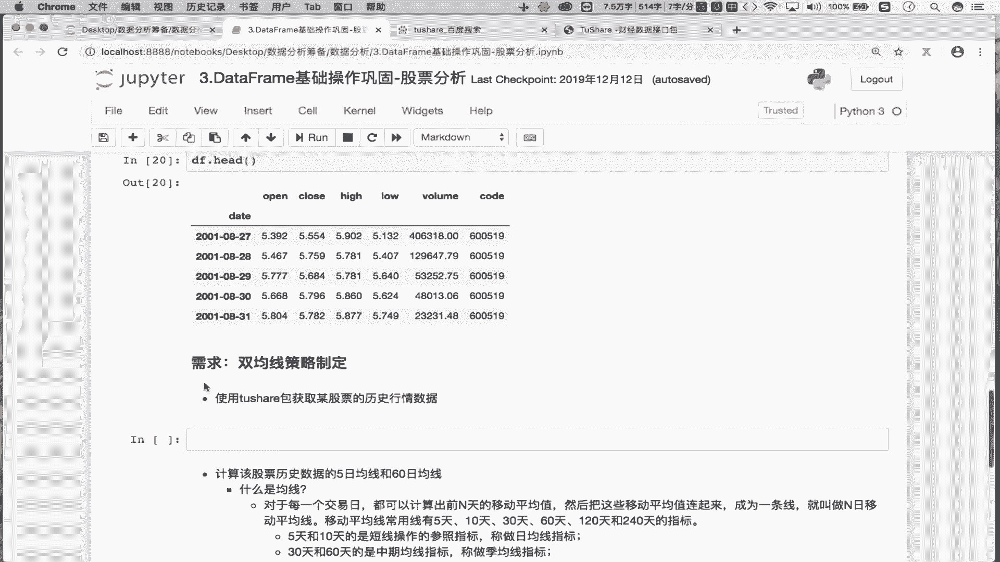

这是因为在后续的需求分析中，我们频繁地需要使用日期。例如，找出特定涨幅发生的日期。如果原始数据中的日期是字符串格式，我们无法高效地利用其时间属性进行计算和筛选。将其转换为Pandas的`DatetimeIndex`（时间序列索引）后，我们就可以使用时间序列特有的方法和特性，从而更便捷地完成后续需求。

因此，请先跟随步骤进行操作，理解其背后的逻辑。


## 需求分析：找出上涨超过3%的日期

接下来，我们实现第二步需求：找出贵州茅台这支股票所有收盘价比开盘价上涨超过3%的日期。

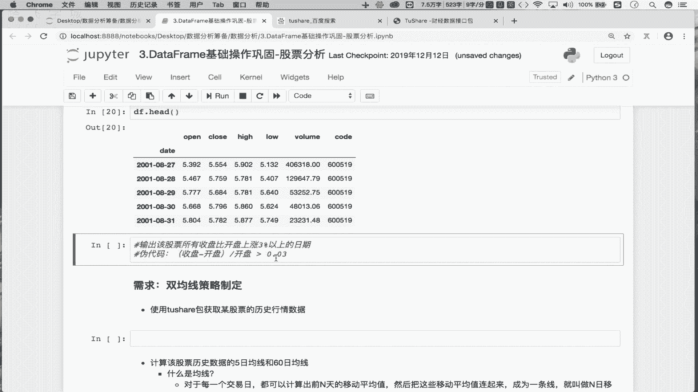

这个分析的目的是总结和分析茅台股票涨幅的分布情况。例如，如果上涨3%的日期集中在3月和6月，那么未来在这些月份购买该股票，获得上涨的概率可能更大。这是一种简单的季节性模式分析思路。

以下是实现该需求的核心逻辑。

### 步骤一：构建逻辑判断条件

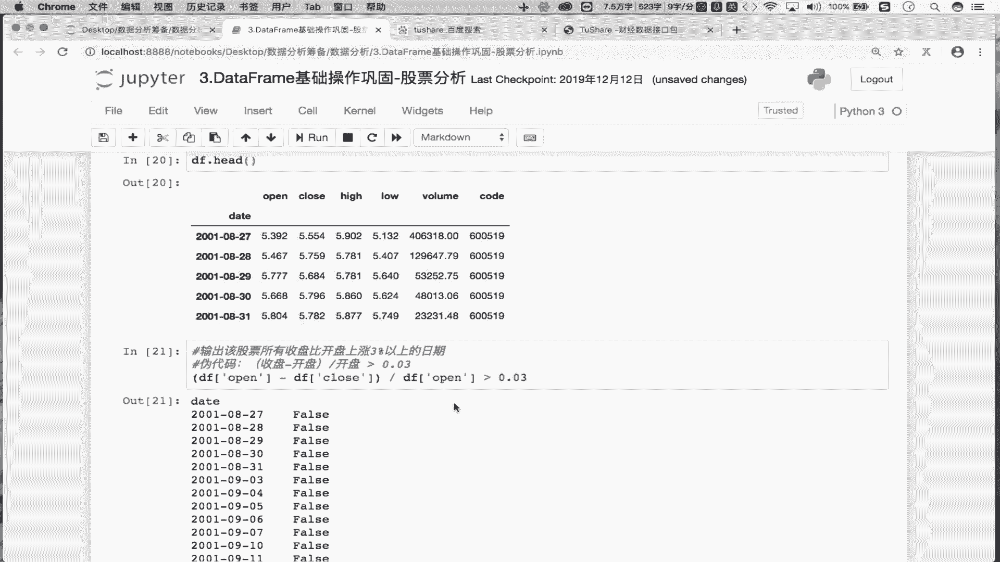

首先，`open`代表股票的开盘价，`close`代表股票的收盘价。我们的目标是找出满足 `(收盘价 - 开盘价) / 开盘价 > 0.03` 的日期。


用伪代码表示如下：
```
(close - open) / open > 0.03
```


这个表达式表示收盘价比开盘价上涨超过3%。

在Pandas中，我们可以将这个伪代码转化为真正的代码。`df[‘open’]`和`df[‘close’]`都是`Series`（序列）。两个`Series`相减，再除以开盘价序列，最后与0.03进行比较。


具体代码如下：
```python
condition = (df[‘close’] - df[‘open’]) / df[‘open’] > 0.03
```

这是一个逻辑判断表达式，其最终返回结果是一组布尔值（`True`或`False`）。例如，`5 > 3`返回`True`。在我们的例子中，这组布尔值序列的每个元素对应原始数据中的一行（一天）。


### 步骤二：理解布尔值的含义

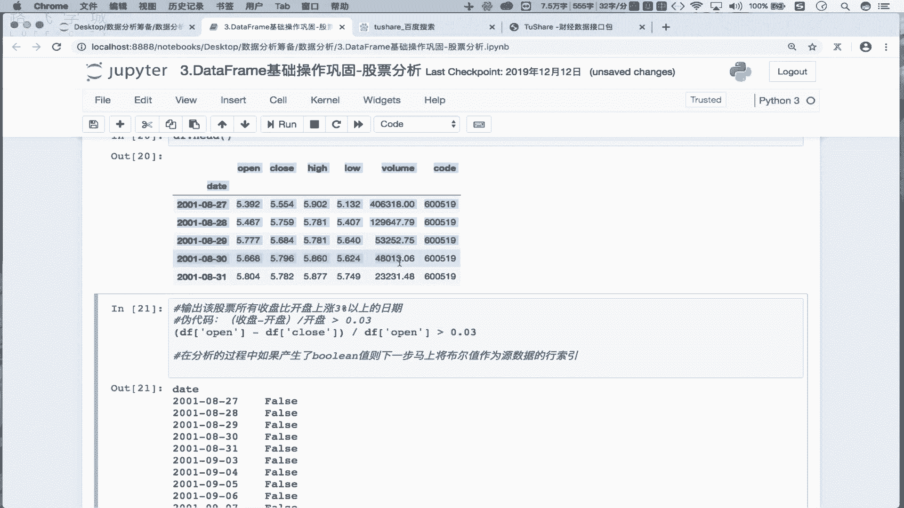

在这组布尔值中，`True`表示对应日期满足“收盘价比开盘价上涨超过3%”的条件，即该日股票上涨显著。`False`则表示不满足该条件。

一个重要的金融常识是：`(close - open) / open > 0` 表示股票上涨，反之则表示下跌。


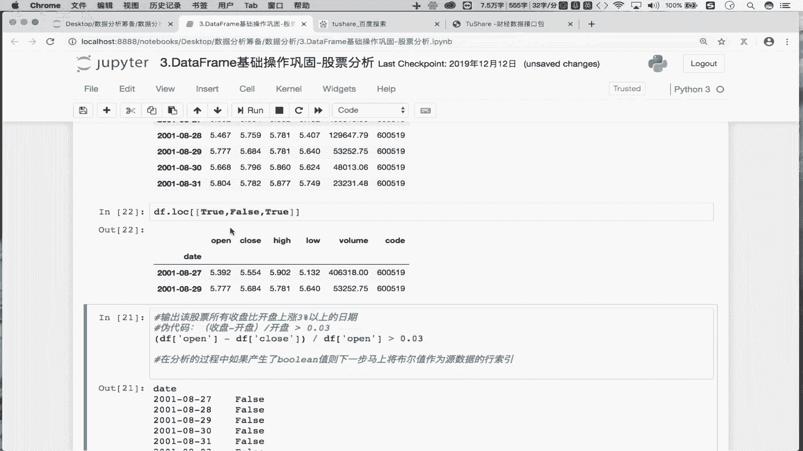

### 步骤三：利用布尔值筛选数据


现在我们得到了一组布尔值，下一步需要取出所有`True`值对应的日期。


这里分享一个在数据分析中非常重要的经验：**如果产生了布尔值序列，下一步可以立即将这组布尔值作为原数据（DataFrame）的行索引进行筛选。**


这是因为，在Pandas中，当使用布尔序列作为`DataFrame`的行索引时，可以取出`True`对应的行数据，并自动忽略`False`对应的行数据。

具体操作如下：
```python
# 将布尔条件作为行索引，筛选出满足条件的行
filtered_df = df.loc[condition]
```


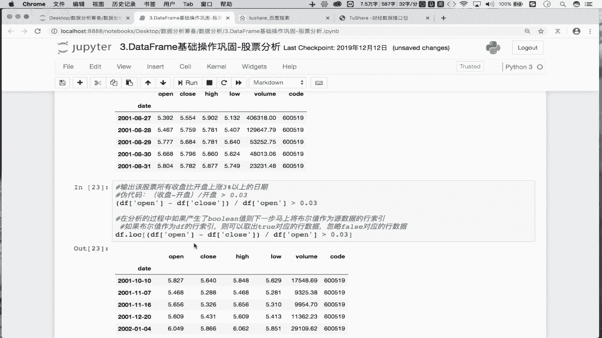

执行这行代码后，`filtered_df`就是一个只包含满足上涨条件日期的`DataFrame`。

### 步骤四：提取目标日期


我们最终需要的是日期，而不是整行数据。由于之前已将日期列设置为行索引，因此满足条件的行数据的行索引，就是我们想要的日期列表。

提取行索引的代码如下：
```python
# 获取筛选后数据的行索引，即目标日期列表
up_dates = filtered_df.index
```


至此，`up_dates`中就包含了所有贵州茅台股票收盘价比开盘价上涨超过3%的日期。

## 核心经验总结


在本需求的实现过程中，我们学习到一个关键经验：**将逻辑判断产生的布尔序列，直接用作`df.loc[]`的索引，可以高效地筛选出满足条件的原始数据行。** 这是Pandas中实现数据查询和筛选的常用且高效的方法。

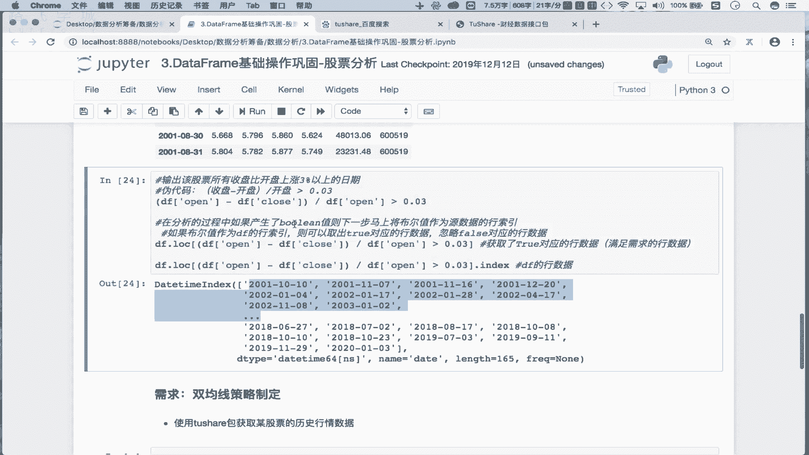


本节课中我们一起学习了如何从处理好的股票数据中，通过构建逻辑表达式、生成布尔序列、再利用布尔序列筛选数据，最终找出股价上涨超过特定阈值的日期。请大家务必勤加练习，熟练掌握这一数据分析的核心技巧。