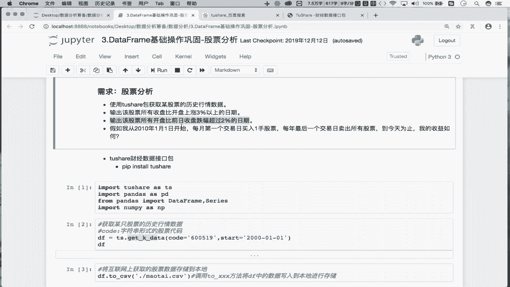
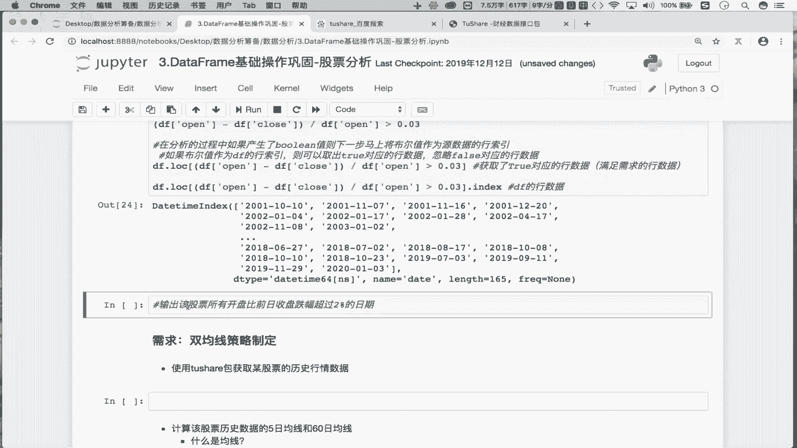
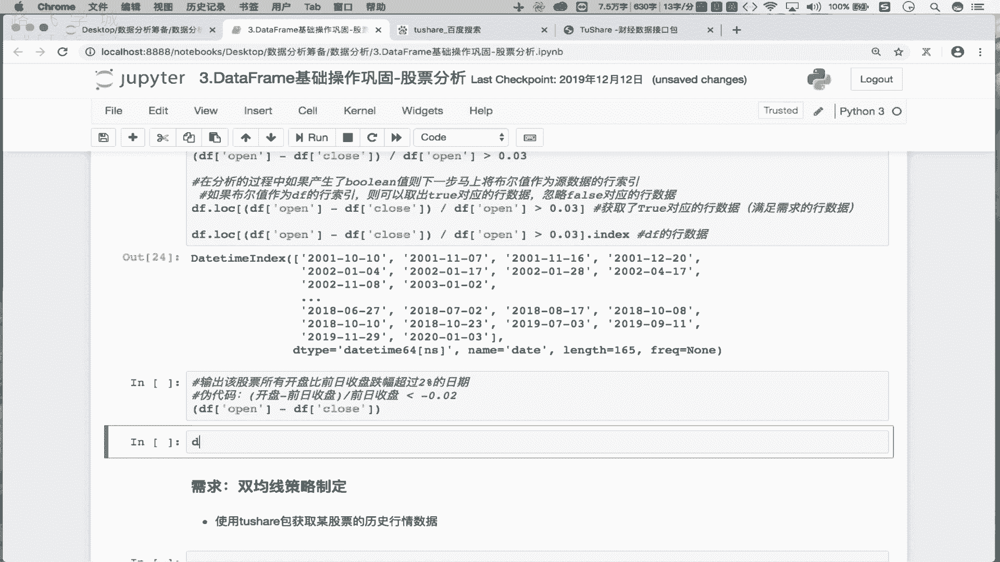
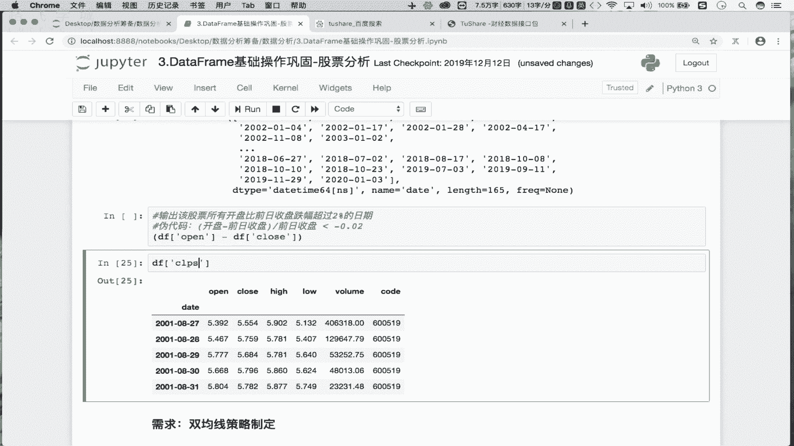
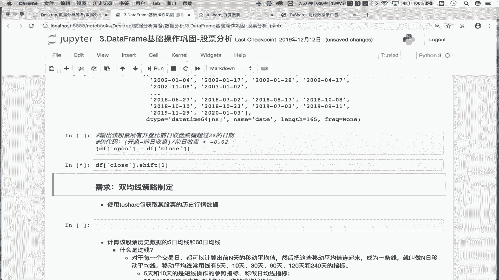
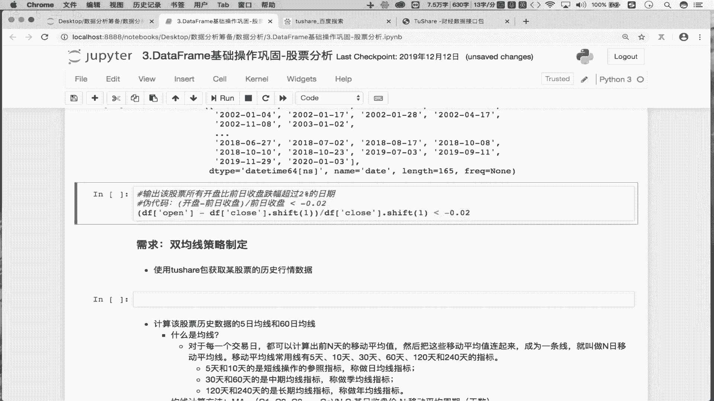
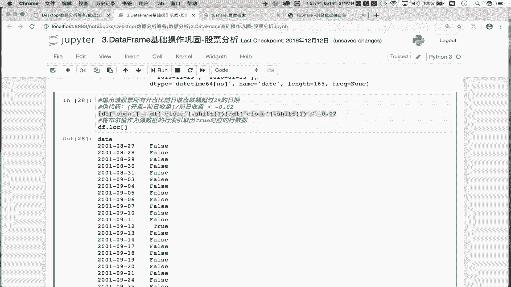
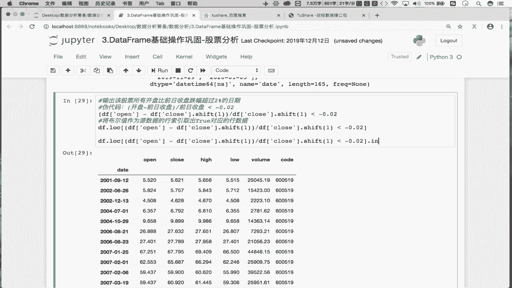
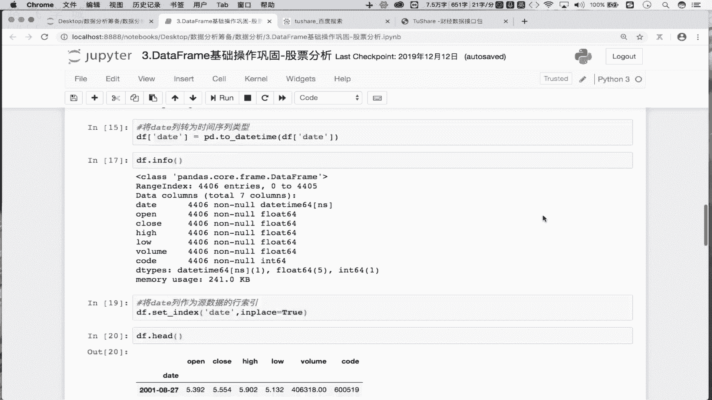
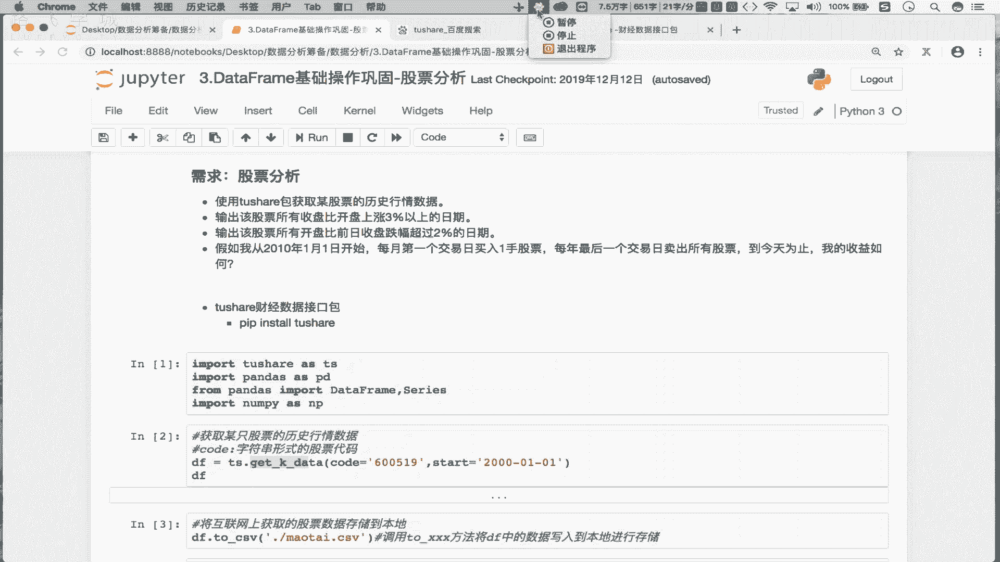

Python金融分析：P4：03 捕获股票跌幅的日期 📉






在本节课中，我们将学习如何从股票数据中筛选出开盘价较前一日收盘价跌幅超过2%的日期。我们将通过分析需求、编写伪代码，并最终实现一行核心代码来完成这个任务。

上一节我们介绍了如何获取和处理股票数据，本节中我们来看看如何基于这些数据进行条件筛选。


### 需求分析
我们的目标是：找出股票所有“开盘价”比“前一日收盘价”跌幅超过2%的日期。



以下是实现此需求的核心步骤：
1.  **计算涨跌幅**：计算（当日开盘价 - 前一日收盘价）/ 前一日收盘价。
2.  **设定条件**：判断上述计算结果是否小于 -0.02（即跌幅超过2%）。
3.  **筛选日期**：将满足条件的布尔索引应用于原始数据，以获取对应的日期。

### 伪代码与逻辑推导
首先，我们通过伪代码理清逻辑。

**计算涨跌幅的公式**为：
`涨跌幅 = (当日开盘 - 前日收盘) / 前日收盘`




**条件判断**：我们需要跌幅“超过”2%。例如，-0.03（跌幅3%）是满足条件的。在数值上，-0.03 < -0.02。因此，我们的筛选条件是：`涨跌幅 < -0.02`。




**关键操作**：如何获取“前一日收盘价”？我们可以使用Pandas的`shift(1)`方法，将收盘价序列整体向下移动一行。这样，每一行的收盘价就变成了前一日的收盘价。




### 代码实现
现在，我们将伪代码转化为实际的Python代码。假设我们的股票数据存储在DataFrame `df`中，其中包含`open`（开盘价）和`close`（收盘价）列。



以下是实现该功能的一行核心代码：
```python
# 获取跌幅超过2%的日期
date_list = df.loc[(df[‘open‘] - df[‘close‘].shift(1)) / df[‘close‘].shift(1) < -0.02].index
```




让我们分解这行代码：
1.  `df[‘close‘].shift(1)`：生成“前一日收盘价”序列。
2.  `(df[‘open‘] - df[‘close‘].shift(1)) / df[‘close‘].shift(1)`：计算每日的涨跌幅。
3.  `... < -0.02`：生成一个布尔序列，`True`表示该日跌幅超过2%。
4.  `df.loc[...]`：使用布尔序列索引原始`df`，筛选出满足条件的行。
5.  `.index`：从筛选出的行中提取日期索引，得到最终结果。


### 执行与验证
运行上述代码后，`date_list`将是一个包含所有跌幅超过2%的日期的索引对象。你可以打印或进一步处理这些日期。





本节课中我们一起学习了如何利用Pandas的向量化操作和`shift`函数，高效地筛选出股票数据中满足特定涨跌幅条件的日期。这个方法逻辑清晰且代码简洁，是金融数据分析中的常用技巧。