# Python金融量化+业务数据分析：P38：02 公式与函数介绍&地址引用的三种方式 📊

在本节课中，我们将要学习Excel中公式与函数的核心概念，并重点掌握单元格地址引用的三种方式：相对引用、绝对引用和混合引用。理解这些概念是高效使用Excel进行数据分析的基础。

## 公式与函数的概念

上一节我们介绍了数据分析的基本环境，本节中我们来看看数据处理的核心工具：公式与函数。

### 什么是公式

公式是Excel中进行计算和分析的基础。在Excel中，公式的定义是以等号（`=`）开头，对单元格地址进行引用的计算形式。

更正式地说，公式是**确立数据之间的关联关系，实现的一种算法，并通过其结果来描述这种关系**。例如，最基本的数学运算 `1 + 1 = 2` 就是一个公式。在Excel中，我们需要输入 `=1+1` 并按回车键，单元格才会显示计算结果 `2`。

将等号放在前面的目的是告诉Excel：“我想要开始计算了”。公式的优势在于引用单元格地址（如 `=A1+B1`），当被引用的单元格值发生变化时，公式的结果会自动更新，这体现了数据间的动态关联。

### 什么是函数

函数可以看作是**预定义好的公式**。它为实现某类特定功能而封装，通过输入参数来得到结果。

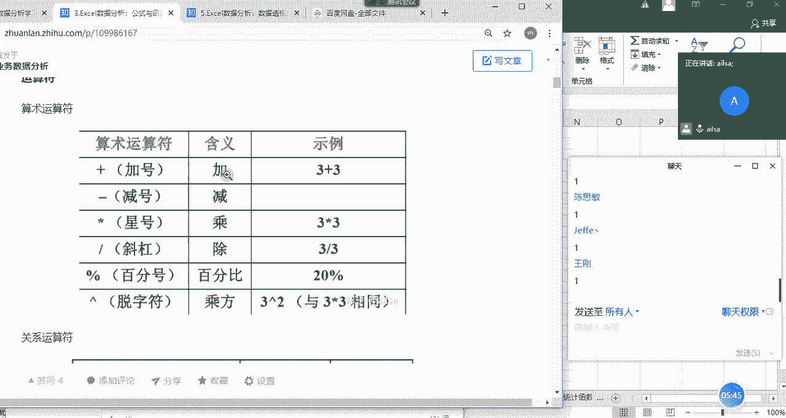

这与我们在Python中定义函数的目的相似：将常用功能模块化，方便重复调用。Excel内置了大量函数，如求和函数 `SUM`，我们只需输入 `=SUM(A1:A10)` 即可计算A1到A10单元格区域的总和，而无需手动书写加法公式。

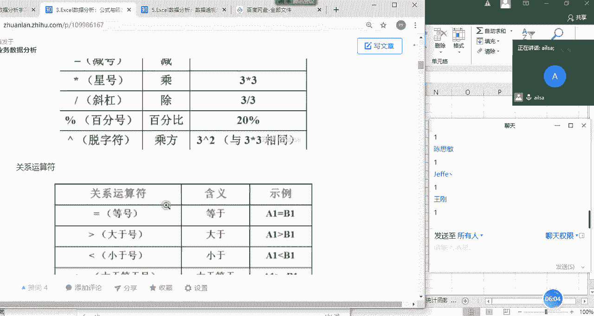

---

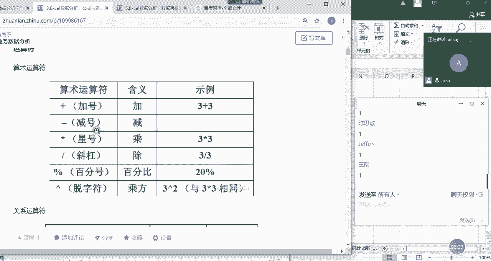

## 运算符

在构建公式时，我们需要使用各种运算符。以下是Excel中常用的两类运算符：

**算术运算符**
用于基本的数学计算。
*   `+`：加法
*   `-`：减法
*   `*`：乘法
*   `/`：除法
*   `^`：乘方（例如，`2^3` 表示2的3次方）
*   `%`：百分比

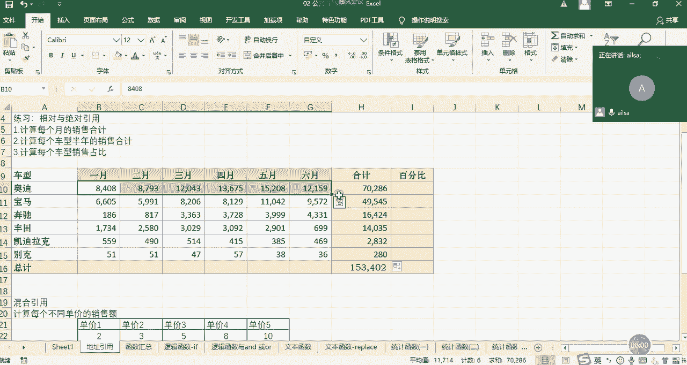

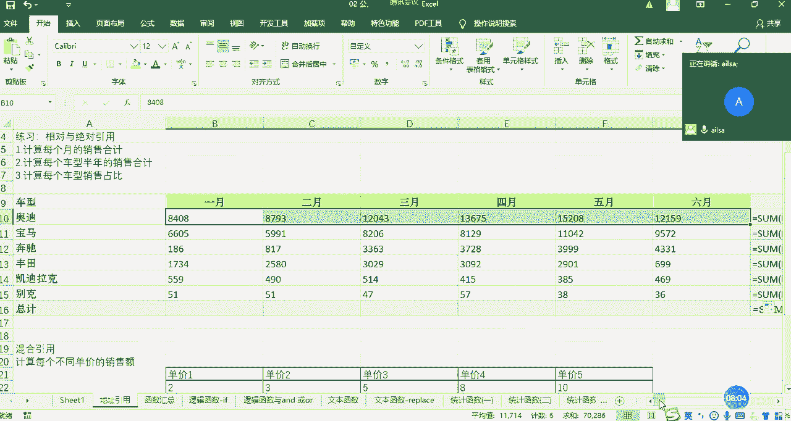

**比较运算符**
用于比较两个值，返回逻辑值 `TRUE` 或 `FALSE`。
*   `=`：等于
*   `>`：大于
*   `<`：小于
*   `>=`：大于等于
*   `<=`：小于等于
*   `<>`：不等于

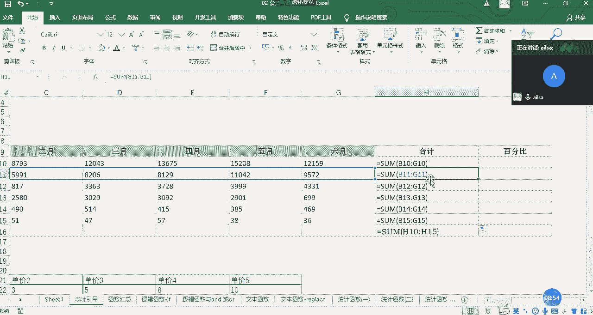

---

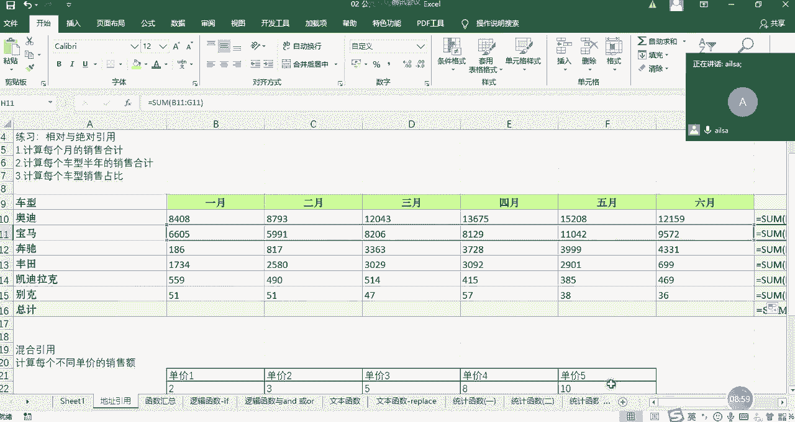

## 单元格地址引用的三种方式

理解了公式和运算符后，最关键的一步是掌握如何在公式中正确地引用单元格。单元格地址由列标（字母）和行号（数字）组成，例如 `A1`。根据公式复制时地址是否变化，引用分为三种类型。

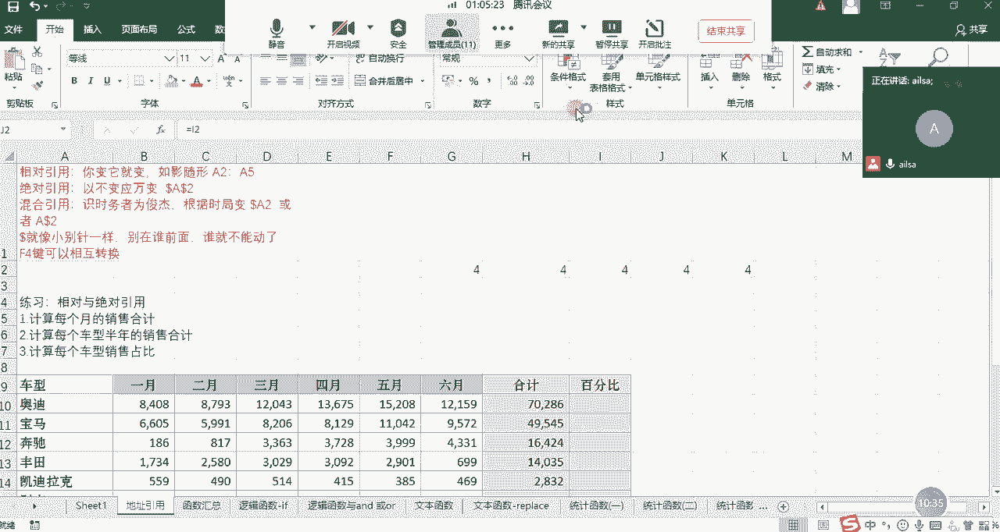

### 相对引用 📍

相对引用是Excel默认的引用方式。其特点是：当公式被复制到其他单元格时，公式中的单元格地址会相对于新位置发生相应变化。

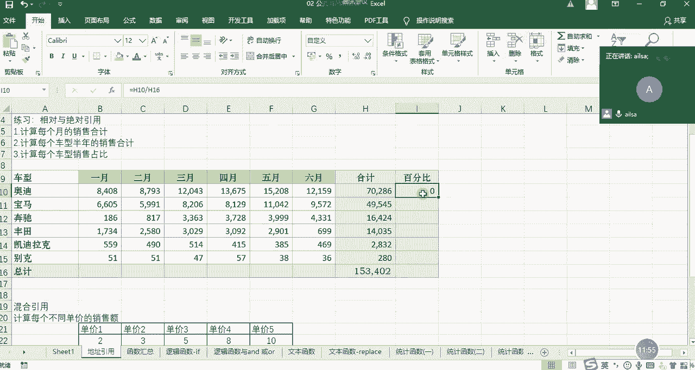

**核心特点**：如影随形，你变它就变。

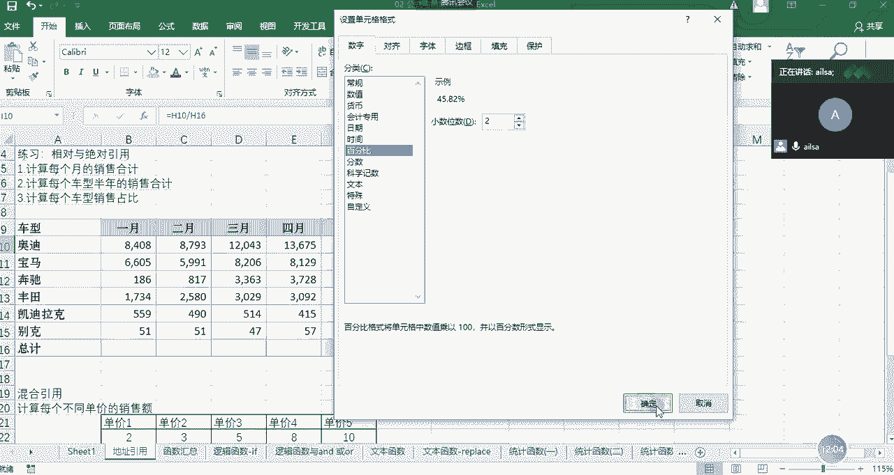

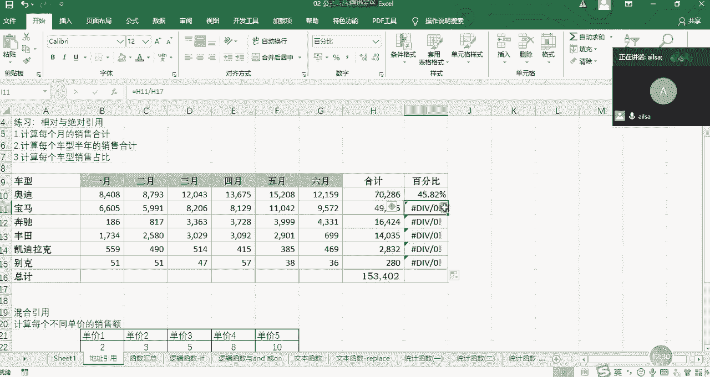

**表现形式**：仅由列标和行号组成，例如 `A1`、`B2:C5`。

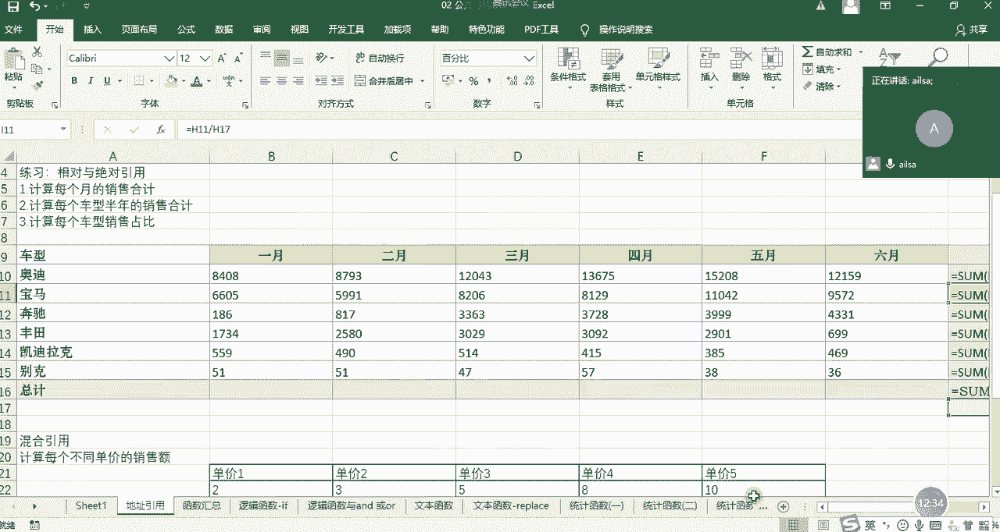

**应用实例**：
假设我们需要计算下表中每款车型上半年的总销量。
1.  在H2单元格输入公式 `=SUM(B2:G2)`，计算“奥迪”的总和。
2.  将H2单元格的公式向下拖动填充至H3单元格。
3.  查看H3单元格的公式，会发现它自动变成了 `=SUM(B3:G3)`。公式中的行号从 `2` 变成了 `3`，以适应新的位置。

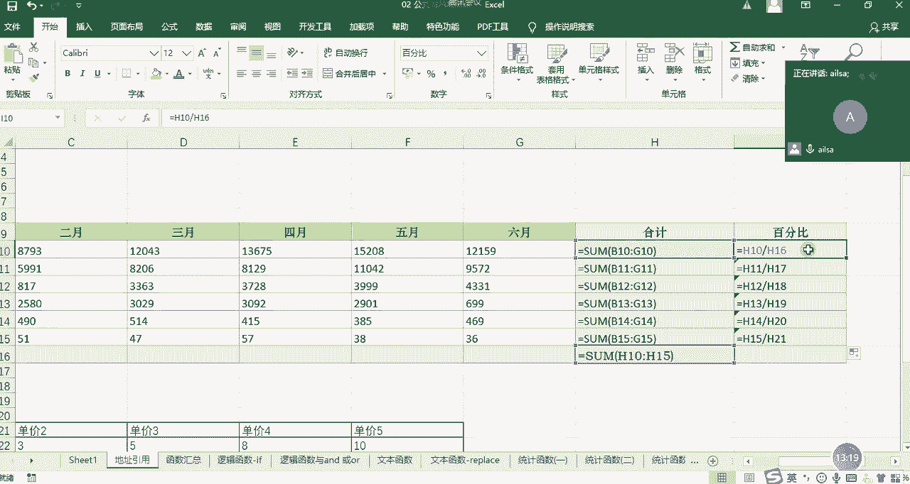

这是因为使用了相对引用，公式像影子一样跟随单元格移动的方向（向下）自动调整了行号。

### 绝对引用 🔒

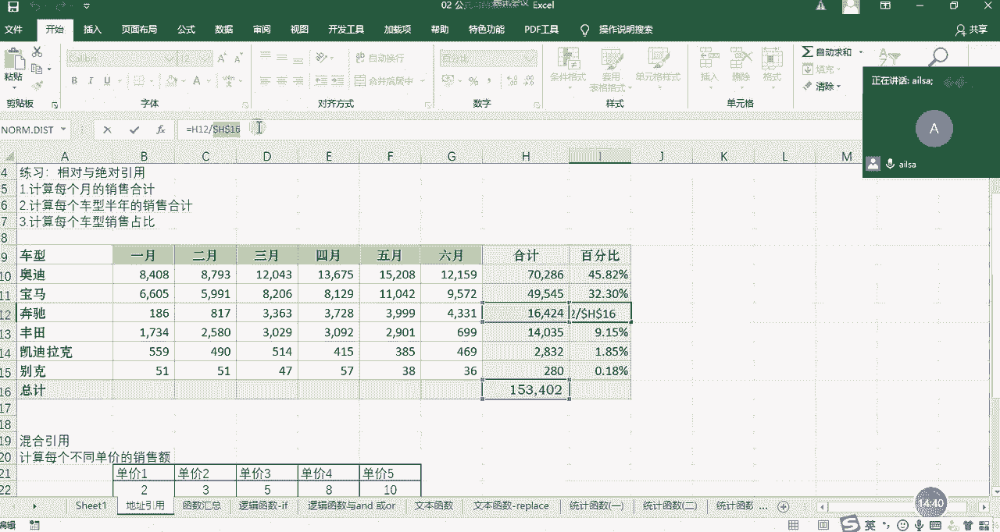

绝对引用的特点是：无论公式被复制到何处，所引用的单元格地址都固定不变。

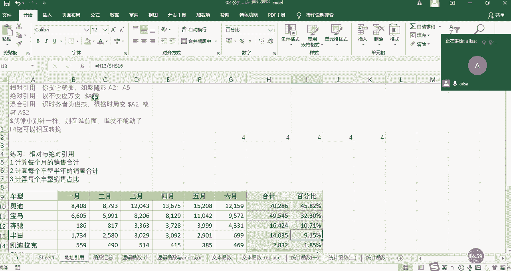

**核心特点**：以不变应万变。

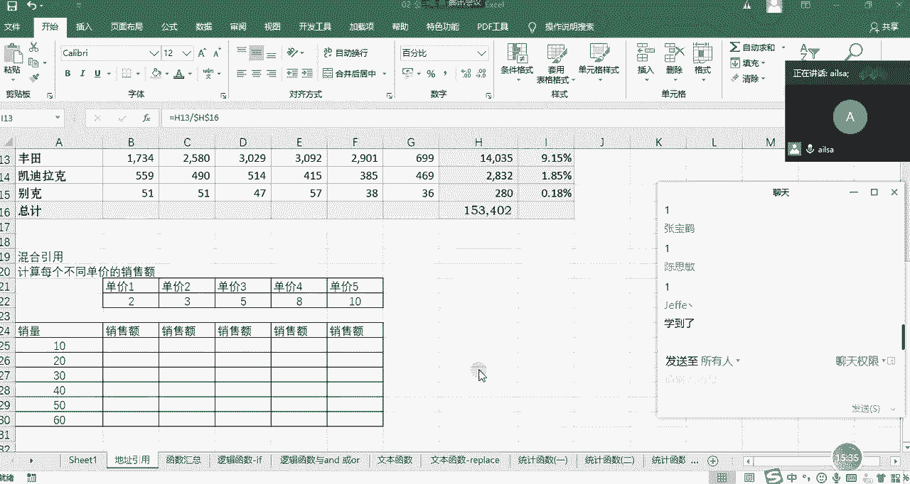

**表现形式**：在列标和行号前都加上美元符号（`$`），例如 `$A$1`。快捷键：选中公式中的地址后，按 **F4** 键可以快速添加或切换引用类型。

**应用实例**：
计算每款车型销量占总销量的百分比。总销量位于 `H8` 单元格。
1.  在I2单元格输入公式 `=H2/H8`，计算“奥迪”的占比。
2.  如果将公式直接向下拖动，I3单元格的公式会变成 `=H3/H9`，而H9是空单元格，会导致计算错误（`#DIV/0!`）。
3.  我们需要分母 `H8` 固定不变。因此，将I2单元格的公式修改为 `=H2/$H$8`。
4.  再次向下拖动公式，I3单元格的公式变为 `=H3/$H$8`。此时，分母被“锁定”在H8单元格，不再变化。

美元符号（`$`）就像一个小别针，把行和列都“别”住，使其在公式复制时保持绝对不变。

### 混合引用 🎯

混合引用是相对引用和绝对引用的结合，即只锁定行或只锁定列。

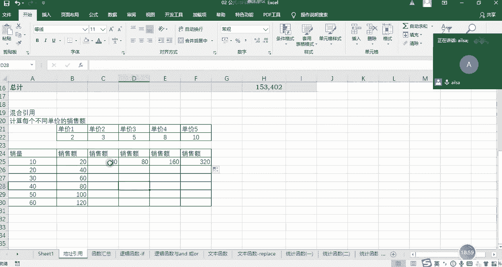

**核心特点**：识时务者为俊杰，根据需求灵活锁定行或列。

**表现形式**：
*   锁定行：例如 `A$1`，列标可以变，但行号 `1` 不变。
*   锁定列：例如 `$A1`，行号可以变，但列标 `A` 不变。

**应用实例**：制作一个简单的销售额模拟表，横向是不同的“单价”，纵向是不同的“销量”，计算矩阵中每个价格和销量组合对应的销售额。
1.  在B2单元格输入初始公式 `=B$1*$A2`。
    *   `B$1`：引用单价。我们希望**向下**复制公式时，行号 `1` 不变（始终引用第一行的单价），但**向右**复制时，列标可以变化（从B列到C列、D列…）。因此锁定行（`$1`）。
    *   `$A2`：引用销量。我们希望**向右**复制公式时，列标 `A` 不变（始终引用A列的销量），但**向下**复制时，行号可以变化（从第2行到第3行、第4行…）。因此锁定列（`$A`）。
2.  将B2单元格的公式先向下拖动，再向右拖动，即可快速生成整个销售额矩阵。

通过混合引用，我们用一个公式就完成了整个表格的计算，极大地提升了效率。

---

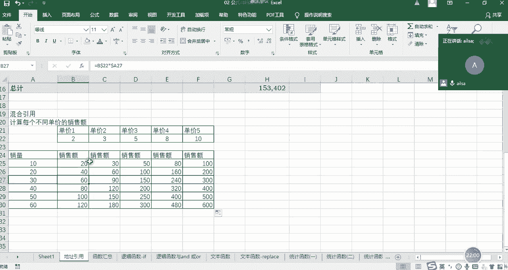

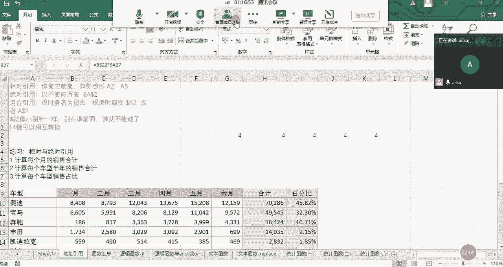

## 总结

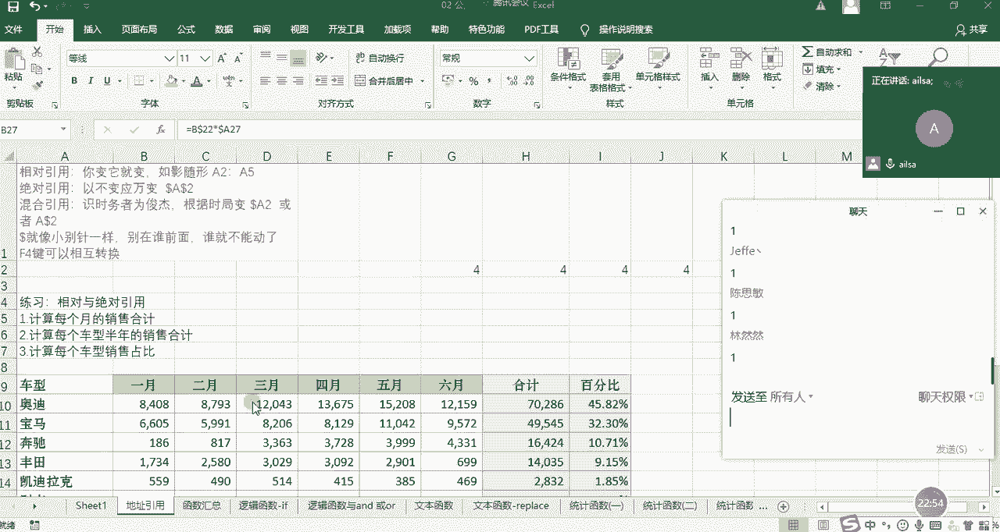

本节课中我们一起学习了Excel中公式与函数的核心概念，并深入探讨了单元格地址引用的三种关键方式。

*   **公式**是以等号开头，通过引用单元格地址来建立数据关联、执行算法的计算式。
*   **函数**是预定义好的公式，用于实现特定功能。
*   **地址引用**的三种方式决定了公式复制时的行为：
    *   **相对引用**（如 `A1`）：公式复制时，地址如影随形般相对变化。
    *   **绝对引用**（如 `$A$1`）：公式复制时，地址被完全锁定，固定不变。
    *   **混合引用**（如 `A$1` 或 `$A1`）：公式复制时，只锁定行或只锁定列，灵活应对复杂需求。

熟练掌握这三种引用方式，是编写高效、准确Excel公式的基石，对于后续进行金融量化和业务数据分析至关重要。