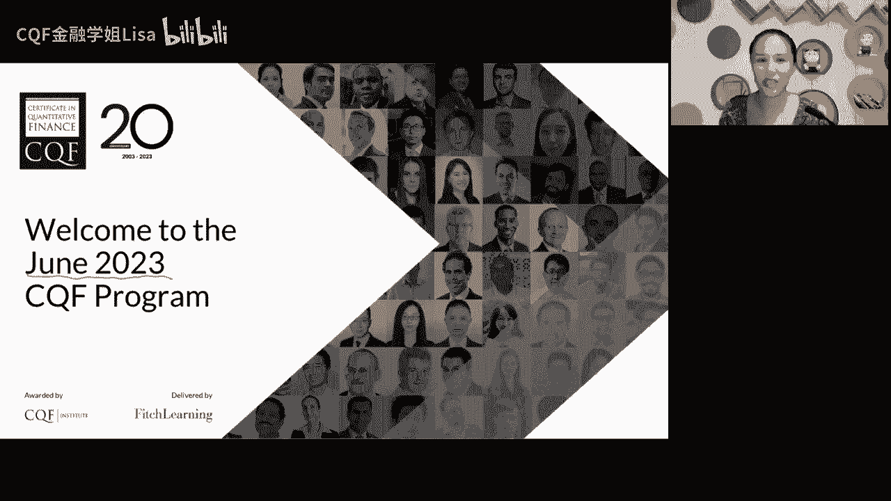
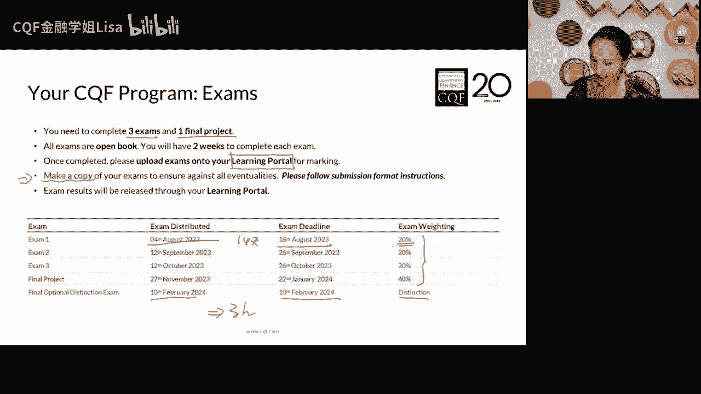
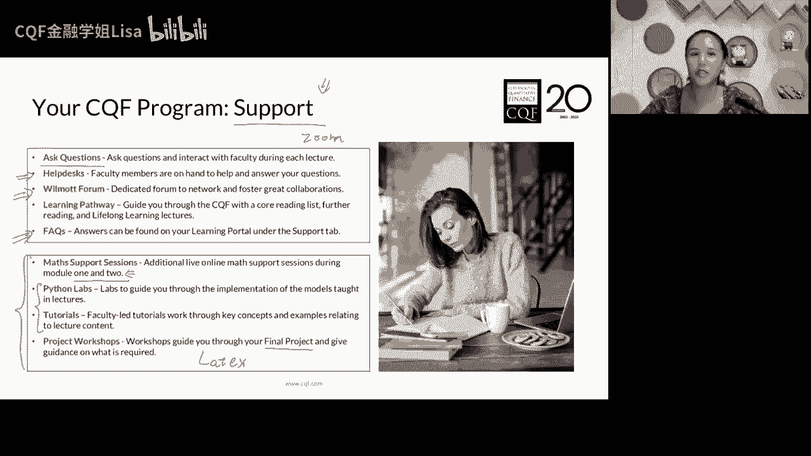
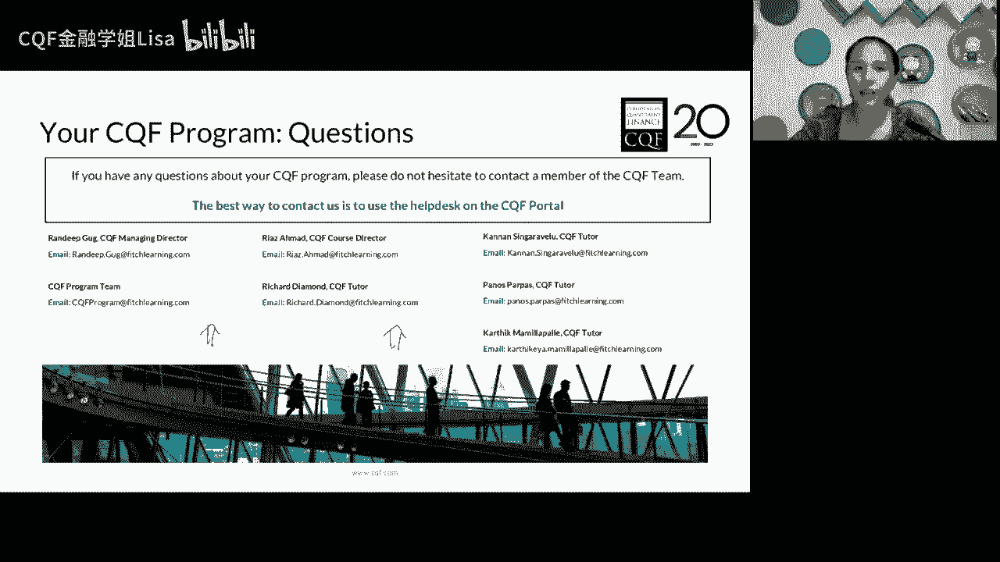
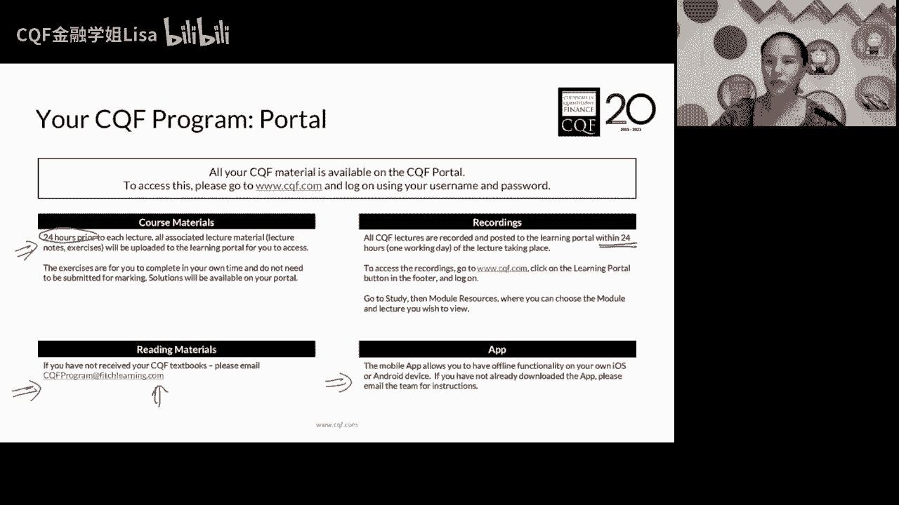
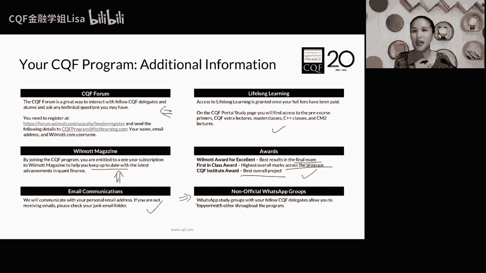
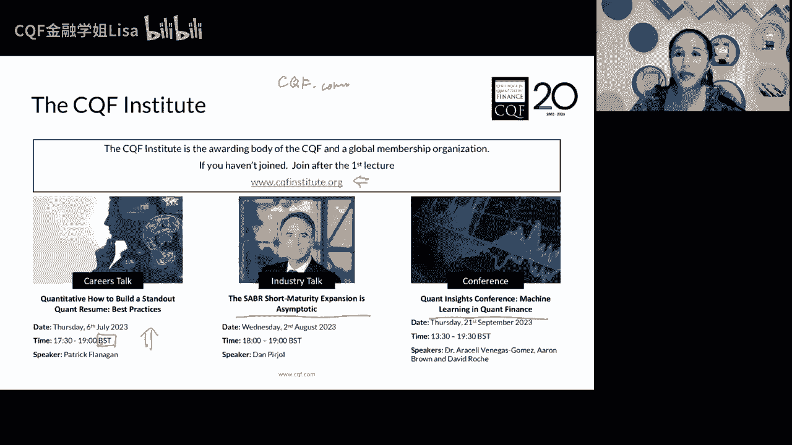
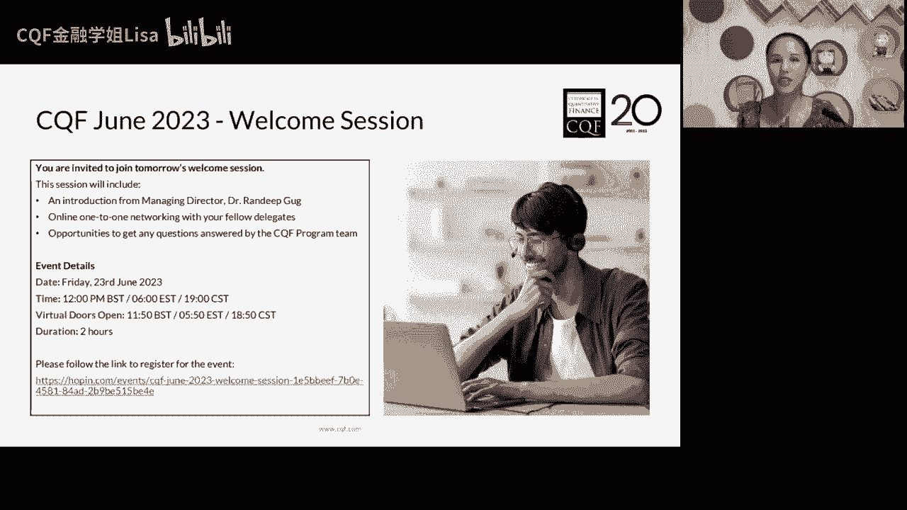

# CQF量化金融入门课：第一讲：CQF课程介绍 📚

## 概述
在本节课中，我们将全面介绍CQF（Certificate in Quantitative Finance）量化金融证书课程。课程内容包括课程结构、核心模块、学习支持、考核方式以及相关资源。我们将帮助初学者理解量化金融的学习路径和所需的基础知识。

---

## 课程结构与核心模块 🧩
CQF课程每半年开设一次，持续六个月，包含六个核心模块。课程内容从基础到前沿，难度逐渐递增。

### 模块一：量化金融基础
模块一主要介绍量化金融的基础知识。课程内容包括随机积分、转移密度函数等数学基础，以及资产建模和波动率等核心概念。这是构建量化思维的起点。

### 模块二：资产组合理论
上一节我们介绍了量化基础，本节中我们来看看资产组合理论。模块二聚焦于马克维茨的有效前沿理论，学习如何量化风险和收益，并构建资产组合。这标志着金融进入量化时代。

### 模块三：股票与货币建模
模块三专注于股票和货币类资产的建模。这部分内容以期权定价为核心，涉及经典的布莱克-斯科尔斯模型。以下是本模块的重点：
*   学习基于股票和货币的资产建模方法。
*   深入理解期权定价理论及其应用。

### 模块四与模块五：机器学习与数据科学
模块四和模块五引入更现代的内容，涵盖机器学习和数据处理。
*   **模块四**：重点介绍监督式学习。
*   **模块五**：涵盖非监督式学习、自然语言处理等前沿话题，例如GPT模型的基础原理。

需要明确的是，机器学习（如GPT）是基于历史数据寻找规律的**数据驱动**方法，而CQF课程教授的数学模型是**逻辑推导**。前者擅长模式识别，后者能解决未见过的分析问题。

### 模块六：固定收益与信用风险
模块六探讨固定收益产品和信用风险建模。这部分内容复杂且模型多样，没有单一的主导模型，是当前量化领域的重要挑战。

**学习曲线说明**：CQF的学习曲线初期较为陡峭，因为前几个模块涉及大量数学和建模基础。坚持度过这个阶段后，后续学习会更侧重于应用和发散思考。

---

## 考核与支持体系 🛠️
课程考核包括三次考试和一次期末项目。每次考试有14天的开卷完成时间，最终加权成绩超过60分即可获得证书。此外，还有可选的线下闭卷考试，用于争取更高荣誉。

课程提供了全面的学习支持系统，以下是主要支持途径：
*   **课程问答**：在英文直播课时通过Zoom直接向教授提问。
*   **技术支持**：通过Help Desk解决网站、教材等技术问题。
*   **学员论坛**：一个专属的Secret Garden论坛，需注册后邮件申请开通权限。
*   **数学支持课**：针对前两个模块的数学基础提供的录播复习课程。
*   **Python实验课**：每个模块提供2-4次Python代码实现课程的录播。
*   **期末项目指导**：在课程末期提供4-6节关于论文写作和项目的指导工作坊。

---

## 学习平台与资源 💻
核心学习平台是 **learning.cqf.com**。课程资料（课件、练习题、数据文件等）会在此发布。英文课程回放通常在直播24小时后上线。

其他重要资源包括：
*   **纸质教材**：注册后会从英国邮寄。
*   **CQF Institute官网**：提供行业资讯、网络研讨会和职业发展内容，建议注册。
*   **WhatsApp学员群**：一个包含全球千余名学员的交流群组，可用于 networking。

请确保在相关平台填写准确的邮寄地址，以便接收教材和杂志。

---

## 总结
本节课我们一起学习了CQF课程的全貌。我们了解了六个从基础到前沿的核心模块，认识了课程“先难后易”的学习曲线，熟悉了考核方式与丰富的学习支持资源，也掌握了主要的学习平台和拓展途径。量化金融之旅始于扎实的基础，希望本介绍能帮助你顺利启程。