# Python+机器学习+量化交易实战教程：P33：简历和面试II 📝

在本节课中，我们将学习如何撰写一份针对量化金融领域的高质量简历，并掌握关键的面试技巧。一份精准的简历和充分的面试准备是获得理想职位的重要基石。

上一节我们介绍了简历的基本结构和重要性，本节中我们来看看如何根据具体岗位定制简历内容，并深入探讨项目描述与面试中的关键细节。

## 根据申请方向定制简历

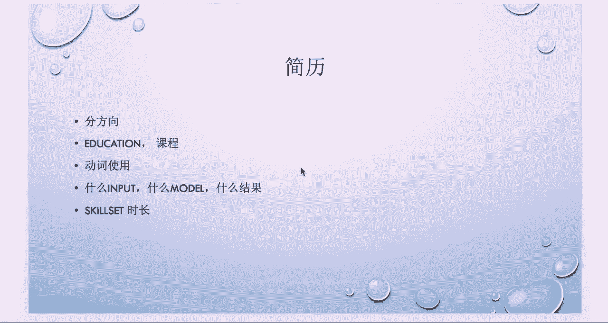

撰写简历的首要原则是针对性。你需要根据申请的具体职位方向来调整简历内容。

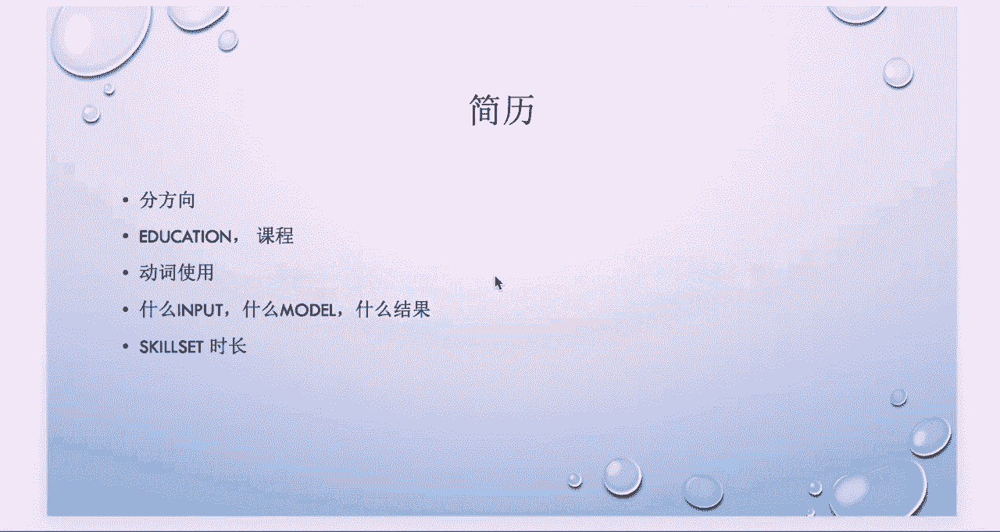

以下是针对不同量化岗位的简历侧重点：

*   **申请交易岗（Desk Quant）**：
    *   **技能**：需重点加入 **Java**、**C++** 等对性能要求高的编程语言。
    *   **项目**：应更多展示与算法交易和机器学习相关的项目经验。

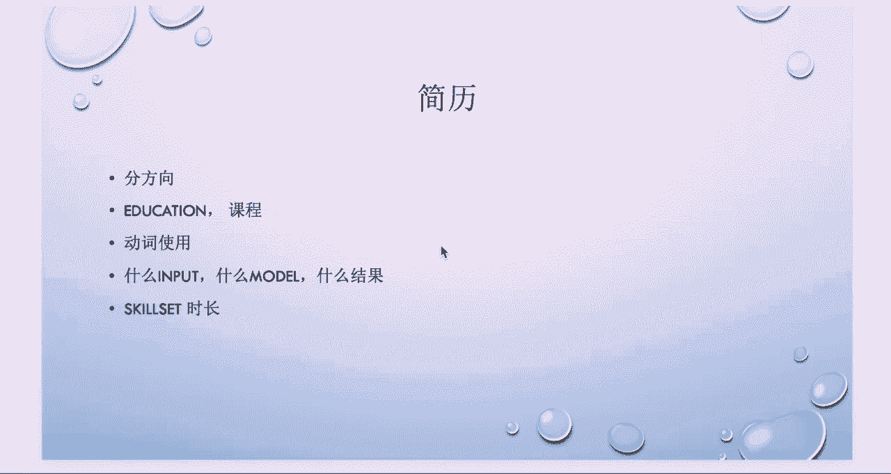

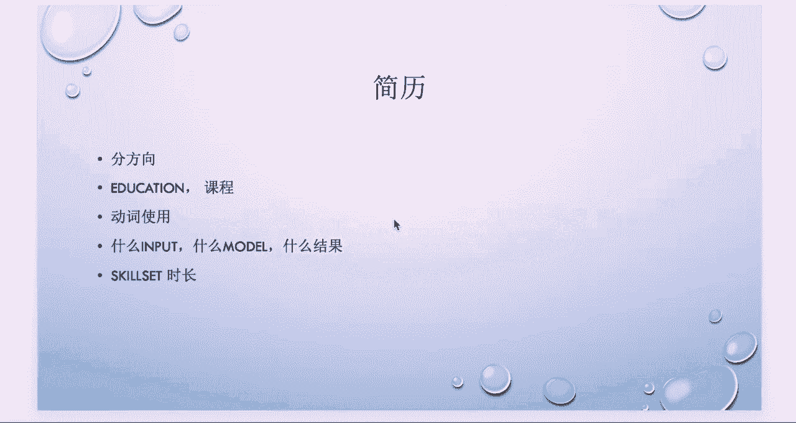

*   **申请研究岗（Research Quant）**：
    *   **技能**：需侧重 **Python**、**R** 和 **MATLAB** 等常用于研究与建模的工具。
    *   **课程**：需列出如期权定价等核心课程。
    *   **项目**：可描述做过的蒙特卡洛模拟或主动投资组合管理等项目。

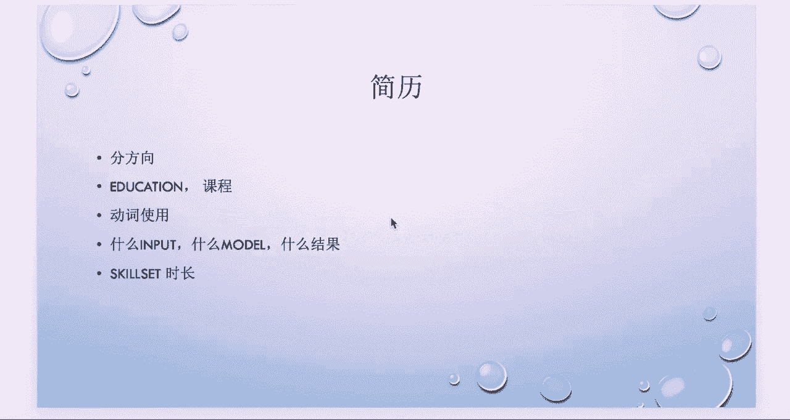

*   **申请风险岗（Risk Quant）**：
    *   **课程**：需写上风险管理、压力测试、在险价值等相关课程。
    *   **项目**：例如，使用蒙特卡洛模拟进行在险价值计算或情景设计等项目。

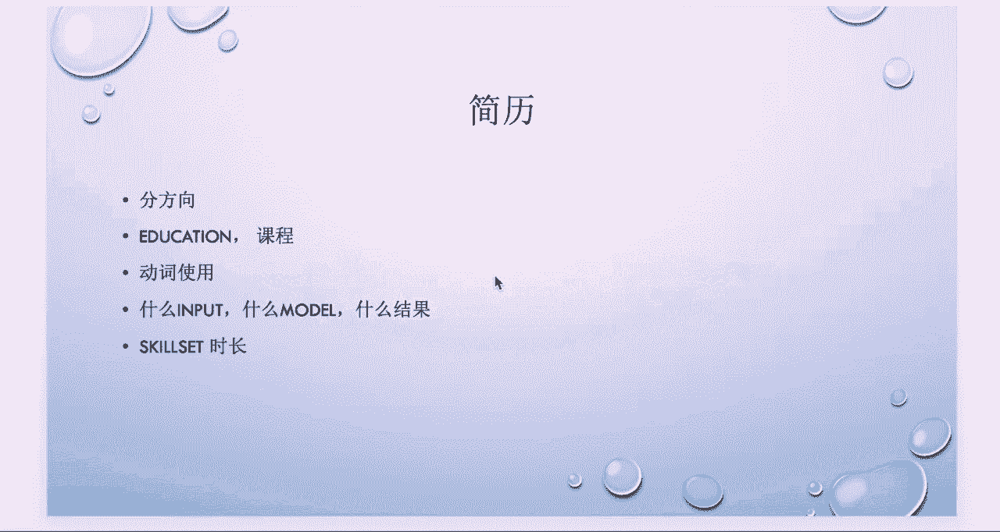

## 教育背景与课程列表

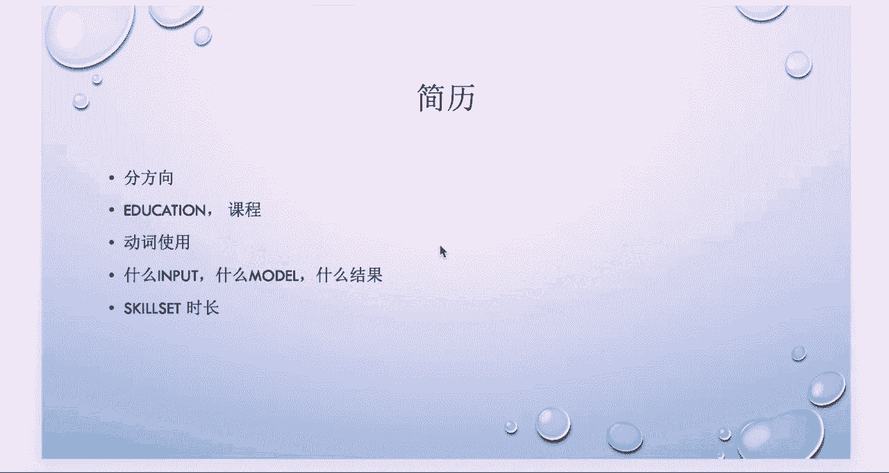

在简历中，除了列出本科、研究生或博士的学历与专业名称外，更重要的是详细列出你所修读的核心课程。

招聘方在审阅简历时，除了关注学校名声，更看重你所学的具体课程。例如，即使毕业于顶尖的金融工程项目，但如果选修的都是会计方向的课程，那么与量化岗位的关联度也不高。

对于量化岗位，应重点列出以下类型的课程：
*   Statistics（统计学）
*   Probability（概率论）
*   Stochastic Calculus（随机微积分）
*   Interest Rate Modeling（利率建模）
*   Derivative Pricing（衍生品定价）
*   Time Series Analysis（时间序列分析）

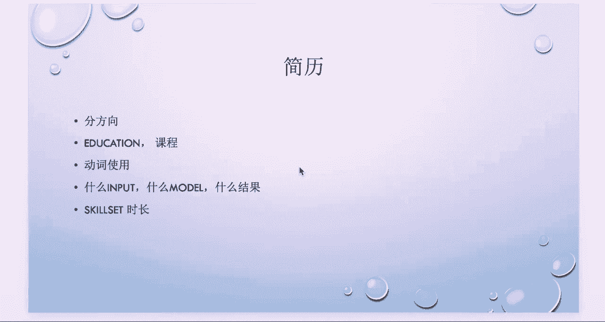

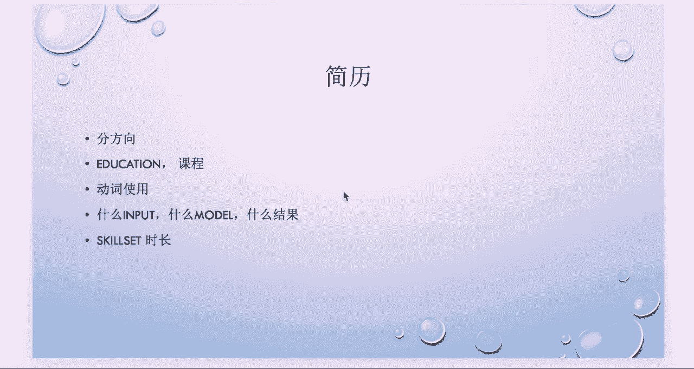

## 项目与工作经历描述

无论是学术项目还是工作经历，描述时对动词的使用要求很严格。应使用能体现主动性和主导能力的动词。

**应避免使用**的动词：Participate（参与）、Study（学习）、Learn（学习）。这些词会让人觉得你可能不是项目的主导者，或对项目了解不深。

**建议使用**的动词：Build（构建）、Develop（开发）、Design（设计）、Did research on（对…进行研究）。这些词能体现你的主观思考和执行能力。

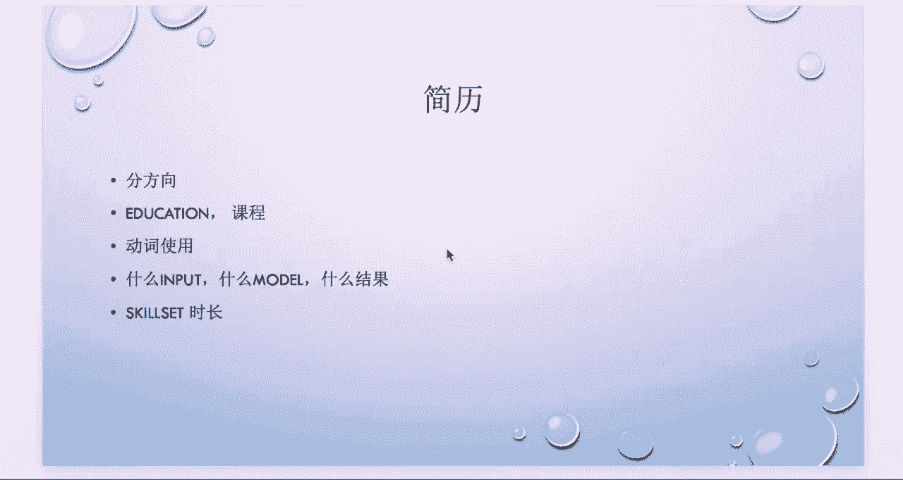

每一段经历（项目或工作）的描述，建议遵循以下三步结构：

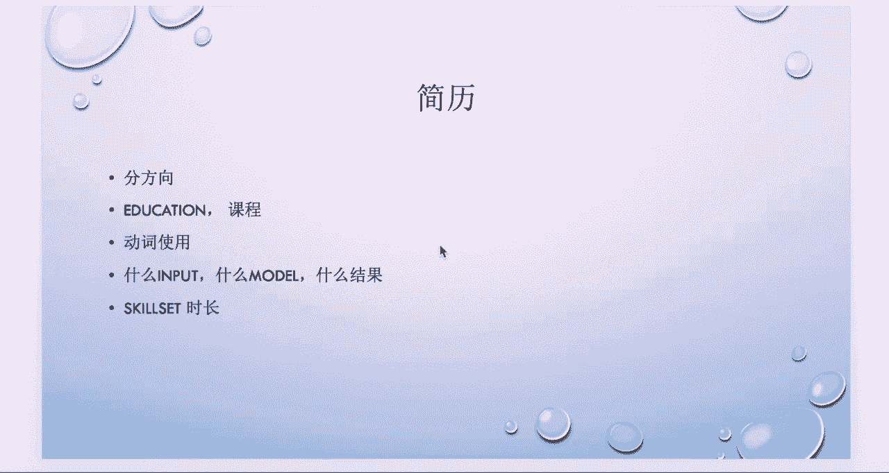

1.  **目标与数据**：首先说明使用了什么**输入数据**，是为了解决什么问题。
    *   *示例*：`使用A股市场2010-2020年的日频价格和成交量数据，以预测未来股价走势。`
2.  **方法与模型**：接着具体说明使用了什么**模型或方法**。务必具体化，例如，不仅是“回归”，而是**Lasso回归**、**线性回归**或**加权最小二乘法**等。
    *   *示例*：`构建了一个基于**LSTM神经网络**的预测模型。`
3.  **成果与影响**：最后阐明得到了什么样的**结果或影响**。最好能量化。
    *   *示例*：`模型在测试集上达到了**85%的准确率**，或策略实现了**年化20%的收益率**。`

## 技能清单的撰写

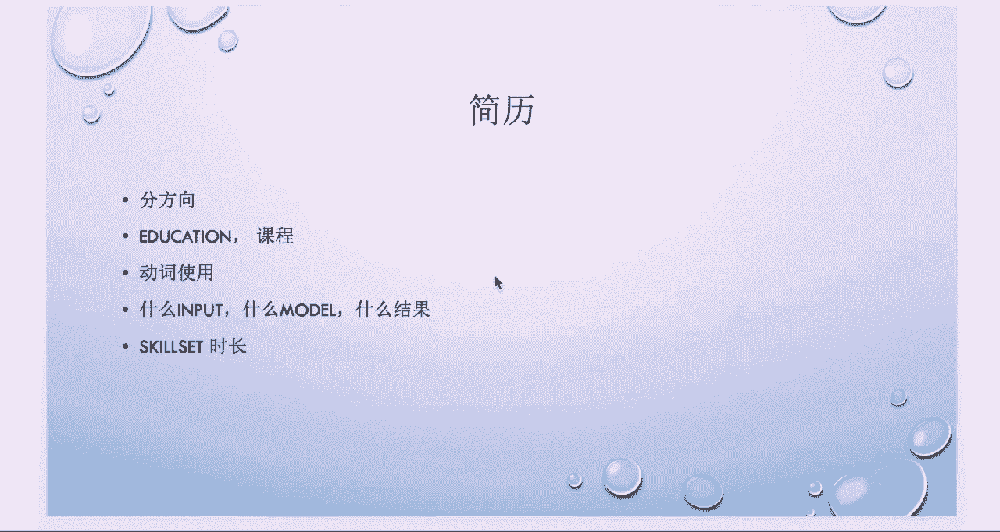

在简历末尾，需要列出你的技能清单。

*   **软件技能**：如 **C++**、**Java**、**Python**、**R**、**MATLAB**。
*   **关键细节**：在每个技能旁，最好用括号注明你使用该技能的**时长**（例如：Python (3 years)）。
    *   这有助于面试官判断你的熟练程度，并据此调整问题的难度。标明“半年”和“五年”所代表的预期水平是完全不同的。

## 电话面试与现场面试技巧

掌握了简历的写法后，我们来看看如何在面试中更好地展示自己。

**电话面试技巧**：
1.  **引导对话**：电话面试通常只有30分钟。面试官常会让你介绍简历。你可以适当延长这部分时间，因为面试官很可能会就你提到的关键词（如模型名称）进行深入提问。回答简历上的问题通常比回答凭空提出的问题更容易。
2.  **清晰表达**：介绍时，从教育背景、课程、工作经历、学术项目到技能清单，层层展开。避免在电话中背诵复杂公式，用清晰的口头语言解释概念为佳。
3.  **诚实作答**：切勿使用谷歌等工具搜索答案并照读。面试官很可能同时开着相关页面，一旦发现，会留下极差的印象。务必用自己的理解进行阐述。

**现场面试技巧**：
1.  **准备工具**：务必自备纸和笔。现场面试常涉及需要推导公式或画图解释的难题。不要期待公司提供，自备纸笔是准备充分的表现。
2.  **注意细节**：注意行为规范。例如，与面试官同行时主动开门；面试结束后，整理好自己用过的草稿纸，并将椅子推回原位。这些细节能体现你的专业素养。

本节课中我们一起学习了如何针对量化金融的不同岗位定制简历，掌握了用“目标-方法-结果”的结构描述项目，并了解了电话面试与现场面试的核心技巧。记住，一份精准的简历和专业的面试表现是开启职业生涯大门的钥匙。