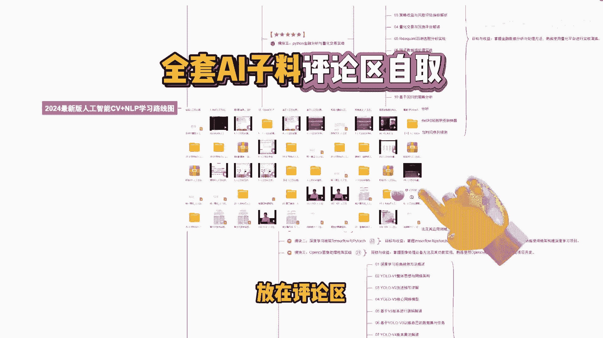
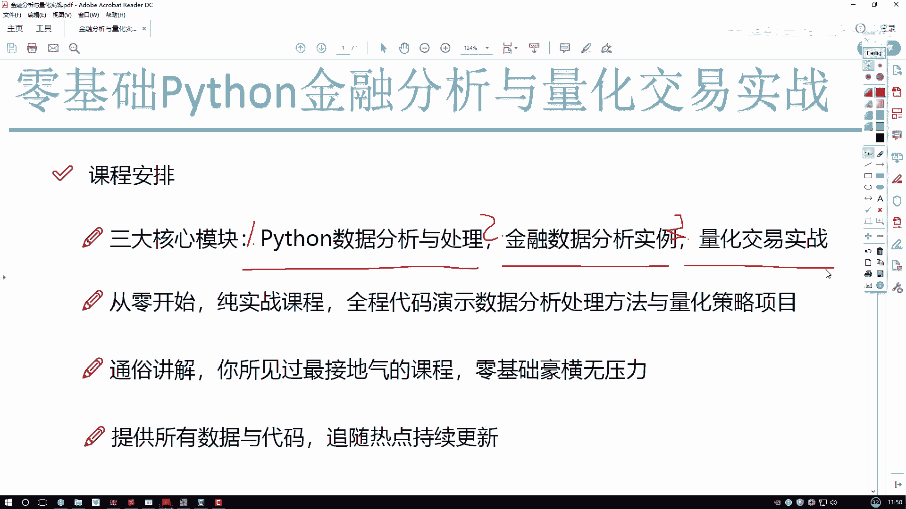
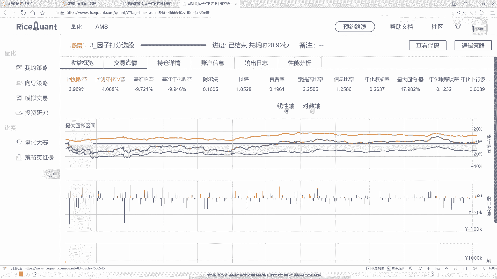
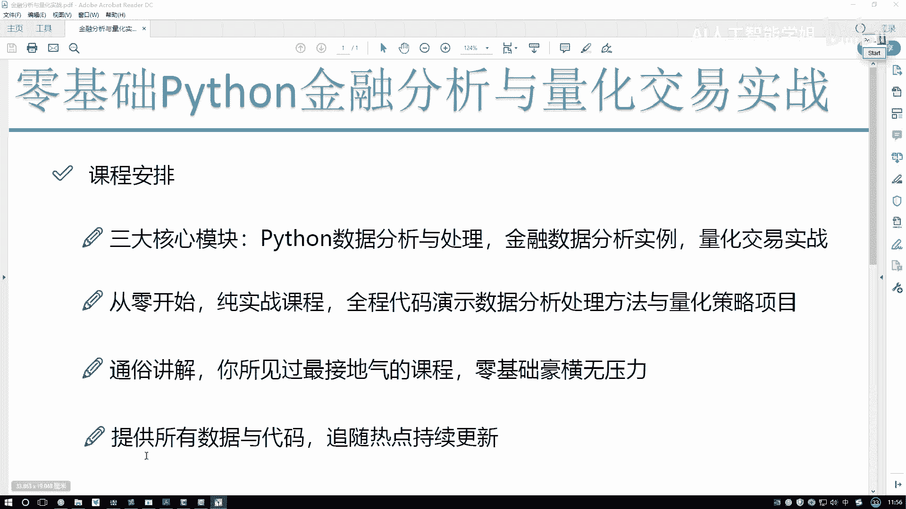
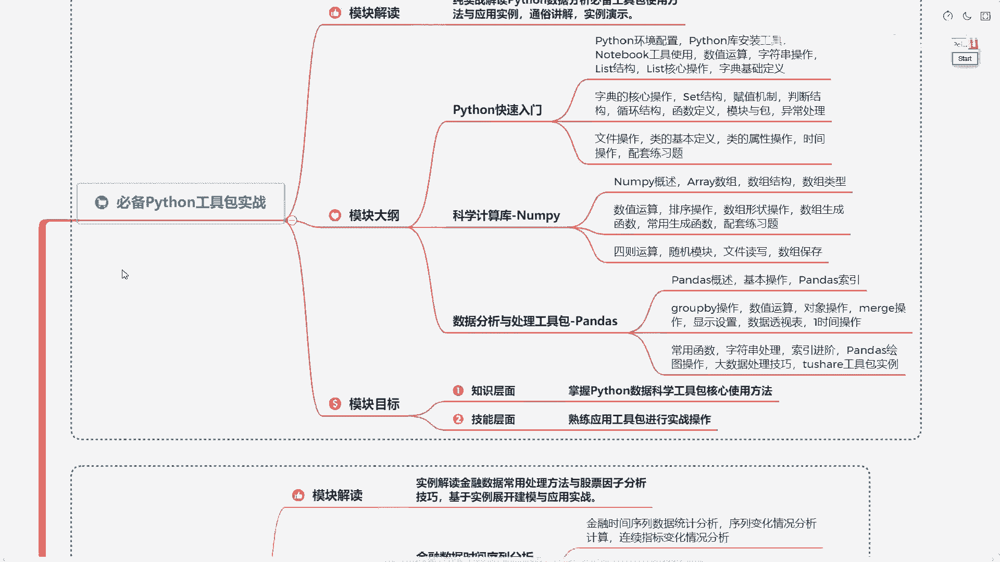
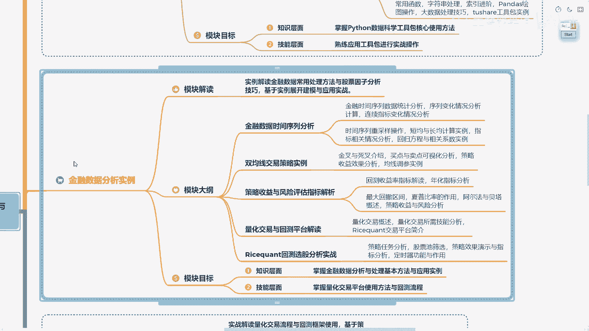
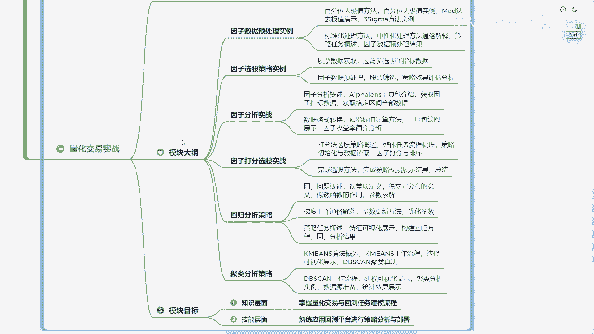
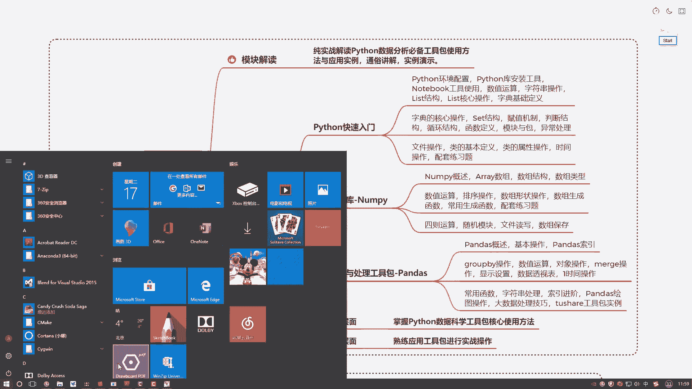
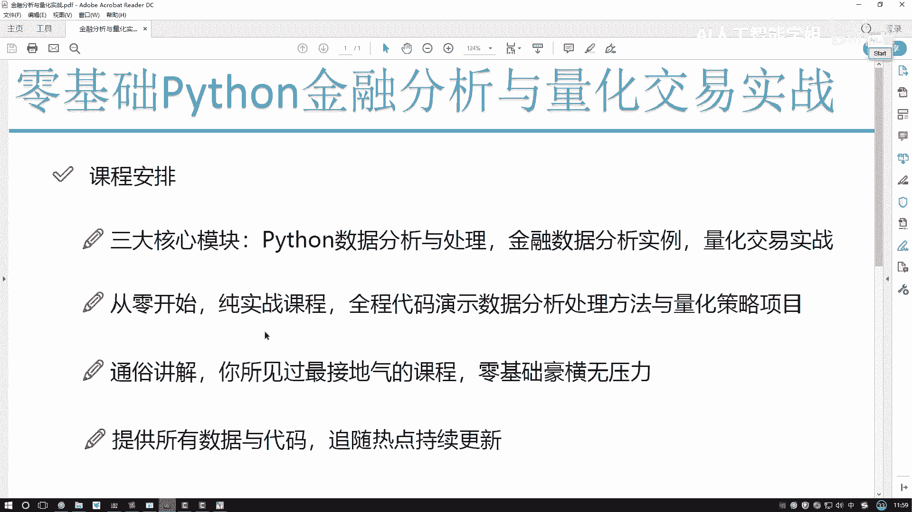

# Python金融量化与股票交易：P1：课程内容与大纲介绍 📚

在本节课中，我们将要学习本课程的整体内容安排、核心模块以及学习路径。课程旨在从零基础开始，通过纯实战的方式，带领大家掌握使用Python进行金融数据分析和量化交易策略开发的全过程。

## 课程核心模块概述

上一节我们介绍了课程的整体目标，本节中我们来看看课程内容是如何组织的。本课程主要围绕以下三大核心模块展开：

1.  **Python数据分析与处理**：学习如何使用Python及其工具包进行数据的获取、处理与分析。
2.  **金融数据分析**：应用Python工具对实际的股票等金融时间序列数据进行操作、分析与统计建模。
3.  **量化交易策略**：学习如何设计交易策略，并在历史数据上进行回测，以评估策略的盈利能力和各项性能指标。

## 课程特色与教学方式

接下来，我们了解一下本课程的教学特色和所使用的工具。

本课程采用纯实战教学，没有传统PPT。教学重点完全放在**代码实现**上，即如何在Python中完成金融分析任务、进行回测并得到结果。

教学将在代码编辑界面中直接进行。所有课程内容均以**实际数据**为例，讲解数据分析、金融数据及时间序列的常用分析方法与统计手段。

以下是课程中将使用的主要工具和环节：

*   **数据分析工具**：我们将使用Jupyter Notebook等环境，演示如何利用Python工具包（如NumPy, Pandas）完成数据分析案例。
*   **回测平台**：当有了交易策略想法后，我们需要在历史数据上检验其效果。课程将介绍如何使用专业的回测平台。
    *   在平台中，我们可以编写策略代码。
    *   运行策略后，可以查看在特定历史时期（如1年、3年）内的回测结果。
    *   结果分析包括：策略收益、与基准（如大盘指数）的比较、超额收益、每日交易详情、持仓变化和账户资金变动等。核心目标是评估“给定初始资金，经过策略运作后是盈利还是亏损”。

## 课程大纲详解

最后，我们详细看一下课程的具体大纲。课程设计为零基础入门，风格通俗接地气，并提供课程中涉及的所有数据和代码。

以下是课程三大模块的详细内容：

*   **模块一：Python必备工具包实战**
    本模块是基础部分，将讲解Python核心知识点、环境配置与安装，并重点介绍两个关键工具包：
    *   **NumPy**：用于数值计算。公式示例：`import numpy as np`
    *   **Pandas**：用于数据分析与处理。代码示例：`import pandas as pd`

*   **模块二：Python金融数据分析实战**
    本模块将过渡到金融领域。我们将拿到真实的股票数据，学习如何对其进行分析、建模和统计。同时，将学习在量化平台中完成第一个回测项目，初步验证策略的历史表现。

*   **模块三：量化交易策略深入实战**
    本模块将深入量化交易核心。我们将学习量化交易中的常用经典策略，探讨在实际操作中如何处理数据、分析因子、改进策略，并最终在历史回测中获得理想的收益结果。

## 总结

本节课中，我们一起学习了《Python金融量化与股票交易》课程的整体框架。我们了解了课程由**Python数据处理**、**金融数据分析**和**量化交易策略**三大实战模块构成，并明确了课程纯代码、重实战的教学特色。从下一节课开始，我们将正式进入模块一的学习，从Python基础工具开始，逐步构建金融量化分析的能力。