# Python金融量化+股票交易：P22：02-2-股票池筛选 📊

在本节课中，我们将学习如何构建一个股票池筛选策略。我们将从沪深300指数成分股出发，根据财务指标（如营业收入）进行排序和筛选，最终选出排名靠前的股票，为后续的交易决策做准备。

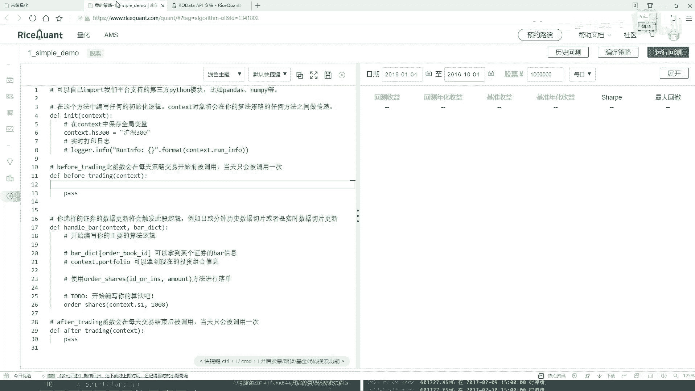

## 策略初始化与股票池设定

上一节我们介绍了量化策略的基本框架，本节中我们来看看如何设定初始的股票池。

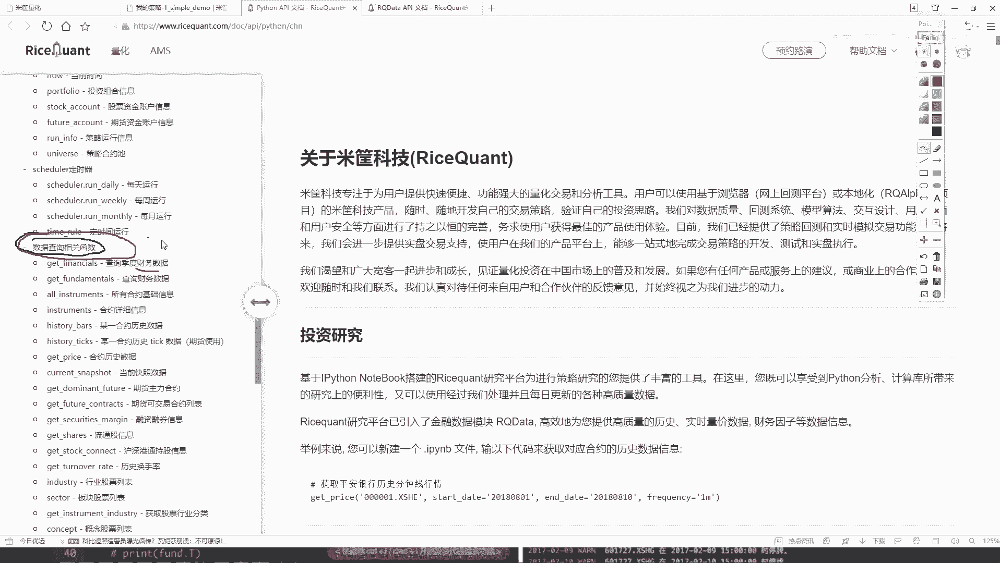

在策略的构造函数中，我们需要定义我们感兴趣的股票池。这里我们选择沪深300指数作为初始的股票池。你可以使用指数名称或代码来指定。

```python
def initialize(context):
    # 设定股票池为沪深300指数成分股
    context.stock_pool = '沪深300'
```

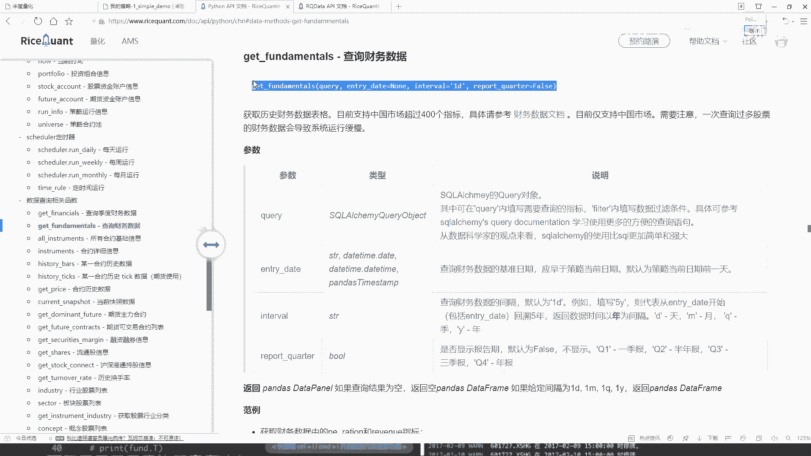

打印信息在此处并非必需，因此可以移除。设定好股票池后，下一步是进行数据预处理。


## 数据预处理与指标查询

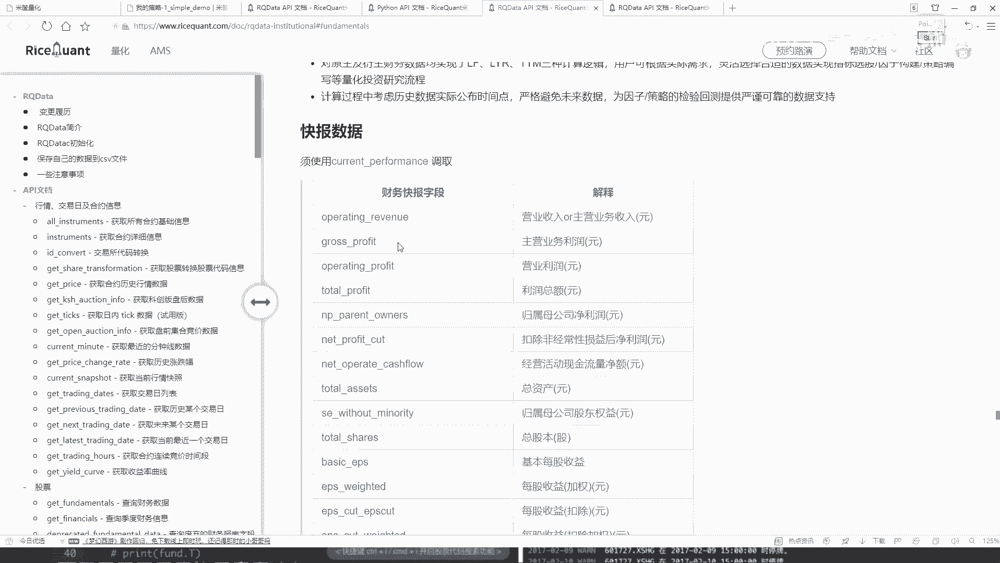

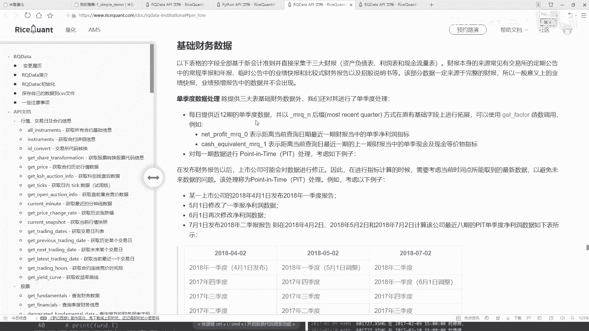

在交易日开始前，我们需要获取并处理相关数据。量化交易的核心是数据挖掘，涉及大量指标。本节课我们仅以营业收入为例进行演示。

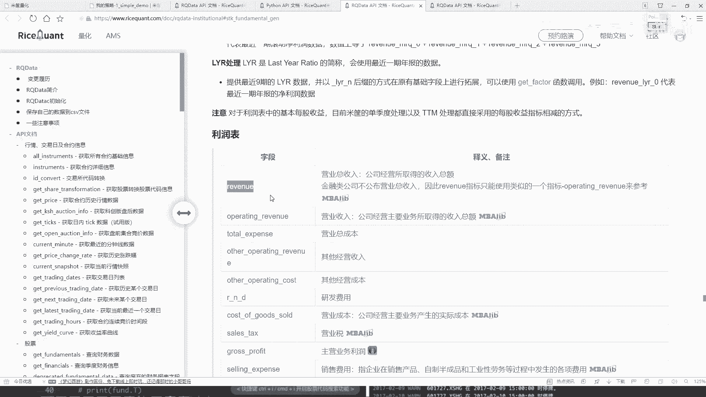

以下是查询财务数据的关键步骤：

1.  **查阅帮助文档**：所有可用的查询函数和指标都在官方帮助文档中。这是获取准确信息的唯一来源。
2.  **使用 `query` 函数**：该函数用于指定要查询的指标。
3.  **使用 `filter` 方法**：用于过滤条件，例如限定股票范围。
4.  **使用 `order_by` 方法**：对查询结果进行排序。
5.  **使用 `limit` 方法**：限制返回结果的数量。

具体实现如下。我们在 `before_trading` 函数中编写预处理逻辑。

```python
def before_trading(context):
    # 构建查询：获取营业收入指标
    q = query(
        fundamentals.financial_indicator.operating_revenue
    ).filter(
        fundamentals.financial_indicator.code.in_(context.stock_pool)
    ).order_by(
        fundamentals.financial_indicator.operating_revenue.desc() # 按营收降序排列
    ).limit(10) # 只取前10名

    # 执行查询，并将结果（一个DataFrame）存入context中供后续使用
    context.filtered_stocks = get_fundamentals(q)
    # 打印结果以供检查
    print(context.filtered_stocks)
```

这段代码首先查询所有股票的营业收入，然后过滤出属于沪深300成分股的股票，接着按营业收入从高到低排序，最后只选取排名前10的股票。

## 运行调试与问题排查

编写完代码后，需要运行回测以检查结果。如果打印出的结果是空的，说明查询可能存在问题。

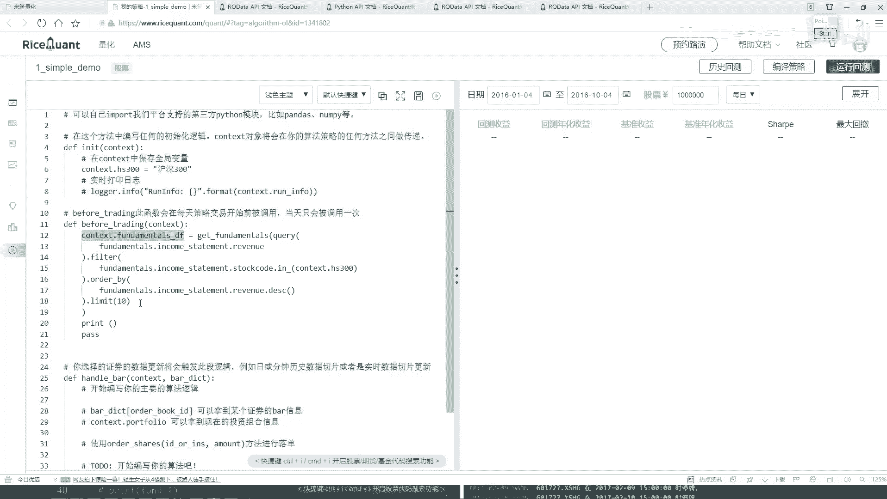

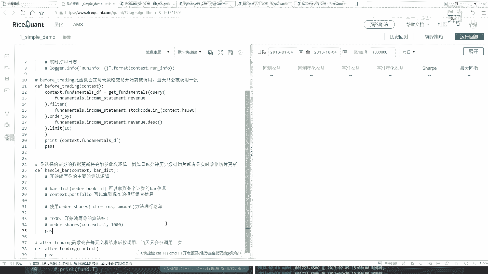

一个常见错误是股票池的指定方式。在之前的代码中，我们直接将字符串 `‘沪深300’` 赋值给了 `context.stock_pool`。然而，在 `filter` 条件中，`.in_()` 方法期望的是一个股票代码列表，而不是一个指数名称。

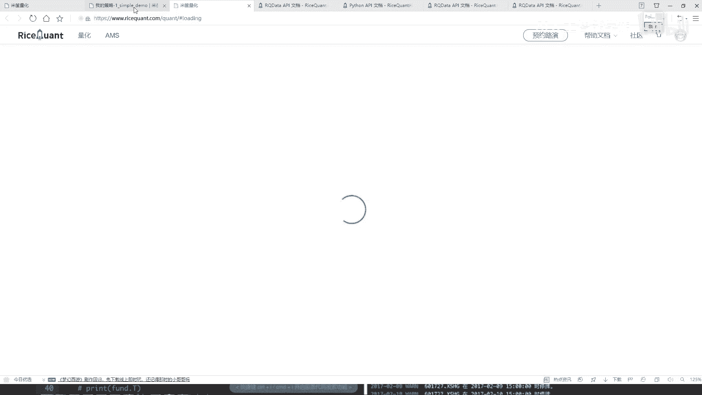

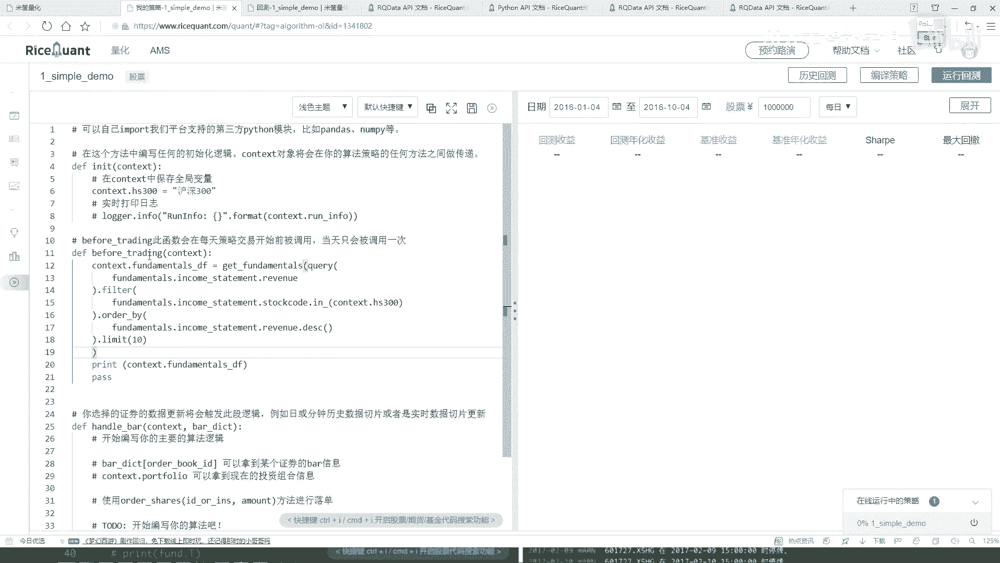

因此，我们需要修正股票池的获取方式，使用专门的函数来获取指数成分股列表。

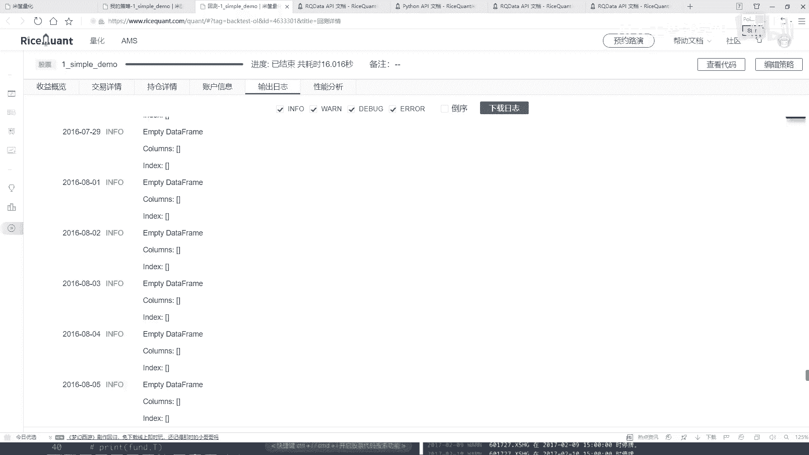

```python
def initialize(context):
    # 修正：获取沪深300指数在指定日期的成分股列表
    context.stock_pool = get_index_stocks('沪深300')
```

修正后再次运行回测，即可在日志中看到每天筛选出的前10只股票及其营业收入数据。数据以 `DataFrame` 格式呈现，横向是股票代码，纵向是具体的财务数值。

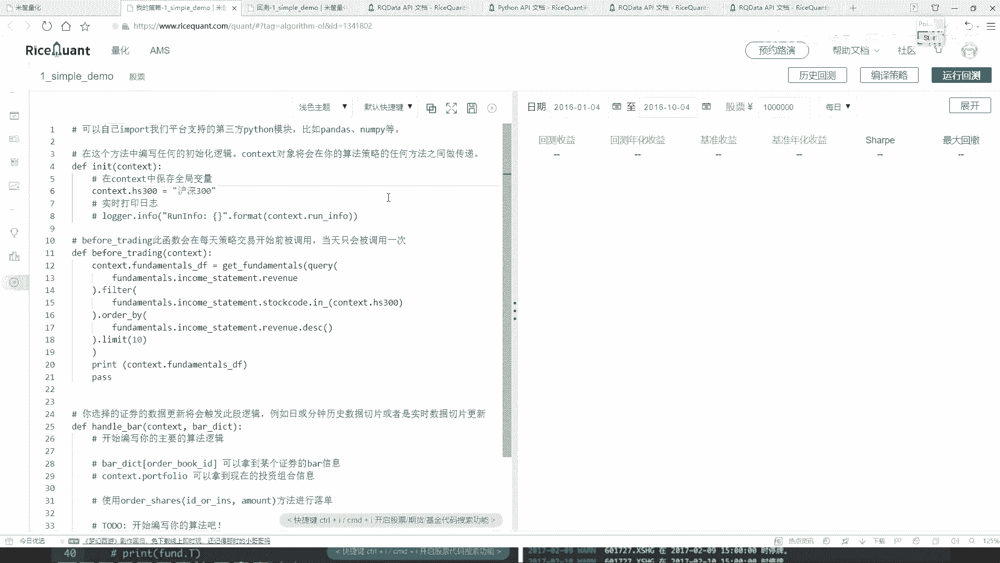


## 总结

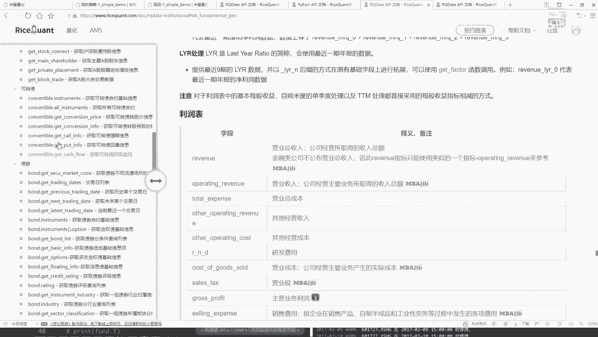


本节课中我们一起学习了股票池筛选的基本流程。


1.  **设定初始股票池**：在 `initialize` 函数中，使用 `get_index_stocks` 函数获取特定指数（如沪深300）的成分股列表。
2.  **数据查询与处理**：在 `before_trading` 函数中，使用 `query`、`filter`、`order_by` 和 `limit` 方法，根据财务指标（如营业收入）从股票池中筛选出目标股票。
3.  **调试与修正**：通过打印中间结果和阅读错误信息，排查并解决了股票池定义不正确的问题。

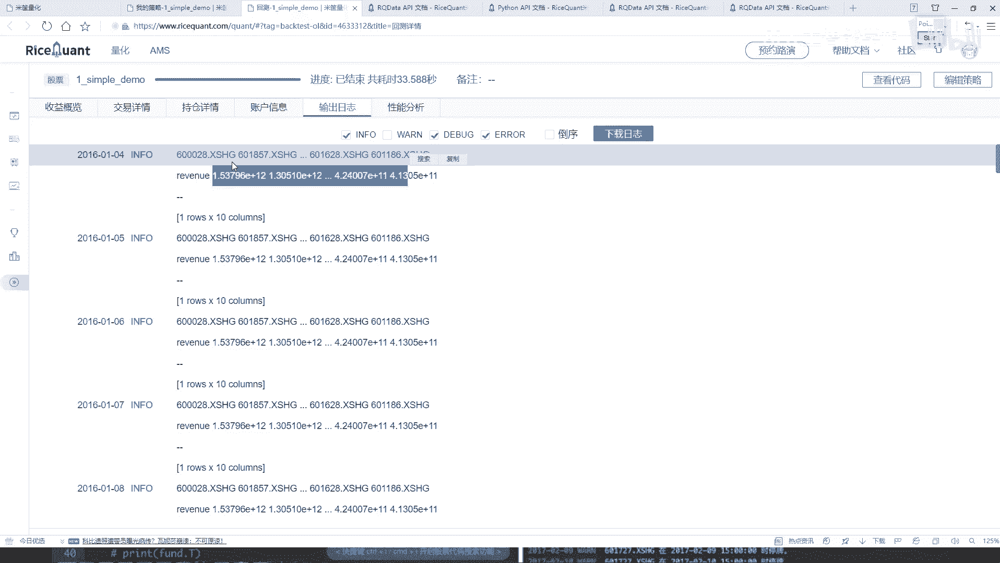

通过本节的学习，你已经掌握了构建一个简单股票筛选器的核心方法。这为后续基于筛选结果进行买卖决策的交易策略打下了坚实的基础。