# Python金融量化+股票交易：P23：03-2-股票池筛选 📊

在本节课中，我们将学习如何构建一个股票池筛选策略。我们将使用财务指标（如营业收入）对沪深300指数成分股进行筛选和排序，最终选出排名靠前的股票，为后续的交易决策做准备。

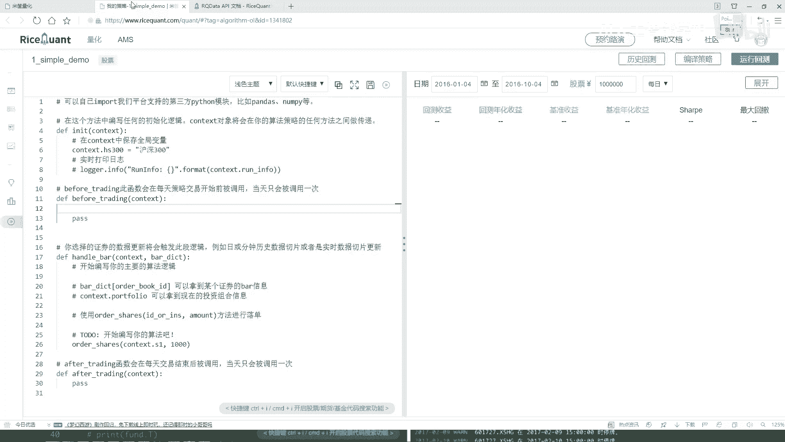

## 策略初始化

上一节我们介绍了策略的基本框架，本节中我们来看看如何初始化一个具体的股票池。

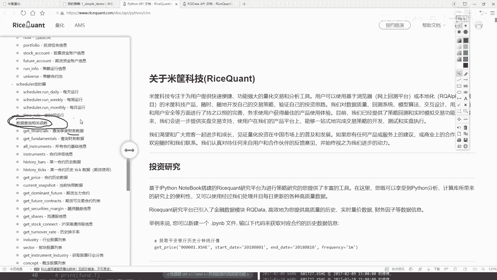

在策略的构造函数中，我们需要定义我们的股票池。这里我们选择沪深300指数作为初始的股票池。你可以使用指数名称或代码来指定。

```python
def initialize(context):
    # 设置股票池为沪深300指数
    context.stock_pool = '沪深300'
```

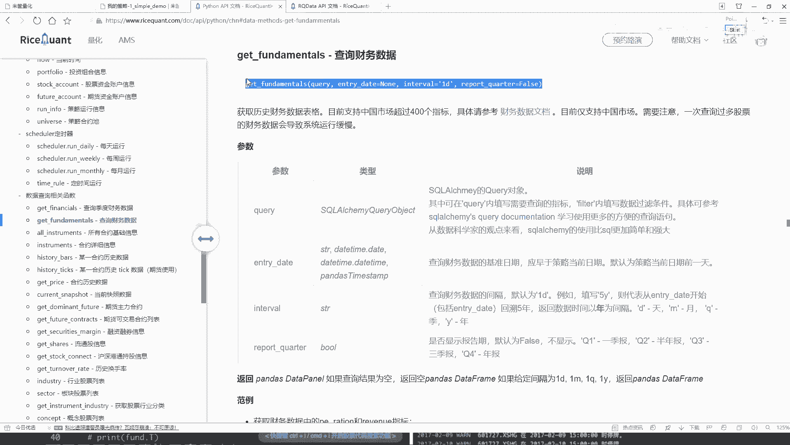

打印信息的部分可以暂时移除。接下来，我们将进入策略的核心预处理部分。

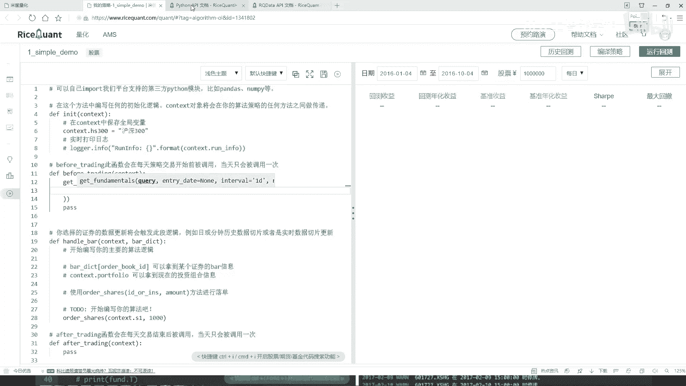

## 数据预处理与筛选

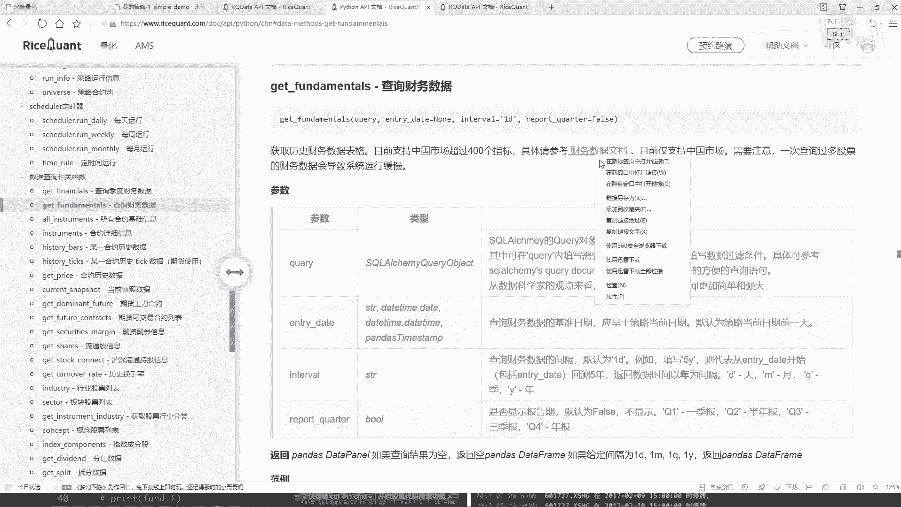

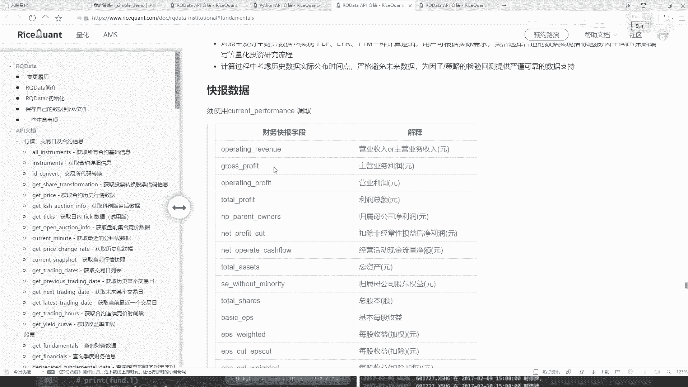

初始化股票池后，我们需要在每天交易开始前，对池中的股票进行筛选。这通常涉及查询财务数据并应用过滤条件。

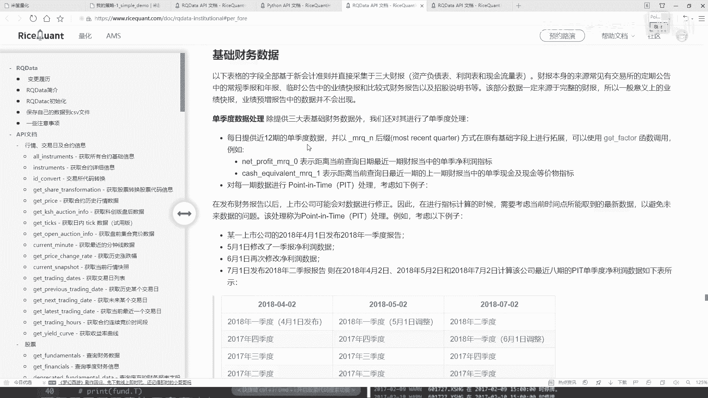

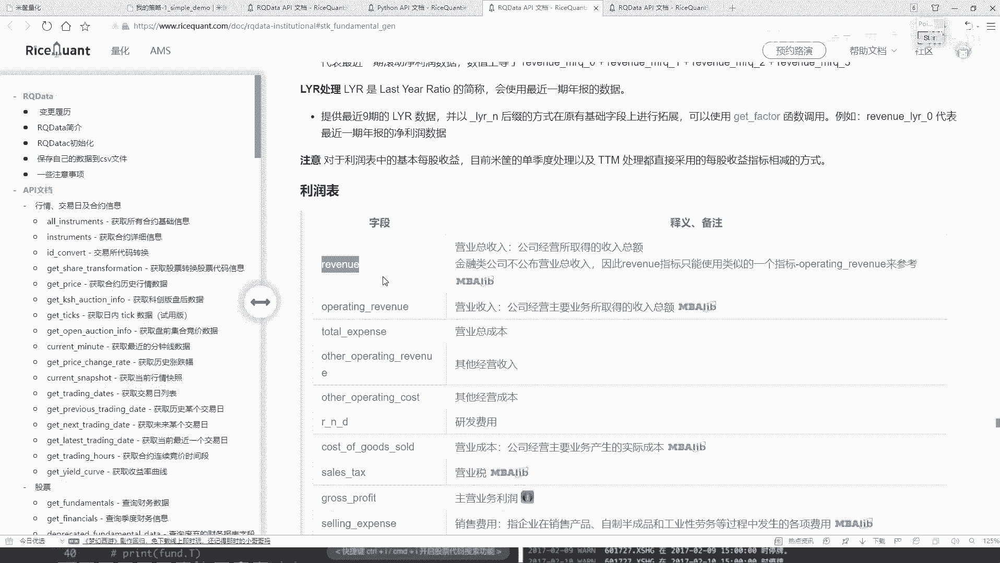

以下是实现这一步骤的关键流程，我们将在`before_trading`函数中完成。

### 1. 查询财务指标

首先，我们需要查询股票的财务数据。量化交易本质上是数据挖掘，涉及大量指标。本节课我们以“营业总收入”为例进行演示。所有可用的指标都可以在平台的帮助文档中找到。

```python
def before_trading(context):
    # 构建查询，获取营业总收入指标
    query = query(
        fundamentals.financial_indicator.operating_revenue
    )
```

### 2. 应用过滤条件

仅有查询还不够，我们需要指定在哪些股票上执行这个查询。这里我们使用`filter`方法，只筛选出属于我们股票池（即沪深300）的股票。

```python
    # 过滤条件：股票代码在沪深300成分股中
    filter_condition = fundamentals.stockcode.in_(context.stock_pool)
```

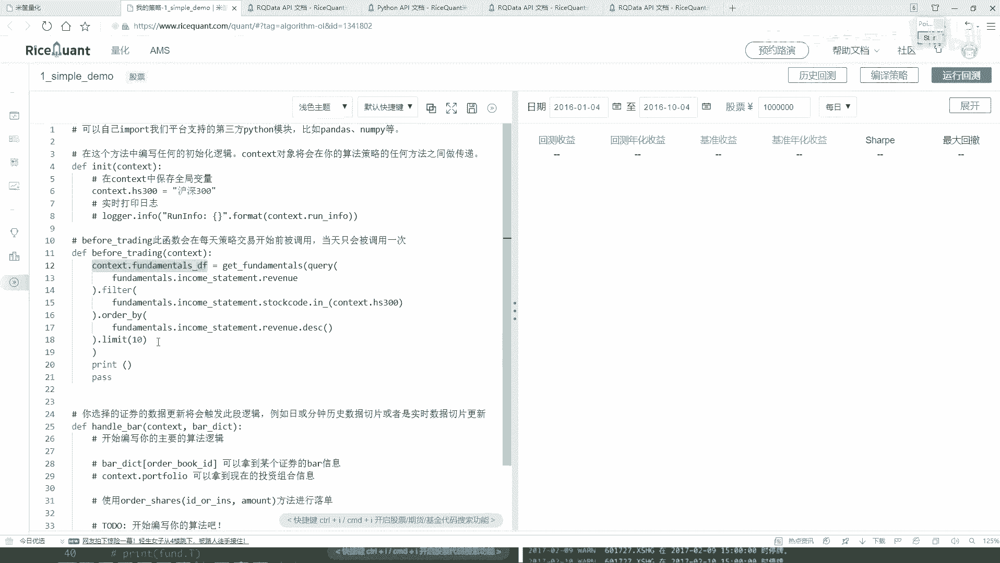

### 3. 排序与限制结果

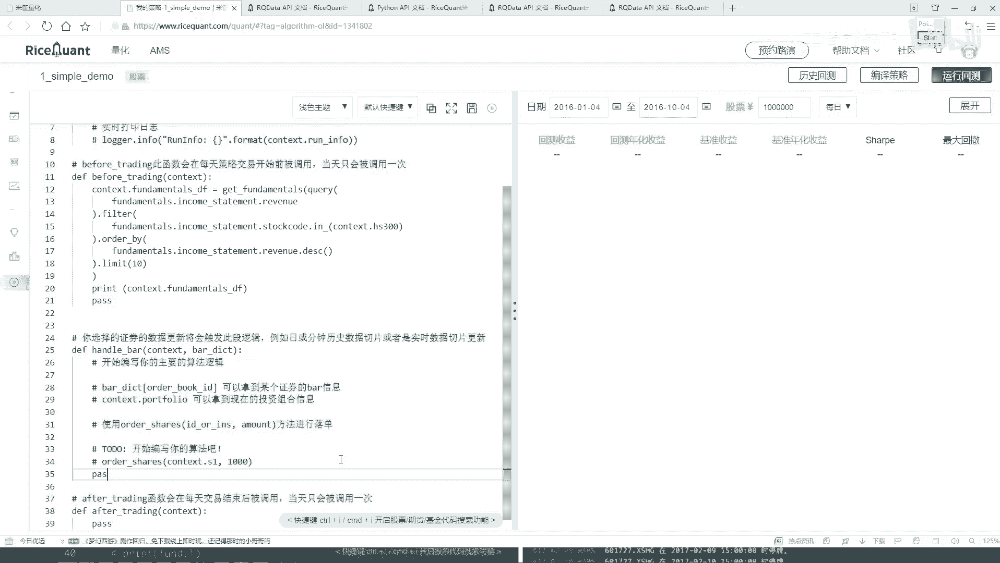


过滤后，我们可能得到多达300只股票。为了选出最理想的标的，我们需要对结果进行排序。这里我们按照营业总收入进行降序排列，并只取排名前10的股票。


```python
    # 按营业总收入降序排列，并限制结果为前10名
    ordered_query = query.filter(filter_condition).order_by(
        fundamentals.financial_indicator.operating_revenue.desc()
    ).limit(10)
```

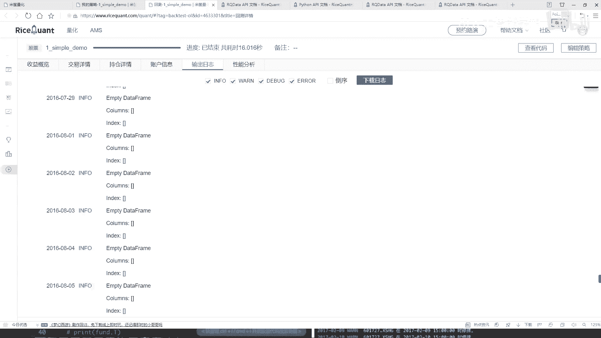

### 4. 执行查询并存储结果

最后，我们执行这个完整的查询，并将结果（一个DataFrame）存储到`context`中，以便在后续的交易函数中使用。为了验证结果，我们可以先将其打印出来。

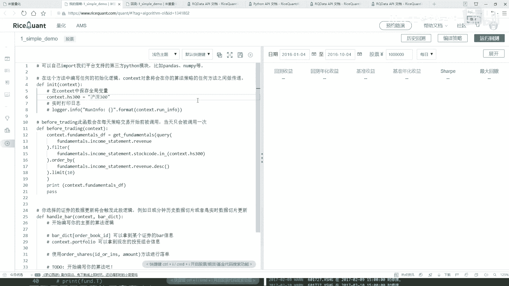

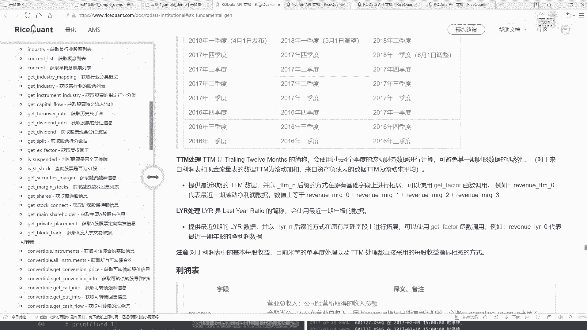

```python
    # 执行查询，将结果存入context
    context.filtered_stocks = get_fundamentals(ordered_query)
    # 打印结果进行验证
    print(context.filtered_stocks)
```


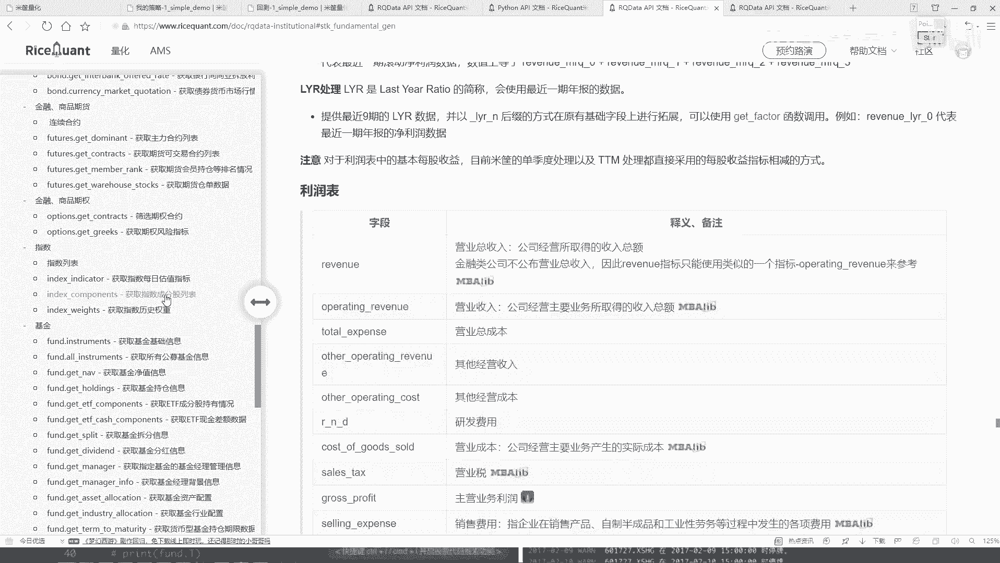

**注意**：在初次运行时，如果打印结果为空，请检查股票池的定义是否正确。确保在获取指数成分股时使用了正确的方法，例如`get_index_stocks(‘沪深300’)`，而不仅仅是字符串‘沪深300’。

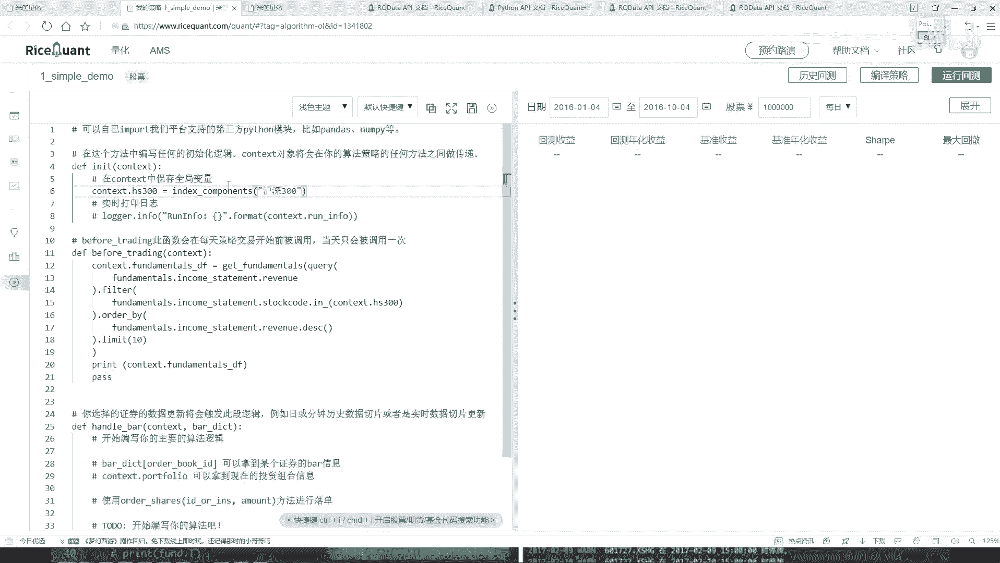

## 总结

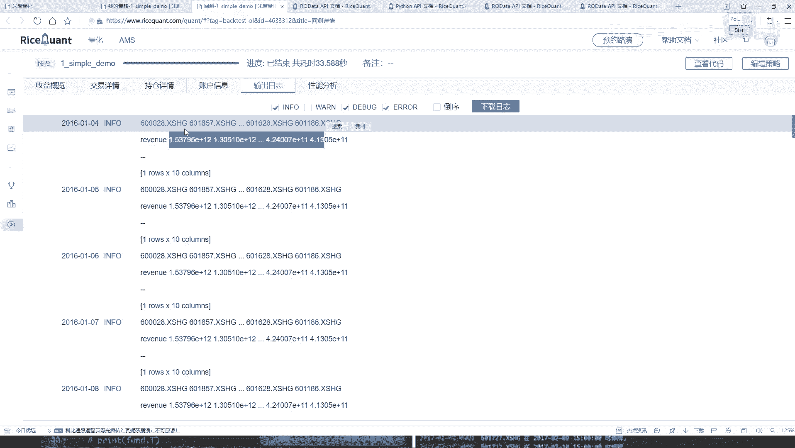

本节课中我们一起学习了股票池筛选的基本流程。我们首先在策略初始化时设定了沪深300作为股票池，然后在每日开盘前，通过查询财务指标、应用过滤条件、排序并限制数量，动态筛选出当日最值得关注的10只股票。这个过程是构建自动化量化交易策略的重要基础步骤。