# Crypto量化教程：P1：火前量化平台概览 🚀

在本节课中，我们将要学习一个名为“火前量化平台”的新型Crypto量化系统。该系统巧妙地将Python的便利性与C++的高效性相结合，旨在帮助开发者快速完成量化策略的开发、回测与实盘部署。

## 平台核心优势

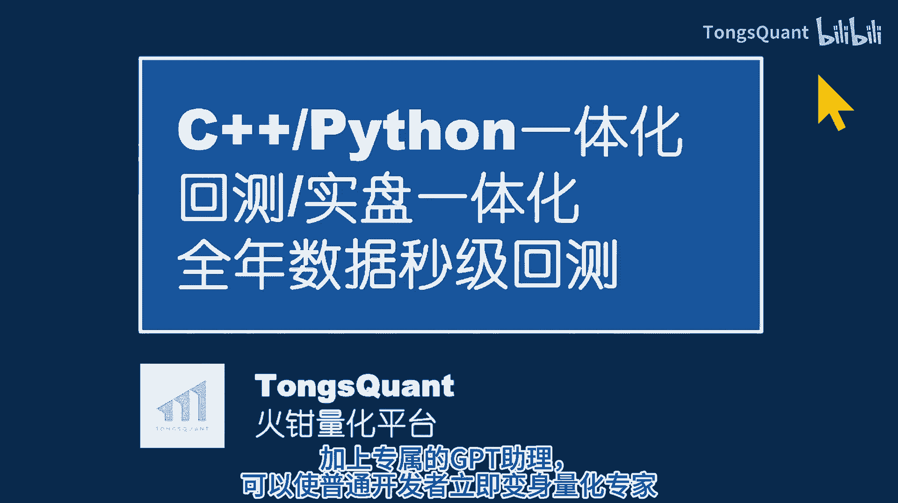

上一节我们介绍了课程目标，本节中我们来看看火前量化平台的核心优势。

火前量化平台有几个突出特点。

以下是其主要特点的详细说明：

1.  **回测与实盘代码统一**：开发者可以编写复杂的策略，使用各种第三方库（包括最新的深度学习技术库）。策略回测完成后，无需修改即可立即投入实盘运行。
2.  **本地化部署与高安全性**：系统部署时仅需拷贝一个文件到目标计算机。这种方式保证了交易所API密钥和策略代码的私密性，无需共享，安全无忧。
3.  **效率与便利的完美结合**：系统核心使用C++开发，运行效率极高。同时，它开放了Python接口用于实现具体的策略算法。这种设计借用了Python的便利性和丰富的第三方库生态，实现了运行效率和开发效率的完美结合。
4.  **经过实盘验证**：TMQUANT平台已在实盘交易中得到充分验证。它实现了实盘所需的各种基本功能，并进行了封装，开发者只需简单调用即可。

## 策略开发流程

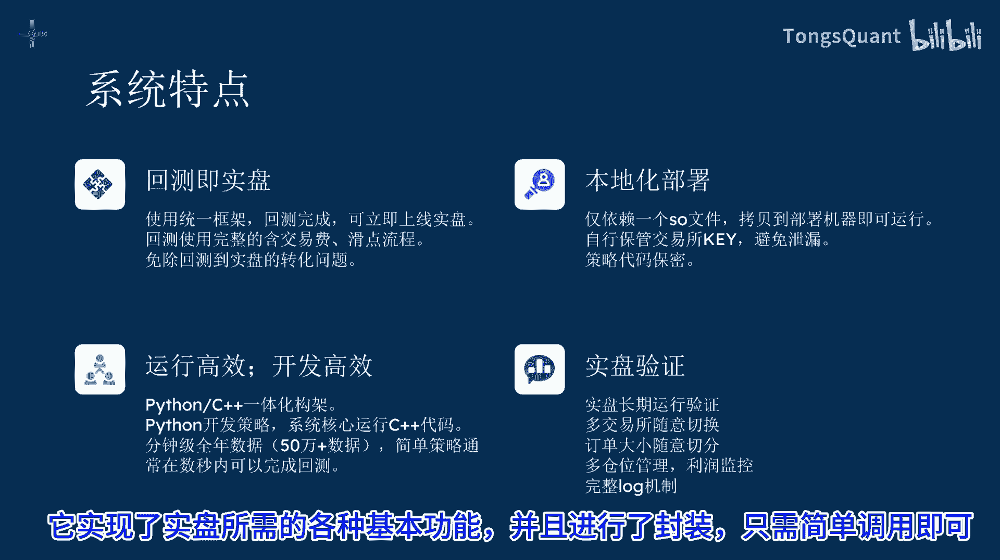

了解了平台的优势后，本节中我们来看看使用该平台开发一个量化策略有多么简单。

以下是一个可以运行的量化策略代码框架：

```python
# 策略初始化代码示例
class MyStrategy(BaseStrategy):
    def __init__(self):
        # 初始化策略所需数据
        super().__init__()

    def algorithm(self, data):
        # 在此处实现核心交易逻辑
        # 例如：展示ETH价格
        print(f"ETH Price: {data['price']}")
        pass

# 运行策略（回测模式）
if __name__ == "__main__":
    strategy = MyStrategy()
    # 回测时参数为 True
    strategy.run(backtest=True)
    # 实盘时只需将 True 改为 False
    # strategy.run(backtest=False)
```

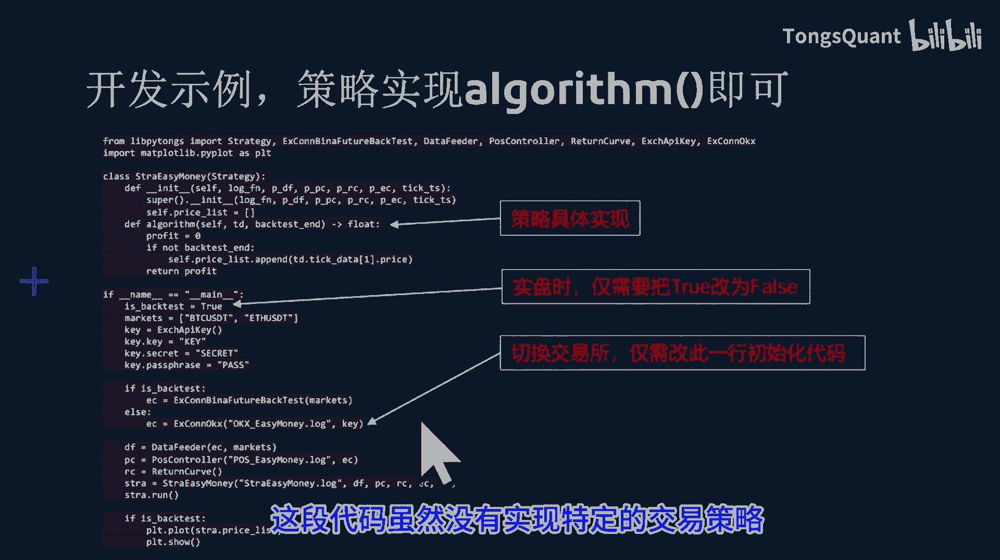

完成一个策略，主要是完成 `algorithm` 函数，加上一些策略所需的初始化数据。然后继承基类，直接运行即可。回测完成后，只需将参数 `backtest=True` 改为 `backtest=False`，就可以立即切换到实盘运行。切换交易所也只需修改一句初始化代码。

这段代码虽然没有实现特定的交易策略，但是它是可以运行的。它利用了回测数据，展示了ETH的价格。运行Github上的演示代码，可以直观感受实现策略的轻松程度和回测研究的高效率。

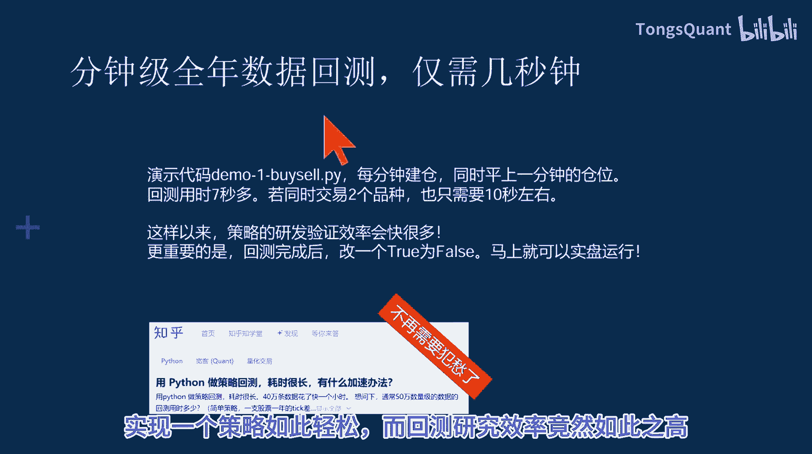

## 合约交易操作

现在，我们来看一下在策略中如何进行具体的合约开仓与平仓操作。

以下是开仓与平仓的代码示例：

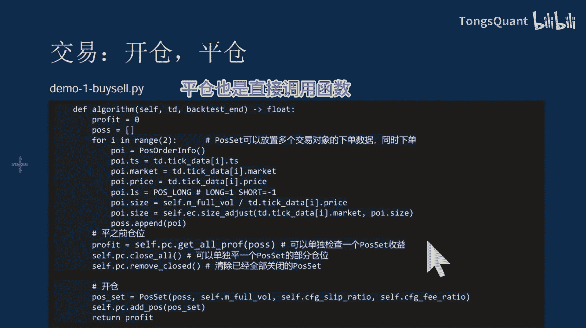

```python
# 开仓操作示例
# 创建一个订单对象
order = Order(
    symbol="ETH-USDT-SWAP",  # 交易对象
    timestamp=current_time,   # 时间
    quantity=1.0,            # 下单数量
    side=OrderSide.BUY,      # 多空方向，例如：BUY (多) 或 SELL (空)
    slippage=0.001,          # 滑点参数
    fee_rate=0.0005          # 手续费率参数
)
# 调用仓位管理函数开仓
position_manager.open_position(order)

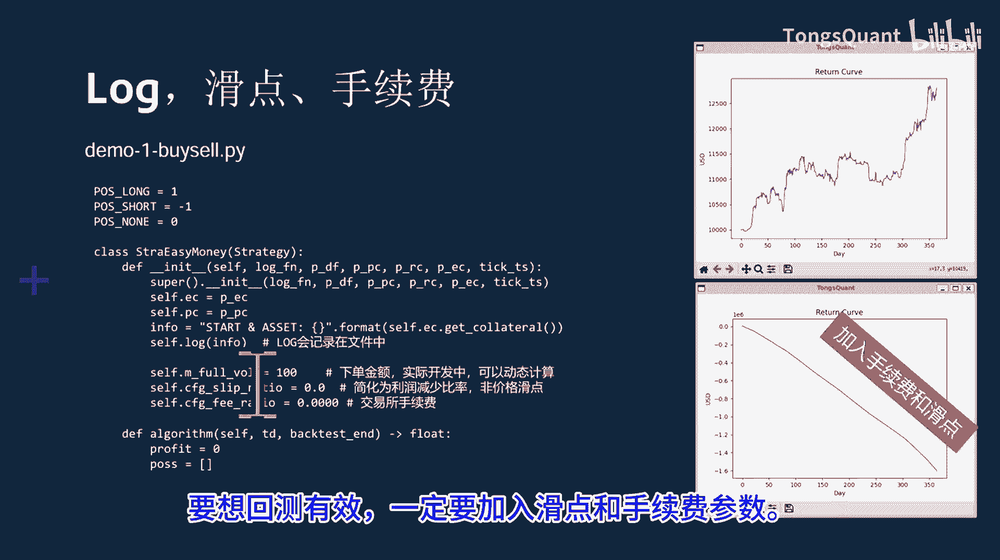

# 平仓操作示例
# 直接调用平仓函数，通常需要指定平仓数量或比例
position_manager.close_position(symbol="ETH-USDT-SWAP", percentage=1.0)
```

开仓操作就是创建一个 `Order` 类实例，然后调用仓位管理的函数即可创建委托单。需要提供的参数包括交易对象、时间、下单数量、多空方向等。平仓也是直接调用对应的函数。

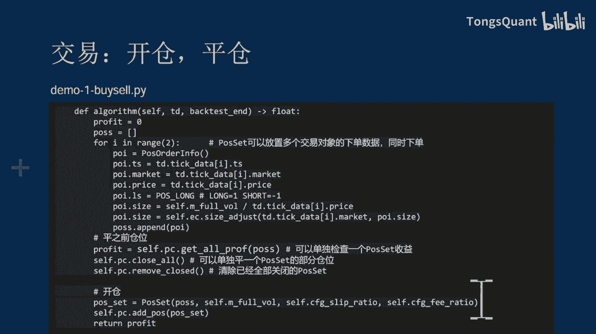

## 回测关键参数

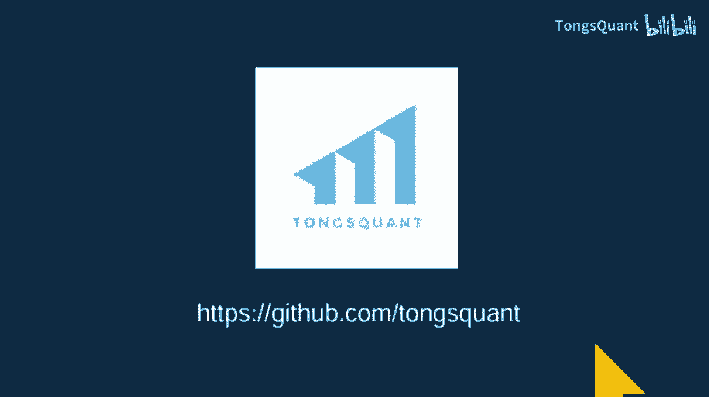

要想回测结果贴近真实市场，必须考虑交易成本。

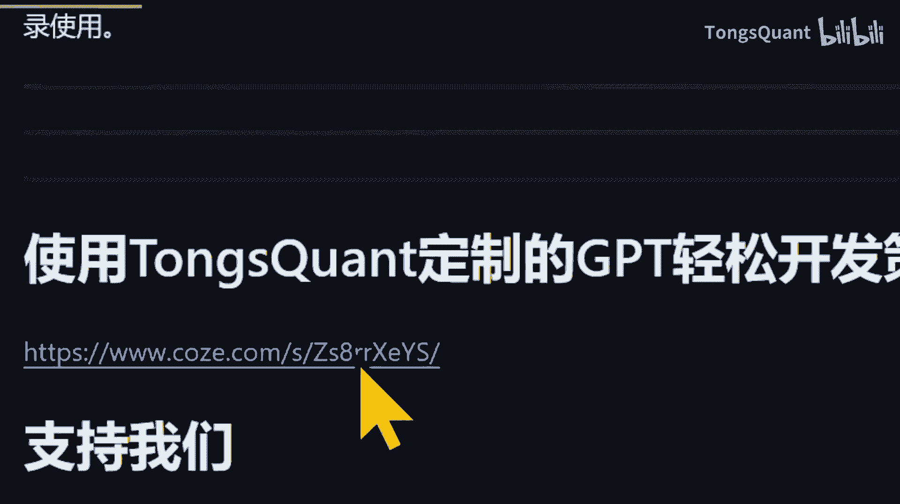

在开仓时需要传入**滑点**和**手续费**参数，用于计算更真实的收益。这两个参数是评估策略盈利能力的关键因素。

具体的实现细节和完整演示代码，请查看项目的Github仓库。

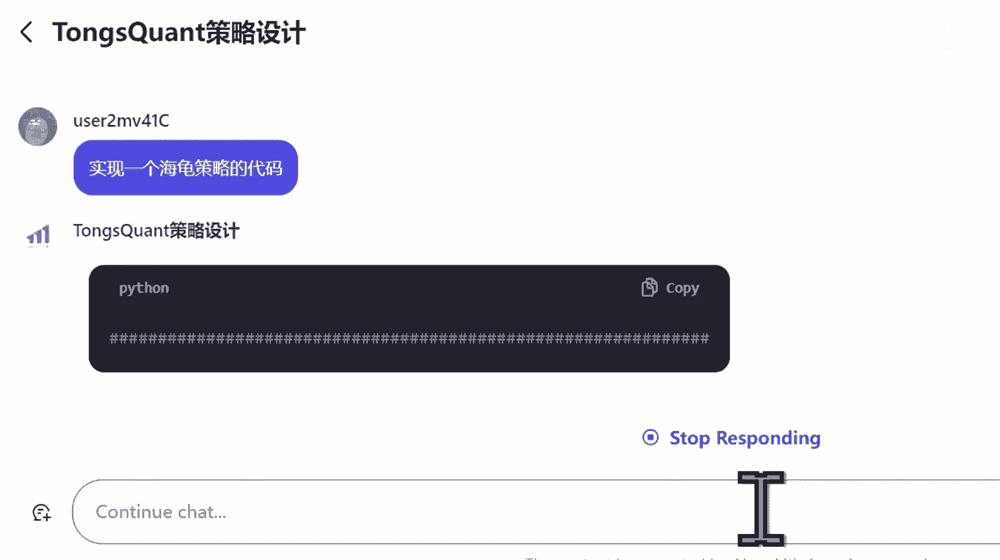

## 利用AI辅助开发

我们也可以使用GPT来辅助我们进行策略开发。

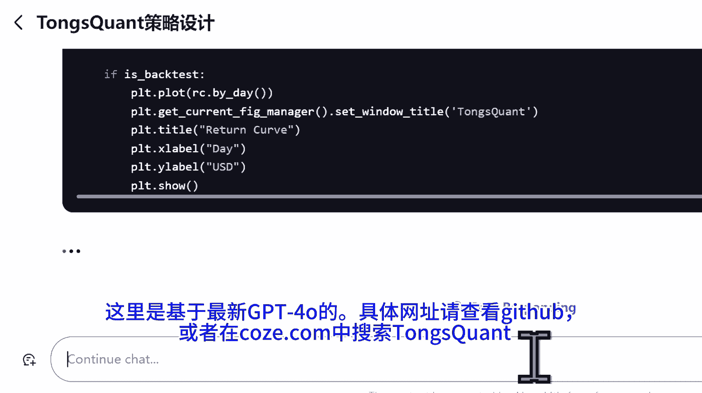

可以让为TMQUANT定制的GPT助手直接生成策略代码。该助手基于最新的GPT-4o模型构建。具体网址请查看Github文档，或在相关平台搜索“TMQUANT”。

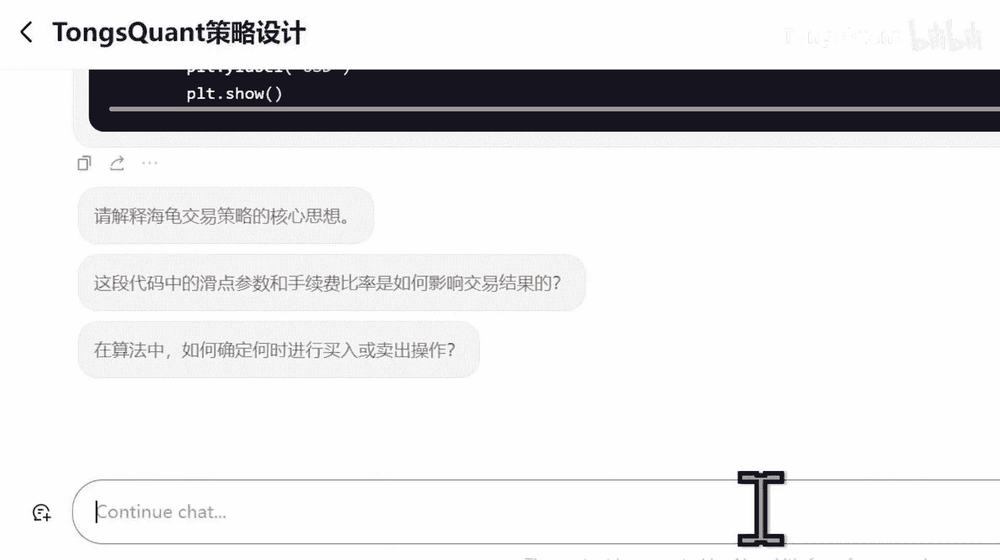

这个定制GPT生成的代码，基本上都可以直接在TMQUANT平台上运行。后续会推出专门介绍TMQUANT与GPT结合开发的视频教程。

## 总结与资源

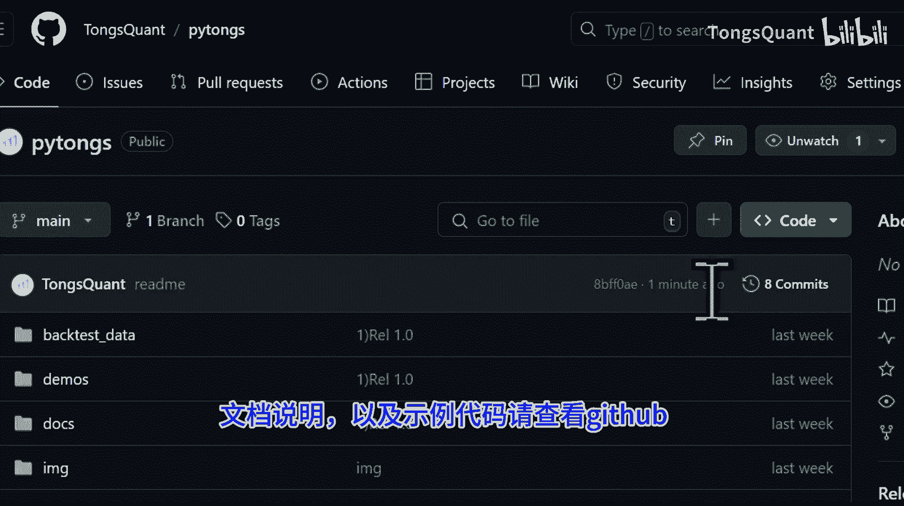

本节课中，我们一起学习了火前量化平台（TMQUANT）的概要。该平台通过结合C++的高性能和Python的易用性，为Crypto量化交易提供了一个高效、安全且便捷的开发环境。

我们了解了其核心优势、简单的策略开发流程、基本的合约交易操作方法，以及回测中关键的成本参数设置。最后，还介绍了如何利用AI工具辅助开发。

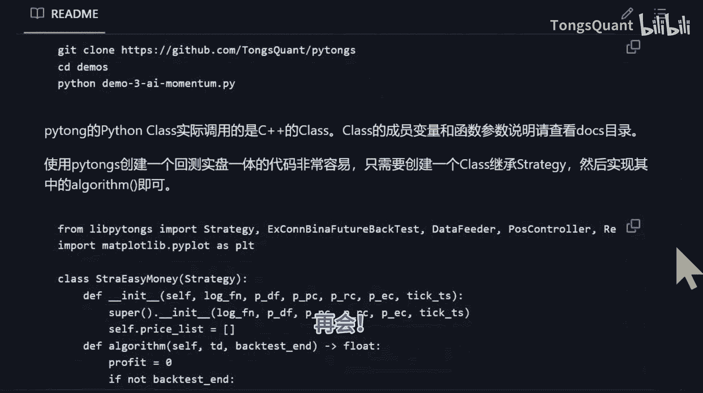

文档说明、示例代码及更多资源，请查看项目Github仓库。TMQUANT是免费平台，希望对你的交易有所帮助。