# 时间序列预测：1：Darts入门与单变量股价预测 📈

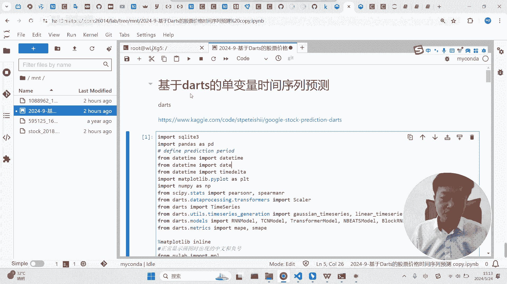

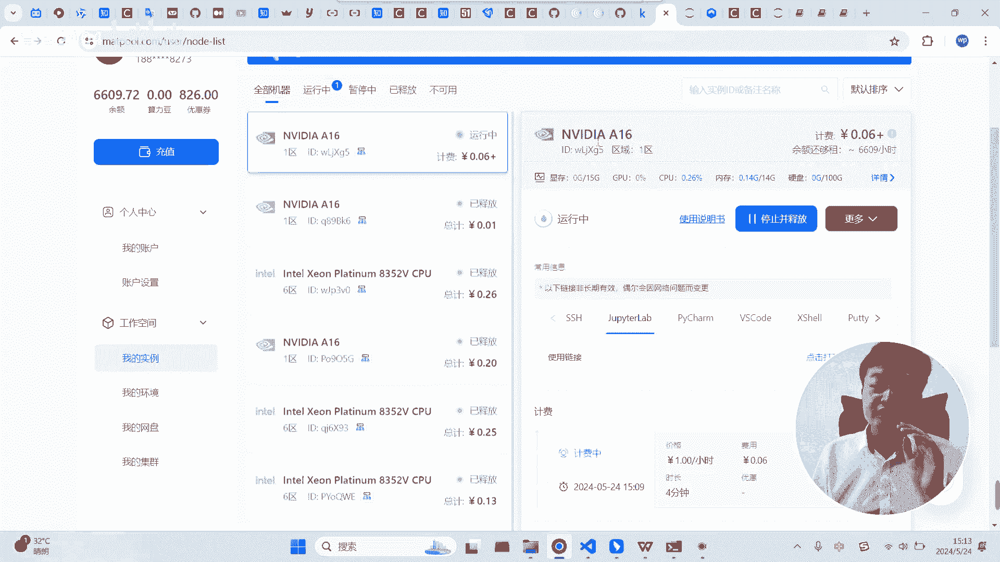

## 概述
在本节课中，我们将学习如何使用Darts库进行时间序列预测。Darts是一个强大的工具，它封装了多种深度学习算法，使得进行时间序列预测的流程变得像使用Scikit-learn一样简单。我们将从一个单变量股价预测的案例开始，了解Darts的基本使用方法。

## 为什么选择Darts？
当前，基于深度学习的时间序列预测方法效果通常优于传统的ARIMA等模型。Darts库的优势在于，它提供了大量基于深度学习的预测函数，并且封装得非常好。这意味着用户无需处理复杂的数据预处理、网络搭建等底层细节，可以专注于预测任务本身。

## 数据准备与处理
要使用Darts，首先需要正确安装库及其依赖（如PyTorch）。接下来，我们将以比亚迪股票数据为例，演示如何将原始数据转换为Darts可用的格式。

### 读取与选择数据
首先，我们读取数据并选择比亚迪的股票数据。这里使用了股票代码来筛选出特定股票，并提取其日期和收盘价。

```python
# 示例：读取并筛选比亚迪股票数据
# 假设df是包含所有股票数据的DataFrame
stock_code = ‘002594’  # 比亚迪股票代码
byd_data = df[df[‘code’] == stock_code][[‘date’, ‘close’]].copy()
```

### 数据格式转换
Darts要求时间列必须是`datetime`类型，并且时间序列不能有缺失的日期。

1.  **转换日期格式**：将日期列转换为字符串，再转换为`datetime`类型。
    ```python
    byd_data[‘date’] = pd.to_datetime(byd_data[‘date’].astype(str))
    ```

2.  **创建完整日期序列**：股票数据在非交易日没有记录，但Darts要求连续日期。因此，我们需要创建一个包含预测范围内所有日期的完整日期表。
    ```python
    start_date = byd_data[‘date’].min()
    end_date = byd_data[‘date’].max()
    all_dates = pd.date_range(start=start_date, end=end_date, freq=‘D’)
    date_df = pd.DataFrame({‘date’: all_dates})
    ```

3.  **合并与填充数据**：将原始数据与完整日期表合并，非交易日的收盘价会出现空值。我们使用前向填充的方法来填补这些空值。
    ```python
    merged_data = pd.merge(date_df, byd_data, on=‘date’, how=‘left’)
    merged_data[‘close’].fillna(method=‘ffill’, inplace=True)
    ```

### 构建Darts时间序列
处理好的数据需要转换成Darts库特有的`TimeSeries`对象。

```python
from darts import TimeSeries

# 创建TimeSeries对象
series = TimeSeries.from_dataframe(merged_data, time_col=‘date’, value_cols=‘close’)
```

## 数据标准化
为了提升模型训练效果，通常需要对数据进行标准化。这里采用了一种简单的方法：将所有收盘价除以最大值，将其缩放至0到1之间。

```python
# 使用Scikit-learn的MinMaxScaler进行标准化
from sklearn.preprocessing import MinMaxScaler
scaler = MinMaxScaler()
scaled_values = scaler.fit_transform(series.values().reshape(-1, 1))
scaled_series = TimeSeries.from_times_and_values(series.time_index, scaled_values)
```

## 模型训练与预测
上一节我们准备好了数据，本节中我们来看看如何使用Darts进行模型训练和预测。其流程与Scikit-learn高度相似。

### 划分数据集
首先，将时间序列划分为训练集和测试集。

```python
# 假设共有720个数据点，用前600个训练，后120个测试
train, test = scaled_series.split_before(0.833)  # 600/720 ≈ 0.833
```

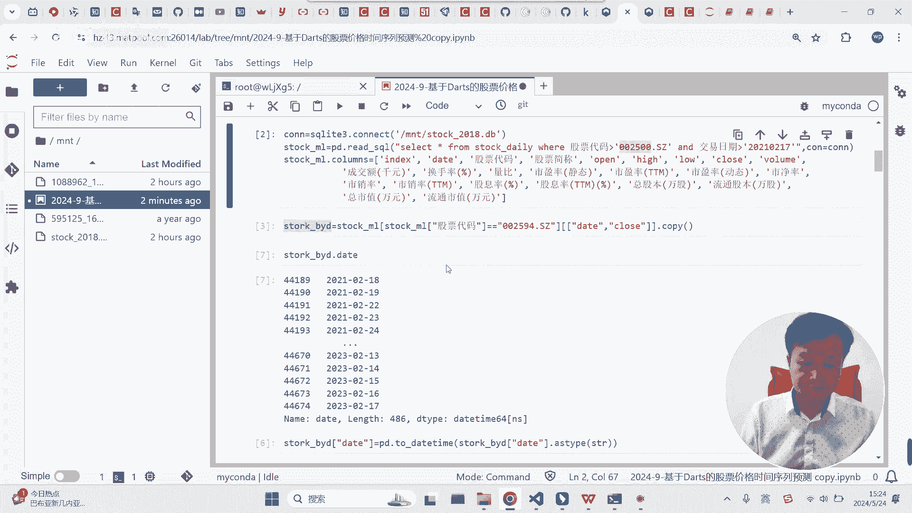

### 选择与定义模型
Darts提供了多种深度学习模型，如RNN、LSTM、Transformer等。以下是如何定义一个模型：

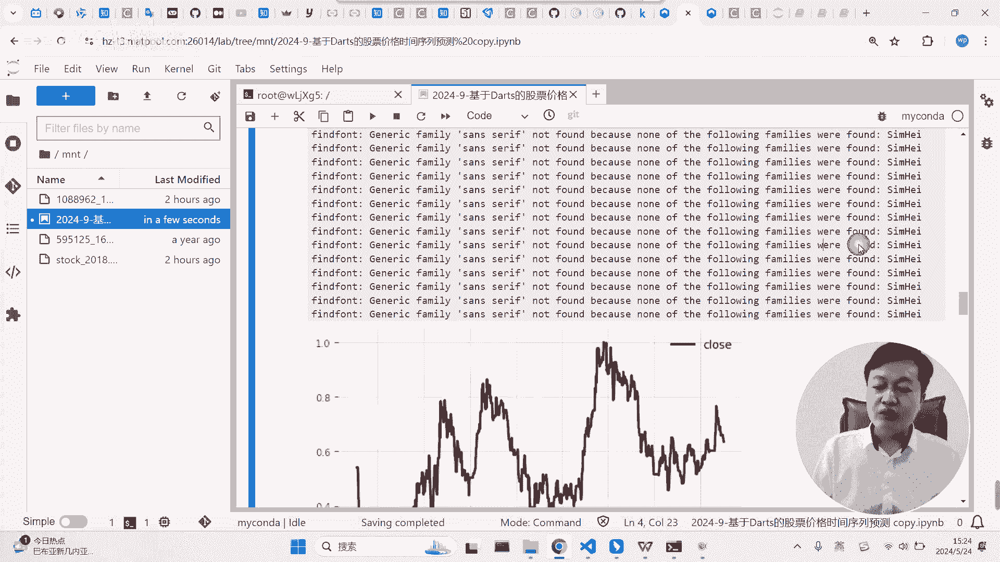

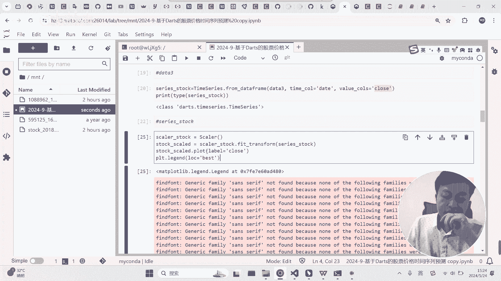

```python
from darts.models import RNNModel  # 这里以RNN模型为例

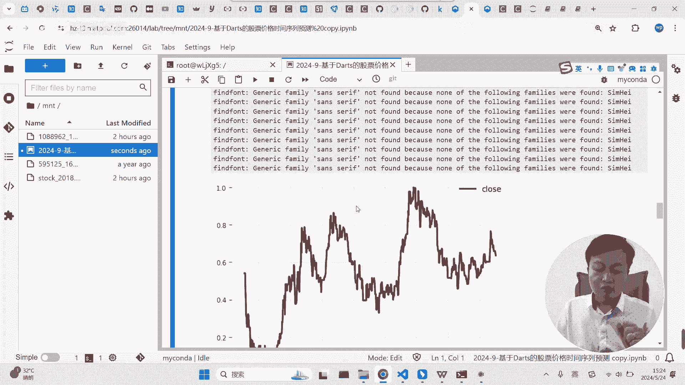

model = RNNModel(
    model=‘LSTM’,
    input_chunk_length=24,  # 使用过去24个时间步作为特征
    output_chunk_length=12,  # 预测未来12个时间步
    n_epochs=100  # 训练轮数
)
```

**核心参数解释**：
*   **`input_chunk_length`**：模型每次查看的历史数据点数量。这里是用过去24天的收盘价。
*   **`output_chunk_length`**：模型一次性预测的未来数据点数量。这里是预测未来12天的收盘价。
*   **`n_epochs`**：模型训练的迭代次数。

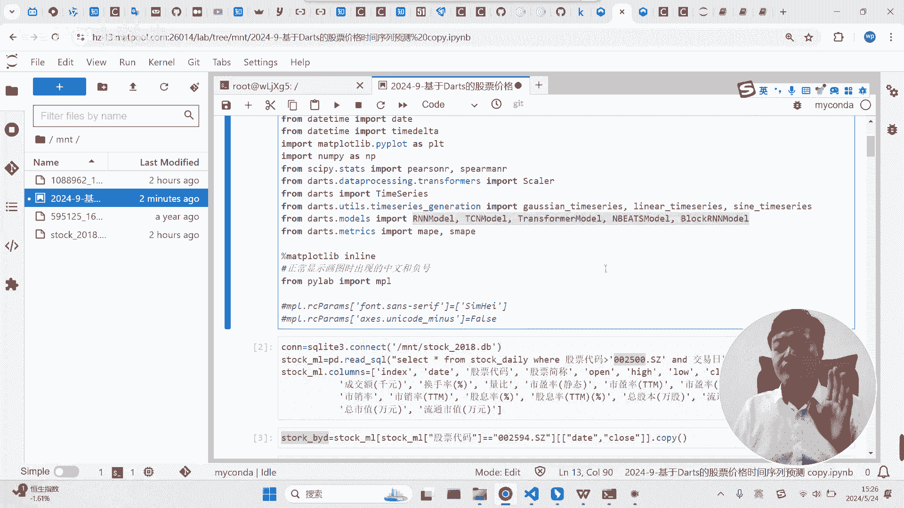

### 训练模型
训练过程非常简单，只需调用`fit`方法并传入训练数据。

```python
model.fit(train)
```

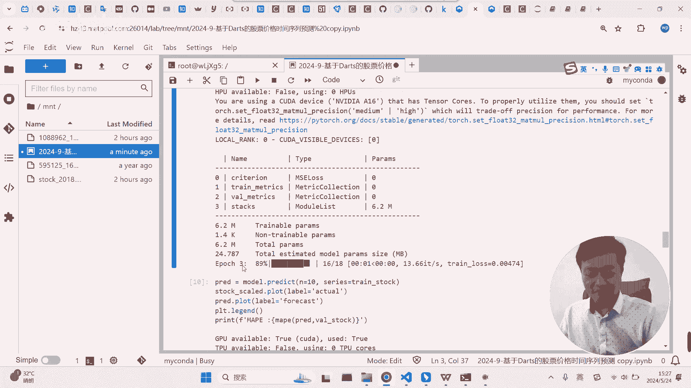

### 进行预测
模型训练完成后，可以使用`predict`方法进行预测。

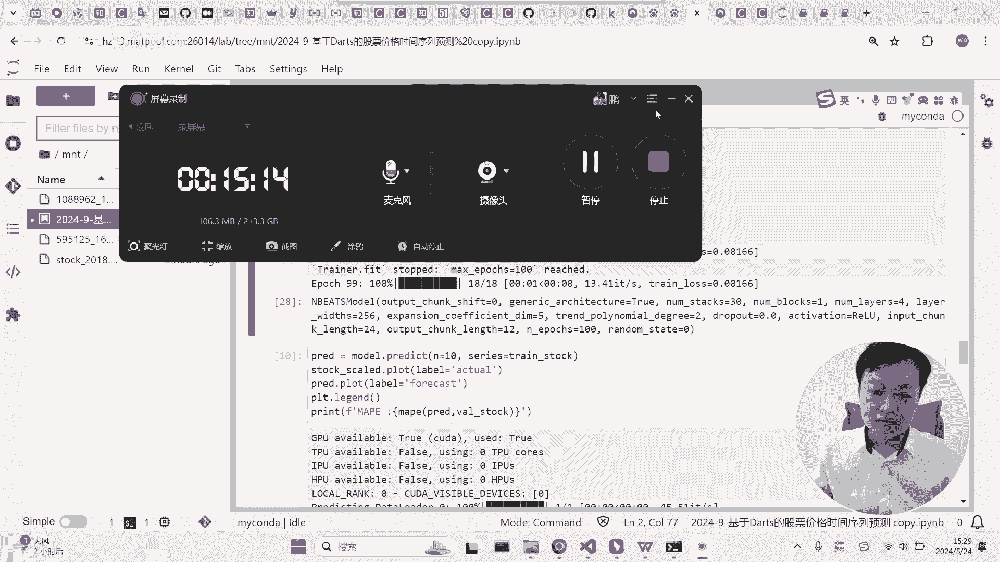

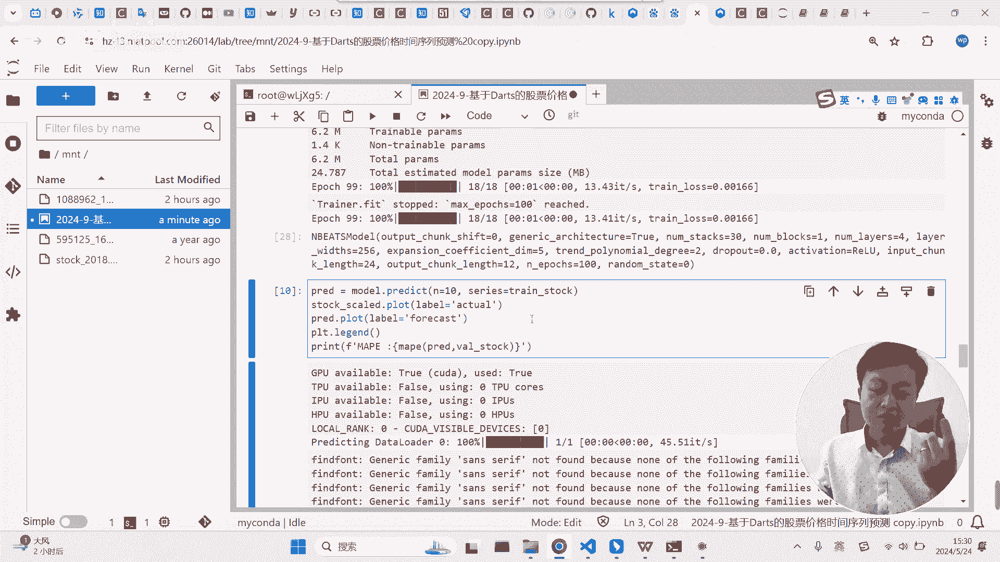

```python
# 预测训练集之后未来n个时间步的值
prediction = model.predict(n=10, series=train)
```
这里的`n=10`表示从训练集最后一个时间点开始，预测接下来的10个值。虽然模型原本设计是预测12步(`output_chunk_length=12`)，但它可以递归地进行更长期的预测。

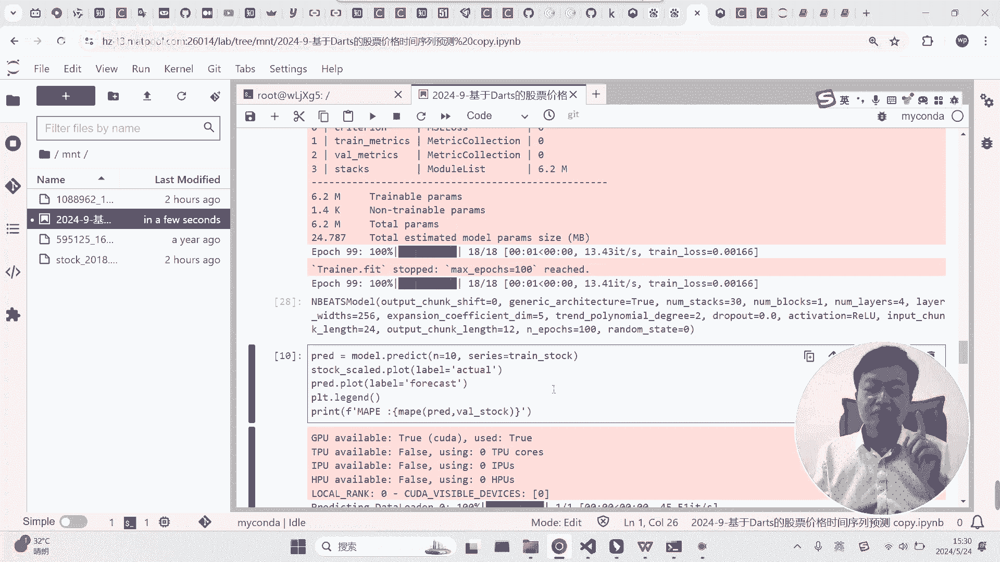

## 结果可视化
最后，我们可以将预测结果与真实值进行对比可视化。

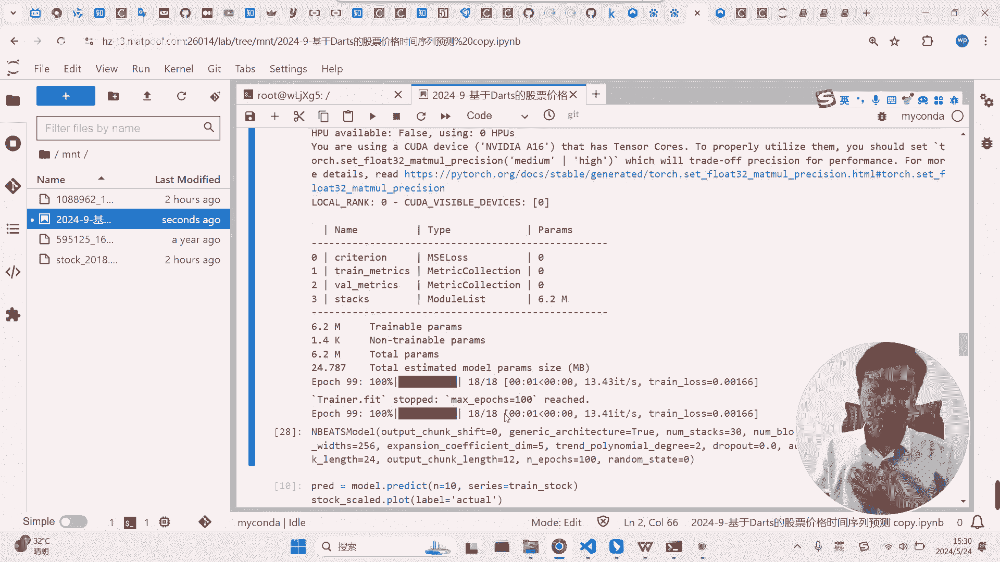

```python
import matplotlib.pyplot as plt

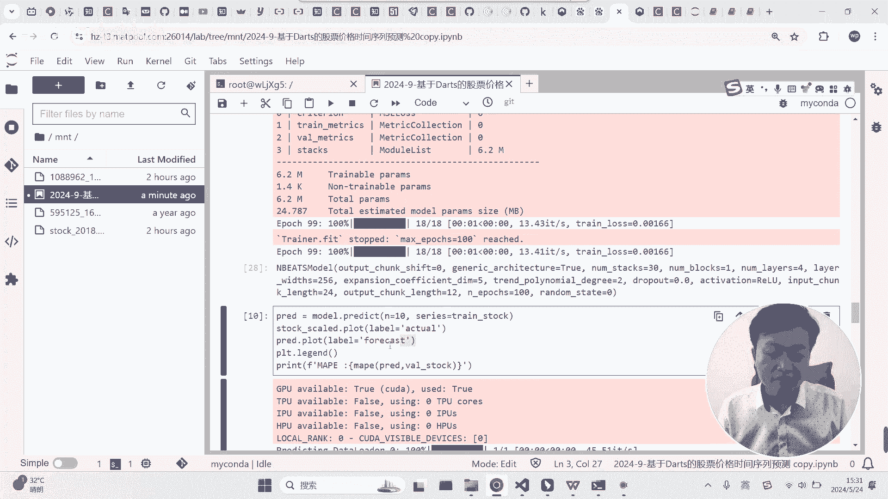

scaled_series.plot(label=‘实际值’)
prediction.plot(label=‘预测值’, lw=2)
plt.legend()
plt.show()
```

**重要提示**：股价预测极具挑战性，因为价格受众多复杂因素影响。因此，不要期望模型预测结果完全准确。模型更多是学习历史数据中的趋势和波动模式。

## 核心流程总结
回顾整个流程，使用Darts进行时间序列预测的核心步骤非常固定：

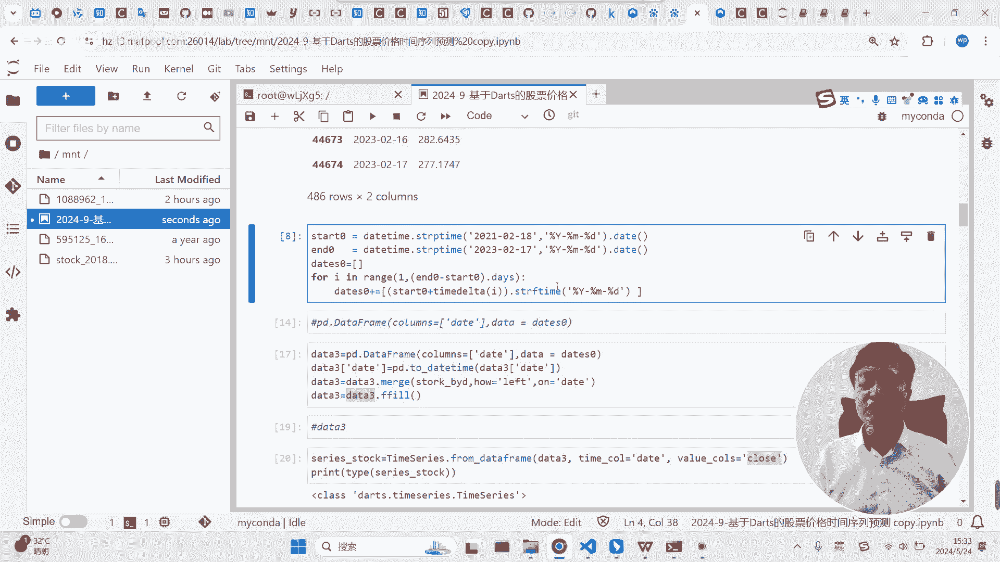

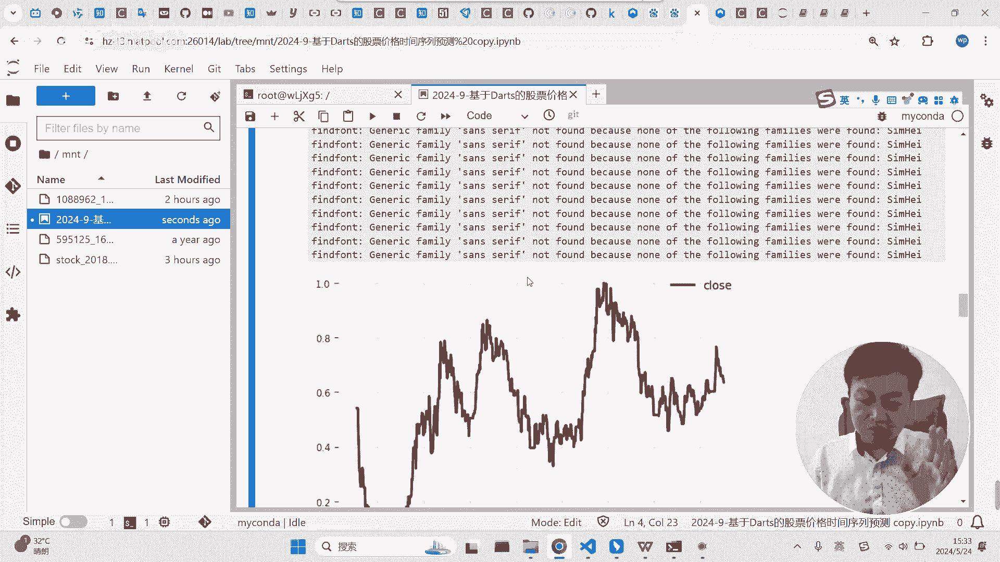

1.  **数据准备**：确保时间列为`datetime`格式，并填补所有缺失的日期。
2.  **序列转换**：使用`TimeSeries.from_dataframe`将DataFrame转换为Darts的`TimeSeries`对象。
3.  **数据标准化**：对数值进行缩放，通常有助于深度学习模型训练。
4.  **划分数据集**：按时间顺序划分训练集和测试集。
5.  **定义与训练模型**：选择模型，设置参数（重点是`input_chunk_length`和`output_chunk_length`），并调用`fit`方法。
6.  **预测与评估**：使用`predict`方法进行预测，并可视化结果。

唯一的难点通常在于**第一步的数据准备**，必须满足Darts对时间序列连续性和格式的要求。一旦数据格式正确，后续的建模和预测流程就变得非常直观和高效。

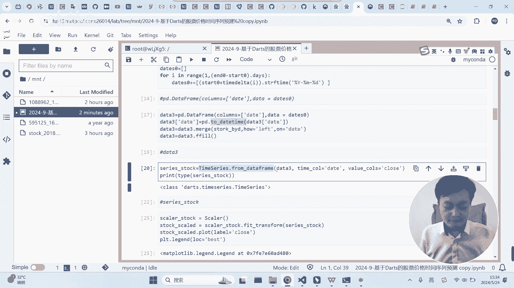

## 总结
本节课中，我们一起学习了Darts库在单变量时间序列预测中的应用。我们从安装环境开始，逐步完成了数据读取、格式转换、标准化、模型训练和预测的完整流程。Darts通过其优秀的封装，大大降低了使用深度学习进行时间序列预测的门槛。记住，处理数据使其符合`TimeSeries`对象的要求是关键的第一步。掌握了这个基本流程后，你就可以尝试使用Darts中更复杂的模型和多变量预测功能了。