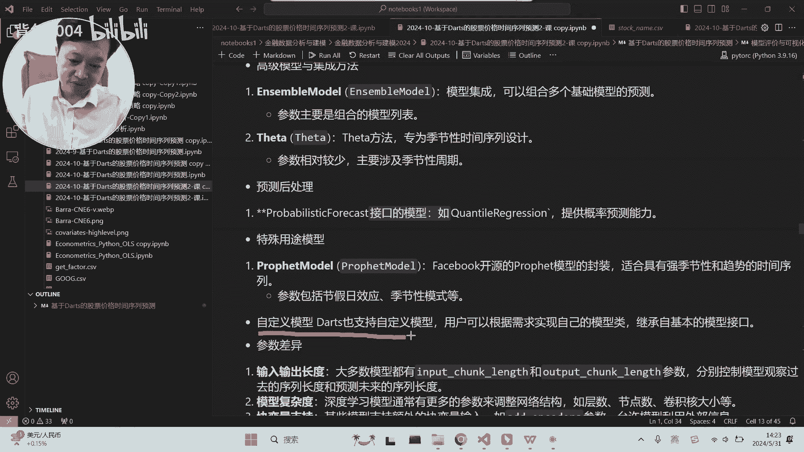
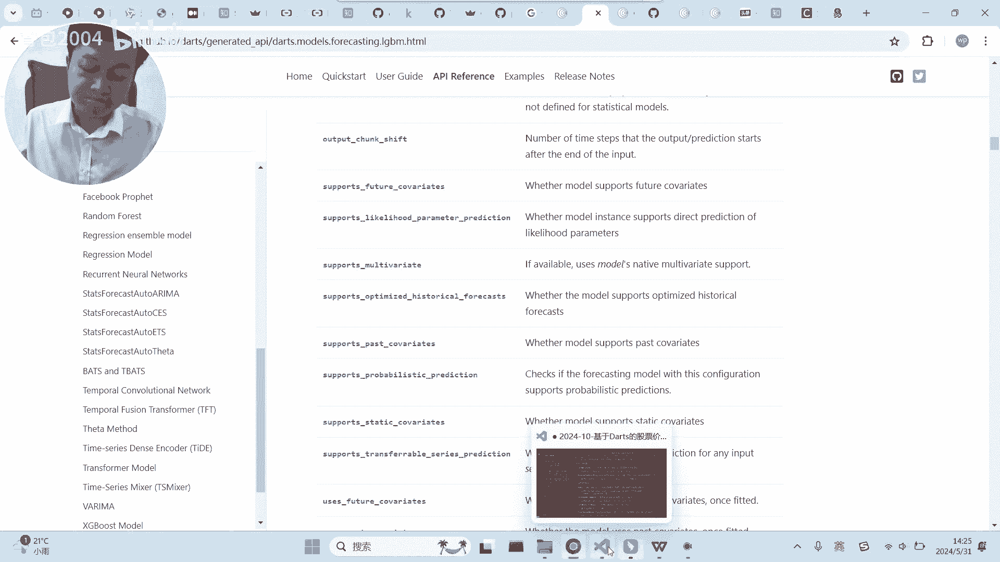
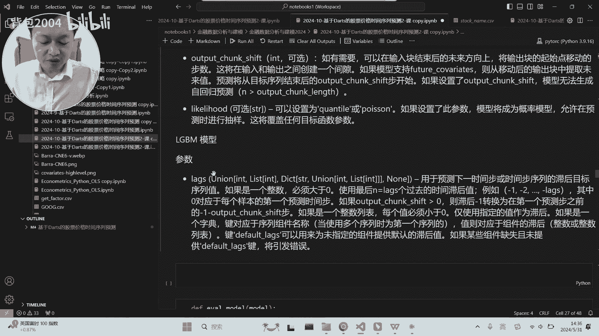
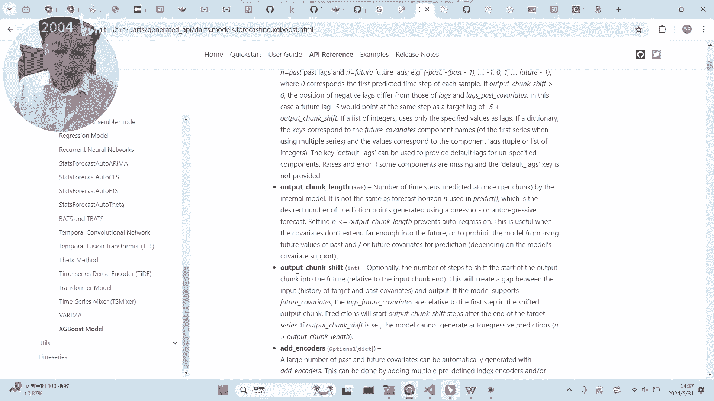
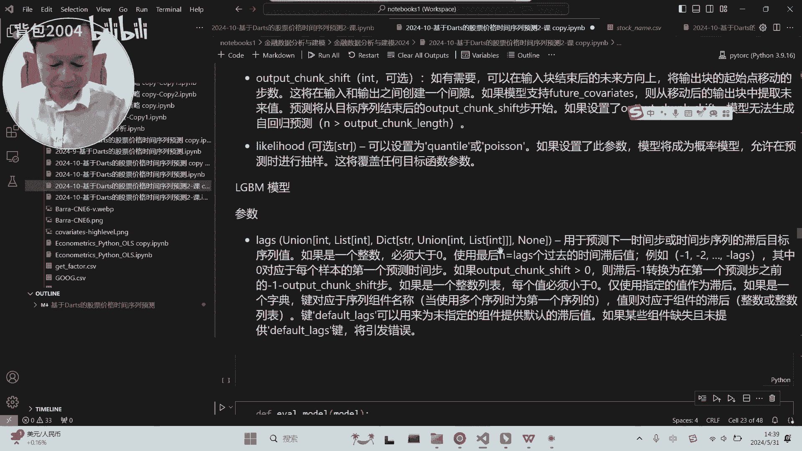

# Darts时间序列预测教程：P1：模型分类与核心参数详解 📊

在本节课中，我们将学习Darts库中提供的主要时间序列预测模型类别，并详细解释不同类别模型的核心参数及其含义。理解这些差异对于选择合适的模型至关重要。

## 模型分类概览

Darts库的亮点在于提供了丰富的深度学习模型，同时也包含了一些经典的传统模型和机器学习模型。这些模型大致可以分为三类。

### 经典传统模型

上一节我们介绍了Darts库的模型分类，本节中我们来看看第一类：经典的传统模型。这类模型通常基于统计学原理，适用于具有明显趋势和季节性的数据。

以下是Darts提供的经典传统模型示例：
*   **ARIMA/AutoARIMA**：自回归综合移动平均模型，是经济学领域常用的经典模型。
*   **指数平滑 (ExponentialSmoothing)**：一种简单且广泛使用的预测方法。



需要注意的是，如果仅使用这类经典模型，可能无需依赖Darts库，其他专门的Python包（如`statsmodels`）已足够。这类模型对于波动剧烈、无明显规律的数据预测能力有限，其预测结果往往是一条平缓的趋势线。

### 机器学习模型

在了解了经典模型后，我们转向第二类：源自机器学习的模型。Darts库封装了一些在机器学习领域表现优异的算法，并将其应用于时间序列预测任务。

以下是Darts集成的部分机器学习模型：
*   **XGBoost**：一个基于梯度提升决策树的强大模型，在过去几年非常流行。
*   **LightGBM**：微软开源的另一个高效的梯度提升框架。
*   **RandomForest**：基于决策树的集成学习模型。



这类模型通常用于解决回归或分类问题，Darts将其适配用于序列预测。一个关键特点是，它们**通常一次只预测一个未来的时间点**。

### 深度学习模型

最后，我们来看Darts的核心优势：深度学习模型。这类模型能够捕捉数据中复杂的非线性关系和长期依赖。

以下是Darts提供的主要深度学习模型类型：
*   **RNN/LSTM/GRU**：循环神经网络及其变体，擅长处理序列数据。
*   **TCN (时序卷积网络)**：使用卷积神经网络来捕捉序列中的模式。
*   **Transformer**：目前大语言模型的核心架构，在时间序列预测中的应用效果存在一定讨论，但Darts提供了实现以供尝试。
*   **N-BEATS**：一个专为时间序列预测设计的深度神经网络架构。
*   **TFT (时序融合变换器)**：能够学习时序关系的复杂模型。
*   **封装模型**：Darts还封装了如Facebook开源的Prophet等知名预测模型。

此外，Darts支持**自定义模型**，这对于学术研究尤其重要。研究者可以将自己的创新模型集成到Darts的框架中，方便地与基线模型进行对比实验。

## 核心参数详解

不同类别的模型在构建和预测时，其核心参数也存在差异。理解这些参数是正确使用模型的关键。

### 通用预测参数：`input_chunk_length` 与 `output_chunk_length`

对于大多数深度学习模型和一些机器学习模型，有两个基础且重要的参数：
*   `input_chunk_length`：模型查看过去多少个时间步的数据来进行预测。公式表示为：使用过去 `N` 个时间点。
*   `output_chunk_length`：模型一次预测未来多少个时间步。公式表示为：预测未来 `M` 个时间点。

例如，在代码中常这样设置：
```python
model = SomeModel(input_chunk_length=24, output_chunk_length=12)
```
这表示“用过去24期的数据，预测未来12期的数据”。

### RNN系列模型的预测特点

RNN、LSTM等循环神经网络有一个内在特点：它们**只能按顺序一步步地预测未来**。即使设置了`output_chunk_length`大于1，模型在内部也是先预测下一步，然后将该预测值（或结合历史数据）作为输入，再预测下下一步，以此类推。这种预测方式被称为**自回归预测**。在Darts中，当对RNN模型调用多步预测时，实际上就是在进行这种自回归。

### 预测偏移参数：`output_chunk_shift`

在实际应用中，我们可能不关心紧接着的下一个时间点，而是想预测更远未来的某个时段。例如，在股票预测中，常用今天的数据预测10天或30天后的情况。

为此，许多模型提供了 `output_chunk_shift` 参数。
*   **定义**：在输入块结束和输出块开始之间设置的间隙步数。
*   **作用**：实现“跳跃式”预测。例如，`input_chunk_length=24`, `output_chunk_length=5`, `output_chunk_shift=10` 意味着：用过去24天的数据，预测从第35天开始的连续5天（即第35至39天），跳过了中间的10天。



这个参数对于需要预测远期窗口的场景非常有用。



### 机器学习模型的预测目标参数

对于XGBoost、LightGBM等转换而来的机器学习模型，它们通常被设计为**单点预测**。因此，它们常用 `lags`（滞后项）和 `lags_past_covariates` 等参数来定义特征，并使用 `output_chunk_length`（通常设为1）来定义预测目标。其核心思想是：利用过去N个时间点的值作为特征，来预测未来第K个时间点的值。这里的“K”就由预测目标的位置决定。

## 总结

本节课中我们一起学习了Darts库中的三大类预测模型：经典传统模型、机器学习模型和深度学习模型。我们重点剖析了不同模型在核心预测参数上的区别：
1.  **经典模型**（如指数平滑）参数简单，但可能无法捕捉复杂波动。
2.  **深度学习模型**（如RNN、TCN）核心参数是 `input_chunk_length` 和 `output_chunk_length`，用于定义回顾窗口和预测窗口。部分模型支持 `output_chunk_shift` 实现跳跃预测。RNN系列采用自回归方式进行多步预测。
3.  **机器学习模型**（如XGBoost）通常用于单点预测，通过滞后参数构造特征，预测指定的未来某个时间点。



理解这些模型的特性和参数，能帮助您根据具体的预测任务（如预测下一步、预测连续未来窗口、预测远期跳跃窗口）选择最合适的工具。