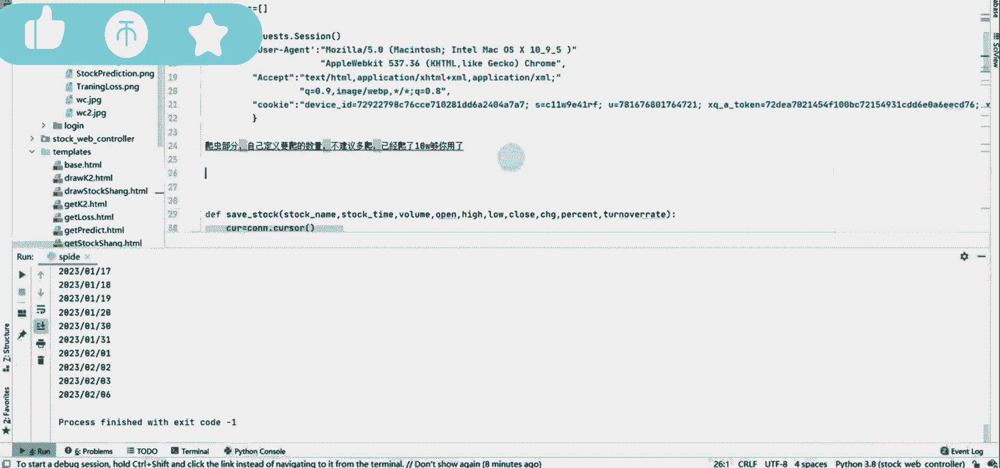
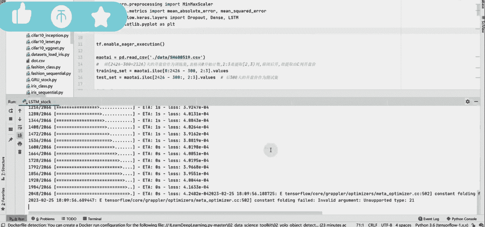
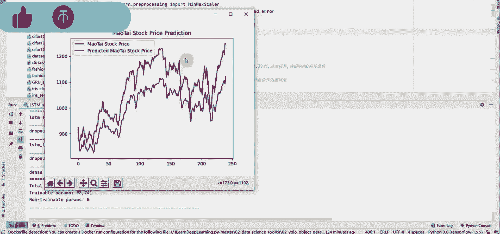
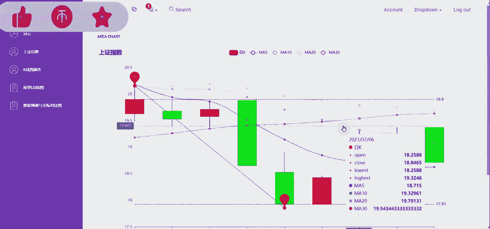
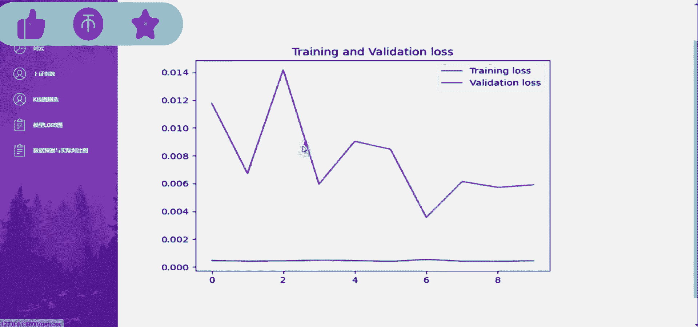

# 计算机毕业设计：P1：项目概述与核心技术栈

在本课程中，我们将学习如何构建一个基于Django框架与大语言模型的股票分析推荐系统。该系统将整合股票数据爬取、可视化分析、量化交易策略以及AI预测等核心功能，是一个综合性的大数据与人工智能毕业设计项目。

## 🎯 项目核心目标

本项目旨在开发一个功能完备的股票智能分析平台。系统将自动获取股票市场数据，通过可视化图表（如K线图）展示历史走势，并运用大语言模型等AI技术对股票进行数据分析与未来趋势预测，最终为用户提供投资参考建议。

## 🛠️ 核心技术栈介绍

上一节我们明确了项目目标，本节中我们来看看实现这些目标需要哪些关键技术。以下是构建本系统所需的核心技术组件：

*   **后端框架**：**Django**。这是一个基于Python的高级Web框架，能快速构建安全、可维护的网站。
*   **前端展示**：HTML、CSS、JavaScript，并结合图表库（如ECharts、Highcharts）实现股票K线图等数据可视化。
*   **数据获取**：**Python爬虫**技术（如使用Requests、BeautifulSoup库）从财经网站获取实时或历史的股票数据。
*   **数据分析与预测**：
    *   **量化分析**：使用Pandas、NumPy进行数据处理，使用TA-Lib等技术指标库进行量化分析。
    *   **AI预测**：集成**大语言模型**的API，用于分析市场舆情、生成报告或辅助决策；可能使用机器学习库（如Scikit-learn）构建传统的股价预测模型。
*   **数据库**：MySQL或PostgreSQL，用于存储用户信息、股票数据、分析结果等。

## 📊 系统功能模块

了解了技术基础后，我们进一步规划系统的具体功能。以下是系统计划实现的主要功能模块：

1.  **股票数据爬虫模块**：自动定时爬取指定股票的代码、名称、实时价格、历史交易数据等。
2.  **数据存储与管理模块**：将爬取的数据清洗后存入数据库，并通过Django Admin或自定义界面进行管理。
3.  **股票可视化模块**：绘制股票的**K线图**，并叠加移动平均线、成交量等常用技术指标。公式示例：`N日简单移动平均线 = (最近N日收盘价之和) / N`。
4.  **股票数据分析模块**：提供基本的股票数据查询、排序、筛选功能，并计算关键财务指标。
5.  **量化交易分析模块**：实现简单的量化策略回测，例如双均线策略（当短期均线上穿长期均线时买入，下穿时卖出）。
6.  **大模型推荐与预测模块**：调用大模型API，输入股票基本面、技术面数据或市场新闻，获取对股票的分析摘要、风险提示或趋势预测。
7.  **用户系统**：实现用户注册、登录、自选股管理等功能。

## 🚀 开发流程简述

最后，我们简要梳理一下项目的开发流程，为后续动手实践做好准备。

1.  **环境搭建**：安装Python、Django、数据库及所需的第三方库。
2.  **Django项目创建**：使用 `django-admin startproject` 命令初始化项目，并创建核心应用。
3.  **数据库模型设计**：定义股票、用户、交易记录等数据模型。
4.  **爬虫开发与数据入库**：编写独立脚本爬取数据，并设计接口将数据导入Django模型。
5.  **后端视图与API开发**：编写处理业务逻辑的视图函数，为前端提供数据接口。
6.  **前端页面开发**：制作网页模板，使用JavaScript图表库渲染K线图。
7.  **AI功能集成**：调用大模型API，并在合适的前端或后端环节整合其输出结果。
8.  **测试与部署**：对系统进行测试，最后部署到服务器。

## 📝 课程总结

本节课中，我们一起学习了“Django+大模型股票推荐系统”这一毕业设计项目的全貌。我们明确了项目的综合目标，认识了以Django为核心、涵盖爬虫、数据可视化、量化分析和大模型AI的技术栈，规划了从数据获取到智能推荐的七大功能模块，并概述了标准的开发流程。这是一个将Web开发、数据分析与人工智能技术相结合的实践项目，为后续分步实现打下了坚实基础。