# 股票推荐与预测系统开发：P1：项目概述与技术栈介绍 🚀

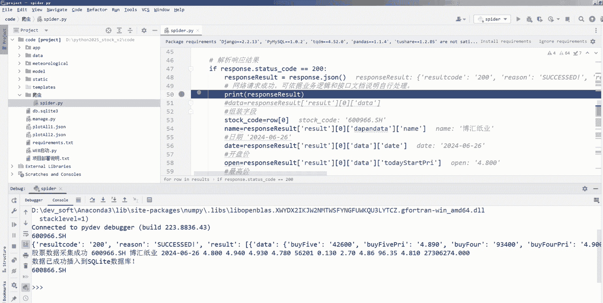

在本课程中，我们将学习如何构建一个基于Django框架和大语言模型的股票推荐与预测系统。该系统将整合股票数据爬取、可视化分析、量化交易策略以及AI预测等核心功能，是一个综合性的大数据与人工智能毕业设计项目。

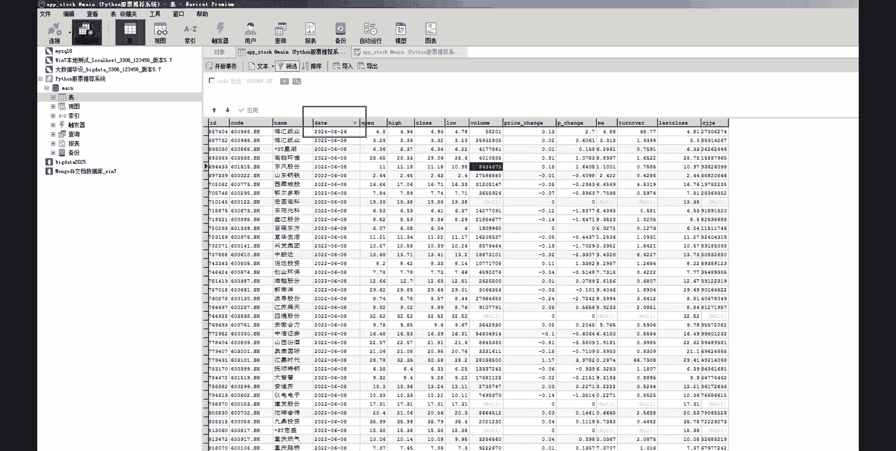

## 项目简介 📊

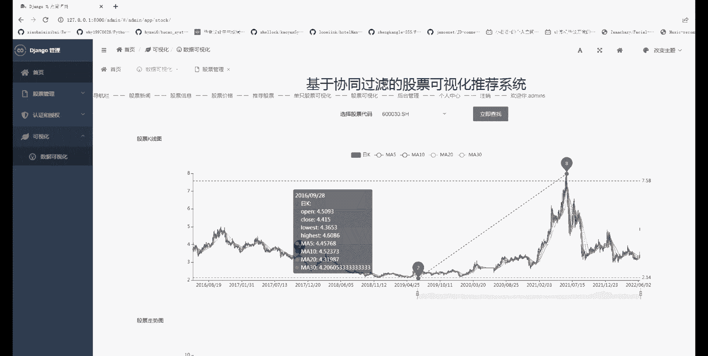

本项目旨在开发一个功能全面的股票数据分析平台。系统后端采用Django框架构建，前端结合可视化图表库，并集成大语言模型进行智能分析与推荐。

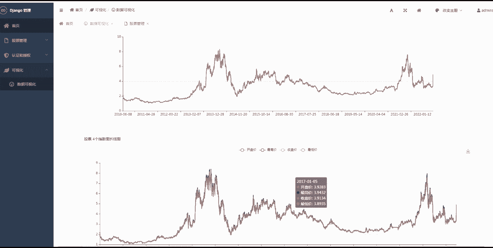

以下是本系统计划实现的核心功能模块：

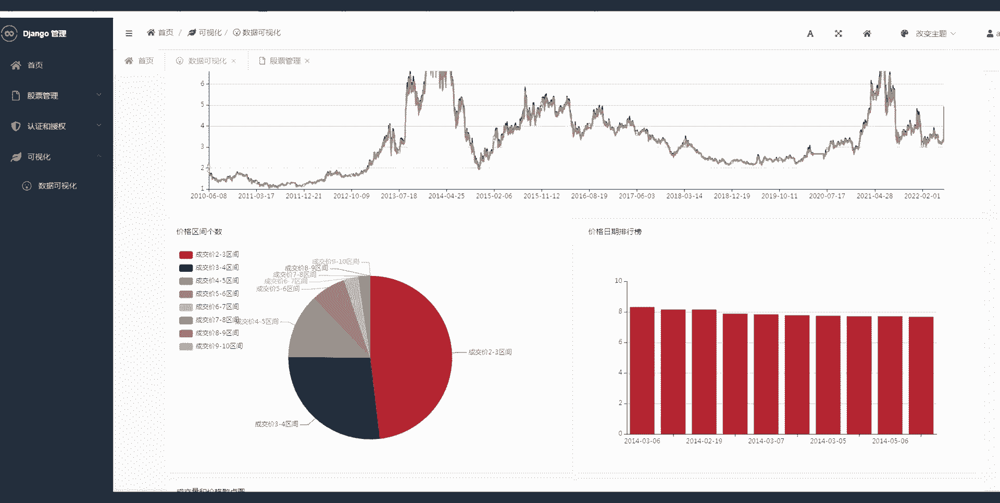

*   **股票数据爬虫**：自动从网络获取实时或历史的股票数据。
*   **股票数据可视化**：通过K线图、趋势图等多种图表展示股票数据。
*   **股票数据分析**：对股票数据进行基本的统计与技术指标分析。
*   **量化交易系统**：实现基于策略模型的自动化交易信号生成。
*   **大模型股票推荐**：利用大语言模型分析市场信息，生成投资建议。
*   **股票预测系统**：基于历史数据构建模型，预测股票未来走势。

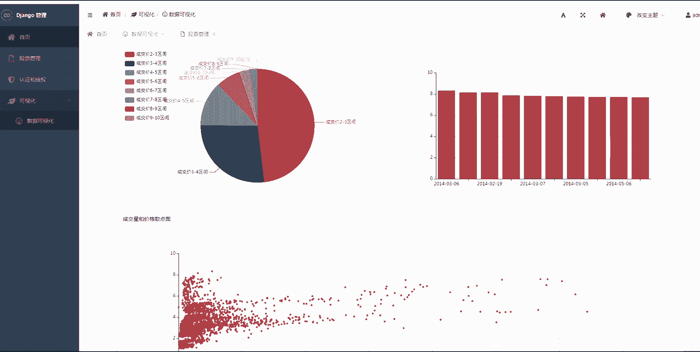

## 技术栈详解 ⚙️

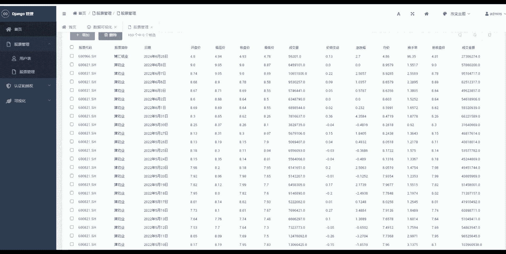

上一节我们介绍了项目的整体功能，本节中我们来看看实现这些功能所需的技术栈。一个强大的技术组合是项目成功的基石。

以下是构建本系统将使用的主要技术与工具：

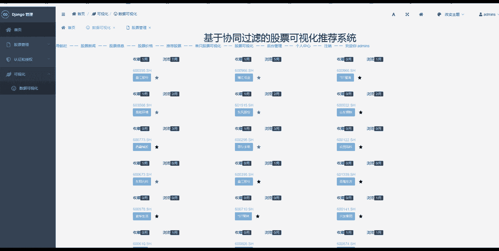

*   **后端框架**：**Django**。这是一个基于Python的高级Web框架，鼓励快速开发和简洁、实用的设计。其核心操作是定义模型（Model）、视图（View）和模板（Template）。
    ```python
    # 示例：一个简单的Django模型定义
    from django.db import models

    class Stock(models.Model):
        code = models.CharField(max_length=10)  # 股票代码
        name = models.CharField(max_length=50)  # 股票名称
        current_price = models.FloatField()     # 当前价格
        date = models.DateField()               # 日期
    ```

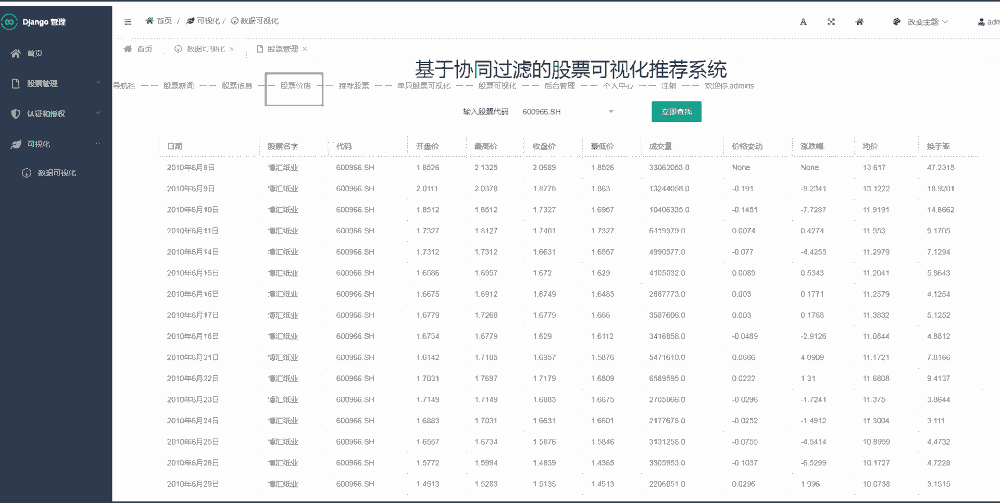

*   **数据获取**：**Python爬虫库（如Requests, Scrapy）** 和 **金融数据API（如AKShare, Yahoo Finance）**。用于获取股票的历史行情、财务数据等。
    ```python
    # 示例：使用AKShare获取股票历史数据
    import akshare as ak
    stock_zh_a_hist_df = ak.stock_zh_a_hist(symbol="000001", period="daily")
    ```

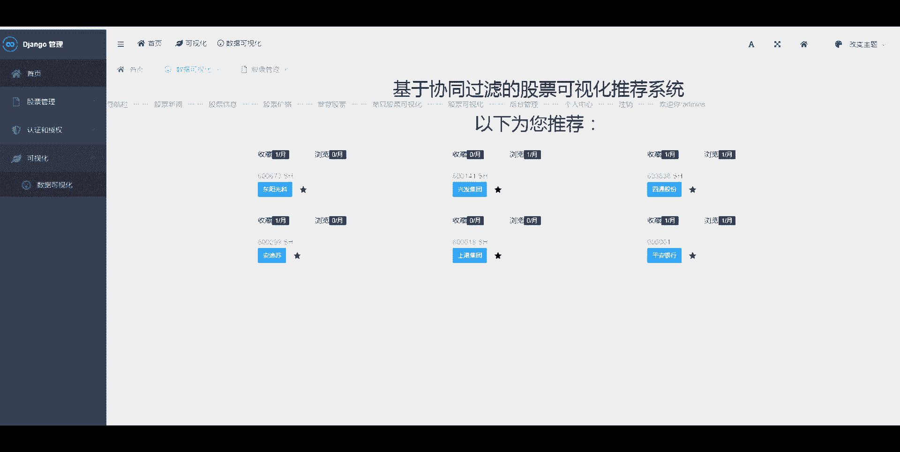

*   **数据可视化**：**ECharts** 或 **Pyecharts**。这是一个由百度开源的数据可视化库，可以生成交互性强的K线图、折线图等。
*   **数据分析与预测**：**Pandas, NumPy, Scikit-learn**。用于数据清洗、分析和构建传统的机器学习预测模型。
*   **大模型集成**：**OpenAI API** 或 **国内大模型API（如文心一言、通义千问）**。通过调用大语言模型的接口，进行市场情绪分析、新闻解读和智能推荐。
*   **前端技术**：**HTML, CSS, JavaScript** 及 **Bootstrap** 框架。用于构建用户交互界面。
*   **数据库**：**MySQL** 或 **PostgreSQL**。用于存储用户信息、股票数据、模型结果等结构化数据。

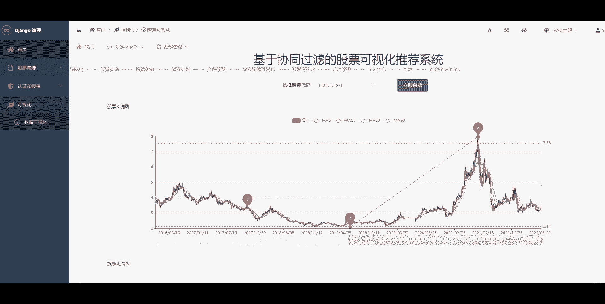

## 学习路径与预备知识 🧭

了解技术栈后，你可能想知道如何开始学习。本节将为你勾勒一个清晰的学习路径。

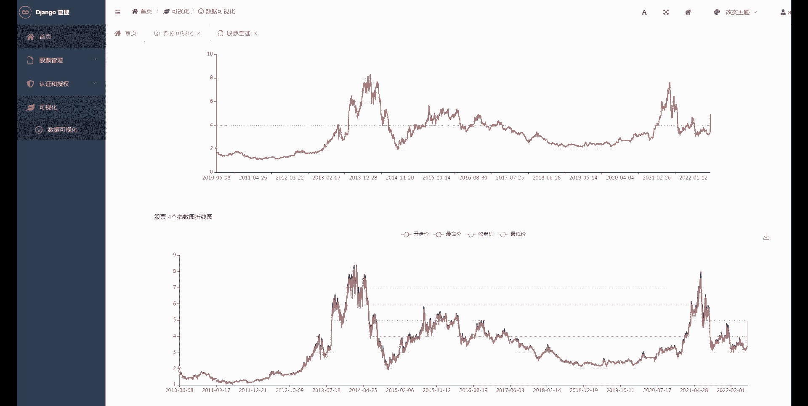

以下是建议的学习步骤和需要掌握的预备知识：

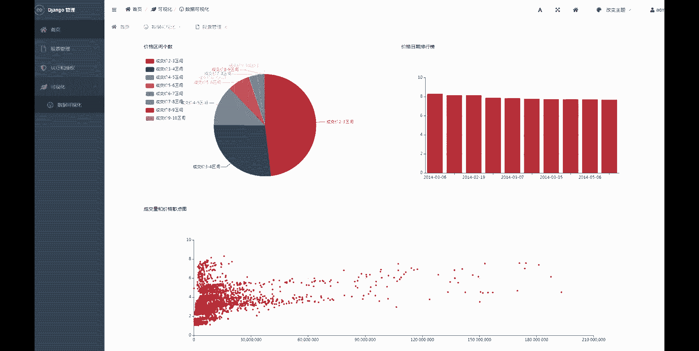

1.  **掌握Python基础**：包括语法、数据结构、函数和面向对象编程。
2.  **学习Django框架**：理解MTV模式，学会创建项目、应用、模型、视图和路由。
3.  **学习数据分析基础**：熟悉Pandas进行数据处理，了解常用的机器学习算法。
4.  **了解前端基础**：能够编写简单的HTML页面，并学会使用ECharts绘制图表。
5.  **实践数据爬取**：动手编写爬虫，获取真实的股票数据。
6.  **集成大模型API**：学习如何调用第三方AI服务，并将结果融入系统逻辑。

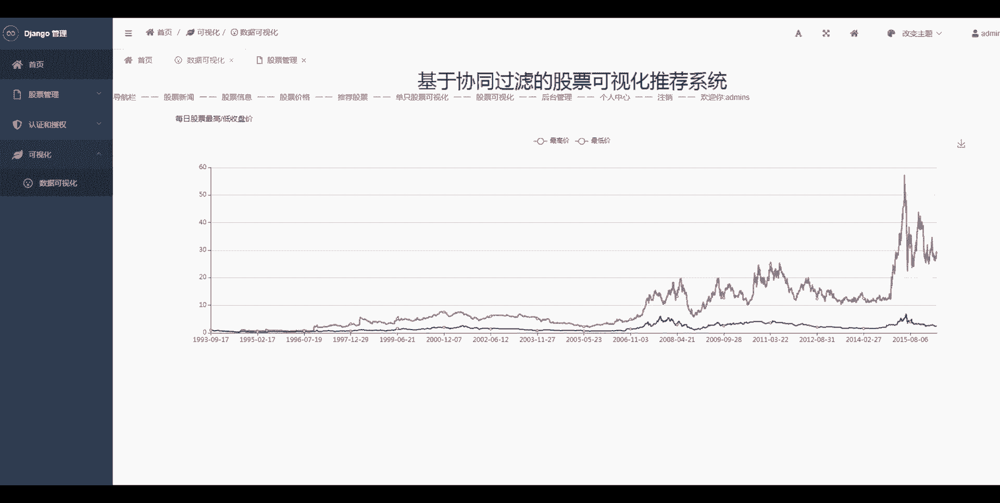

## 总结

本节课中我们一起学习了“股票推荐与预测系统”项目的整体面貌。我们明确了系统需要实现的六大核心功能，并详细介绍了实现这些功能所需的技术栈，包括Django、数据爬虫、可视化库、分析工具以及大模型API。最后，我们规划了从基础到实践的学习路径。从下一节课开始，我们将正式进入开发环节，首先从搭建Django项目环境开始。