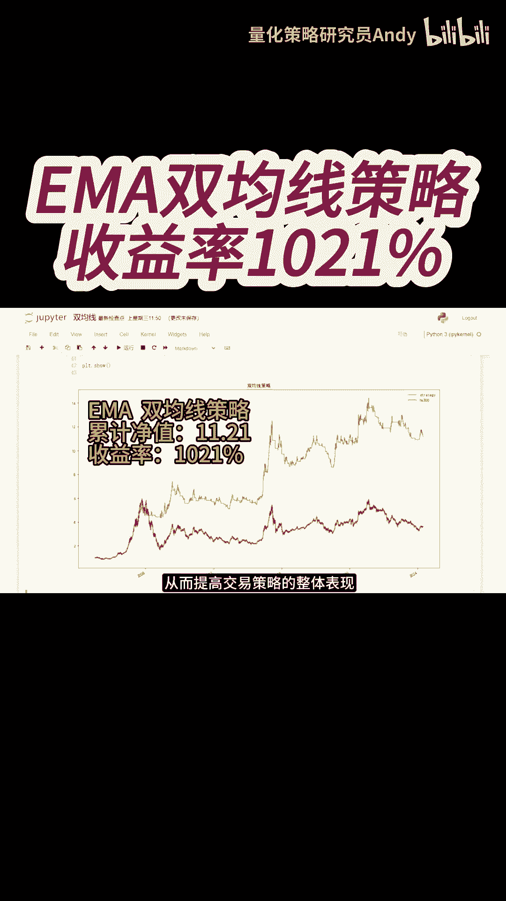
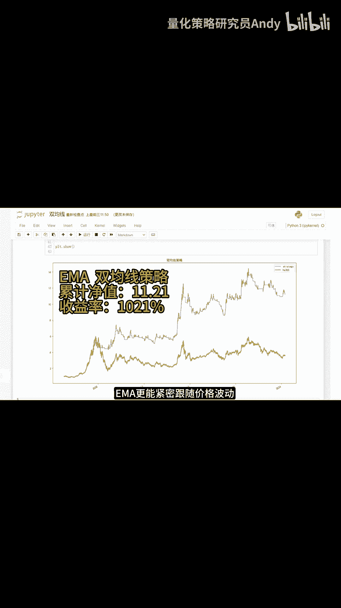

# 量化交易策略：P1：EMA双均线策略详解

在本节课中，我们将要学习如何将简单的移动平均线策略升级为指数移动平均线策略，并分析其显著提升收益率的原理。我们将通过对比回测结果，理解EMA如何更有效地捕捉市场趋势。

## 策略升级与回测结果

上一节我们介绍了基础的移动平均线策略。本节中，我们来看看将均线算法修改为**指数移动平均线**后的效果。

对策略代码进行修改并重新回测后，得到的结果如上图所示。图中蓝色曲线代表采用**EMA双均线策略**的资产净值曲线。其最终累计净值为 **11.21**，换算为收益率为 **1021%**。

这一表现相较于使用简单移动平均线的策略，收益率提升了 **420%**，并且远远跑赢了同期沪深300指数的表现。

## EMA的优势原理

那么，为什么EMA策略能获得如此显著的改进呢？核心在于EMA的计算方式赋予了最新价格数据更高的权重。

EMA的计算公式体现了其加权特性：
`EMA_today = (Price_today * (2/(N+1))) + (EMA_yesterday * (1 - (2/(N+1))))`
其中，`N`是周期数。这个公式使得最新价格对当前EMA值的影响更大。

由于这种特性，EMA能够在市场趋势形成的初期，比简单移动平均线更快地发出买卖信号。这使得交易者能够更早地进入上涨趋势或退出下跌趋势，从而捕捉到更多的盈利空间。

此外，当市场波动加剧时，EMA因其对近期价格的高敏感性，能够更紧密地跟随价格波动。这带来了另一个关键好处：

即减少滞后性所产生的虚假信号，提高交易信号的可靠性。

以下是EMA核心优势的总结：
*   **反应迅速**：对趋势变化更敏感，能及早发出信号。
*   **紧跟波动**：在震荡市中能更贴合价格走势。
*   **过滤噪音**：相比简单均线，能在一定程度上减少无效的交叉信号。

## 总结

本节课中我们一起学习了EMA双均线策略。我们首先看到了该策略高达1021%的回测收益率，并对比了其相对于简单移动平均线的巨大优势。接着，我们深入探讨了其背后的原理：**EMA通过赋予近期价格更高权重的计算方式**，实现了对市场趋势更快速、更紧密的跟踪，从而能更早地捕捉交易机会并减少虚假信号。理解这一原理是应用和改进该策略的基础。