# Python数据分析实战：P13：12 安装配置全宇宙最好用的代码编辑器 🚀

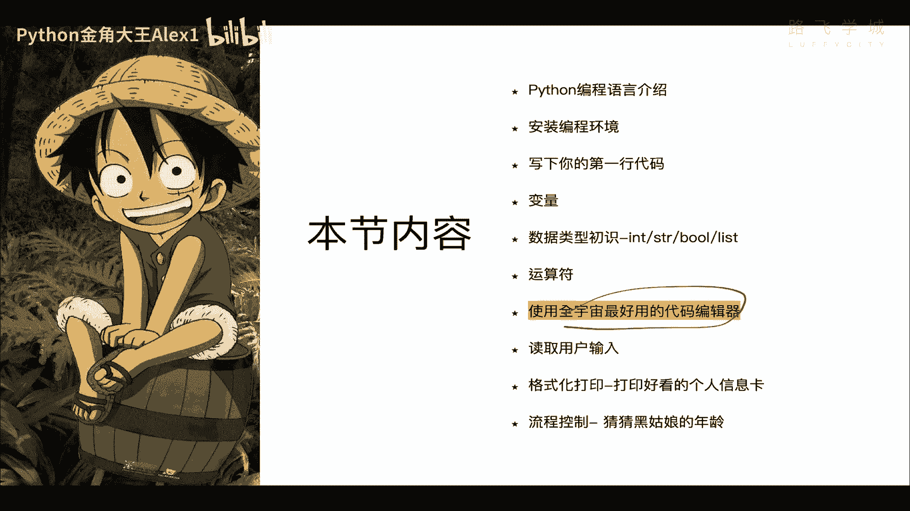

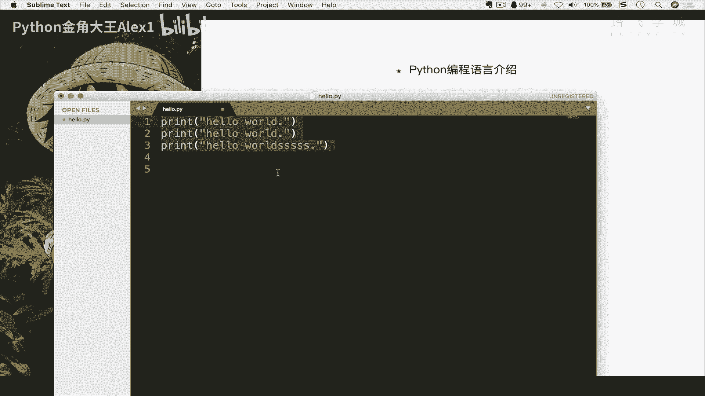

## 概述
在本节课中，我们将学习如何安装和配置一个强大的代码编辑器——PyCharm。之前我们编写代码时，要么在交互式环境中，要么在简单的文本文件中，执行和调试过程繁琐且效率低下。通过使用集成开发环境（IDE），我们可以将代码编写、执行、调试和管理功能整合在一起，极大地提升开发效率。

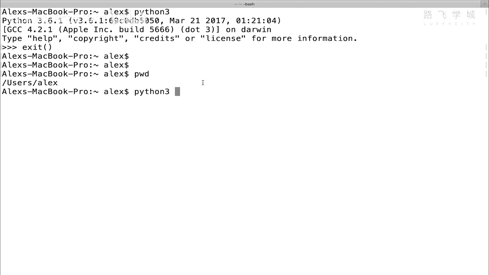

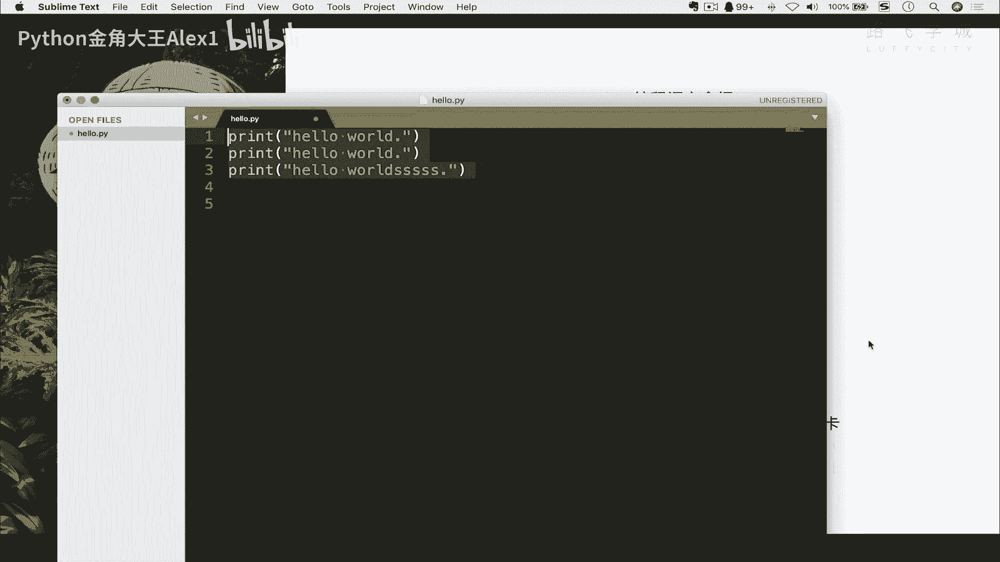

---

## 为什么需要代码编辑器？
上一节我们介绍了在基础环境中编写和执行代码的方法。本节中我们来看看为什么需要一个专业的代码编辑器。

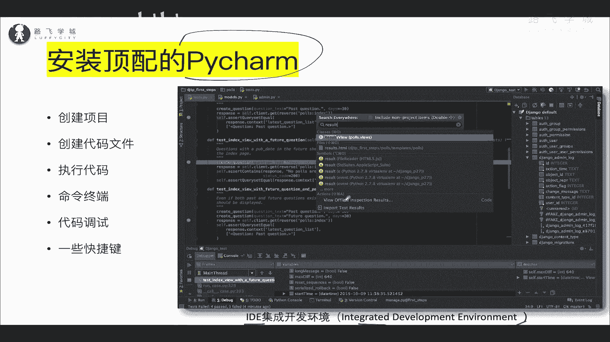

在文本文件中编写代码后，需要将其拖拽到终端中执行。如果代码出错，需要返回文件修改、保存，再重新执行。这个过程非常麻烦，效率很低。

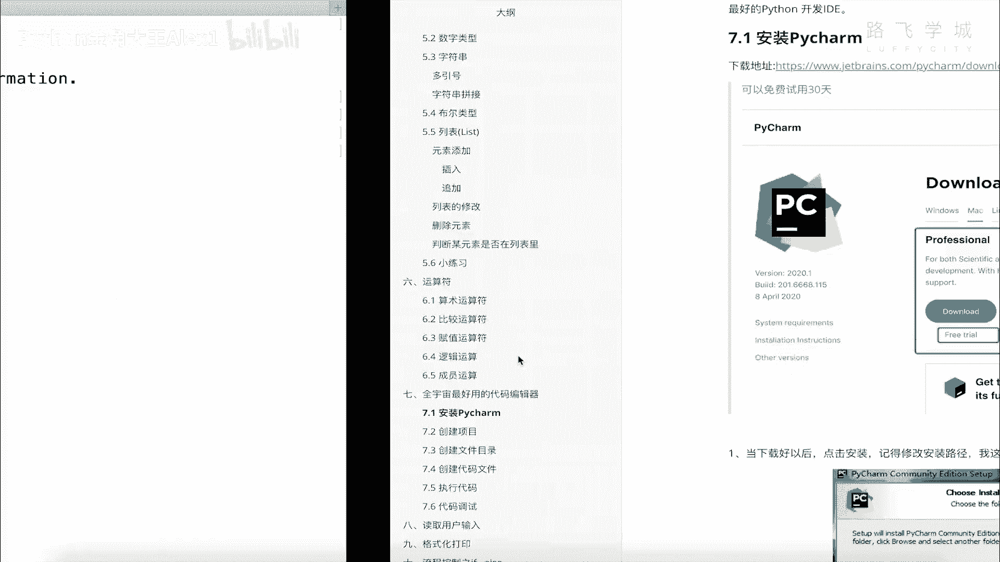

当代码文件数量增多，且文件之间存在相互调用关系时，手动管理将变得异常困难。为了提高效率，我们需要借助专业的代码开发工具，即代码编辑器。

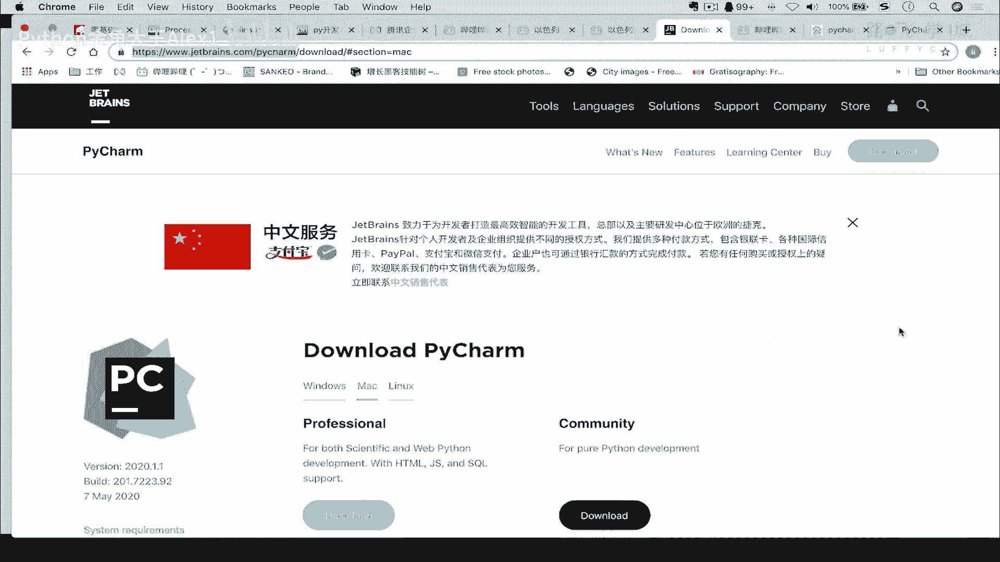

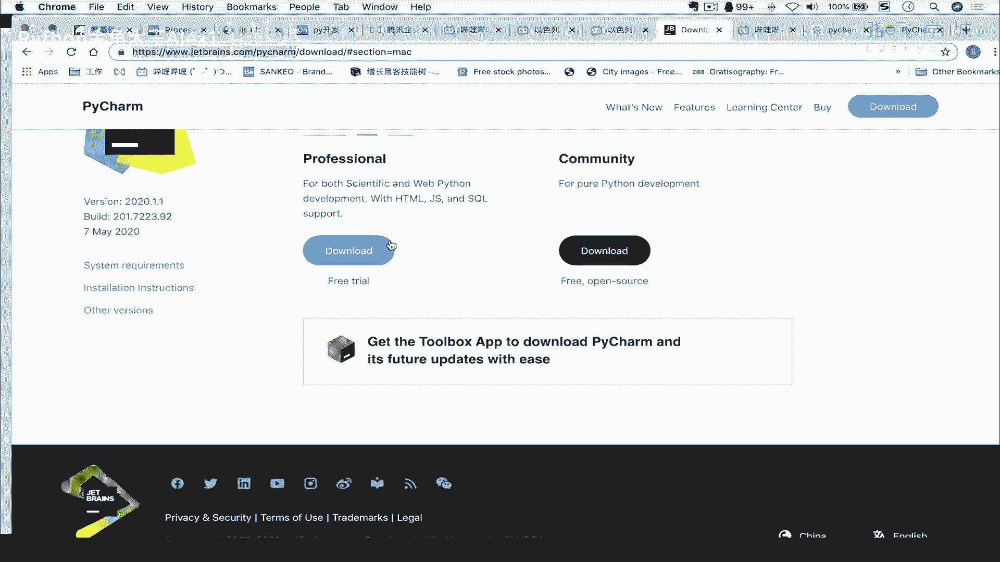

---

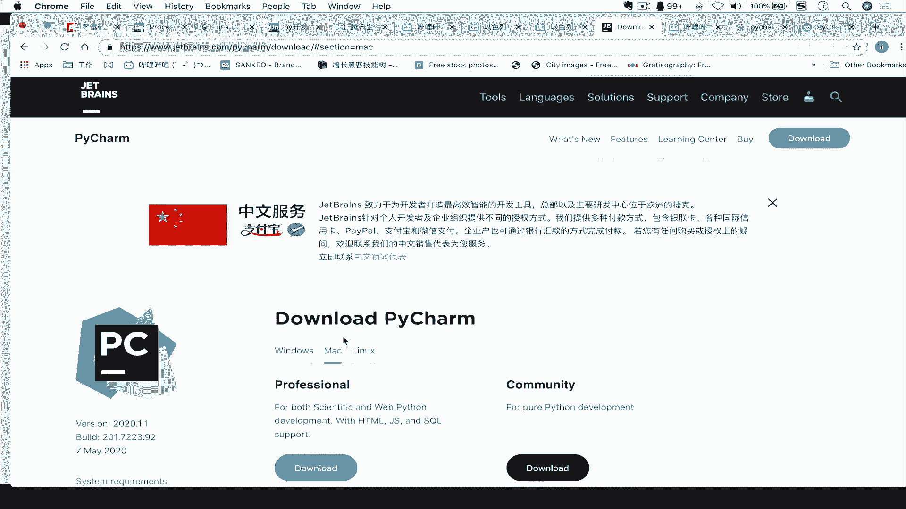

## 认识PyCharm
PyCharm是由JetBrains公司开发的一款专门用于Python的集成开发环境（IDE）。它的英文全称是Integrated Development Environment。

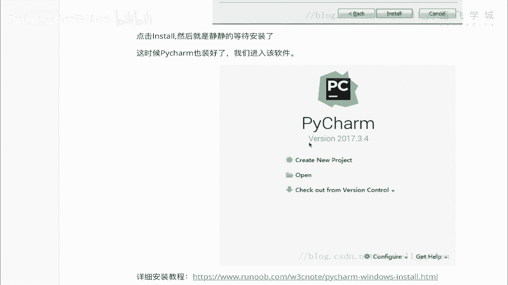

PyCharm界面看似复杂，但掌握后会发现它非常简单高效。接下来，我们将安装并配置PyCharm，学习其核心功能。

---

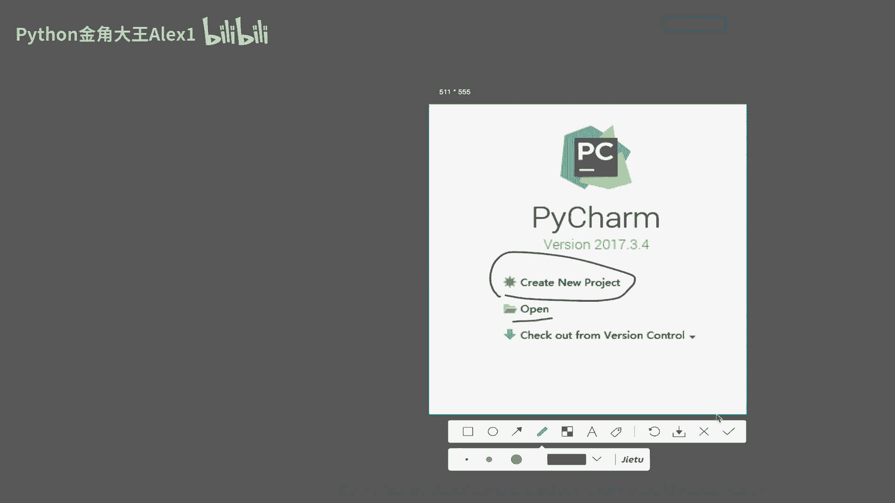

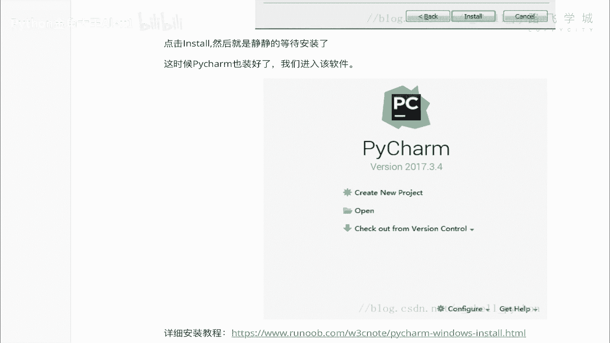

## 下载与安装PyCharm
以下是下载和安装PyCharm的步骤。

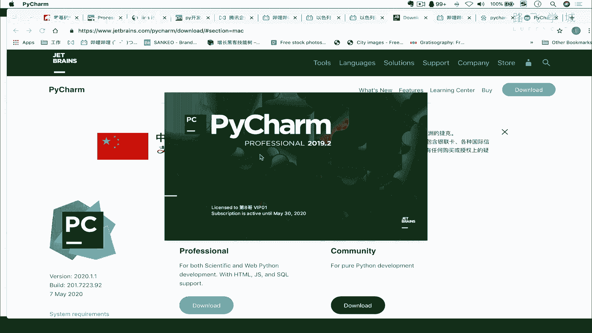

1.  **访问官网**：打开浏览器，访问JetBrains官方网站的PyCharm下载页面。
2.  **选择版本**：PyCharm提供专业版（Professional）和社区版（Community）。专业版功能更强大但需要付费；社区版免费，功能足够初学者使用。建议新用户选择专业版，可免费试用30天。
3.  **下载安装**：点击下载按钮，文件大小约300MB。下载完成后，运行安装程序。
4.  **安装向导**：在安装过程中，通常只需点击“下一步”，并注意勾选“创建桌面快捷方式”等选项。安装路径可以自定义选择。

安装成功后，双击桌面图标启动PyCharm。

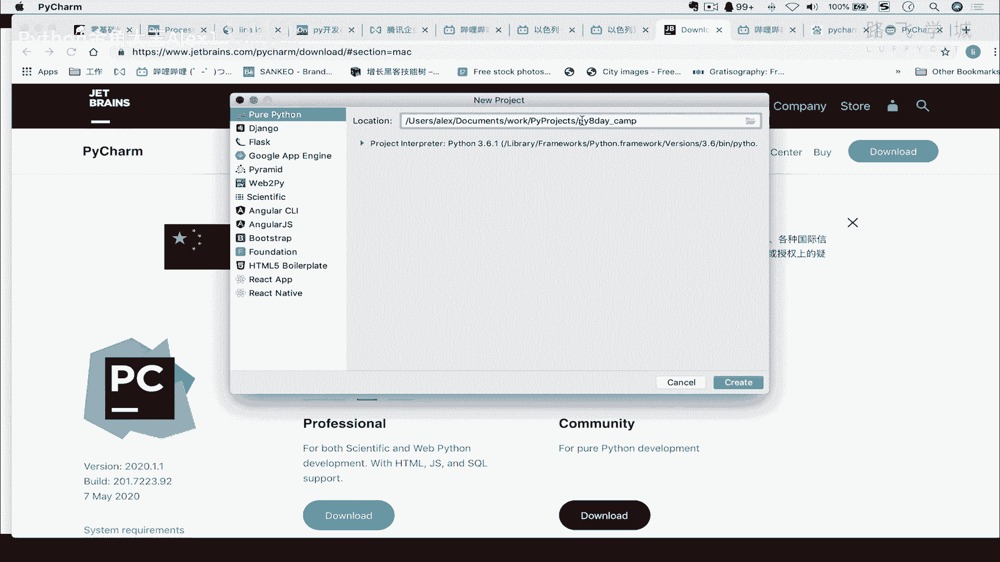

---

## 创建第一个项目
启动PyCharm后，通常会看到一个欢迎界面，提示“Create New Project”（创建新项目）或“Open”（打开项目）。

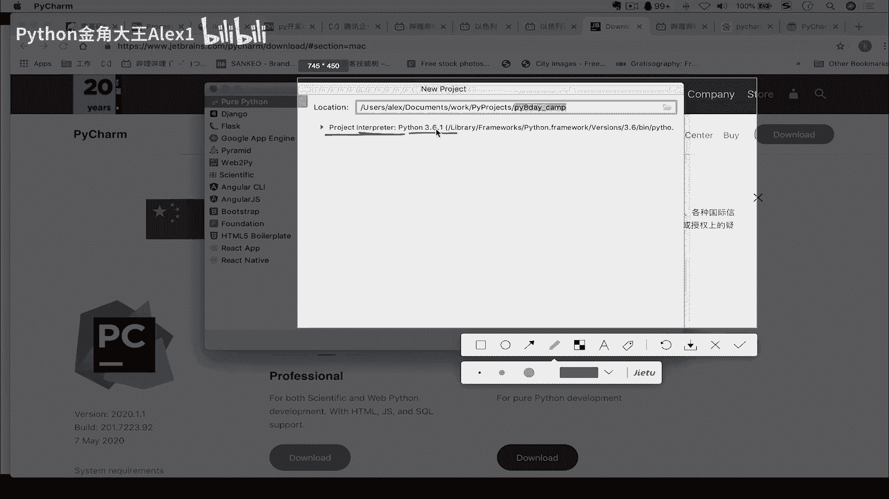

在软件开发中，代码通常以“项目”的形式进行组织和管理。一个项目对应一个主文件夹，其中可以包含多个子文件夹和代码文件。

以下是创建项目的具体操作。

1.  点击“Create New Project”。
2.  在左侧项目类型中，选择“Pure Python”（纯Python项目）。
3.  在“Location”（位置）处，设置项目的存储路径和名称。例如，可以将项目命名为 `Python_Camp`。
4.  配置解释器：在“Interpreter”处，PyCharm通常会**自动检测**到系统中已安装的Python解释器。如果未检测到，需要手动配置：
    *   点击下拉菜单，选择“Existing interpreter”（已存在的解释器）。
    *   点击“...”按钮，浏览并找到你电脑上Python解释器的可执行文件（Windows系统为 `python.exe`，通常位于安装目录的 `Scripts` 或根目录下）。
5.  点击“Create”按钮，完成项目创建。

项目创建成功后，界面左侧会显示项目目录结构。

---

## 编写与运行代码
现在，我们可以在项目中创建Python文件并运行代码。

1.  **创建目录与文件**：在左侧项目目录上右键，选择“New” -> “Directory”，可以创建文件夹（例如 `day1`）。在文件夹上右键，选择“New” -> “Python File”，可以创建Python文件（例如 `first_code.py`）。
2.  **编写代码**：在右侧的编辑区域编写代码，例如：
    ```python
    print("Hello, World!")
    ```
    PyCharm会提供智能代码提示（如输入 `print` 时）。
3.  **运行代码**：在代码编辑区域右键，选择“Run ‘first_code’”即可执行该文件。运行结果会显示在PyCharm下方的“Run”工具窗口中。
4.  **管理多个文件**：你可以创建多个Python文件，并通过点击文件标签或左侧目录轻松切换。每个文件都可以独立运行。

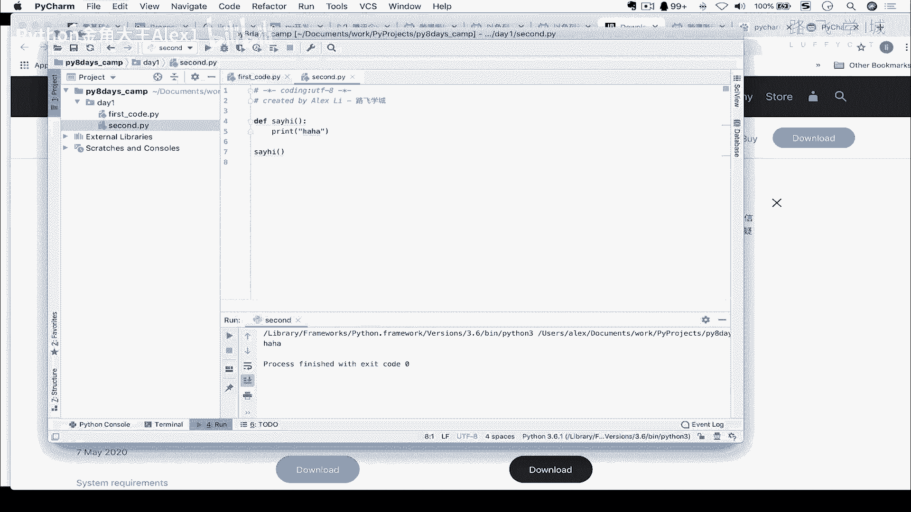

---

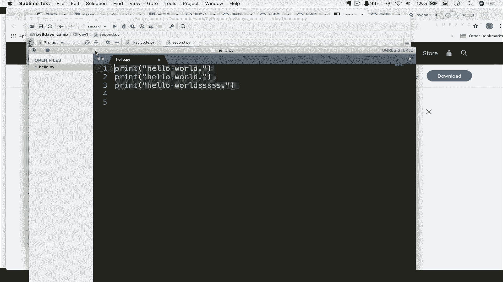

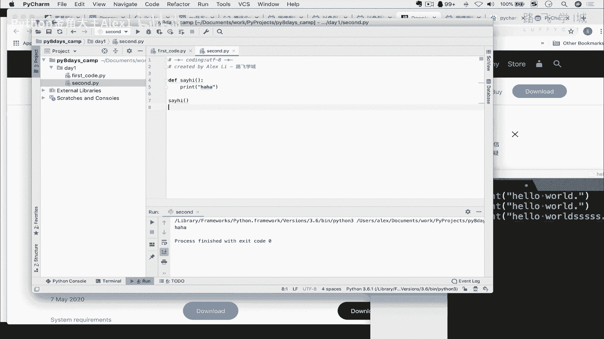

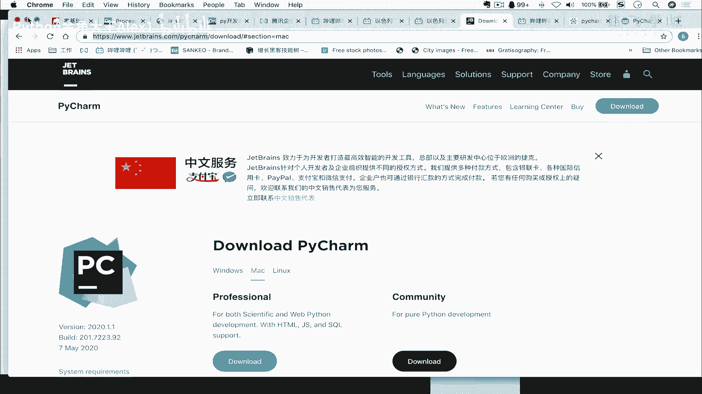

## 使用终端与Python控制台
PyCharm集成了系统终端和Python交互式控制台，方便进行各种操作。

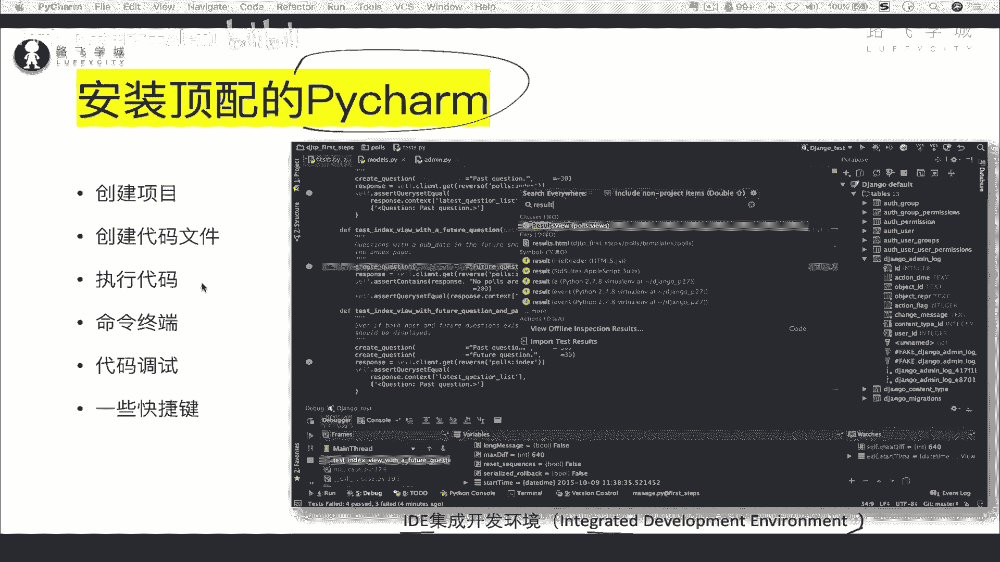

1.  **系统终端（Terminal）**：点击PyCharm界面下方的“Terminal”标签页，会打开一个命令行终端（Windows下类似CMD，Mac下类似Terminal）。你可以在这里执行操作系统命令或运行Python脚本。
2.  **Python控制台（Python Console）**：点击“Python Console”标签页，会直接进入一个Python交互式环境。你可以在这里直接输入Python代码并立即看到结果，就像之前使用的交互模式一样。

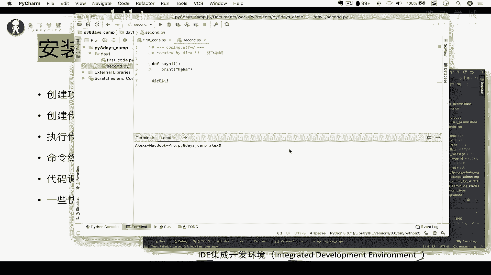

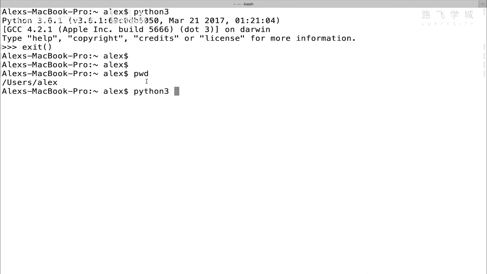

---

## 代码调试功能
当代码逻辑复杂时，调试（Debug）功能至关重要。它允许你逐步执行代码，并观察每一步中变量的状态。

1.  **设置断点**：在代码行号旁边单击，可以设置一个红色的断点（Breakpoint）。
2.  **开始调试**：右键点击代码编辑区，选择“Debug ‘文件名’”，而不是“Run”。
3.  **逐步执行**：程序会在第一个断点处暂停。此时，你可以查看“Variables”（变量）窗口，了解当前所有变量的值。
4.  **控制流程**：使用调试工具栏上的按钮（如 `Step Over`）可以逐行执行代码。每执行一步，都可以观察变量值的变化，从而定位逻辑错误。

---

## 常用快捷键与技巧
掌握一些快捷键能进一步提升编码效率。

*   **复制当前行**：`Ctrl + D` (Windows/Linux) 或 `Cmd + D` (Mac)。
*   **注释/取消注释代码**：选中多行代码，按 `Ctrl + /` (Windows/Linux) 或 `Cmd + /` (Mac)。被注释的代码行前会添加 `#` 号，Python解释器会忽略这些行。
*   **代码提示**：在输入代码时，PyCharm会自动给出提示，按 `Tab` 键可以快速补全。

---

## 总结
本节课中，我们一起学习了如何安装和配置PyCharm这一强大的Python IDE。我们了解了创建项目、编写运行代码、使用集成终端与控制台、进行代码调试以及使用常用快捷键的方法。

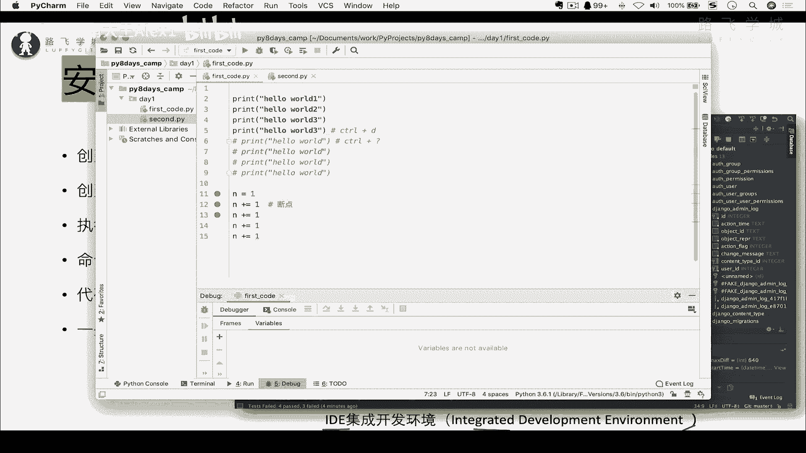

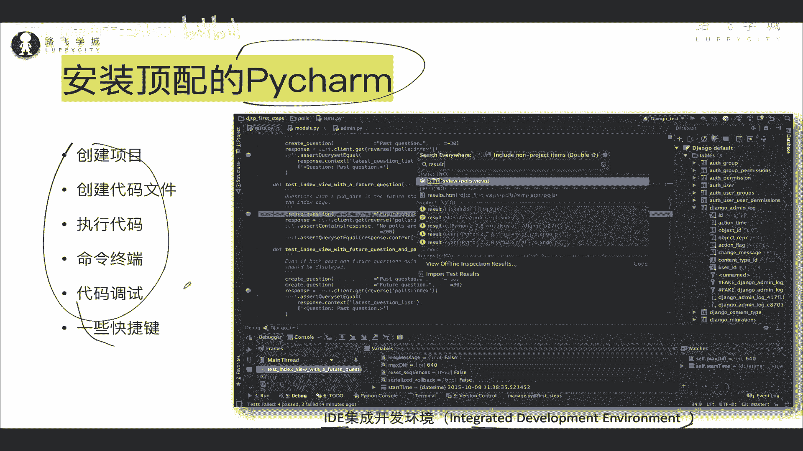

使用PyCharm后，代码的编写、管理、执行和调试过程将变得非常高效和便捷。在后续的课程和实际项目中，我们都将在此环境中进行开发。请大家务必完成安装和配置，并熟悉基本操作。