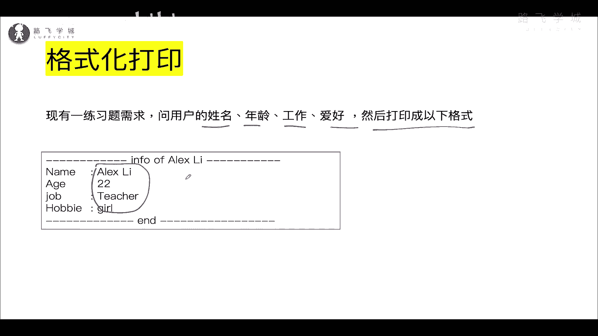
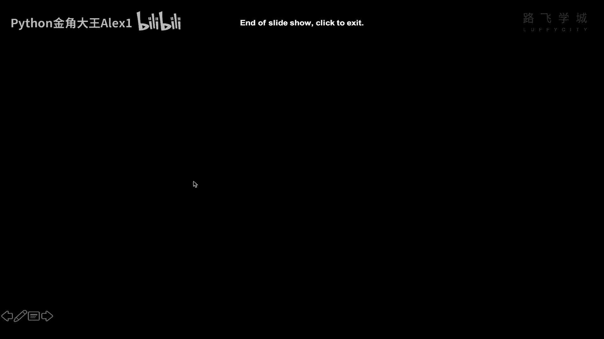
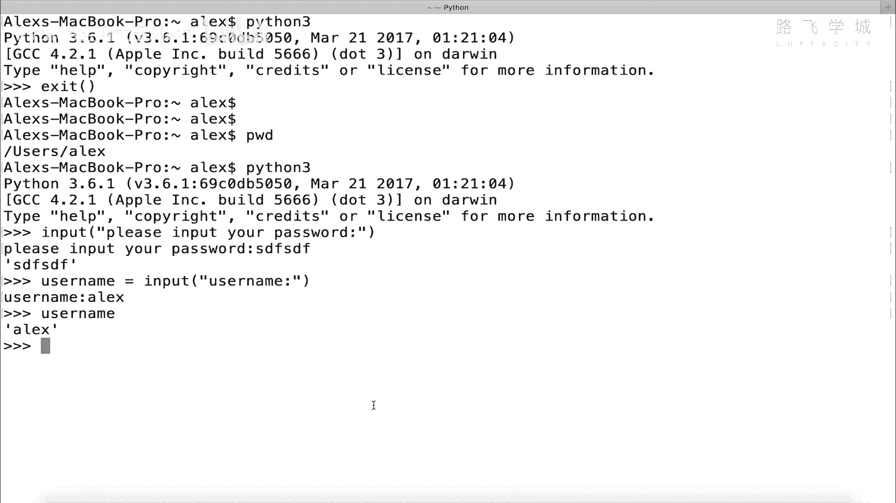
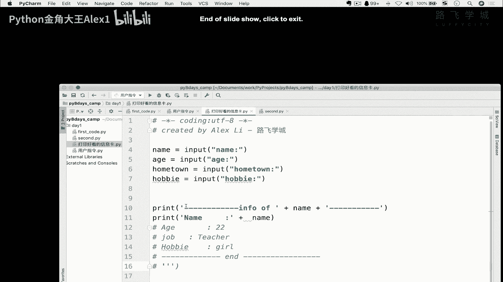
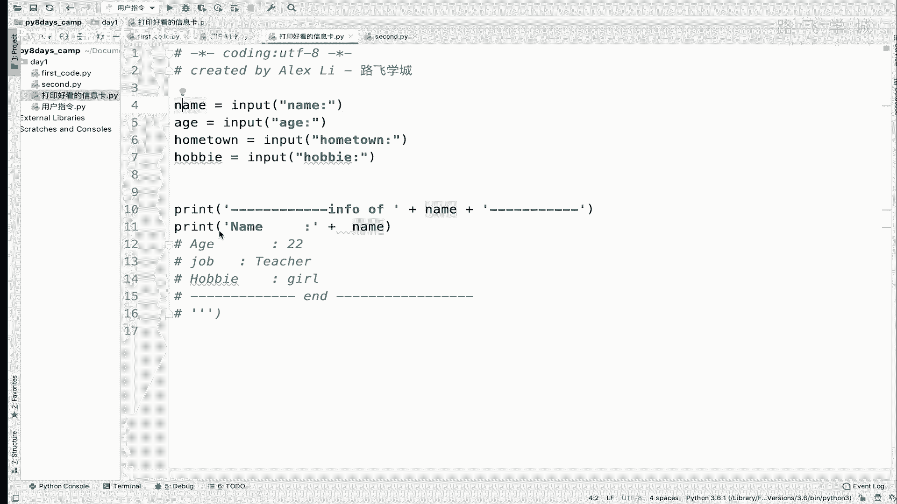
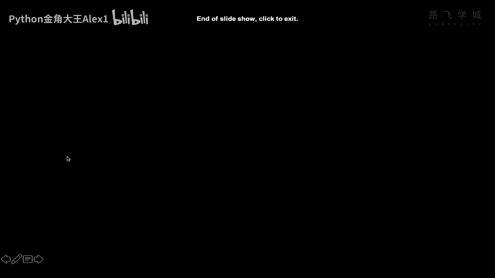
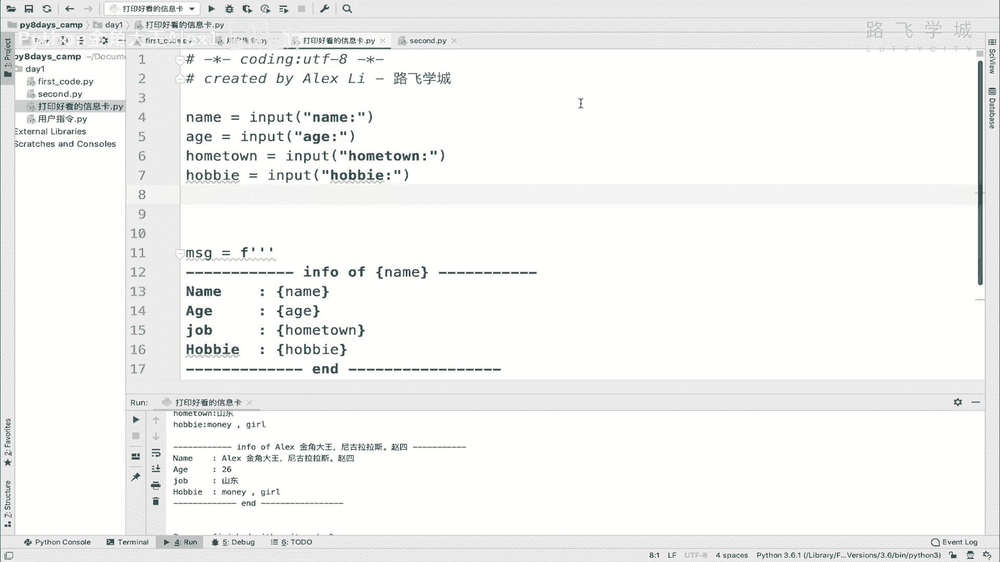

# Python数据分析实战：P15：14 格式化输出-打印好看的个人信息卡 📝

在本节课中，我们将要学习Python中的格式化输出。通过一个“打印个人信息卡”的练习，你将学会如何将用户输入的信息，以一种美观、格式化的方式打印出来，而无需进行繁琐的字符串拼接。

---





上一节我们学习了如何获取用户的输入。本节中，我们来看看如何将这些输入的信息进行格式化输出。



首先，我们来看一下练习题的需求：你需要让用户输入姓名、年龄、工作和爱好，然后将这些信息按照特定的格式打印出来。格式类似一个卡片，包含波浪线和横线作为装饰。请注意，这些信息是用户动态输入的，而不是在代码中写死的。



以下是实现这个需求的一种初级思路，但效率较低：

```python
name = input("请输入姓名：")
age = input("请输入年龄：")
job = input("请输入工作：")
hobby = input("请输入爱好：")

# 通过字符串拼接的方式打印
print("~" * 50)
print("姓名：" + name)
print("年龄：" + age)
print("工作：" + job)
print("爱好：" + hobby)
print("~" * 50)
```



这种方式虽然可行，但需要手动拼接每一个变量和字符串。如果信息很多，代码会显得冗长且难以维护。这并非高效的程序员做法。



---

那么，有没有更简洁高效的方法呢？答案是肯定的。我们可以使用Python 3.6及以上版本引入的**f-string**格式化方法。

其核心概念是：在一个字符串前加上字母 `f` 或 `F`，然后在字符串内部，你可以直接使用大括号 `{}` 来嵌入变量或表达式。Python解释器会自动将这些大括号中的内容替换为对应变量的值。

以下是使用f-string的改进方案：

```python
name = input("请输入姓名：")
age = input("请输入年龄：")
job = input("请输入工作：")
hobby = input("请输入爱好：")

# 使用f-string进行格式化输出
message = f"""
{'~' * 50}
姓名：{name}
年龄：{age}
工作：{job}
爱好：{hobby}
{'~' * 50}
"""
print(message)
```

**代码解析**：
1.  在字符串前加上了 `f` 前缀，这告诉Python这是一个格式化字符串。
2.  在字符串内部，使用 `{变量名}` 的语法直接引用了之前定义的变量（`name`, `age`, `job`, `hobby`）。
3.  甚至可以在 `{}` 内进行简单的表达式计算，例如 `{'~' * 50}` 用于生成50个波浪线。
4.  使用三引号 `"""` 可以方便地编写多行字符串，保持输出格式的整洁。

运行这段代码，你将得到一个格式美观、信息完整的个人卡片。这种方法极大地简化了代码，使其更易读、更易维护。

---



本节课中我们一起学习了Python的格式化输出，重点掌握了**f-string**的使用方法。通过 `f"字符串{变量}"` 的语法，我们可以轻松地将变量嵌入到字符串中，实现清晰、高效的格式化打印。请记住这个强大的工具，它将在你未来的Python编程中频繁使用。