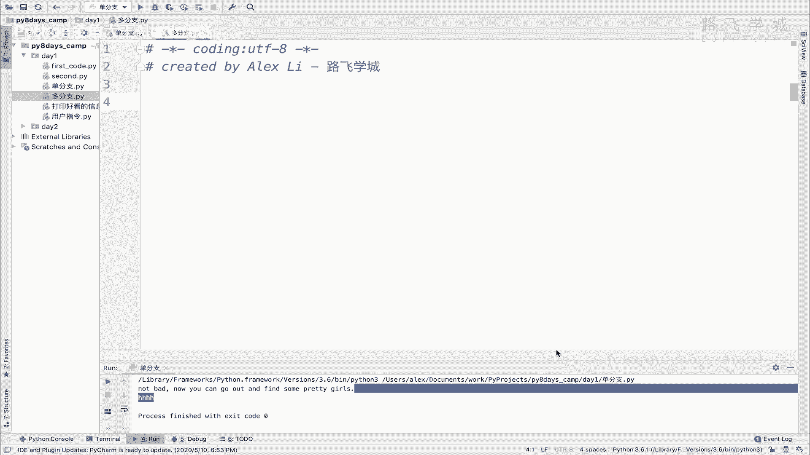
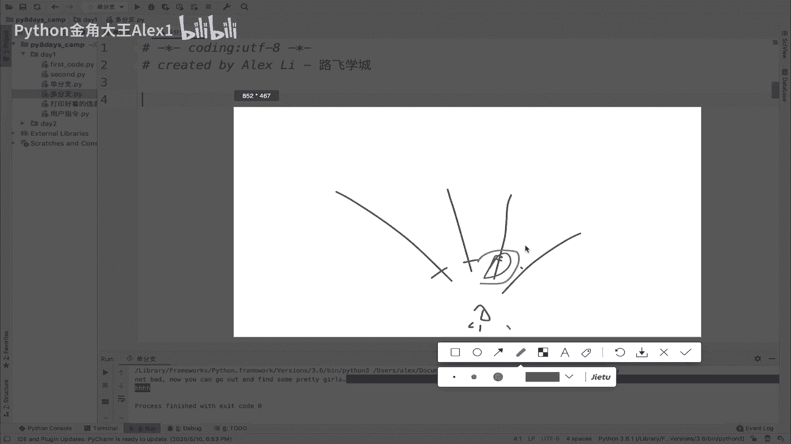
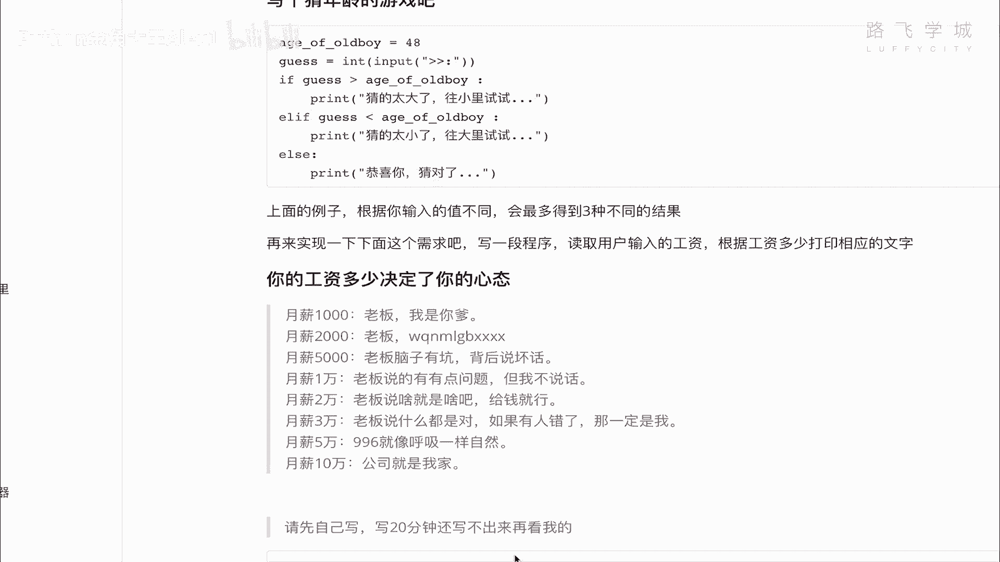

# Python数据分析实战：P18：17 流程控制-if..elif多分支 🚦



在本节课中，我们将要学习Python中的多分支流程控制，即`if...elif...else`结构。通过它，我们可以让程序根据多个不同的条件，选择执行不同的代码路径。

## 多分支概念

上一节我们介绍了简单的`if-else`双分支结构。本节中我们来看看更复杂的多分支情况。

多分支即指程序可以设置多个条件。程序会依次判断这些条件，满足哪个条件就执行对应的代码块。这就像站在一个十字路口，面前有多条道路，每条路都有一个通行条件。你只能根据条件选择其中一条路来走。



虽然有多条路可选，但最终你只能走其中一条。这意味着在多分支结构中，即便有多个条件，最终也只有一个条件会被真正满足并执行其对应的代码。

## 多分支语法

理解了概念后，我们来看看它的具体语法。多分支的语法结构如下：

```python
if 条件1:
    # 条件1成立时执行的代码
elif 条件2:
    # 条件1不成立，但条件2成立时执行的代码
elif 条件3:
    # 条件1和2都不成立，但条件3成立时执行的代码
else:
    # 以上所有条件都不成立时执行的代码
```

**关键点解析：**
*   `if`：判断第一个条件。
*   `elif`：是`else if`的缩写。它表示“否则如果”，即**只有在上层所有`if`或`elif`条件都不满足时**，才会判断当前`elif`的条件。
*   `else`：是可选的。它表示“否则”，即**前面所有条件都不满足时**的最终执行路径。

## 实战演练：猜年龄游戏

掌握了语法，让我们通过一个猜年龄的小程序来实践。这个程序有三种可能的结果：猜大了、猜小了、猜对了。以下是实现这个程序的步骤：

首先，我们设定一个目标年龄，并让用户输入猜测。

```python
black_girl_age = 26
guess = int(input("请输入你猜的年龄："))
```

接下来，使用多分支结构来判断用户的输入。

```python
if guess > black_girl_age:
    print("你讨厌，人家哪有那么老！")
elif guess < black_girl_age:
    print("真开心，但实际我比这个岁数大呢~")
else:
    print("恭喜你，猜对了，今天可以把我领回家了~~")
```

**程序逻辑：**
1.  如果猜测值大于实际年龄，执行第一个`if`块，输出“猜大了”。
2.  如果第一个条件不满足（即猜的年龄不大于26），程序会检查`elif`条件。如果猜测值小于实际年龄，则执行`elif`块，输出“猜小了”。
3.  如果前两个条件都不满足（即猜的年龄既不大于26，也不小于26），那么程序会执行`else`块，输出“猜对了”。

运行程序，输入不同的值（如30、22、26），将会看到三种不同的输出结果。

## 进阶练习：工资决定心态

现在，我们来尝试一个更复杂的多分支练习。假设根据不同的工资水平，会说出不同的话。这个例子有超过三个的条件分支。

以下是程序的需求描述，你需要根据它来编写代码：
*   工资为1000时，说：“老板，我是你爹！”
*   工资为2000时，说：“老板，wqnmlgb!”
*   工资为5000时，说：“老板脑子有坑，背后说坏话。”
*   工资为10000时，说：“老板说的有点问题，但我不说话。”
*   工资为20000时，说：“老板说啥都对，只要给钱！”
*   工资为30000时，说：“老板说什么都是对的，如果有人错了，那一定是我！”
*   工资为50000时，说：“996就像呼吸一样自然！”
*   工资为100000时，说：“公司就是我家，我热爱工作！”

**编写提示：**
1.  使用`input()`获取用户输入的工资，并转换为整数。
2.  使用`if`和多个`elif`来对应不同的工资区间。
3.  考虑是否需要一个`else`来处理未覆盖到的情况（例如输入了负数）。

请先尝试独立完成这个练习。如果有困难，可以参考猜年龄程序的框架，将条件判断和输出语句替换成上述需求即可。

## 总结

本节课中我们一起学习了Python中重要的多分支流程控制结构 `if...elif...else`。

*   **核心**：它允许程序在多个条件中选择**唯一一条**路径执行。
*   **执行顺序**：程序会从上到下依次判断`if`和`elif`后的条件，一旦某个条件为真，则执行对应的代码块，并跳过其后所有的`elif`和`else`。
*   **`else`**：是可选的收尾分支，用于处理所有条件都不满足的情况。



通过“猜年龄”和“工资心态”的练习，我们掌握了如何利用多分支结构处理具有多种可能结果的逻辑问题，这是编写复杂程序的基础。