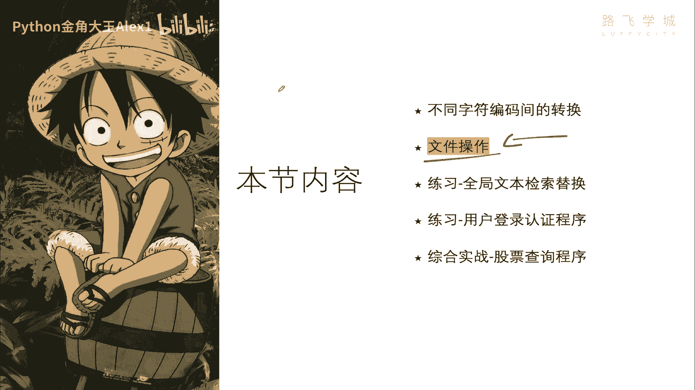
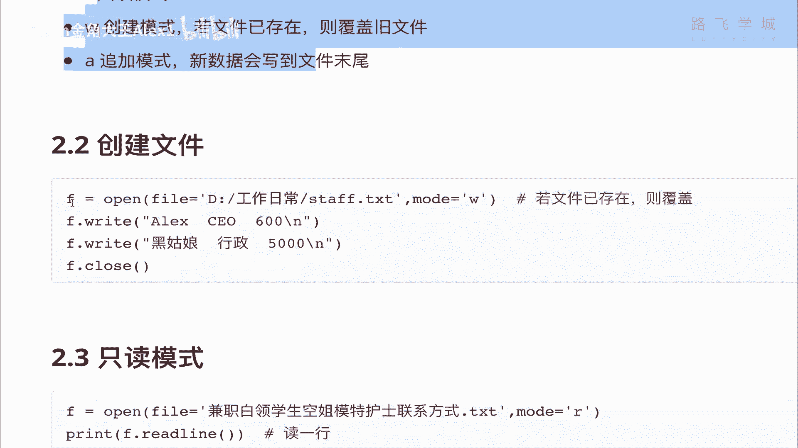
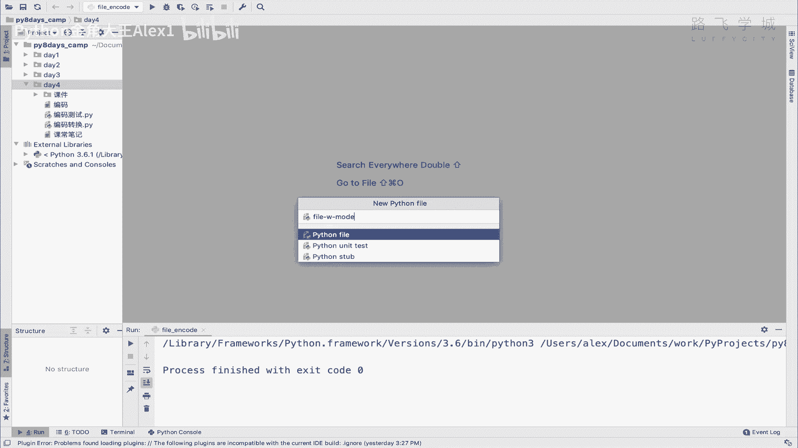
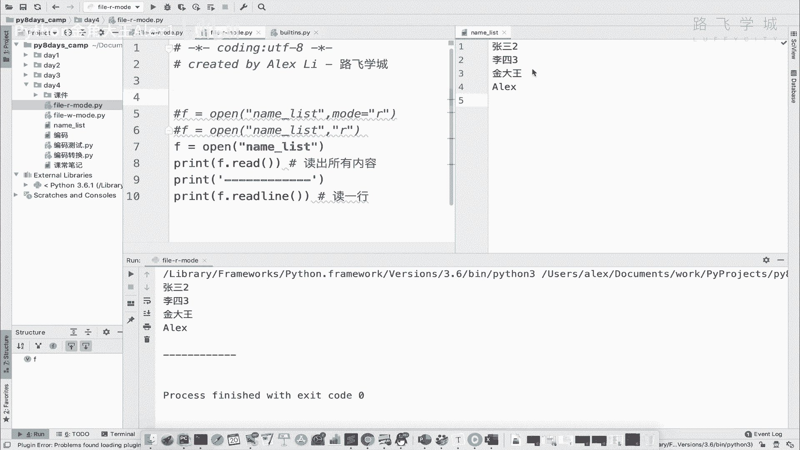
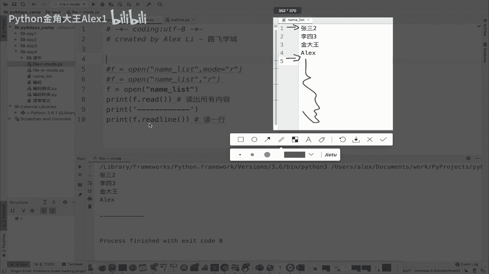
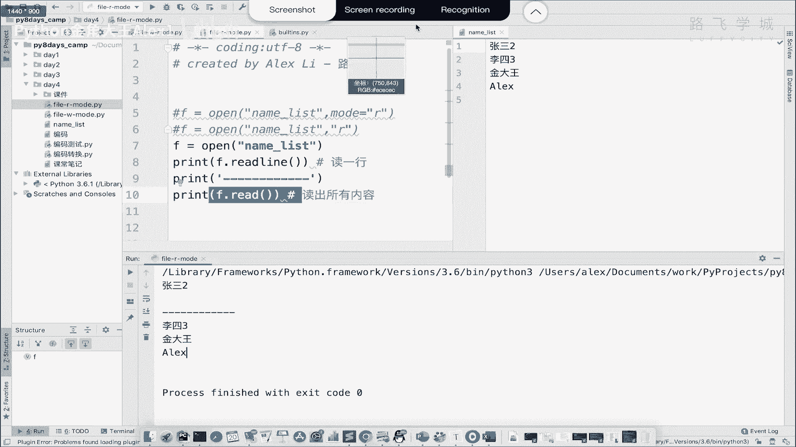
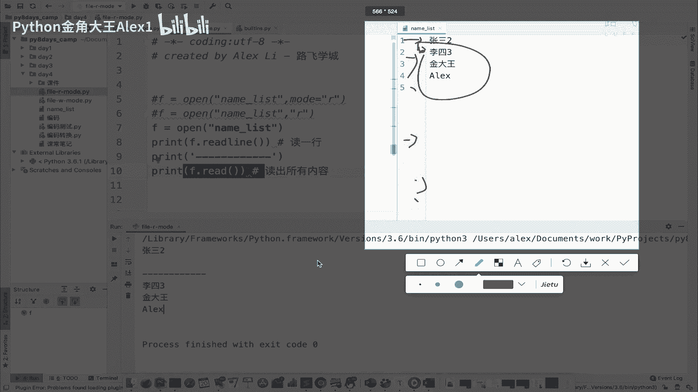
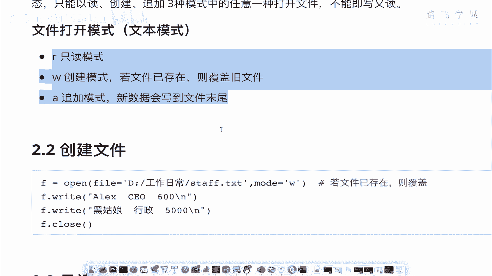

# Python文件操作：P46：05 用Python操作文件的3种模式 📂



在本节课中，我们将学习如何使用Python进行文件操作。文件操作是编程中的基础技能，它允许我们通过代码读取、写入和修改文件内容，就像我们用鼠标操作Word或Excel一样，但更加自动化和高效。

## 文件操作的基本流程

上一节我们了解了文件操作的重要性，本节中我们来看看Python操作文件的标准流程。这个流程与我们手动操作文档的步骤非常相似。

操作一个文件通常包含三个核心步骤：
1.  **打开文件**：获取文件的访问权限。
2.  **增删改查**：对文件内容进行读取、写入或修改。
3.  **关闭文件**：保存更改并释放系统资源。

在Python中，这个流程通过以下代码结构实现：
```python
f = open(‘文件名‘, ‘模式‘) # 1. 打开文件
f.write(‘内容‘) 或 f.read()      # 2. 进行写或读操作
f.close()                       # 3. 关闭并保存文件
```
其中，`open()`函数用于打开文件，并返回一个文件对象（这里赋值给变量`f`）。通过这个文件对象，我们可以调用`.write()`方法写入内容，或调用`.read()`方法读取内容。最后，必须使用`.close()`方法来关闭文件。

## 文件的三种基本模式

与Word文档可以同时读写不同，Python在打开文件时需要明确指定操作模式。这确保了操作的安全性和明确性。主要有三种文本模式：

*   **`‘r‘` (只读模式)**：只能读取文件内容，不能修改。如果文件不存在，会报错。
*   **`‘w‘` (创建/写入模式)**：用于创建新文件或覆盖已存在的文件。只能写入，不能读取。
*   **`‘a‘` (追加模式)**：在已有文件的末尾添加新内容。只能写入，不能读取。





下面，我们将逐一学习这三种模式的具体用法。

### 创建/写入模式 (`‘w‘`)

首先，我们学习如何创建一个新文件并向其中写入内容。使用`‘w‘`模式。

```python
# 以写入模式打开（或创建）一个名为 ‘name_list.txt‘ 的文件
f = open(‘name_list.txt‘, ‘w‘)

# 向文件中写入内容。多次write不会自动换行。
f.write(‘张三‘)
f.write(‘李四‘)
f.write(‘金角大王‘)
f.write(‘Alex‘)

# 写入内容并换行，需要在字符串末尾添加换行符 ‘\n‘
f.write(‘张三\n‘)
f.write(‘李四\n‘)
f.write(‘金角大王\n‘)
f.write(‘Alex\n‘)

# 操作完成后，必须关闭文件以保存更改
f.close()
```
**重要提示**：`‘w‘`模式是“创建”模式。如果指定的文件已存在，`open()`函数会**清空该文件的所有原有内容**，然后从头开始写入。它不是在原有内容上修改。

### 只读模式 (`‘r‘`)

接下来，我们学习如何读取一个已存在文件的内容。使用`‘r‘`模式。

```python
# 以只读模式打开 ‘name_list.txt‘ 文件。‘r‘是默认模式，可以不写。
f = open(‘name_list.txt‘, ‘r‘) # 等价于 open(‘name_list.txt‘)

# 读取文件的全部内容
all_content = f.read()
print(all_content)

# 读取文件的一行内容
one_line = f.readline()
print(one_line)



# 关闭文件
f.close()
```
**关键概念：文件指针**
文件对象内部有一个“指针”，标记着当前读取或写入的位置。打开文件时，指针在文件开头。
*   执行`f.read()`后，指针会移动到文件末尾。
*   再次调用`f.readline()`或`f.read()`，会从指针当前位置（即文件末尾）开始读，因此可能读不到内容或读到空字符串。
*   以`‘r‘`模式打开的文件只能调用`.read()`方法，尝试调用`.write()`方法会报错。



### 追加模式 (`‘a‘`)

最后，我们学习如何在不断加已有内容的情况下，在文件末尾添加新内容。使用`‘a‘`模式。

```python
# 以追加模式打开 ‘name_list.txt‘ 文件
f = open(‘name_list.txt‘, ‘a‘)



# 在文件末尾追加新内容。同样，需要‘\n‘来换行。
f.write(‘新追加的行1\n‘)
f.write(‘新追加的行2\n‘)



# 关闭文件以保存
f.close()
```
**模式特点**：
*   `‘a‘`模式不会清空原文件内容。
*   所有写入操作都从文件末尾开始。
*   与`‘w‘`模式一样，它只能写入，不能读取。

这种模式非常适合记录日志（Log），因为日志总是按时间顺序在文件尾部添加新记录。

## 总结

本节课中我们一起学习了Python文件操作的三种基本文本模式：
1.  **`‘w‘` (写入)**：用于创建新文件或完全覆盖旧文件。**慎用**，以免误删数据。
2.  **`‘r‘` (只读)**：用于安全地读取文件内容，是打开文件的默认模式。
3.  **`‘a‘` (追加)**：用于在文件末尾添加新内容，是记录日志等场景的理想选择。



记住操作文件的标准流程：**打开 → 操作 → 关闭**。每种模式都限制了你能进行的操作（读或写），理解“文件指针”的概念有助于你更好地控制读写位置。请务必在操作完成后使用`.close()`方法关闭文件。